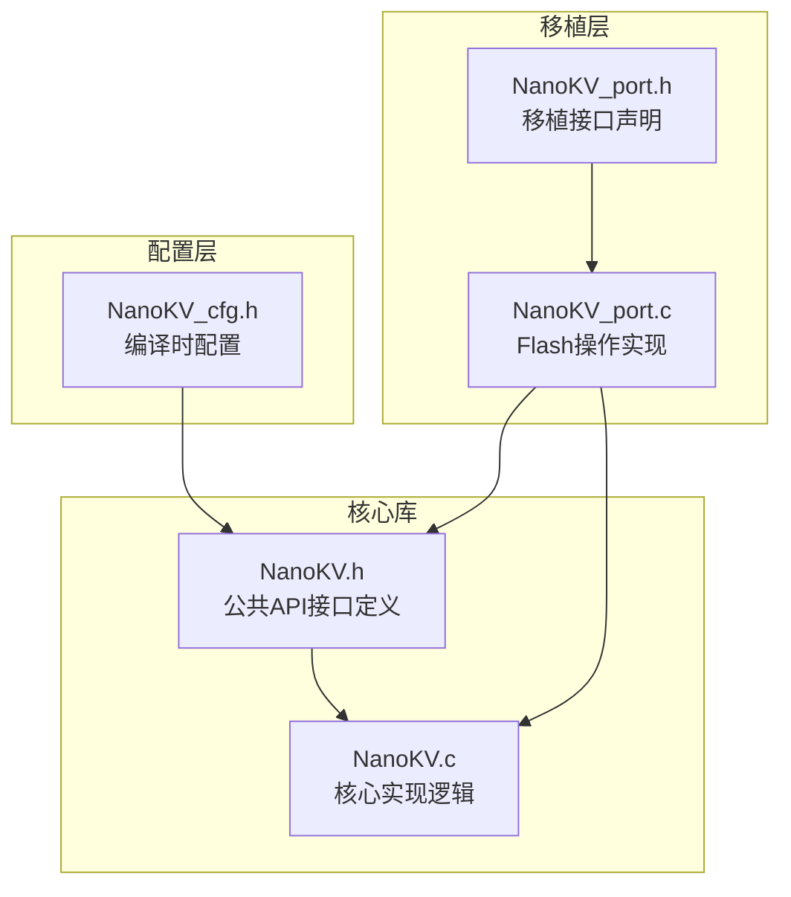
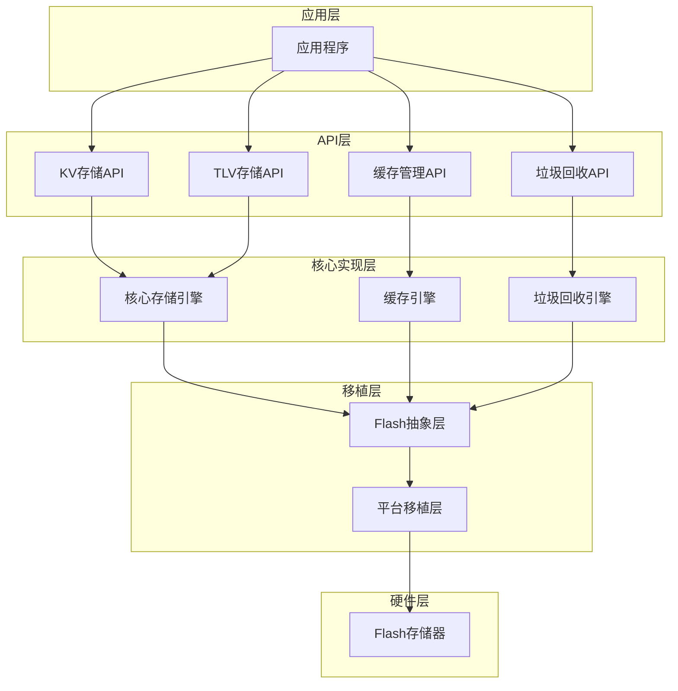
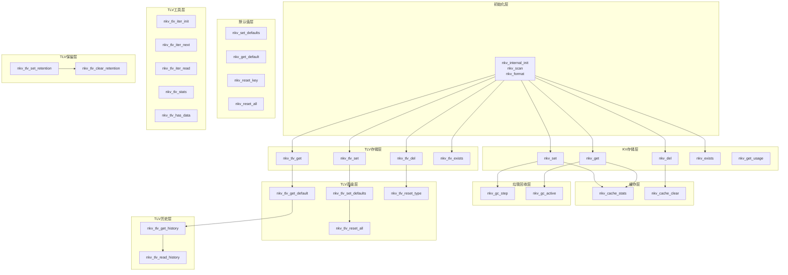

# API参考手册

<cite>
**本文档引用的文件**
- [NanoKV.h](file://NanoKV.h)
- [NanoKV.c](file://NanoKV.c)
- [NanoKV_cfg.h](file://NanoKV_cfg.h)
- [NanoKV_port.h](file://NanoKV_port.h)
- [NanoKV_port.c](file://NanoKV_port.c)
</cite>

## 目录
1. [简介](#简介)
2. [项目结构](#项目结构)
3. [核心组件](#核心组件)
4. [架构概览](#架构概览)
5. [详细组件分析](#详细组件分析)
6. [依赖关系分析](#依赖关系分析)
7. [性能考虑](#性能考虑)
8. [故障排除指南](#故障排除指南)
9. [结论](#结论)
10. [附录](#附录)

## 简介
NanoKV是一个轻量级的嵌入式KV/TLV存储库，专为资源受限的微控制器环境设计。它提供了追加写入、多扇区环形存储、掉电安全、LFU缓存、增量垃圾回收等特性，适用于需要可靠数据持久化的物联网设备和嵌入式系统。

## 项目结构
该项目采用模块化设计，主要包含以下核心文件：



**图表来源**
- [NanoKV.h](file://NanoKV.h#L1-L257)
- [NanoKV.c](file://NanoKV.c#L1-L1261)
- [NanoKV_cfg.h](file://NanoKV_cfg.h#L1-L51)
- [NanoKV_port.h](file://NanoKV_port.h#L1-L27)
- [NanoKV_port.c](file://NanoKV_port.c#L1-L95)

**章节来源**
- [NanoKV.h](file://NanoKV.h#L1-L257)
- [NanoKV.c](file://NanoKV.c#L1-L1261)
- [NanoKV_cfg.h](file://NanoKV_cfg.h#L1-L51)
- [NanoKV_port.h](file://NanoKV_port.h#L1-L27)
- [NanoKV_port.c](file://NanoKV_port.c#L1-L95)

## 核心组件
NanoKV的核心组件包括：

### 数据结构
- **nkv_instance_t**: 主实例结构，包含Flash操作配置、当前状态和缓存信息
- **nkv_entry_t**: KV条目头，描述键值对的元数据
- **nkv_sector_hdr_t**: 扇区头，包含魔数和序列号
- **nkv_cache_entry_t**: 缓存条目，实现LFU缓存算法

### 错误码定义
- **NKV_OK**: 操作成功
- **NKV_ERR_NOT_FOUND**: 未找到目标数据
- **NKV_ERR_NO_SPACE**: 存储空间不足
- **NKV_ERR_INVALID**: 参数无效
- **NKV_ERR_FLASH**: Flash操作失败

**章节来源**
- [NanoKV.h](file://NanoKV.h#L33-L131)
- [NanoKV.c](file://NanoKV.c#L628-L640)

## 架构概览
NanoKV采用分层架构设计，确保了良好的可移植性和可配置性：



**图表来源**
- [NanoKV.h](file://NanoKV.h#L133-L257)
- [NanoKV.c](file://NanoKV.c#L626-L1261)
- [NanoKV_port.c](file://NanoKV_port.c#L53-L95)

## 详细组件分析

### KV存储API

#### nkv_set - 设置键值对
设置指定键的值，如果键已存在则更新，不存在则创建新条目。

**函数签名路径**: [NanoKV.c](file://NanoKV.c#L695-L763)

**参数说明**:
- `key`: 字符串键名，长度不能超过配置的最大键长度
- `value`: 要存储的数据指针
- `len`: 数据长度，必须小于等于最大值长度

**返回值**:
- `NKV_OK`: 设置成功
- `NKV_ERR_INVALID`: 参数无效
- `NKV_ERR_NO_SPACE`: 存储空间不足
- `NKV_ERR_FLASH`: Flash写入失败

**使用示例**:
```c
// 正确的调用方式
nkv_err_t result = nkv_set("temperature", &temp_value, sizeof(temp_value));

// 错误处理示例
if (result != NKV_OK) {
    switch(result) {
        case NKV_ERR_INVALID:
            // 处理参数错误
            break;
        case NKV_ERR_NO_SPACE:
            // 处理空间不足
            break;
        case NKV_ERR_FLASH:
            // 处理Flash错误
            break;
    }
}
```

**章节来源**
- [NanoKV.c](file://NanoKV.c#L695-L763)

#### nkv_get - 获取键值
从存储中检索指定键的值。

**函数签名路径**: [NanoKV.c](file://NanoKV.c#L765-L798)

**参数说明**:
- `key`: 要查询的键名
- `buf`: 输出缓冲区指针
- `size`: 缓冲区大小
- `out_len`: 实际返回的数据长度指针

**返回值**:
- `NKV_OK`: 成功获取数据
- `NKV_ERR_INVALID`: 参数无效
- `NKV_ERR_NOT_FOUND`: 键不存在
- `NKV_ERR_FLASH`: Flash读取失败

**使用示例**:
```c
uint8_t buffer[255];
uint8_t actual_len;
nkv_err_t result = nkv_get("config", buffer, sizeof(buffer), &actual_len);

if (result == NKV_OK) {
    // 使用获取的数据
    process_config_data(buffer, actual_len);
} else if (result == NKV_ERR_NOT_FOUND) {
    // 键不存在，使用默认值
    use_default_config();
}
```

**章节来源**
- [NanoKV.c](file://NanoKV.c#L765-L798)

#### nkv_del - 删除键值
删除指定键及其对应的值。

**函数签名路径**: [NanoKV.c](file://NanoKV.c#L800-L806)

**参数说明**:
- `key`: 要删除的键名

**返回值**:
- `NKV_OK`: 删除成功
- `NKV_ERR_INVALID`: 参数无效

**使用示例**:
```c
nkv_err_t result = nkv_del("temporary_data");
if (result == NKV_OK) {
    // 数据已删除
    log_message("Data deleted successfully");
} else {
    // 处理删除失败
    handle_delete_error(result);
}
```

**章节来源**
- [NanoKV.c](file://NanoKV.c#L800-L806)

#### nkv_exists - 检查键是否存在
检查指定键是否存在于存储中。

**函数签名路径**: [NanoKV.c](file://NanoKV.c#L808-L815)

**参数说明**:
- `key`: 要检查的键名

**返回值**:
- `1`: 键存在且值有效
- `0`: 键不存在或值无效

**使用示例**:
```c
if (nkv_exists("device_id")) {
    // 设备ID已存在，直接使用
    nkv_get("device_id", device_id_buffer, sizeof(device_id_buffer), &len);
} else {
    // 生成新的设备ID并保存
    generate_device_id(device_id_buffer);
    nkv_set("device_id", device_id_buffer, DEVICE_ID_LEN);
}
```

**章节来源**
- [NanoKV.c](file://NanoKV.c#L808-L815)

#### nkv_get_usage - 获取存储使用情况
获取当前存储的使用统计信息。

**函数签名路径**: [NanoKV.c](file://NanoKV.c#L817-L823)

**参数说明**:
- `used`: 指向已用空间的指针
- `total`: 指向总空间的指针

**返回值**: 无（通过输出参数返回结果）

**使用示例**:
```c
uint32_t used, total;
nkv_get_usage(&used, &total);
float usage_percent = ((float)used / total) * 100.0f;

if (usage_percent > 80.0f) {
    // 存储使用率过高，考虑清理或扩容
    log_warning("Storage usage: %.1f%%", usage_percent);
}
```

**章节来源**
- [NanoKV.c](file://NanoKV.c#L817-L823)

### TLV存储API

#### nkv_tlv_set - 设置TLV值
设置指定类型的TLV值。

**函数签名路径**: [NanoKV.c](file://NanoKV.c#L964-L973)

**参数说明**:
- `type`: TLV类型，必须在有效范围内
- `value`: 要存储的数据指针
- `len`: 数据长度，必须大于0且不超过254字节

**返回值**:
- `NKV_OK`: 设置成功
- `NKV_ERR_INVALID`: 参数无效

**使用示例**:
```c
// 设置温度传感器数据
uint8_t temperature_data[2] = {25, 50}; // 25.5°C
nkv_err_t result = nkv_tlv_set(TLV_TYPE_SENSOR_TEMP, temperature_data, 2);

// 设置设备配置
char device_config[] = "CONFIG_VALUE";
nkv_err_t result2 = nkv_tlv_set(TLV_TYPE_APP_MIN + 1, device_config, strlen(device_config));
```

**章节来源**
- [NanoKV.c](file://NanoKV.c#L964-L973)

#### nkv_tlv_get - 获取TLV值
获取指定类型的TLV值。

**函数签名路径**: [NanoKV.c](file://NanoKV.c#L975-L994)

**参数说明**:
- `type`: 要查询的TLV类型
- `buf`: 输出缓冲区指针
- `size`: 缓冲区大小
- `out_len`: 实际返回的数据长度指针

**返回值**:
- `NKV_OK`: 成功获取数据
- `NKV_ERR_INVALID`: 参数无效
- `NKV_ERR_NOT_FOUND`: 类型不存在
- `NKV_ERR_FLASH`: Flash读取失败

**使用示例**:
```c
uint8_t buffer[255];
uint8_t actual_len;

nkv_err_t result = nkv_tlv_get(TLV_TYPE_SENSOR_TEMP, buffer, sizeof(buffer), &actual_len);
if (result == NKV_OK) {
    uint8_t temp_high = buffer[0];
    uint8_t temp_low = buffer[1];
    float temperature = temp_high + (temp_low / 100.0f);
    log_info("Temperature: %.2f°C", temperature);
} else if (result == NKV_ERR_NOT_FOUND) {
    // 温度数据不存在，使用默认值
    temperature = DEFAULT_TEMPERATURE;
}
```

**章节来源**
- [NanoKV.c](file://NanoKV.c#L975-L994)

#### nkv_tlv_del - 删除TLV值
删除指定类型的TLV值。

**函数签名路径**: [NanoKV.c](file://NanoKV.c#L996-L1001)

**参数说明**:
- `type`: 要删除的TLV类型

**返回值**:
- `NKV_OK`: 删除成功
- `NKV_ERR_INVALID`: 参数无效

**使用示例**:
```c
// 删除过期的传感器数据
nkv_err_t result = nkv_tlv_del(TLV_TYPE_SENSOR_TEMP);
if (result == NKV_OK) {
    log_info("Temperature data cleared");
}
```

**章节来源**
- [NanoKV.c](file://NanoKV.c#L996-L1001)

#### nkv_tlv_exists - 检查TLV类型是否存在
检查指定类型的TLV数据是否存在。

**函数签名路径**: [NanoKV.c](file://NanoKV.c#L1003-L1010)

**参数说明**:
- `type`: 要检查的TLV类型

**返回值**:
- `1`: 类型存在且有有效数据
- `0`: 类型不存在或无有效数据

**使用示例**:
```c
if (nkv_tlv_exists(TLV_TYPE_APP_MIN + 1)) {
    // 应用配置存在
    nkv_tlv_get(TLV_TYPE_APP_MIN + 1, config_buffer, sizeof(config_buffer), &len);
} else {
    // 应用配置不存在，初始化默认值
    initialize_default_config();
}
```

**章节来源**
- [NanoKV.c](file://NanoKV.c#L1003-L1010)

### 缓存管理API

#### nkv_cache_stats - 获取缓存统计信息
获取当前缓存的命中统计信息。

**函数签名路径**: [NanoKV.c](file://NanoKV.c#L848-L856)

**参数说明**:
- `stats`: 指向统计结构的指针

**返回值**: 无（通过输出参数返回结果）

**使用示例**:
```c
nkv_cache_stats_t stats;
nkv_cache_stats(&stats);

float hit_rate = stats.hit_rate;
log_info("Cache hit rate: %.2f%%", hit_rate);

if (hit_rate < 30.0f) {
    // 缓存效率低，考虑调整缓存大小
    log_warning("Low cache hit rate detected");
}
```

**章节来源**
- [NanoKV.c](file://NanoKV.c#L848-L856)

#### nkv_cache_clear - 清空缓存
清空所有缓存条目。

**函数签名路径**: [NanoKV.c](file://NanoKV.c#L858-L862)

**参数说明**: 无

**返回值**: 无

**使用示例**:
```c
// 系统重启前清空缓存
nkv_cache_clear();

// 或者在内存压力过大时清空缓存
if (memory_pressure_detected()) {
    nkv_cache_clear();
}
```

**章节来源**
- [NanoKV.c](file://NanoKV.c#L858-L862)

### 垃圾回收API

#### nkv_gc_step - 执行垃圾回收步骤
手动执行指定数量的垃圾回收步骤。

**函数签名路径**: [NanoKV.c](file://NanoKV.c#L826-L839)

**参数说明**:
- `steps`: 要执行的步骤数量

**返回值**:
- `1`: 成功执行至少一个步骤
- `0`: 无法执行任何步骤

**使用示例**:
```c
// 在系统空闲时间执行垃圾回收
while (nkv_gc_step(1)) {
    // 等待一段时间让系统其他任务运行
    delay_ms(1);
}

// 或者在固定间隔执行
if (system_idle_time() > IDLE_THRESHOLD) {
    nkv_gc_step(GC_STEPS_PER_CYCLE);
}
```

**章节来源**
- [NanoKV.c](file://NanoKV.c#L826-L839)

#### nkv_gc_active - 检查垃圾回收状态
检查垃圾回收是否正在进行中。

**函数签名路径**: [NanoKV.c](file://NanoKV.c#L841-L845)

**参数说明**: 无

**返回值**:
- `1`: 垃圾回收正在运行
- `0`: 垃圾回收未运行

**使用示例**:
```c
if (nkv_gc_active()) {
    // 垃圾回收正在进行，避免执行大量写操作
    log_info("Garbage collection in progress");
    wait_for_gc_completion();
} else {
    // 可以安全地执行写操作
    perform_write_operation();
}
```

**章节来源**
- [NanoKV.c](file://NanoKV.c#L841-L845)

### 默认值API

#### nkv_set_defaults - 设置默认值表
设置键值对的默认值表。

**函数签名路径**: [NanoKV.c](file://NanoKV.c#L866-L870)

**参数说明**:
- `defs`: 默认值数组指针
- `count`: 默认值数量

**返回值**: 无

**使用示例**:
```c
// 定义默认值
const nkv_default_t default_configs[] = {
    {"device_id", "DEVICE_001", 9},
    {"baud_rate", &DEFAULT_BAUD_RATE, 4},
    {"timeout", &DEFAULT_TIMEOUT, 4}
};

nkv_set_defaults(default_configs, ARRAY_SIZE(default_configs));
```

**章节来源**
- [NanoKV.c](file://NanoKV.c#L866-L870)

#### nkv_get_default - 获取默认值
获取指定键的默认值。

**函数签名路径**: [NanoKV.c](file://NanoKV.c#L887-L905)

**参数说明**:
- `key`: 要获取默认值的键名
- `buf`: 输出缓冲区指针
- `size`: 缓冲区大小
- `out_len`: 实际返回的数据长度指针

**返回值**:
- `NKV_OK`: 成功获取默认值
- `NKV_ERR_INVALID`: 参数无效
- `NKV_ERR_NOT_FOUND`: 键不存在或无默认值

**使用示例**:
```c
uint8_t buffer[255];
uint8_t actual_len;

nkv_err_t result = nkv_get_default("device_id", buffer, sizeof(buffer), &actual_len);
if (result == NKV_OK) {
    log_info("Using default device ID: %.*s", actual_len, buffer);
} else {
    log_error("Failed to get default value");
}
```

**章节来源**
- [NanoKV.c](file://NanoKV.c#L887-L905)

#### nkv_reset_key - 重置单个键到默认值
将指定键重置为其默认值。

**函数签名路径**: [NanoKV.c](file://NanoKV.c#L907-L915)

**参数说明**:
- `key`: 要重置的键名

**返回值**:
- `NKV_OK`: 重置成功
- `NKV_ERR_INVALID`: 参数无效
- `NKV_ERR_NOT_FOUND`: 键不存在或无默认值

**使用示例**:
```c
// 用户修改了配置但想要恢复默认值
if (confirm_reset()) {
    nkv_err_t result = nkv_reset_key("device_config");
    if (result == NKV_OK) {
        log_info("Configuration reset to default");
    }
}
```

**章节来源**
- [NanoKV.c](file://NanoKV.c#L907-L915)

#### nkv_reset_all - 重置所有键到默认值
将所有键重置为其默认值。

**函数签名路径**: [NanoKV.c](file://NanoKV.c#L917-L933)

**参数说明**: 无

**返回值**:
- `NKV_OK`: 重置成功
- `NKV_ERR_INVALID`: 无默认值表或参数无效

**使用示例**:
```c
// 系统恢复出厂设置
if (confirm_factory_reset()) {
    nkv_err_t result = nkv_reset_all();
    if (result == NKV_OK) {
        log_info("All configurations reset to factory defaults");
    }
}
```

**章节来源**
- [NanoKV.c](file://NanoKV.c#L917-L933)

### TLV高级API

#### nkv_tlv_set_defaults - 设置TLV默认值表
设置TLV类型的默认值表。

**函数签名路径**: [NanoKV.c](file://NanoKV.c#L1013-L1017)

**参数说明**:
- `defs`: TLV默认值数组指针
- `count`: 默认值数量

**返回值**: 无

**使用示例**:
```c
const nkv_tlv_default_t tlv_defaults[] = {
    {TLV_TYPE_SENSOR_TEMP, &default_temp, 2},
    {TLV_TYPE_SENSOR_HUMIDITY, &default_humidity, 2}
};

nkv_tlv_set_defaults(tlv_defaults, ARRAY_SIZE(tlv_defaults));
```

**章节来源**
- [NanoKV.c](file://NanoKV.c#L1013-L1017)

#### nkv_tlv_get_default - 获取TLV默认值
获取指定类型TLV的默认值。

**函数签名路径**: [NanoKV.c](file://NanoKV.c#L1029-L1043)

**参数说明**:
- `type`: TLV类型
- `buf`: 输出缓冲区指针
- `size`: 缓冲区大小
- `out_len`: 实际返回的数据长度指针

**返回值**:
- `NKV_OK`: 成功获取默认值
- `NKV_ERR_INVALID`: 参数无效
- `NKV_ERR_NOT_FOUND`: 类型不存在或无默认值

**使用示例**:
```c
uint8_t buffer[255];
uint8_t actual_len;

nkv_err_t result = nkv_tlv_get_default(TLV_TYPE_SENSOR_TEMP, buffer, sizeof(buffer), &actual_len);
if (result == NKV_OK) {
    log_info("Using default temperature: %d.%d°C", buffer[0], buffer[1]);
}
```

**章节来源**
- [NanoKV.c](file://NanoKV.c#L1029-L1043)

#### nkv_tlv_reset_type - 重置单个TLV类型到默认值
将指定类型的TLV重置为其默认值。

**函数签名路径**: [NanoKV.c](file://NanoKV.c#L1045-L1051)

**参数说明**:
- `type`: TLV类型

**返回值**:
- `NKV_OK`: 重置成功
- `NKV_ERR_INVALID`: 参数无效
- `NKV_ERR_NOT_FOUND`: 类型不存在或无默认值

**使用示例**:
```c
// 恢复温度传感器配置到默认值
nkv_err_t result = nkv_tlv_reset_type(TLV_TYPE_SENSOR_TEMP);
if (result == NKV_OK) {
    log_info("Temperature sensor configuration reset");
}
```

**章节来源**
- [NanoKV.c](file://NanoKV.c#L1045-L1051)

#### nkv_tlv_reset_all - 重置所有TLV类型到默认值
将所有TLV类型重置为其默认值。

**函数签名路径**: [NanoKV.c](file://NanoKV.c#L1053-L1064)

**参数说明**: 无

**返回值**:
- `NKV_OK`: 重置成功
- `NKV_ERR_INVALID`: 无默认值表或参数无效

**使用示例**:
```c
// 恢复所有传感器配置到默认值
nkv_err_t result = nkv_tlv_reset_all();
if (result == NKV_OK) {
    log_info("All sensor configurations reset");
}
```

**章节来源**
- [NanoKV.c](file://NanoKV.c#L1053-L1064)

### TLV迭代器API

#### nkv_tlv_iter_init - 初始化TLV迭代器
初始化TLV迭代器以遍历所有TLV数据。

**函数签名路径**: [NanoKV.c](file://NanoKV.c#L1067-L1074)

**参数说明**:
- `iter`: 迭代器指针

**返回值**: 无

**使用示例**:
```c
nkv_tlv_iter_t iter;
nkv_tlv_iter_init(&iter);

nkv_tlv_entry_t entry;
while (nkv_tlv_iter_next(&iter, &entry)) {
    uint8_t buffer[entry.len];
    if (nkv_tlv_iter_read(&entry, buffer, sizeof(buffer)) == NKV_OK) {
        log_info("Type: %d, Length: %d, Data: %.*s", 
                 entry.type, entry.len, entry.len, buffer);
    }
}
```

**章节来源**
- [NanoKV.c](file://NanoKV.c#L1067-L1074)

#### nkv_tlv_iter_next - 获取下一个TLV条目
获取下一个有效的TLV条目信息。

**函数签名路径**: [NanoKV.c](file://NanoKV.c#L1076-L1122)

**参数说明**:
- `iter`: 迭代器指针
- `info`: 指向条目信息结构的指针

**返回值**:
- `1`: 成功获取下一个条目
- `0`: 迭代完成或发生错误

**使用示例**:
```c
nkv_tlv_iter_t iter;
nkv_tlv_iter_init(&iter);

nkv_tlv_entry_t entry;
while (nkv_tlv_iter_next(&iter, &entry)) {
    // 处理每个TLV条目
    process_tlv_entry(entry.type, entry.len, entry.flash_addr);
}
```

**章节来源**
- [NanoKV.c](file://NanoKV.c#L1076-L1122)

#### nkv_tlv_iter_read - 读取迭代器指向的TLV数据
从迭代器当前位置读取TLV数据。

**函数签名路径**: [NanoKV.c](file://NanoKV.c#L1124-L1132)

**参数说明**:
- `info`: 条目信息结构指针
- `buf`: 输出缓冲区指针
- `size`: 缓冲区大小

**返回值**:
- `NKV_OK`: 读取成功
- `NKV_ERR_INVALID`: 参数无效
- `NKV_ERR_FLASH`: Flash读取失败

**使用示例**:
```c
nkv_tlv_iter_t iter;
nkv_tlv_iter_init(&iter);

nkv_tlv_entry_t entry;
while (nkv_tlv_iter_next(&iter, &entry)) {
    uint8_t buffer[entry.len];
    nkv_err_t result = nkv_tlv_iter_read(&entry, buffer, sizeof(buffer));
    if (result == NKV_OK) {
        // 处理读取的数据
        handle_tlv_data(entry.type, buffer, entry.len);
    }
}
```

**章节来源**
- [NanoKV.c](file://NanoKV.c#L1124-L1132)

### TLV工具函数

#### nkv_tlv_stats - 获取TLV统计信息
获取TLV存储的统计信息。

**函数签名路径**: [NanoKV.c](file://NanoKV.c#L1135-L1154)

**参数说明**:
- `count`: 指向条目数量的指针
- `used`: 指向已用空间的指针

**返回值**: 无（通过输出参数返回结果）

**使用示例**:
```c
uint16_t count;
uint32_t used;
nkv_tlv_stats(&count, &used);

float utilization = ((float)used / (FLASH_SIZE * SECTOR_COUNT)) * 100.0f;
log_info("TLV Storage: %d entries, %d bytes used, %.1f%% utilization", 
         count, used, utilization);
```

**章节来源**
- [NanoKV.c](file://NanoKV.c#L1135-L1154)

#### nkv_tlv_has_data - 检查TLV存储是否有数据
检查TLV存储中是否存在任何数据。

**函数签名路径**: [NanoKV.c](file://NanoKV.c#L1156-L1162)

**参数说明**: 无

**返回值**:
- `1`: 存储中有数据
- `0`: 存储中无数据

**使用示例**:
```c
if (!nkv_tlv_has_data()) {
    log_info("TLV storage is empty");
    // 可以进行格式化或其他初始化操作
}
```

**章节来源**
- [NanoKV.c](file://NanoKV.c#L1156-L1162)

### TLV历史记录API

#### nkv_tlv_get_history - 获取指定类型的TLV历史记录
获取指定类型的所有历史版本信息。

**函数签名路径**: [NanoKV.c](file://NanoKV.c#L1165-L1209)

**参数说明**:
- `type`: TLV类型
- `history`: 历史记录数组指针
- `max`: 最大历史记录数量
- `count`: 实际返回的历史记录数量指针

**返回值**:
- `NKV_OK`: 获取成功
- `NKV_ERR_INVALID`: 参数无效

**使用示例**:
```c
nkv_tlv_history_t history[10];
uint8_t count;

nkv_err_t result = nkv_tlv_get_history(TLV_TYPE_SENSOR_TEMP, history, 10, &count);
if (result == NKV_OK) {
    log_info("Found %d historical versions:", count);
    for (uint8_t i = 0; i < count; i++) {
        log_info("Version %d: address 0x%08X, length %d", 
                 i+1, history[i].flash_addr, history[i].len);
    }
}
```

**章节来源**
- [NanoKV.c](file://NanoKV.c#L1165-L1209)

#### nkv_tlv_read_history - 读取历史版本数据
从历史记录中读取指定版本的数据。

**函数签名路径**: [NanoKV.c](file://NanoKV.c#L1211-L1219)

**参数说明**:
- `entry`: 历史记录条目指针
- `buf`: 输出缓冲区指针
- `size`: 缓冲区大小

**返回值**:
- `NKV_OK`: 读取成功
- `NKV_ERR_INVALID`: 参数无效
- `NKV_ERR_FLASH`: Flash读取失败

**使用示例**:
```c
nkv_tlv_history_t history[10];
uint8_t count;
nkv_tlv_get_history(TLV_TYPE_SENSOR_TEMP, history, 10, &count);

if (count > 0) {
    // 读取最新的历史版本
    uint8_t buffer[history[0].len];
    nkv_err_t result = nkv_tlv_read_history(&history[0], buffer, sizeof(buffer));
    if (result == NKV_OK) {
        log_info("Latest historical data: %.*s", history[0].len, buffer);
    }
}
```

**章节来源**
- [NanoKV.c](file://NanoKV.c#L1211-L1219)

### TLV保留策略API

#### nkv_tlv_set_retention - 设置TLV保留策略
设置指定类型的保留策略，控制历史数据的保留数量。

**函数签名路径**: [NanoKV.c](file://NanoKV.c#L1223-L1245)

**参数说明**:
- `type`: TLV类型
- `keep`: 要保留的最新版本数量

**返回值**:
- `NKV_OK`: 设置成功
- `NKV_ERR_INVALID`: 参数无效

**使用示例**:
```c
// 保留最近5个温度读数
nkv_err_t result = nkv_tlv_set_retention(TLV_TYPE_SENSOR_TEMP, 5);
if (result == NKV_OK) {
    log_info("Temperature retention policy set to keep 5 latest versions");
}
```

**章节来源**
- [NanoKV.c](file://NanoKV.c#L1223-L1245)

#### nkv_tlv_clear_retention - 清除TLV保留策略
清除指定类型的保留策略。

**函数签名路径**: [NanoKV.c](file://NanoKV.c#L1247-L1259)

**参数说明**:
- `type`: TLV类型

**返回值**: 无

**使用示例**:
```c
// 清除温度数据的保留策略
nkv_tlv_clear_retention(TLV_TYPE_SENSOR_TEMP);
log_info("Temperature retention policy cleared");
```

**章节来源**
- [NanoKV.c](file://NanoKV.c#L1247-L1259)

## 依赖关系分析

NanoKV的API之间存在复杂的依赖关系，形成了清晰的功能层次：



**图表来源**
- [NanoKV.h](file://NanoKV.h#L133-L257)
- [NanoKV.c](file://NanoKV.c#L628-L1261)

**章节来源**
- [NanoKV.h](file://NanoKV.h#L133-L257)
- [NanoKV.c](file://NanoKV.c#L628-L1261)

## 性能考虑

### 缓存性能
NanoKV实现了LFU（Least Frequently Used）缓存算法，具有以下特点：

- **缓存大小**: 可配置，默认4个条目
- **命中率优化**: 通过访问计数实现智能替换
- **内存占用**: 每个缓存条目约占用260字节（键名+值+元数据）
- **性能影响**: 启用缓存可显著提升重复读取操作的性能

### 垃圾回收性能
NanoKV支持两种垃圾回收模式：

#### 全量GC（默认）
- **触发条件**: 当可用空间低于阈值时自动触发
- **执行时间**: 可能导致较长的阻塞时间
- **适用场景**: 实时性要求不高的系统

#### 增量GC（推荐）
- **触发条件**: 当可用空间不足且有空闲扇区时启动
- **执行方式**: 分批处理，每次只迁移少量条目
- **执行时间**: 短时间片内完成，不影响系统实时性
- **配置参数**: 
  - `NKV_GC_ENTRIES_PER_WRITE`: 每次写入后迁移的条目数（建议1-4）
  - `NKV_GC_THRESHOLD_PERCENT`: 触发阈值（建议60-80%）

### 存储性能
- **写入延迟**: 由于采用追加写入，写入操作通常很快
- **空间利用率**: 多扇区环形设计最大化利用存储空间
- **磨损均衡**: 自动扇区轮换减少Flash磨损
- **CRC校验**: 提供数据完整性保护

### 并发访问注意事项
- **线程安全**: NanoKV不是线程安全的，需要外部同步机制
- **原子性**: 单个API调用是原子性的，但跨多个调用的操作需要用户自行保证一致性
- **建议做法**: 
  - 使用互斥锁保护关键代码段
  - 避免在中断服务程序中调用可能阻塞的API
  - 对频繁访问的数据考虑使用缓存

**章节来源**
- [NanoKV_cfg.h](file://NanoKV_cfg.h#L14-L26)
- [NanoKV.c](file://NanoKV.c#L489-L624)

## 故障排除指南

### 常见错误码及处理

#### NKV_ERR_NOT_FOUND
**原因**: 请求的键或类型不存在
**处理方法**:
- 检查键名或类型是否正确
- 使用`nkv_exists()`或`nkv_tlv_exists()`先检查存在性
- 考虑使用默认值回退机制

#### NKV_ERR_NO_SPACE
**原因**: 存储空间不足
**处理方法**:
- 检查存储使用率：`nkv_get_usage()`
- 执行垃圾回收：`nkv_gc_step()`
- 删除不需要的数据：`nkv_del()` 或 `nkv_tlv_del()`
- 调整配置增加扇区数量

#### NKV_ERR_INVALID
**原因**: 参数无效
**处理方法**:
- 检查键名长度是否超过`NKV_MAX_KEY_LEN`
- 检查值长度是否超过`NKV_MAX_VALUE_LEN`
- 确保缓冲区大小足够
- 验证指针参数非空

#### NKV_ERR_FLASH
**原因**: Flash操作失败
**处理方法**:
- 检查Flash驱动实现
- 验证Flash地址对齐
- 确认Flash操作权限
- 检查硬件连接

### 调试和诊断

#### 启用调试日志
通过配置`NKV_DEBUG_ENABLE`宏来启用详细日志输出：

```c
// 在NanoKV_cfg.h中启用调试
#define NKV_DEBUG_ENABLE 1
```

#### 性能监控
使用以下API监控系统状态：

```c
// 获取存储使用情况
uint32_t used, total;
nkv_get_usage(&used, &total);
float usage_percent = ((float)used / total) * 100.0f;

// 获取缓存统计
nkv_cache_stats_t stats;
nkv_cache_stats(&stats);
float hit_rate = stats.hit_rate;
```

**章节来源**
- [NanoKV.h](file://NanoKV.h#L33-L41)
- [NanoKV_cfg.h](file://NanoKV_cfg.h#L27-L48)
- [NanoKV.c](file://NanoKV.c#L817-L862)

## 结论
NanoKV是一个功能完整、性能优异的嵌入式存储解决方案。其设计充分考虑了嵌入式系统的特殊需求，提供了：

1. **可靠性**: 追加写入、状态机保护、CRC校验确保数据完整性
2. **性能**: LFU缓存、增量GC、多扇区环形设计优化读写性能
3. **易用性**: 简洁的API设计，丰富的默认值和工具函数
4. **可移植性**: 清晰的移植层接口，支持多种硬件平台

通过合理配置和使用，NanoKV能够满足大多数嵌入式应用的数据存储需求。

## 附录

### 配置选项详解

#### 键值配置
- `NKV_MAX_KEY_LEN`: 最大键名长度（默认16字节）
- `NKV_MAX_VALUE_LEN`: 最大值长度（默认255字节）

#### 缓存配置
- `NKV_CACHE_ENABLE`: 是否启用缓存（默认1）
- `NKV_CACHE_SIZE`: 缓存条目数量（默认4）

#### 垃圾回收配置
- `NKV_INCREMENTAL_GC`: 是否启用增量GC（默认1）
- `NKV_GC_ENTRIES_PER_WRITE`: 每次写入迁移条目数（默认2）
- `NKV_GC_THRESHOLD_PERCENT`: GC触发阈值（默认70%）

#### TLV保留策略配置
- `NKV_TLV_RETENTION_ENABLE`: 是否启用保留策略（默认1）
- `NKV_TLV_RETENTION_MAX`: 保留策略表最大条目数（默认8）

### API使用最佳实践

#### 写操作最佳实践
1. **批量写入**: 将相关的键值对组合在一起写入
2. **错误处理**: 始终检查返回值并适当处理错误
3. **空间预留**: 预留一定的存储空间给未来的写入操作

#### 读操作最佳实践
1. **缓存利用**: 启用缓存以提高重复读取性能
2. **默认值回退**: 为重要的配置设置默认值
3. **边界检查**: 确保缓冲区大小足够容纳返回的数据

#### 垃圾回收最佳实践
1. **定期维护**: 在系统空闲时执行垃圾回收
2. **监控使用率**: 定期检查存储使用率
3. **配置优化**: 根据应用场景调整GC参数

**章节来源**
- [NanoKV_cfg.h](file://NanoKV_cfg.h#L10-L26)