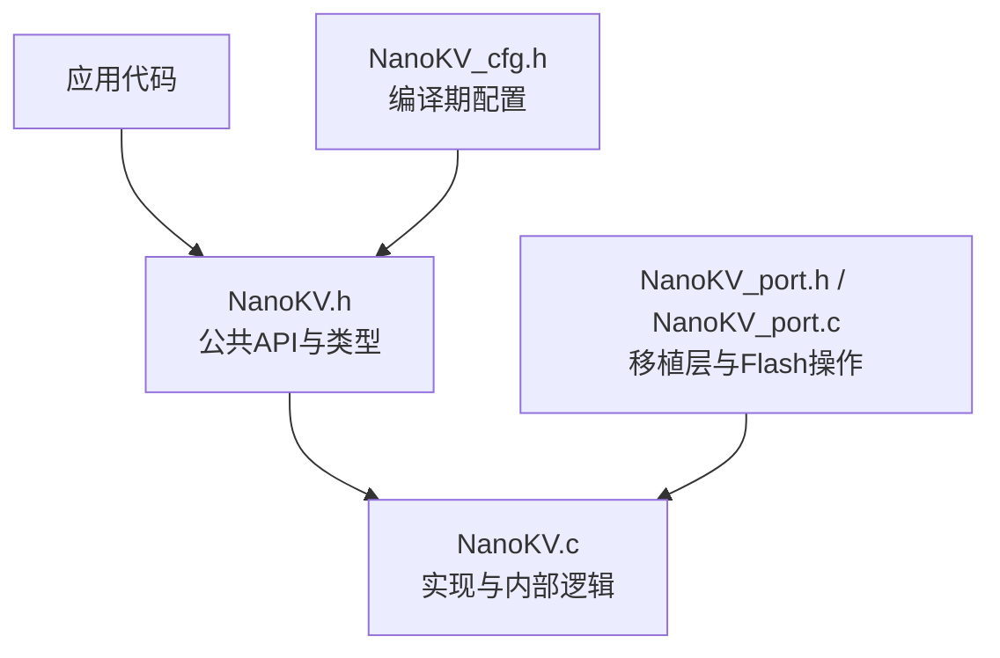
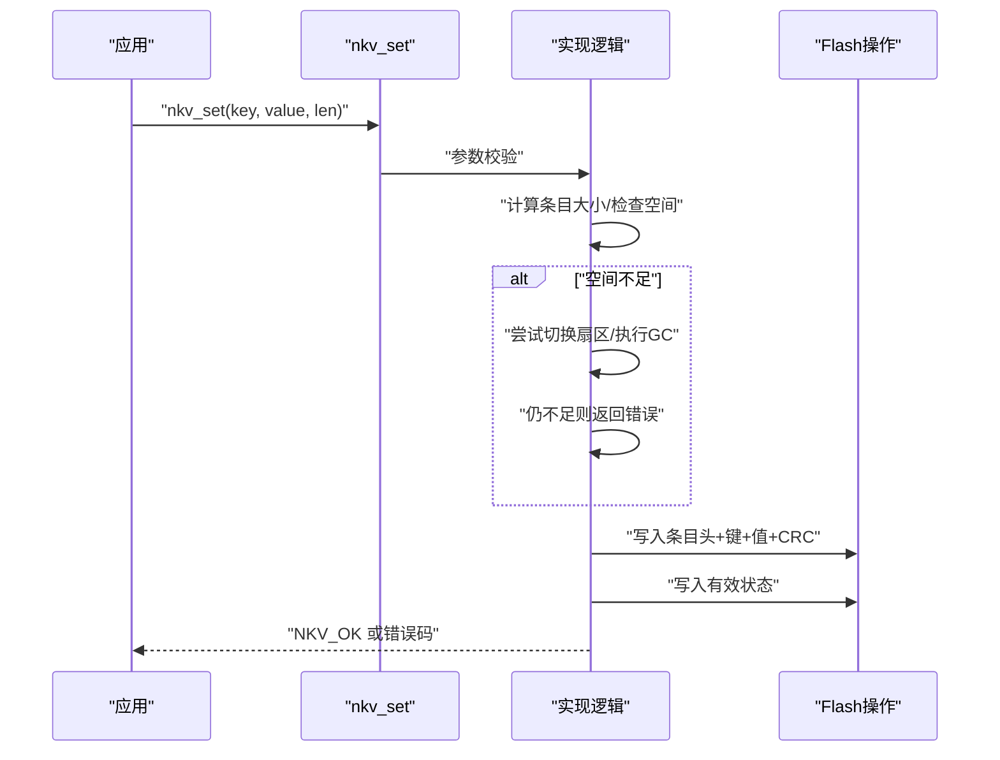
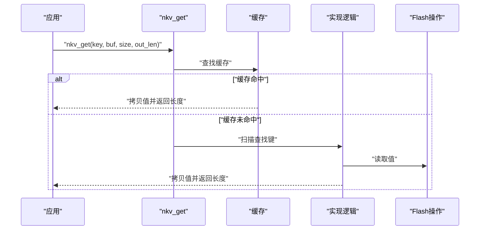
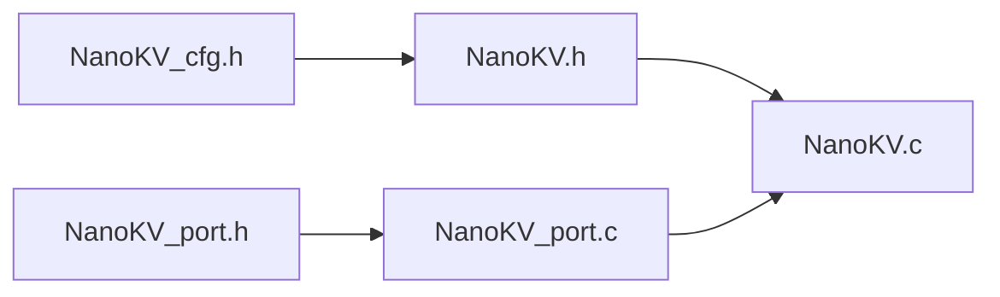

# KV存储API

<cite>
**本文引用的文件**
- [NanoKV.h](file://NanoKV.h)
- [NanoKV.c](file://NanoKV.c)
- [NanoKV_cfg.h](file://NanoKV_cfg.h)
- [NanoKV_port.h](file://NanoKV_port.h)
- [NanoKV_port.c](file://NanoKV_port.c)
</cite>

## 更新摘要
**变更内容**
- 完全重写文档以反映NanoKV的全新实现
- 更新API规范以符合新的状态机机制和CRC校验
- 添加TLV扩展功能的详细说明
- 更新错误码和状态常量
- 重新组织架构说明以体现新的设计模式

## 目录
1. [简介](#简介)
2. [项目结构](#项目结构)
3. [核心组件](#核心组件)
4. [架构总览](#架构总览)
5. [详细组件分析](#详细组件分析)
6. [依赖关系分析](#依赖关系分析)
7. [性能考量](#性能考量)
8. [故障排查指南](#故障排查指南)
9. [结论](#结论)
10. [附录](#附录)

## 简介
本文件为 NanoKV 的 KV/TLV 存储 API 参考文档，覆盖 nkv_set、nkv_get、nkv_del、nkv_exists 等核心函数以及 TLV 扩展功能的完整 API 规范。NanoKV 是一个全新的轻量级嵌入式存储库，具有以下特性：
- 追加写入：无需擦除即可更新，减少Flash磨损
- 多扇区环形：自动磨损均衡，充分利用存储空间
- 掉电安全：状态机 + CRC校验保障数据完整性
- LFU缓存：加速热点数据访问，提升读取性能
- 增量GC：分摊垃圾回收开销，适合实时系统
- 默认值支持：配置项可回退到预设值
- TLV扩展：类型-长度-值存储，支持历史记录和保留策略

## 项目结构
仓库采用"头文件+实现+配置+移植"的分层组织：
- NanoKV.h：公共接口、数据结构、常量与API声明
- NanoKV.c：KV/TLV实现、GC、缓存、扫描与格式化等逻辑
- NanoKV_cfg.h：编译期配置（键值长度、缓存、GC策略、调试等）
- NanoKV_port.h / NanoKV_port.c：移植层接口与Flash操作实现模板



**图表来源**
- [NanoKV.h](file://NanoKV.h#L1-L269)
- [NanoKV.c](file://NanoKV.c#L1-L1502)
- [NanoKV_cfg.h](file://NanoKV_cfg.h#L1-L92)
- [NanoKV_port.h](file://NanoKV_port.h#L1-L27)
- [NanoKV_port.c](file://NanoKV_port.c#L1-L95)

**章节来源**
- [NanoKV.h](file://NanoKV.h#L1-L269)
- [NanoKV.c](file://NanoKV.c#L1-L1502)
- [NanoKV_cfg.h](file://NanoKV_cfg.h#L1-L92)
- [NanoKV_port.h](file://NanoKV_port.h#L1-L27)
- [NanoKV_port.c](file://NanoKV_port.c#L1-L95)

## 核心组件
- 错误码枚举：NKV_OK、NKV_ERR_NOT_FOUND、NKV_ERR_NO_SPACE、NKV_ERR_INVALID、NKV_ERR_FLASH、NKV_ERR_CRC
- 状态常量：NKV_STATE_ERASED、NKV_STATE_WRITING、NKV_STATE_VALID、NKV_STATE_PRE_DEL、NKV_STATE_DELETED
- KV条目头结构：state、key_len、val_len
- 扇区头结构：magic、seq
- Flash操作回调：nkv_read_fn、nkv_write_fn、nkv_erase_fn
- 实例结构：nkv_instance_t，包含Flash配置、活动扇区、写偏移、GC状态、默认值指针、缓存等
- KV API：nkv_set、nkv_get、nkv_del、nkv_exists、nkv_get_usage、默认值API、缓存API、增量GC API
- TLV API：nkv_tlv_set、nkv_tlv_get、nkv_tlv_del、nkv_tlv_exists、迭代器API、历史记录API、保留策略API

**章节来源**
- [NanoKV.h](file://NanoKV.h#L45-L53)
- [NanoKV.h](file://NanoKV.h#L35-L39)
- [NanoKV.h](file://NanoKV.h#L64-L70)
- [NanoKV.h](file://NanoKV.h#L57-L62)
- [NanoKV.h](file://NanoKV.h#L85-L95)
- [NanoKV.h](file://NanoKV.h#L124-L143)
- [NanoKV.h](file://NanoKV.h#L145-L180)
- [NanoKV.h](file://NanoKV.h#L188-L266)

## 架构总览
NanoKV 以"多扇区环形 + 追加写入 + 状态机 + CRC"为核心设计，结合 LFU 缓存与增量 GC，实现低擦写频率、掉电安全与高吞吐读取。系统支持两种存储模式：KV键值对存储和TLV类型-长度-值存储。

```mermaid
graph TB
subgraph "应用层"
APP["应用代码"]
end
subgraph "NanoKV层"
API["KV API<br/>nkv_set/nkv_get/nkv_del/nkv_exists"]
TLV["TLV API<br/>nkv_tlv_set/nlv_tlv_get/..."]
CACHE["LFU缓存"]
GC["增量GC/全量GC"]
SCAN["扫描与恢复"]
FORMAT["格式化"]
END
subgraph "移植层"
PORT["移植层接口<br/>nkv_init/nkv_task"]
FLASH["Flash操作<br/>read/write/erase"]
end
APP --> API
APP --> TLV
API --> CACHE
API --> GC
API --> SCAN
API --> FORMAT
TLV --> CACHE
TLV --> GC
TLV --> SCAN
TLV --> FORMAT
PORT --> API
PORT --> TLV
PORT --> FLASH
```

**图表来源**
- [NanoKV.h](file://NanoKV.h#L145-L180)
- [NanoKV.h](file://NanoKV.h#L188-L266)
- [NanoKV.c](file://NanoKV.c#L737-L802)
- [NanoKV_port.h](file://NanoKV_port.h#L18-L21)
- [NanoKV_port.c](file://NanoKV_port.c#L54-L88)

## 详细组件分析

### nkv_set：设置键值
- 功能：写入一个键值对；若键已存在则覆盖；值长度为0表示删除该键
- 原型路径：[nkv_set](file://NanoKV.h#L153)
- 实现路径：[nkv_set](file://NanoKV.c#L843-L932)
- 参数与约束
  - key：非空字符串，长度需小于 NKV_MAX_KEY_LEN
  - value：当 len > 0 时非空；当 len == 0 表示删除
  - len：值长度，需不超过 NKV_MAX_VALUE_LEN
- 返回值
  - NKV_OK：成功
  - NKV_ERR_INVALID：参数非法（如未初始化、key为空、len越界、value为NULL但len>0）
  - NKV_ERR_NO_SPACE：无可用空间且无法触发GC或切换扇区
  - NKV_ERR_FLASH：Flash读写擦除失败
- 写入流程（简化）
  - 计算条目大小并检查空间；必要时寻找空闲扇区或执行GC
  - 构造条目头（state=WRITING），写入键、值与CRC
  - 将state标记为VALID
  - 更新写偏移；可选更新缓存；可选触发增量GC
- 边界条件
  - key长度超限、len超限、value为NULL但len>0
  - 写入后仍无空间（全量GC失败或无可擦除扇区）
- 并发与线程安全
  - 未提供内置互斥；多线程调用需外部同步
- 示例（路径）
  - 正确调用：[示例路径](file://NanoKV_port.c#L54-L88)
  - 错误处理策略：检查返回值并记录日志



**图表来源**
- [NanoKV.c](file://NanoKV.c#L843-L932)

**章节来源**
- [NanoKV.h](file://NanoKV.h#L153)
- [NanoKV.c](file://NanoKV.c#L843-L932)
- [NanoKV_port.c](file://NanoKV_port.c#L54-L88)

### nkv_get：获取键值
- 功能：读取键对应的值；支持从缓存命中或直接从Flash读取
- 原型路径：[nkv_get](file://NanoKV.h#L154)
- 实现路径：[nkv_get](file://NanoKV.c#L934-L991)
- 参数与约束
  - key：非空
  - buf：输出缓冲区，size为可容纳的最大字节数
  - out_len：可选，返回实际读取长度
- 返回值
  - NKV_OK：成功读取
  - NKV_ERR_INVALID：参数非法（未初始化、key为空、buf为空）
  - NKV_ERR_NOT_FOUND：未找到键或键值长度为0
  - NKV_ERR_FLASH：Flash读取失败
  - NKV_ERR_CRC：CRC校验失败
- 读取流程（简化）
  - 可选：缓存命中则直接拷贝并返回
  - 否则：按扇区序扫描查找键，定位条目后读取值
  - 可选：更新缓存
- 边界条件
  - 缓存容量不足时不会强制写入新值
  - out_len 为NULL时不会返回长度
- 并发与线程安全
  - 未提供内置互斥；多线程调用需外部同步
- 示例（路径）
  - 读取后处理：[示例路径](file://NanoKV_port.c#L54-L88)



**图表来源**
- [NanoKV.c](file://NanoKV.c#L934-L991)

**章节来源**
- [NanoKV.h](file://NanoKV.h#L154)
- [NanoKV.c](file://NanoKV.c#L934-L991)

### nkv_del：删除键
- 功能：删除指定键；内部通过设置空值实现
- 原型路径：[nkv_del](file://NanoKV.h#L155)
- 实现路径：[nkv_del](file://NanoKV.c#L993-L999)
- 参数与约束
  - key：非空
- 返回值
  - NKV_OK：删除成功
  - 其他：与 nkv_set(len==0) 相同的错误路径
- 边界条件
  - 键不存在时仍视为成功（幂等）
  - 可选：删除后更新缓存
- 并发与线程安全
  - 未提供内置互斥；多线程调用需外部同步
- 示例（路径）
  - 删除后读取验证：[示例路径](file://NanoKV_port.c#L54-L88)


**图表来源**
- [NanoKV.c](file://NanoKV.c#L993-L999)

**章节来源**
- [NanoKV.h](file://NanoKV.h#L155)
- [NanoKV.c](file://NanoKV.c#L993-L999)

### nkv_exists：检查键是否存在
- 功能：判断键是否存在且值长度大于0
- 原型路径：[nkv_exists](file://NanoKV.h#L156)
- 实现路径：[nkv_exists](file://NanoKV.c#L1001-L1008)
- 参数与约束
  - key：非空
- 返回值
  - 1：存在且值长度>0
  - 0：不存在或值长度为0
- 边界条件
  - 未初始化或key为空时返回0
- 并发与线程安全
  - 未提供内置互斥；多线程调用需外部同步
- 示例（路径）
  - 存在性判断：[示例路径](file://NanoKV_port.c#L54-L88)


**图表来源**
- [NanoKV.c](file://NanoKV.c#L1001-L1008)

**章节来源**
- [NanoKV.h](file://NanoKV.h#L156)
- [NanoKV.c](file://NanoKV.c#L1001-L1008)

### nkv_get_usage：获取使用情况
- 功能：返回已用空间与总空间
- 原型路径：[nkv_get_usage](file://NanoKV.h#L157)
- 实现路径：[nkv_get_usage](file://NanoKV.c#L1010-L1016)
- 参数与约束
  - used/out_len：可选，传入非空指针接收结果
- 返回值
  - 无返回值；通过指针参数返回
- 并发与线程安全
  - 未提供内置互斥；多线程调用需外部同步

**章节来源**
- [NanoKV.h](file://NanoKV.h#L157)
- [NanoKV.c](file://NanoKV.c#L1010-L1016)

### 默认值支持（与KV API协同）
- 设置默认值：nkv_set_defaults
- 查询默认值：nkv_get_default
- 查找默认值：nkv_find_default
- 重置单个键：nkv_reset_key
- 重置全部：nkv_reset_all
- 实现路径
  - [nkv_set_defaults](file://NanoKV.c#L1102-L1108)
  - [nkv_get_default](file://NanoKV.c#L1125-L1143)
  - [nkv_find_default](file://NanoKV.c#L1110-L1123)
  - [nkv_reset_key](file://NanoKV.c#L1145-L1153)
  - [nkv_reset_all](file://NanoKV.c#L1155-L1171)

**章节来源**
- [NanoKV.h](file://NanoKV.h#L159-L164)
- [NanoKV.c](file://NanoKV.c#L1102-L1171)

### 缓存API（可选）
- 获取缓存统计：nkv_cache_stats
- 清空缓存：nkv_cache_clear
- 实现路径
  - [nkv_cache_stats](file://NanoKV.c#L1041-L1049)
  - [nkv_cache_clear](file://NanoKV.c#L1051-L1054)

**章节来源**
- [NanoKV.h](file://NanoKV.h#L177-L180)
- [NanoKV.c](file://NanoKV.c#L1041-L1054)

### 增量GC API（可选）
- 执行GC步骤：nkv_gc_step
- 查询GC状态：nkv_gc_active
- 实现路径
  - [nkv_gc_step](file://NanoKV.c#L1019-L1032)
  - [nkv_gc_active](file://NanoKV.c#L1034-L1037)

**章节来源**
- [NanoKV.h](file://NanoKV.h#L170-L174)
- [NanoKV.c](file://NanoKV.c#L1019-L1037)

### TLV API（新增功能）

#### nkv_tlv_set：设置TLV值
- 功能：写入一个类型-长度-值条目
- 原型路径：[nkv_tlv_set](file://NanoKV.h#L231)
- 实现路径：[nkv_tlv_set](file://NanoKV.c#L1202-L1211)
- 参数与约束
  - type：非零类型标识符
  - value：值数据指针
  - len：值长度，需在1-254范围内
- 返回值
  - NKV_OK：成功
  - NKV_ERR_INVALID：参数非法（type为0、value为NULL、len越界）

#### nkv_tlv_get：获取TLV值
- 功能：读取指定类型的TLV值
- 原型路径：[nkv_tlv_get](file://NanoKV.h#L232)
- 实现路径：[nkv_tlv_get](file://NanoKV.c#L1213-L1232)
- 参数与约束
  - type：非零类型标识符
  - buf：输出缓冲区
  - size：缓冲区大小
  - out_len：可选，返回实际长度
- 返回值
  - NKV_OK：成功
  - NKV_ERR_INVALID：参数非法
  - NKV_ERR_NOT_FOUND：未找到指定类型

#### nkv_tlv_del：删除TLV类型
- 功能：删除指定类型的TLV条目
- 原型路径：[nkv_tlv_del](file://NanoKV.h#L233)
- 实现路径：[nkv_tlv_del](file://NanoKV.c#L1234-L1239)
- 参数与约束
  - type：非零类型标识符
- 返回值
  - NKV_OK：删除成功
  - NKV_ERR_INVALID：type为0

#### nkv_tlv_exists：检查TLV类型是否存在
- 功能：判断指定类型是否存在且值长度>1
- 原型路径：[nkv_tlv_exists](file://NanoKV.h#L234)
- 实现路径：[nkv_tlv_exists](file://NanoKV.c#L1241-L1248)
- 参数与约束
  - type：非零类型标识符
- 返回值
  - 1：存在且值长度>1
  - 0：不存在或值长度<=1

**章节来源**
- [NanoKV.h](file://NanoKV.h#L231-L234)
- [NanoKV.c](file://NanoKV.c#L1202-L1248)

### TLV默认值API（新增功能）

#### nkv_tlv_set_defaults：设置TLV默认值
- 功能：设置TLV默认值表
- 原型路径：[nkv_tlv_set_defaults](file://NanoKV.h#L237)
- 实现路径：[nkv_tlv_set_defaults](file://NanoKV.c#L1251-L1257)
- 参数与约束
  - defs：默认值数组
  - count：默认值数量
- 返回值
  - 无返回值

#### nkv_tlv_get_default：获取TLV默认值
- 功能：获取指定类型的默认值
- 原型路径：[nkv_tlv_get_default](file://NanoKV.h#L238)
- 实现路径：[nkv_tlv_get_default](file://NanoKV.c#L1269-L1282)
- 参数与约束
  - type：类型标识符
  - buf：输出缓冲区
  - size：缓冲区大小
  - out_len：可选，返回实际长度
- 返回值
  - NKV_OK：成功
  - NKV_ERR_NOT_FOUND：未找到默认值

#### nkv_tlv_reset_type：重置TLV类型
- 功能：将指定类型重置为默认值
- 原型路径：[nkv_tlv_reset_type](file://NanoKV.h#L239)
- 实现路径：[nkv_tlv_reset_type](file://NanoKV.c#L1285-L1291)
- 参数与约束
  - type：类型标识符
- 返回值
  - NKV_OK：重置成功
  - NKV_ERR_NOT_FOUND：未找到默认值

#### nkv_tlv_reset_all：重置所有TLV类型
- 功能：将所有类型重置为默认值
- 原型路径：[nkv_tlv_reset_all](file://NanoKV.h#L240)
- 实现路径：[nkv_tlv_reset_all](file://NanoKV.c#L1293-L1304)
- 参数与约束
  - 无
- 返回值
  - NKV_OK：重置成功
  - 其他：重置过程中的错误

**章节来源**
- [NanoKV.h](file://NanoKV.h#L237-L240)
- [NanoKV.c](file://NanoKV.c#L1251-L1304)

### TLV迭代器API（新增功能）

#### nkv_tlv_iter_init：初始化迭代器
- 功能：初始化TLV迭代器
- 原型路径：[nkv_tlv_iter_init](file://NanoKV.h#L243)
- 实现路径：[nkv_tlv_iter_init](file://NanoKV.c#L1307-L1314)
- 参数与约束
  - iter：迭代器指针
- 返回值
  - 无返回值

#### nkv_tlv_iter_next：获取下一个TLV条目
- 功能：获取下一个有效的TLV条目信息
- 原型路径：[nkv_tlv_iter_next](file://NanoKV.h#L244)
- 实现路径：[nkv_tlv_iter_next](file://NanoKV.c#L1316-L1363)
- 参数与约束
  - iter：迭代器指针
  - info：输出条目信息
- 返回值
  - 1：找到有效条目
  - 0：迭代结束

#### nkv_tlv_iter_read：读取迭代器指向的值
- 功能：读取迭代器当前指向的TLV值
- 原型路径：[nkv_tlv_iter_read](file://NanoKV.h#L245)
- 实现路径：[nkv_tlv_iter_read](file://NanoKV.c#L1365-L1373)
- 参数与约束
  - info：条目信息指针
  - buf：输出缓冲区
  - size：缓冲区大小
- 返回值
  - NKV_OK：读取成功
  - NKV_ERR_INVALID：参数非法
  - NKV_ERR_FLASH：Flash读取失败

**章节来源**
- [NanoKV.h](file://NanoKV.h#L243-L245)
- [NanoKV.c](file://NanoKV.c#L1307-L1373)

### TLV工具函数（新增功能）

#### nkv_tlv_stats：获取TLV统计信息
- 功能：获取TLV条目数量和使用的空间
- 原型路径：[nkv_tlv_stats](file://NanoKV.h#L248)
- 实现路径：[nkv_tlv_stats](file://NanoKV.c#L1376-L1395)
- 参数与约束
  - count：可选，返回条目数量
  - used：可选，返回使用的空间
- 返回值
  - 无返回值

#### nkv_tlv_has_data：检查是否有TLV数据
- 功能：检查存储区是否包含TLV数据
- 原型路径：[nkv_tlv_has_data](file://NanoKV.h#L249)
- 实现路径：[nkv_tlv_has_data](file://NanoKV.c#L1397-L1403)
- 参数与约束
  - 无
- 返回值
  - 1：有数据
  - 0：无数据

**章节来源**
- [NanoKV.h](file://NanoKV.h#L248-L249)
- [NanoKV.c](file://NanoKV.c#L1376-L1403)

### TLV历史记录API（新增功能）

#### nkv_tlv_get_history：获取类型历史记录
- 功能：获取指定类型的完整历史记录
- 原型路径：[nkv_tlv_get_history](file://NanoKV.h#L252)
- 实现路径：[nkv_tlv_get_history](file://NanoKV.c#L1406-L1450)
- 参数与约束
  - type：类型标识符
  - history：输出历史记录数组
  - max：最大历史记录数量
  - count：可选，返回实际数量
- 返回值
  - NKV_OK：获取成功
  - NKV_ERR_INVALID：参数非法

#### nkv_tlv_read_history：读取历史记录值
- 功能：读取指定历史记录的值
- 原型路径：[nkv_tlv_read_history](file://NanoKV.h#L253)
- 实现路径：[nkv_tlv_read_history](file://NanoKV.c#L1452-L1460)
- 参数与约束
  - entry：历史记录指针
  - buf：输出缓冲区
  - size：缓冲区大小
- 返回值
  - NKV_OK：读取成功
  - NKV_ERR_INVALID：参数非法
  - NKV_ERR_FLASH：Flash读取失败

**章节来源**
- [NanoKV.h](file://NanoKV.h#L252-L253)
- [NanoKV.c](file://NanoKV.c#L1406-L1460)

### TLV保留策略API（新增功能）

#### nkv_tlv_set_retention：设置保留策略
- 功能：为指定类型设置保留策略
- 原型路径：[nkv_tlv_set_retention](file://NanoKV.h#L257)
- 实现路径：[nkv_tlv_set_retention](file://NanoKV.c#L1464-L1486)
- 参数与约束
  - type：类型标识符
  - keep：保留的最新记录数量
- 返回值
  - NKV_OK：设置成功
  - NKV_ERR_INVALID：参数非法

#### nkv_tlv_clear_retention：清除保留策略
- 功能：清除指定类型的保留策略
- 原型路径：[nkv_tlv_clear_retention](file://NanoKV.h#L258)
- 实现路径：[nkv_tlv_clear_retention](file://NanoKV.c#L1488-L1500)
- 参数与约束
  - type：类型标识符
- 返回值
  - 无返回值

**章节来源**
- [NanoKV.h](file://NanoKV.h#L256-L259)
- [NanoKV.c](file://NanoKV.c#L1464-L1500)

## 依赖关系分析
- 头文件依赖
  - NanoKV.h 依赖 NanoKV_cfg.h 提供编译期配置
  - 实现文件 NanoKV.c 包含 NanoKV.h，并使用配置常量
- 移植层依赖
  - NanoKV_port.c 提供 Flash 回调与初始化入口
  - NanoKV_port.h 声明 nkv_init 与 nkv_task
- 内部依赖
  - KV API 依赖 Flash 回调、扫描/格式化、GC、缓存等内部模块
  - TLV API 依赖 KV API 的基础设施



**图表来源**
- [NanoKV_cfg.h](file://NanoKV_cfg.h#L1-L92)
- [NanoKV.h](file://NanoKV.h#L1-L269)
- [NanoKV.c](file://NanoKV.c#L1-L1502)
- [NanoKV_port.h](file://NanoKV_port.h#L1-L27)
- [NanoKV_port.c](file://NanoKV_port.c#L1-L95)

**章节来源**
- [NanoKV.h](file://NanoKV.h#L1-L269)
- [NanoKV.c](file://NanoKV.c#L1-L1502)
- [NanoKV_cfg.h](file://NanoKV_cfg.h#L1-L92)
- [NanoKV_port.h](file://NanoKV_port.h#L1-L27)
- [NanoKV_port.c](file://NanoKV_port.c#L1-L95)

## 性能考量
- 读取性能
  - 启用缓存（LFU）可显著降低重复读取的Flash访问次数
  - 未命中缓存时按扇区逆序扫描，时间复杂度与有效条目数近似线性
  - TLV读取通过专门的匹配器优化，避免不必要的扫描
- 写入性能
  - 追加写入避免擦除，减少Flash磨损；但可能触发GC
  - 增量GC将GC开销分摊到多次写入中，避免长时阻塞
  - TLV写入通过特殊的键值处理实现高效存储
- 空间利用
  - 多扇区环形结构与磨损均衡提升空间利用率
  - GC后释放空间，但可能因保留策略导致部分旧数据保留
  - TLV保留策略允许配置历史数据的保留数量
- 配置影响
  - NKV_CACHE_SIZE、NKV_GC_ENTRIES_PER_WRITE、NKV_GC_THRESHOLD_PERCENT 等直接影响性能与可靠性
  - NKV_TLV_RETENTION_ENABLE 影响TLV存储的额外开销

**章节来源**
- [NanoKV_cfg.h](file://NanoKV_cfg.h#L17-L29)
- [NanoKV.c](file://NanoKV.c#L498-L735)

## 故障排查指南
- 常见错误码
  - NKV_ERR_INVALID：参数非法（未初始化、key为空、长度越界、value为NULL但len>0）
  - NKV_ERR_NOT_FOUND：键不存在或值长度为0
  - NKV_ERR_NO_SPACE：空间不足且无法切换扇区或GC失败
  - NKV_ERR_FLASH：Flash读写擦除失败
  - NKV_ERR_CRC：CRC校验失败
- 定位方法
  - 检查初始化流程：nkv_internal_init → nkv_scan → nkv_get_usage
  - 检查移植层Flash回调实现是否正确
  - 使用 nkv_get_usage 获取使用率，评估是否接近阈值
  - 启用调试日志（NKV_DEBUG_ENABLE）查看详细信息
  - 对于TLV问题，使用 nkv_tlv_stats 和迭代器API进行诊断
- 建议
  - 写入前先检查返回值并处理错误
  - 在高写入负载下关注GC状态（nkv_gc_active）
  - 合理设置缓存大小与GC阈值
  - 对于TLV数据，合理配置保留策略以平衡存储空间和历史记录需求

**章节来源**
- [NanoKV.h](file://NanoKV.h#L45-L53)
- [NanoKV.c](file://NanoKV.c#L760-L802)
- [NanoKV_port.c](file://NanoKV_port.c#L54-L88)
- [NanoKV_cfg.h](file://NanoKV_cfg.h#L35-L70)

## 结论
NanoKV 提供了功能丰富的KV/TLV存储API，具备掉电安全、低擦写、可配置缓存与增量GC等特性。KV API（nkv_set、nkv_get、nkv_del、nkv_exists）和TLV API（nkv_tlv_set、nkv_tlv_get、nkv_tlv_del、nkv_tlv_exists）满足嵌入式场景下的多样化存储需求。系统支持默认值回退、历史记录追踪和保留策略等高级功能。使用时需关注参数验证、空间管理、错误处理与并发同步，并结合配置参数优化性能与可靠性。

## 附录

### API参数与返回值速查
- nkv_set
  - 输入：key、value、len
  - 输出：错误码
  - 适用：新增/更新/删除键
- nkv_get
  - 输入：key、buf、size、out_len
  - 输出：错误码，out_len可选
  - 适用：读取键值
- nkv_del
  - 输入：key
  - 输出：错误码
  - 适用：删除键
- nkv_exists
  - 输入：key
  - 输出：布尔值
  - 适用：存在性检查
- nkv_get_usage
  - 输入：无
  - 输出：used、total（指针）
  - 适用：空间使用统计
- nkv_tlv_set
  - 输入：type、value、len
  - 输出：错误码
  - 适用：设置TLV值
- nkv_tlv_get
  - 输入：type、buf、size、out_len
  - 输出：错误码，out_len可选
  - 适用：获取TLV值
- nkv_tlv_del
  - 输入：type
  - 输出：错误码
  - 适用：删除TLV类型
- nkv_tlv_exists
  - 输入：type
  - 输出：布尔值
  - 适用：TLV类型存在性检查

**章节来源**
- [NanoKV.h](file://NanoKV.h#L153-L157)
- [NanoKV.h](file://NanoKV.h#L231-L234)
- [NanoKV.c](file://NanoKV.c#L843-L1016)

### 数据格式与内存布局
- 扇区头
  - 字段：magic（2字节）、seq（2字节）
  - 作用：标识扇区有效性与序列号
- KV条目头
  - 字段：state（2字节）、key_len（1字节）、val_len（1字节）
  - 作用：描述条目状态与键值长度
- TLV条目头
  - 字段：state（2字节）、key_len（1字节）、val_len（1字节）
  - 作用：描述条目状态与值长度（TLV中key_len固定为0）
- 条目内容
  - KV：键（key_len字节）+ 值（val_len字节）+ CRC（2字节）
  - TLV：类型（1字节）+ 值（val_len-1字节）+ CRC（2字节）
  - 对齐：按 Flash 对齐要求进行对齐
- 状态机
  - WRITING → VALID：写入完成后标记有效，确保掉电安全
  - PRE_DEL：预删除状态，用于更新时的原子性操作
  - DELETED：已删除状态，标记为可回收

**章节来源**
- [NanoKV.h](file://NanoKV.h#L57-L70)
- [NanoKV.h](file://NanoKV.h#L34-L42)
- [NanoKV.c](file://NanoKV.c#L58-L70)

### 线程安全与并发访问
- 当前实现未内置互斥锁
- 建议
  - 单线程环境下直接调用
  - 多线程环境下在调用API前后自行加锁
  - 避免同时进行写入与GC相关的操作
  - 对于TLV操作，注意类型冲突可能导致的竞态条件

**章节来源**
- [NanoKV.c](file://NanoKV.c#L843-L932)
- [NanoKV.c](file://NanoKV.c#L993-L999)
- [NanoKV.c](file://NanoKV.c#L1001-L1008)

### 使用示例（路径）
- 初始化与基本操作
  - [nkv_init 流程](file://NanoKV_port.c#L54-L88)
- 设置键值
  - [nkv_set 调用](file://NanoKV.c#L843-L932)
- 读取键值
  - [nkv_get 调用](file://NanoKV.c#L934-L991)
- 删除键
  - [nkv_del 调用](file://NanoKV.c#L993-L999)
- 检查存在性
  - [nkv_exists 调用](file://NanoKV.c#L1001-L1008)
- 获取使用情况
  - [nkv_get_usage 调用](file://NanoKV.c#L1010-L1016)
- TLV基本操作
  - [nkv_tlv_set 调用](file://NanoKV.c#L1202-L1211)
  - [nkv_tlv_get 调用](file://NanoKV.c#L1213-L1232)
  - [nkv_tlv_del 调用](file://NanoKV.c#L1234-L1239)
  - [nkv_tlv_exists 调用](file://NanoKV.c#L1241-L1248)
- TLV高级功能
  - [nkv_tlv_get_history 调用](file://NanoKV.c#L1406-L1450)
  - [nkv_tlv_set_retention 调用](file://NanoKV.c#L1464-L1486)

**章节来源**
- [NanoKV_port.c](file://NanoKV_port.c#L54-L88)
- [NanoKV.c](file://NanoKV.c#L843-L1500)