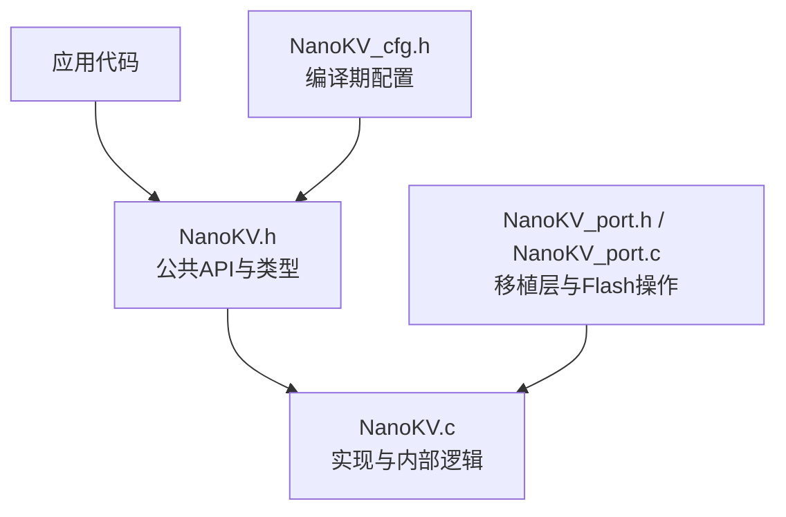
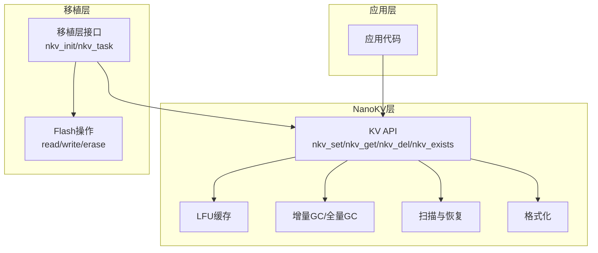
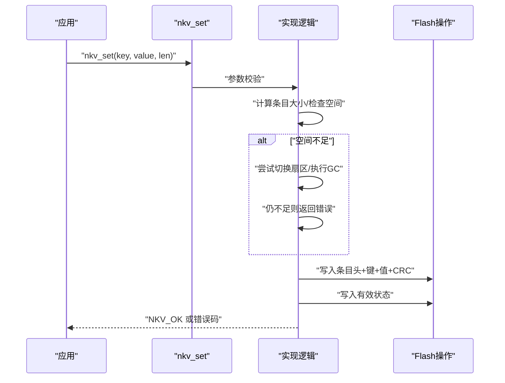
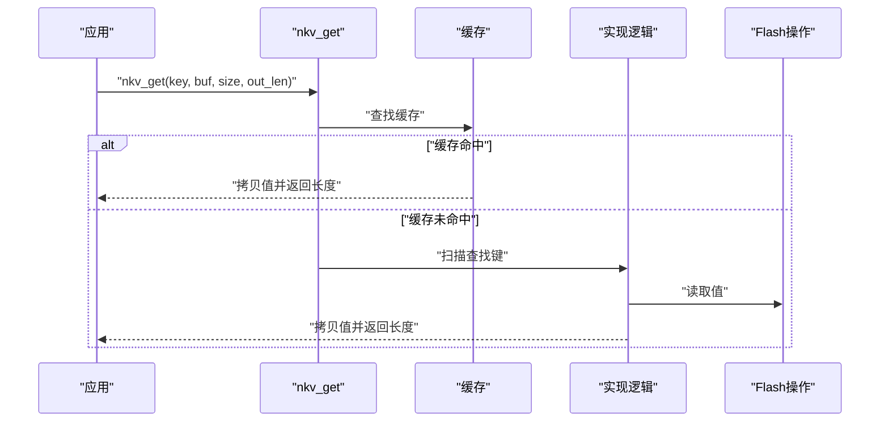
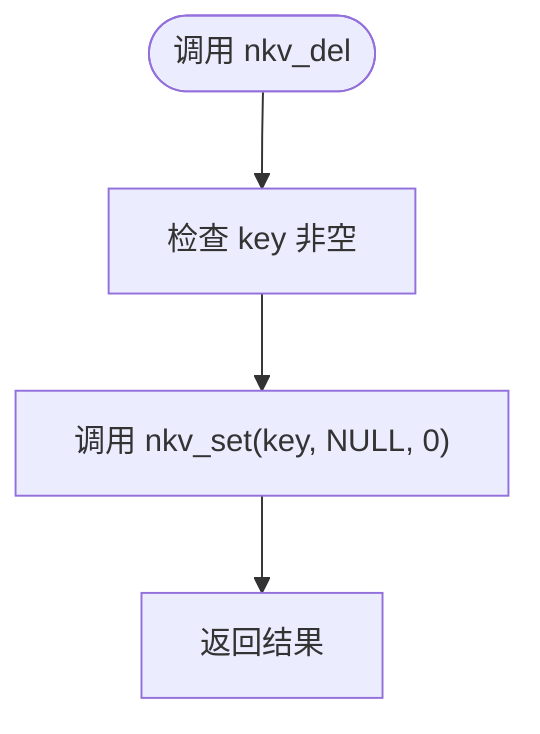
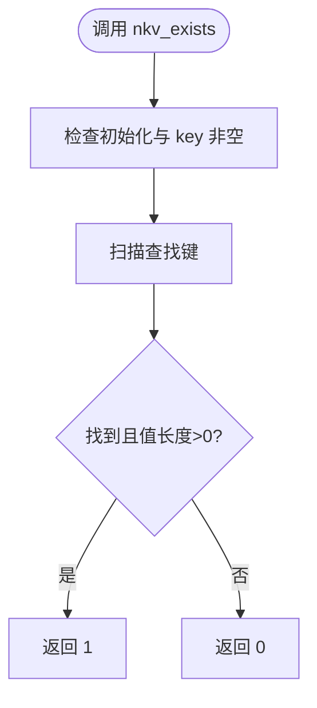
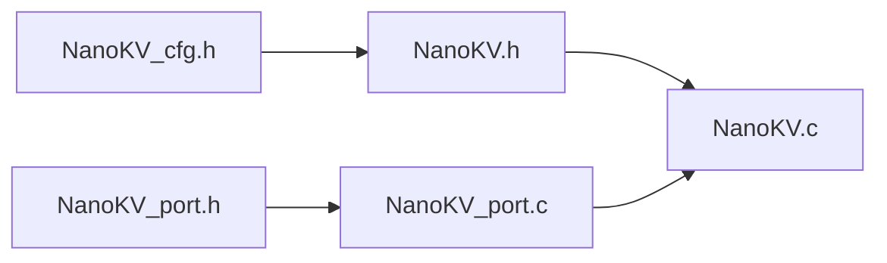

# KV存储API

<cite>
**本文引用的文件**
- [NanoKV.h](file://NanoKV.h)
- [NanoKV.c](file://NanoKV.c)
- [NanoKV_cfg.h](file://NanoKV_cfg.h)
- [NanoKV_port.h](file://NanoKV_port.h)
- [NanoKV_port.c](file://NanoKV_port.c)
</cite>

## 目录
1. [简介](#简介)
2. [项目结构](#项目结构)
3. [核心组件](#核心组件)
4. [架构总览](#架构总览)
5. [详细组件分析](#详细组件分析)
6. [依赖关系分析](#依赖关系分析)
7. [性能考量](#性能考量)
8. [故障排查指南](#故障排查指南)
9. [结论](#结论)
10. [附录](#附录)

## 简介
本文件为 NanoKV 的 KV 存储 API 参考文档，覆盖 nkv_set、nkv_get、nkv_del、nkv_exists 等核心函数的完整 API 规范。内容包括：
- 参数类型与返回值语义
- 错误码解释与常见错误场景
- 使用示例与参数验证规则
- 数据格式、内存布局与工作原理
- 性能特征、使用限制与最佳实践
- 线程安全与并发访问注意事项
- 与移植层、配置层的集成要点

## 项目结构
仓库采用“头文件+实现+配置+移植”的分层组织：
- NanoKV.h：公共接口、数据结构、常量与API声明
- NanoKV.c：KV/TLV实现、GC、缓存、扫描与格式化等逻辑
- NanoKV_cfg.h：编译期配置（键值长度、缓存、GC策略、调试等）
- NanoKV_port.h / NanoKV_port.c：移植层接口与Flash操作实现模板

图表来源
- [NanoKV.h](file://NanoKV.h#L1-L257)
- [NanoKV.c](file://NanoKV.c#L1-L1261)
- [NanoKV_cfg.h](file://NanoKV_cfg.h#L1-L51)
- [NanoKV_port.h](file://NanoKV_port.h#L1-L27)
- [NanoKV_port.c](file://NanoKV_port.c#L1-L95)

章节来源
- [NanoKV.h](file://NanoKV.h#L1-L257)
- [NanoKV.c](file://NanoKV.c#L1-L1261)
- [NanoKV_cfg.h](file://NanoKV_cfg.h#L1-L51)
- [NanoKV_port.h](file://NanoKV_port.h#L1-L27)
- [NanoKV_port.c](file://NanoKV_port.c#L1-L95)

## 核心组件
- 错误码枚举：NKV_OK、NKV_ERR_NOT_FOUND、NKV_ERR_NO_SPACE、NKV_ERR_INVALID、NKV_ERR_FLASH
- KV条目头结构：state、key_len、val_len
- 扇区头结构：magic、seq
- Flash操作回调：nkv_read_fn、nkv_write_fn、nkv_erase_fn
- 实例结构：nkv_instance_t，包含Flash配置、活动扇区、写偏移、GC状态、默认值指针、缓存等
- KV API：nkv_set、nkv_get、nkv_del、nkv_exists、nkv_get_usage、默认值API、缓存API、增量GC API

章节来源
- [NanoKV.h](file://NanoKV.h#L33-L131)
- [NanoKV.h](file://NanoKV.h#L133-L168)
- [NanoKV.c](file://NanoKV.c#L628-L640)

## 架构总览
NanoKV 以“多扇区环形 + 追加写入 + 状态机 + CRC”为核心设计，结合 LFU 缓存与增量 GC，实现低擦写频率、掉电安全与高吞吐读取。

图表来源
- [NanoKV.h](file://NanoKV.h#L133-L168)
- [NanoKV.c](file://NanoKV.c#L628-L693)
- [NanoKV_port.h](file://NanoKV_port.h#L18-L21)
- [NanoKV_port.c](file://NanoKV_port.c#L54-L88)

## 详细组件分析

### nkv_set：设置键值
- 功能：写入一个键值对；若键已存在则覆盖；值长度为0表示删除该键（通过内部调用实现）
- 原型路径：[nkv_set](file://NanoKV.h#L141)
- 实现路径：[nkv_set](file://NanoKV.c#L695-L763)
- 参数与约束
  - key：非空字符串，长度需小于 NKV_MAX_KEY_LEN
  - value：当 len > 0 时非空；当 len == 0 表示删除
  - len：值长度，需不超过 NKV_MAX_VALUE_LEN
- 返回值
  - NKV_OK：成功
  - NKV_ERR_INVALID：参数非法（如未初始化、key为空、len越界、value为NULL但len>0）
  - NKV_ERR_NO_SPACE：无可用空间且无法触发GC或切换扇区
  - NKV_ERR_FLASH：Flash读写擦除失败
- 写入流程（简化）
  - 计算条目大小并检查空间；必要时寻找空闲扇区或执行GC
  - 构造条目头（state=WRITING），写入键、值与CRC
  - 将state标记为VALID
  - 更新写偏移；可选更新缓存；可选触发增量GC
- 边界条件
  - key长度超限、len超限、value为NULL但len>0
  - 写入后仍无空间（全量GC失败或无可擦除扇区）
- 并发与线程安全
  - 未提供内置互斥；多线程调用需外部同步
- 示例（路径）
  - 正确调用：[示例路径](file://NanoKV_port.c#L54-L88)
  - 错误处理策略：检查返回值并记录日志

图表来源
- [NanoKV.c](file://NanoKV.c#L695-L763)

章节来源
- [NanoKV.h](file://NanoKV.h#L141)
- [NanoKV.c](file://NanoKV.c#L695-L763)
- [NanoKV_port.c](file://NanoKV_port.c#L54-L88)

### nkv_get：获取键值
- 功能：读取键对应的值；支持从缓存命中或直接从Flash读取
- 原型路径：[nkv_get](file://NanoKV.h#L142)
- 实现路径：[nkv_get](file://NanoKV.c#L765-L798)
- 参数与约束
  - key：非空
  - buf：输出缓冲区，size为可容纳的最大字节数
  - out_len：可选，返回实际读取长度
- 返回值
  - NKV_OK：成功读取
  - NKV_ERR_INVALID：参数非法（未初始化、key为空、buf为空）
  - NKV_ERR_NOT_FOUND：未找到键或键值长度为0
  - NKV_ERR_FLASH：Flash读取失败
- 读取流程（简化）
  - 可选：缓存命中则直接拷贝并返回
  - 否则：按扇区序扫描查找键，定位条目后读取值
  - 可选：更新缓存
- 边界条件
  - 缓存容量不足时不会强制写入新值
  - out_len 为NULL时不会返回长度
- 并发与线程安全
  - 未提供内置互斥；多线程调用需外部同步
- 示例（路径）
  - 读取后处理：[示例路径](file://NanoKV_port.c#L54-L88)

图表来源
- [NanoKV.c](file://NanoKV.c#L765-L798)

章节来源
- [NanoKV.h](file://NanoKV.h#L142)
- [NanoKV.c](file://NanoKV.c#L765-L798)

### nkv_del：删除键
- 功能：删除指定键；内部通过设置空值实现
- 原型路径：[nkv_del](file://NanoKV.h#L143)
- 实现路径：[nkv_del](file://NanoKV.c#L800-L806)
- 参数与约束
  - key：非空
- 返回值
  - NKV_OK：删除成功
  - 其他：与 nkv_set(len==0) 相同的错误路径
- 边界条件
  - 键不存在时仍视为成功（幂等）
  - 可选：删除后更新缓存
- 并发与线程安全
  - 未提供内置互斥；多线程调用需外部同步
- 示例（路径）
  - 删除后读取验证：[示例路径](file://NanoKV_port.c#L54-L88)

图表来源
- [NanoKV.c](file://NanoKV.c#L800-L806)

章节来源
- [NanoKV.h](file://NanoKV.h#L143)
- [NanoKV.c](file://NanoKV.c#L800-L806)

### nkv_exists：检查键是否存在
- 功能：判断键是否存在且值长度大于0
- 原型路径：[nkv_exists](file://NanoKV.h#L144)
- 实现路径：[nkv_exists](file://NanoKV.c#L808-L815)
- 参数与约束
  - key：非空
- 返回值
  - 1：存在且值长度>0
  - 0：不存在或值长度为0
- 边界条件
  - 未初始化或key为空时返回0
- 并发与线程安全
  - 未提供内置互斥；多线程调用需外部同步
- 示例（路径）
  - 存在性判断：[示例路径](file://NanoKV_port.c#L54-L88)

图表来源
- [NanoKV.c](file://NanoKV.c#L808-L815)

章节来源
- [NanoKV.h](file://NanoKV.h#L144)
- [NanoKV.c](file://NanoKV.c#L808-L815)

### nkv_get_usage：获取使用情况
- 功能：返回已用空间与总空间
- 原型路径：[nkv_get_usage](file://NanoKV.h#L145)
- 实现路径：[nkv_get_usage](file://NanoKV.c#L817-L823)
- 参数与约束
  - used/out_len：可选，传入非空指针接收结果
- 返回值
  - 无返回值；通过指针参数返回
- 并发与线程安全
  - 未提供内置互斥；多线程调用需外部同步

章节来源
- [NanoKV.h](file://NanoKV.h#L145)
- [NanoKV.c](file://NanoKV.c#L817-L823)

### 默认值支持（与KV API协同）
- 设置默认值：nkv_set_defaults
- 查询默认值：nkv_get_default
- 查找默认值：nkv_find_default
- 重置单个键：nkv_reset_key
- 重置全部：nkv_reset_all
- 实现路径
  - [nkv_set_defaults](file://NanoKV.c#L866-L870)
  - [nkv_get_default](file://NanoKV.c#L887-L905)
  - [nkv_find_default](file://NanoKV.c#L872-L885)
  - [nkv_reset_key](file://NanoKV.c#L907-L915)
  - [nkv_reset_all](file://NanoKV.c#L917-L933)

章节来源
- [NanoKV.h](file://NanoKV.h#L147-L152)
- [NanoKV.c](file://NanoKV.c#L866-L933)

### 缓存API（可选）
- 获取缓存统计：nkv_cache_stats
- 清空缓存：nkv_cache_clear
- 实现路径
  - [nkv_cache_stats](file://NanoKV.c#L847-L862)
  - [nkv_cache_clear](file://NanoKV.c#L858-L861)

章节来源
- [NanoKV.h](file://NanoKV.h#L164-L168)
- [NanoKV.c](file://NanoKV.c#L847-L862)

### 增量GC API（可选）
- 执行GC步骤：nkv_gc_step
- 查询GC状态：nkv_gc_active
- 实现路径
  - [nkv_gc_step](file://NanoKV.c#L825-L845)
  - [nkv_gc_active](file://NanoKV.c#L841-L844)

章节来源
- [NanoKV.h](file://NanoKV.h#L158-L162)
- [NanoKV.c](file://NanoKV.c#L825-L845)

## 依赖关系分析
- 头文件依赖
  - NanoKV.h 依赖 NanoKV_cfg.h 提供编译期配置
  - 实现文件 NanoKV.c 包含 NanoKV.h，并使用配置常量
- 移植层依赖
  - NanoKV_port.c 提供 Flash 回调与初始化入口
  - NanoKV_port.h 声明 nkv_init 与 nkv_task
- 内部依赖
  - KV API 依赖 Flash 回调、扫描/格式化、GC、缓存等内部模块

图表来源
- [NanoKV_cfg.h](file://NanoKV_cfg.h#L1-L51)
- [NanoKV.h](file://NanoKV.h#L1-L257)
- [NanoKV.c](file://NanoKV.c#L1-L1261)
- [NanoKV_port.h](file://NanoKV_port.h#L1-L27)
- [NanoKV_port.c](file://NanoKV_port.c#L1-L95)

章节来源
- [NanoKV.h](file://NanoKV.h#L1-L257)
- [NanoKV.c](file://NanoKV.c#L1-L1261)
- [NanoKV_cfg.h](file://NanoKV_cfg.h#L1-L51)
- [NanoKV_port.h](file://NanoKV_port.h#L1-L27)
- [NanoKV_port.c](file://NanoKV_port.c#L1-L95)

## 性能考量
- 读取性能
  - 启用缓存（LFU）可显著降低重复读取的Flash访问次数
  - 未命中缓存时按扇区逆序扫描，时间复杂度与有效条目数近似线性
- 写入性能
  - 追加写入避免擦除，减少Flash磨损；但可能触发GC
  - 增量GC将GC开销分摊到多次写入中，避免长时阻塞
- 空间利用
  - 多扇区环形结构与磨损均衡提升空间利用率
  - GC后释放空间，但可能因保留策略导致部分旧数据保留
- 配置影响
  - NKV_CACHE_SIZE、NKV_GC_ENTRIES_PER_WRITE、NKV_GC_THRESHOLD_PERCENT 等直接影响性能与可靠性

章节来源
- [NanoKV_cfg.h](file://NanoKV_cfg.h#L14-L26)
- [NanoKV.c](file://NanoKV.c#L489-L624)

## 故障排查指南
- 常见错误码
  - NKV_ERR_INVALID：参数非法（未初始化、key为空、长度越界、value为NULL但len>0）
  - NKV_ERR_NOT_FOUND：键不存在或值长度为0
  - NKV_ERR_NO_SPACE：空间不足且无法切换扇区或GC失败
  - NKV_ERR_FLASH：Flash读写擦除失败
- 定位方法
  - 检查初始化流程：nkv_internal_init → nkv_scan → nkv_get_usage
  - 检查移植层Flash回调实现是否正确
  - 使用 nkv_get_usage 获取使用率，评估是否接近阈值
  - 启用调试日志（NKV_DEBUG_ENABLE）查看详细信息
- 建议
  - 写入前先检查返回值并处理错误
  - 在高写入负载下关注GC状态（nkv_gc_active）
  - 合理设置缓存大小与GC阈值

章节来源
- [NanoKV.h](file://NanoKV.h#L33-L41)
- [NanoKV.c](file://NanoKV.c#L628-L693)
- [NanoKV_port.c](file://NanoKV_port.c#L54-L88)
- [NanoKV_cfg.h](file://NanoKV_cfg.h#L27-L48)

## 结论
NanoKV 提供了简洁可靠的KV存储API，具备掉电安全、低擦写、可配置缓存与增量GC等特性。KV API（nkv_set、nkv_get、nkv_del、nkv_exists）满足嵌入式场景下的键值持久化需求。使用时需关注参数验证、空间管理、错误处理与并发同步，并结合配置参数优化性能与可靠性。

## 附录

### API参数与返回值速查
- nkv_set
  - 输入：key、value、len
  - 输出：错误码
  - 适用：新增/更新/删除键
- nkv_get
  - 输入：key、buf、size、out_len
  - 输出：错误码，out_len可选
  - 适用：读取键值
- nkv_del
  - 输入：key
  - 输出：错误码
  - 适用：删除键
- nkv_exists
  - 输入：key
  - 输出：布尔值
  - 适用：存在性检查
- nkv_get_usage
  - 输入：无
  - 输出：used、total（指针）
  - 适用：空间使用统计

章节来源
- [NanoKV.h](file://NanoKV.h#L141-L145)
- [NanoKV.c](file://NanoKV.c#L695-L823)

### 数据格式与内存布局
- 扇区头
  - 字段：magic（2字节）、seq（2字节）
  - 作用：标识扇区有效性与序列号
- KV条目头
  - 字段：state（2字节）、key_len（1字节）、val_len（1字节）
  - 作用：描述条目状态与键值长度
- 条目内容
  - 顺序：键（key_len字节）+ 值（val_len字节）+ CRC（2字节）
  - 对齐：按 Flash 对齐要求进行对齐
- 状态机
  - WRITING → VALID：写入完成后标记有效，确保掉电安全

章节来源
- [NanoKV.h](file://NanoKV.h#L25-L58)
- [NanoKV.c](file://NanoKV.c#L54-L64)
- [NanoKV.c](file://NanoKV.c#L23-L26)

### 线程安全与并发访问
- 当前实现未内置互斥锁
- 建议
  - 单线程环境下直接调用
  - 多线程环境下在调用API前后自行加锁
  - 避免同时进行写入与GC相关的操作

章节来源
- [NanoKV.c](file://NanoKV.c#L695-L763)
- [NanoKV.c](file://NanoKV.c#L800-L806)
- [NanoKV.c](file://NanoKV.c#L808-L815)

### 使用示例（路径）
- 初始化与基本操作
  - [nkv_init 流程](file://NanoKV_port.c#L54-L88)
- 设置键值
  - [nkv_set 调用](file://NanoKV.c#L695-L763)
- 读取键值
  - [nkv_get 调用](file://NanoKV.c#L765-L798)
- 删除键
  - [nkv_del 调用](file://NanoKV.c#L800-L806)
- 检查存在性
  - [nkv_exists 调用](file://NanoKV.c#L808-L815)
- 获取使用情况
  - [nkv_get_usage 调用](file://NanoKV.c#L817-L823)