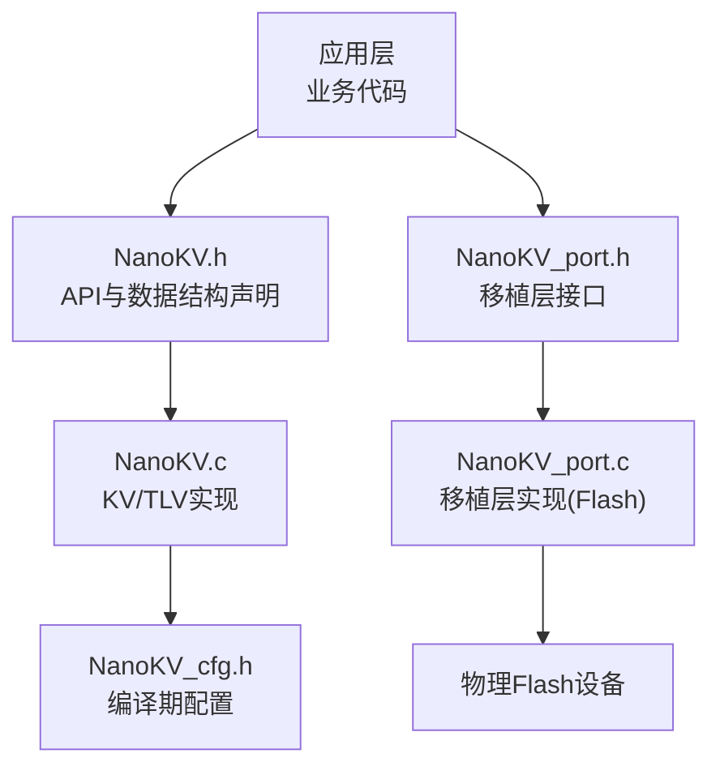
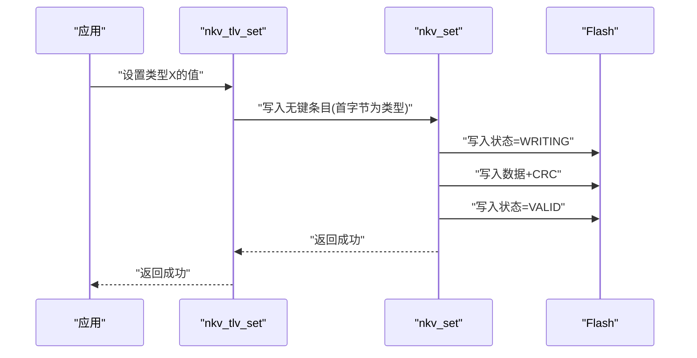
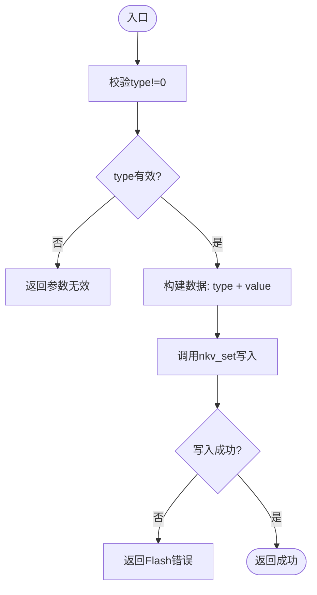
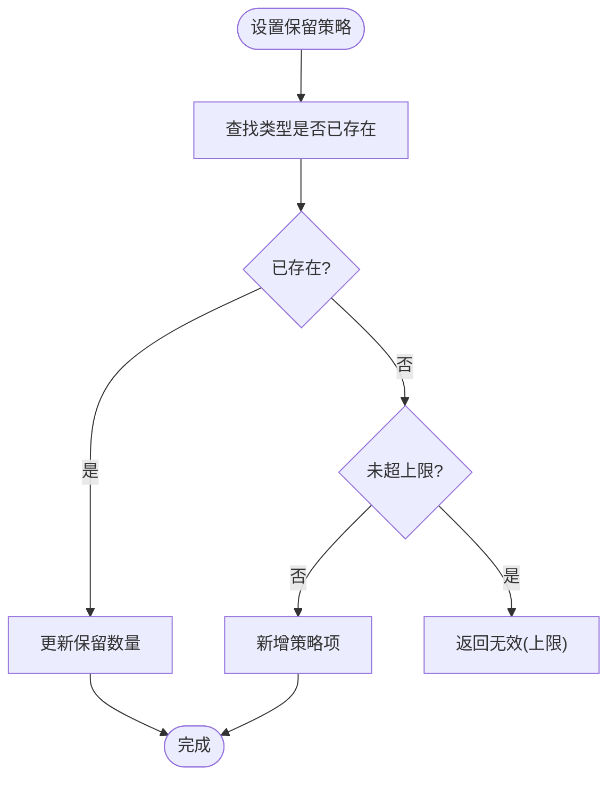
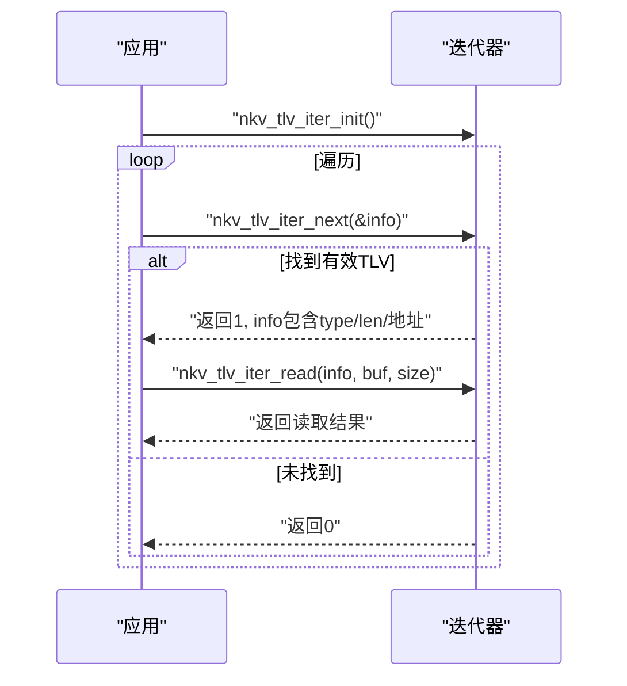
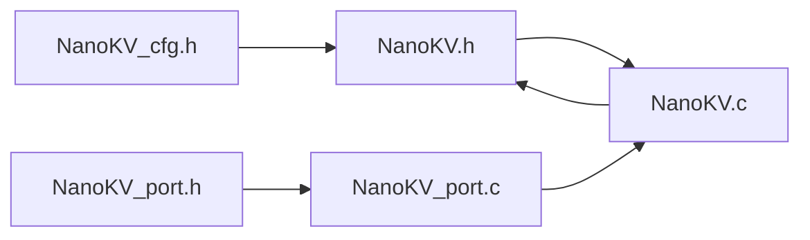

# TLV存储API

<cite>
**本文引用的文件**
- [NanoKV.h](file://NanoKV.h)
- [NanoKV.c](file://NanoKV.c)
- [NanoKV_cfg.h](file://NanoKV_cfg.h)
- [NanoKV_port.h](file://NanoKV_port.h)
- [NanoKV_port.c](file://NanoKV_port.c)
</cite>

## 目录
1. [简介](#简介)
2. [项目结构](#项目结构)
3. [核心组件](#核心组件)
4. [架构总览](#架构总览)
5. [详细组件分析](#详细组件分析)
6. [依赖关系分析](#依赖关系分析)
7. [性能考量](#性能考量)
8. [故障排查指南](#故障排查指南)
9. [结论](#结论)
10. [附录](#附录)

## 简介
本文件为NanoKV的TLV存储API参考文档，聚焦nkv_tlv_set、nkv_tlv_get、nkv_tlv_del、nkv_tlv_exists等TLV操作接口，覆盖TLV类型系统、默认值支持、历史记录管理、迭代器API、保留策略机制，并解释TLV条目结构、类型范围定义与适用场景。同时提供工具函数nkv_tlv_stats、nkv_tlv_has_data的使用说明与最佳实践。

## 项目结构
NanoKV采用单片机/嵌入式KV/TLV存储方案，核心由头文件定义API与数据结构，实现文件提供KV/TLV具体逻辑，配置文件控制行为开关，移植层封装Flash读写擦除接口。

图表来源
- [NanoKV.h](file://NanoKV.h#L1-L257)
- [NanoKV.c](file://NanoKV.c#L1-L1261)
- [NanoKV_cfg.h](file://NanoKV_cfg.h#L1-L51)
- [NanoKV_port.h](file://NanoKV_port.h#L1-L27)
- [NanoKV_port.c](file://NanoKV_port.c#L1-L95)

章节来源
- [NanoKV.h](file://NanoKV.h#L1-L257)
- [NanoKV.c](file://NanoKV.c#L1-L1261)
- [NanoKV_cfg.h](file://NanoKV_cfg.h#L1-L51)
- [NanoKV_port.h](file://NanoKV_port.h#L1-L27)
- [NanoKV_port.c](file://NanoKV_port.c#L1-L95)

## 核心组件
- TLV类型系统与范围
  - 保留类型：0x00
  - 应用类型：0x01..0x7F
  - 系统类型：0x80..0xFF
- TLV条目结构
  - 无键KV条目：key_len=0；val_len>1；首字节为type，其余为value
  - 条目头含state、key_len、val_len
- 默认值支持
  - nkv_tlv_set_defaults设置默认表
  - nkv_tlv_get_default按类型回退默认值
  - nkv_tlv_reset_type与nkv_tlv_reset_all重置为默认
- 历史记录与保留策略
  - nkv_tlv_get_history按写入顺序返回历史版本
  - nkv_tlv_set_retention设置“保留最近N个版本”
  - 仅在启用保留策略时生效
- 迭代器API
  - nkv_tlv_iter_init初始化
  - nkv_tlv_iter_next遍历当前有效TLV
  - nkv_tlv_iter_read从迭代结果读取值
- 工具函数
  - nkv_tlv_stats统计TLV数量与占用
  - nkv_tlv_has_data判断是否存在TLV数据

章节来源
- [NanoKV.h](file://NanoKV.h#L176-L257)
- [NanoKV.c](file://NanoKV.c#L940-L1261)

## 架构总览
NanoKV以KV为基础，TLV通过“无键条目”复用KV写入路径，实现类型-长度-值的多版本存储与历史管理。写入时先写入状态标记为“写入中”，再写入完整数据，最后原子性地写入有效状态，确保掉电安全。GC阶段会根据保留策略决定是否迁移旧版本。

图表来源
- [NanoKV.c](file://NanoKV.c#L964-L973)
- [NanoKV.c](file://NanoKV.c#L695-L763)

## 详细组件分析

### TLV条目结构与类型系统
- 结构要点
  - 无键KV条目：key_len=0，val_len>1
  - 首字节为type，其后为value
  - 使用CRC校验，条目头含state、key_len、val_len
- 类型范围
  - 保留：0x00
  - 应用：0x01..0x7F
  - 系统：0x80..0xFF
- 保留策略
  - 通过“保留最近N个版本”控制GC迁移，避免过早删除新值

章节来源
- [NanoKV.h](file://NanoKV.h#L52-L58)
- [NanoKV.h](file://NanoKV.h#L178-L183)
- [NanoKV.h](file://NanoKV.h#L186-L191)
- [NanoKV.c](file://NanoKV.c#L940-L973)

### TLV操作接口
- nkv_tlv_set
  - 功能：设置指定类型的TLV值
  - 行为：将type置于首字节，后续为value，调用nkv_set写入
  - 参数校验：type!=0，value非空，len>0且<=254
- nkv_tlv_get
  - 功能：获取指定类型的TLV值
  - 行为：查找有效条目，读取首字节后的内容作为value
  - 返回：未找到或条目无效返回错误码
- nkv_tlv_del
  - 功能：删除指定类型的TLV
  - 行为：写入一个仅包含type的“删除占位”条目
- nkv_tlv_exists
  - 功能：检查指定类型是否存在有效值
  - 行为：查找并验证条目有效性

图表来源
- [NanoKV.c](file://NanoKV.c#L964-L973)

章节来源
- [NanoKV.c](file://NanoKV.c#L964-L1010)

### 默认值支持
- nkv_tlv_set_defaults
  - 设置默认值表，供后续回退使用
- nkv_tlv_get_default
  - 优先读取当前值，不存在则回退到默认值
- nkv_tlv_reset_type / nkv_tlv_reset_all
  - 将指定类型或全部类型重置为默认值

章节来源
- [NanoKV.c](file://NanoKV.c#L1013-L1064)

### 历史记录与保留策略
- 历史记录
  - nkv_tlv_get_history：按写入顺序返回历史版本，最多返回固定数量
  - nkv_tlv_read_history：从历史条目读取值
- 保留策略
  - nkv_tlv_set_retention：为某类型设置保留最近N个版本
  - nkv_tlv_clear_retention：清除该类型的保留策略
  - 仅在启用保留策略时生效

图表来源
- [NanoKV.c](file://NanoKV.c#L1223-L1245)

章节来源
- [NanoKV.c](file://NanoKV.c#L1165-L1219)
- [NanoKV.c](file://NanoKV.c#L1222-L1259)

### 迭代器API
- nkv_tlv_iter_init
  - 初始化迭代器，指向第一个扇区的起始位置
- nkv_tlv_iter_next
  - 遍历有效TLV条目，填充nkv_tlv_entry_t
  - 仅返回key_len==0且val_len>1的有效TLV
- nkv_tlv_iter_read
  - 从迭代结果读取实际值内容

图表来源
- [NanoKV.c](file://NanoKV.c#L1067-L1132)

章节来源
- [NanoKV.c](file://NanoKV.c#L1067-L1132)

### 工具函数
- nkv_tlv_stats
  - 统计有效TLV数量与占用字节数（头+类型+值+CRC）
- nkv_tlv_has_data
  - 快速判断是否存在TLV数据

章节来源
- [NanoKV.c](file://NanoKV.c#L1135-L1162)

### 与KV存储的区别
- KV存储：键值对，支持默认值回退与缓存
- TLV存储：类型-长度-值，支持历史记录与保留策略，适用于配置项、日志、参数集等场景

章节来源
- [NanoKV.h](file://NanoKV.h#L133-L175)
- [NanoKV.h](file://NanoKV.h#L176-L257)

## 依赖关系分析
- 头文件依赖
  - NanoKV.h包含配置头，定义API与数据结构
- 实现依赖
  - NanoKV.c依赖KV实现路径（nkv_set等），复用条目扫描与匹配逻辑
  - 迭代器基于通用扫描器find_in_sector与匹配器tlv_matcher
- 配置依赖
  - 保留策略与缓存等特性由配置头控制
- 移植依赖
  - Flash读写擦除由移植层提供

图表来源
- [NanoKV.h](file://NanoKV.h#L19-L257)
- [NanoKV.c](file://NanoKV.c#L1-L1261)
- [NanoKV_cfg.h](file://NanoKV_cfg.h#L1-L51)
- [NanoKV_port.h](file://NanoKV_port.h#L1-L27)
- [NanoKV_port.c](file://NanoKV_port.c#L1-L95)

章节来源
- [NanoKV.h](file://NanoKV.h#L1-L257)
- [NanoKV.c](file://NanoKV.c#L1-L1261)
- [NanoKV_cfg.h](file://NanoKV_cfg.h#L1-L51)
- [NanoKV_port.h](file://NanoKV_port.h#L1-L27)
- [NanoKV_port.c](file://NanoKV_port.c#L1-L95)

## 性能考量
- 追加写入与状态机
  - 写入采用“写入中→有效”的状态机，结合CRC，保证掉电安全
- 增量GC
  - 分步迁移有效条目，避免长时间阻塞，适合实时系统
- 缓存
  - 可选LFU缓存，加速热点数据读取
- 迭代成本
  - 迭代器需遍历所有扇区与条目，复杂度O(S*N)，建议配合保留策略限制历史数量

章节来源
- [NanoKV.h](file://NanoKV.h#L34-L41)
- [NanoKV.c](file://NanoKV.c#L489-L624)
- [NanoKV_cfg.h](file://NanoKV_cfg.h#L14-L26)

## 故障排查指南
- 常见错误码
  - NKV_OK：成功
  - NKV_ERR_NOT_FOUND：未找到
  - NKV_ERR_NO_SPACE：空间不足
  - NKV_ERR_INVALID：参数无效
  - NKV_ERR_FLASH：Flash操作失败
- 常见问题定位
  - nkv_tlv_set返回参数无效：检查type是否为0、value是否为空、len是否在允许范围内
  - nkv_tlv_get返回未找到：确认类型是否存在有效值，或是否被删除
  - nkv_tlv_del无效：确认type不为0，或检查是否被新的保留策略覆盖
  - nkv_tlv_stats计数异常：检查是否启用了保留策略导致历史版本未被清理
- 调试建议
  - 启用调试日志（配置头中开启）
  - 使用nkv_tlv_has_data快速判断是否存在数据
  - 使用nkv_tlv_iter_next遍历验证条目状态

章节来源
- [NanoKV.h](file://NanoKV.h#L34-L41)
- [NanoKV.c](file://NanoKV.c#L1135-L1162)
- [NanoKV_cfg.h](file://NanoKV_cfg.h#L27-L48)

## 结论
NanoKV的TLV存储API以KV实现为基础，通过“无键条目+类型首字节”实现类型-长度-值的灵活存储，并提供默认值回退、历史记录与保留策略、迭代器与统计工具，适用于嵌入式配置管理、参数集版本控制、日志记录等场景。合理配置保留策略与缓存，可在可靠性与性能之间取得平衡。

## 附录

### API清单与使用要点
- nkv_tlv_set
  - 用途：设置类型X的值
  - 注意：type不可为0；value不可为空；len>0且<=254
- nkv_tlv_get
  - 用途：获取类型X的值
  - 注意：返回值长度可能小于请求size，需检查out_len
- nkv_tlv_del
  - 用途：删除类型X
  - 注意：写入删除占位，不会影响其他类型
- nkv_tlv_exists
  - 用途：检查类型X是否存在有效值
- 默认值
  - nkv_tlv_set_defaults：设置默认值表
  - nkv_tlv_get_default：优先读取当前值，否则回退默认值
  - nkv_tlv_reset_type / nkv_tlv_reset_all：重置为默认
- 历史与保留
  - nkv_tlv_get_history：获取历史版本（按写入顺序）
  - nkv_tlv_read_history：读取历史版本值
  - nkv_tlv_set_retention / nkv_tlv_clear_retention：设置/清除保留策略
- 迭代器
  - nkv_tlv_iter_init：初始化
  - nkv_tlv_iter_next：获取下一个TLV信息
  - nkv_tlv_iter_read：从信息读取值
- 工具
  - nkv_tlv_stats：统计数量与占用
  - nkv_tlv_has_data：是否存在TLV数据

章节来源
- [NanoKV.h](file://NanoKV.h#L218-L247)
- [NanoKV.c](file://NanoKV.c#L964-L1261)