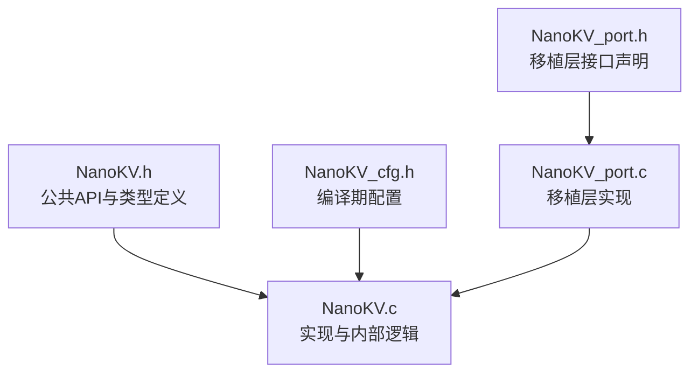
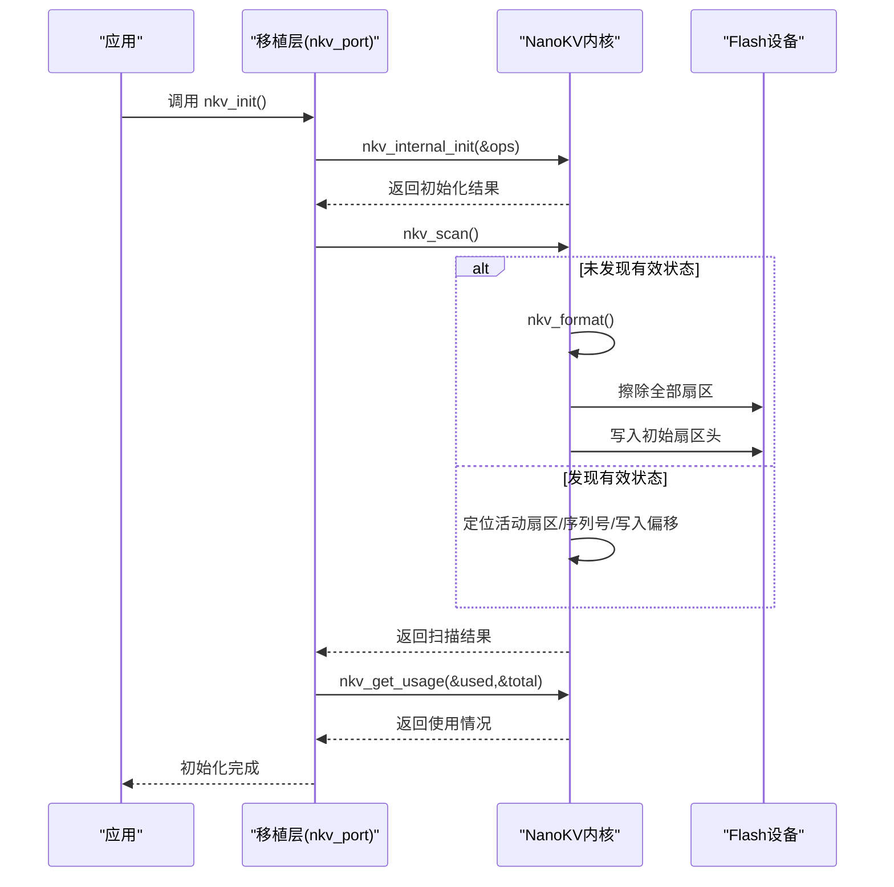
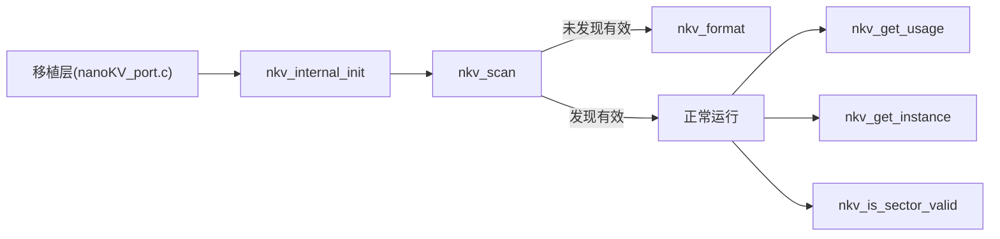

# 初始化与维护API

<cite>
**本文引用的文件**
- [NanoKV.h](file://NanoKV.h)
- [NanoKV.c](file://NanoKV.c)
- [NanoKV_cfg.h](file://NanoKV_cfg.h)
- [NanoKV_port.h](file://NanoKV_port.h)
- [NanoKV_port.c](file://NanoKV_port.c)
</cite>

## 目录
1. [简介](#简介)
2. [项目结构](#项目结构)
3. [核心组件](#核心组件)
4. [架构总览](#架构总览)
5. [详细组件分析](#详细组件分析)
6. [依赖关系分析](#依赖关系分析)
7. [性能考量](#性能考量)
8. [故障排查指南](#故障排查指南)
9. [结论](#结论)
10. [附录](#附录)

## 简介
本文件聚焦NanoKV的初始化与维护API，围绕以下核心接口展开：nkv_internal_init、nkv_scan、nkv_format、nkv_get_usage、nkv_get_instance、nkv_is_sector_valid。内容覆盖系统启动流程、状态扫描与恢复、存储格式化、使用情况查询、内部状态检查与维护策略，并提供参数说明、返回值解释与最佳实践建议。

## 项目结构
仓库采用“头文件+实现文件+配置文件+移植层”的组织方式，便于在不同硬件平台快速适配。

图表来源
- [NanoKV.h](file://NanoKV.h#L1-L257)
- [NanoKV.c](file://NanoKV.c#L1-L1261)
- [NanoKV_cfg.h](file://NanoKV_cfg.h#L1-L51)
- [NanoKV_port.h](file://NanoKV_port.h#L1-L27)
- [NanoKV_port.c](file://NanoKV_port.c#L1-L95)

章节来源
- [NanoKV.h](file://NanoKV.h#L1-L257)
- [NanoKV_cfg.h](file://NanoKV_cfg.h#L1-L51)
- [NanoKV_port.h](file://NanoKV_port.h#L1-L27)
- [NanoKV_port.c](file://NanoKV_port.c#L1-L95)

## 核心组件
- 初始化相关API
  - nkv_internal_init：内部初始化，设置Flash操作回调与基础参数
  - nkv_scan：扫描并恢复系统状态（定位活动扇区、序列号、写入偏移）
  - nkv_format：格式化存储区，建立初始扇区头
- 查询与维护API
  - nkv_get_usage：获取已用空间与总容量
  - nkv_get_instance：获取全局实例指针（内部调试/诊断）
  - nkv_is_sector_valid：检查指定扇区是否有效（魔数校验）

章节来源
- [NanoKV.h](file://NanoKV.h#L135-L157)
- [NanoKV.c](file://NanoKV.c#L628-L693)
- [NanoKV.c](file://NanoKV.c#L817-L823)
- [NanoKV.c](file://NanoKV.c#L935-L938)
- [NanoKV.c](file://NanoKV.c#L218-L224)

## 架构总览
NanoKV通过移植层提供Flash读写擦除回调，初始化阶段将这些回调注入到内部实例；随后进行扫描恢复，若无有效状态则执行格式化；运行期间通过nkv_get_usage监控使用情况，必要时结合增量GC策略维持性能。

图表来源
- [NanoKV_port.c](file://NanoKV_port.c#L54-L88)
- [NanoKV.c](file://NanoKV.c#L628-L693)
- [NanoKV.c](file://NanoKV.c#L817-L823)

## 详细组件分析

### nkv_internal_init：内部初始化
- 功能概述
  - 校验传入的Flash操作回调是否完整
  - 校验扇区数量与对齐要求
  - 将Flash配置复制到全局实例，准备后续扫描与格式化
- 参数
  - ops：指向nkv_flash_ops_t的指针，必须包含read/write/erase三个函数指针，以及base、sector_size、sector_count、align等字段
- 返回值
  - NKV_OK：成功
  - NKV_ERR_INVALID：参数非法（回调为空、扇区数过少、对齐不合法）
- 使用要点
  - 必须在调用nkv_scan之前完成
  - 若返回非NKV_OK，需检查移植层提供的Flash回调与配置
- 典型调用路径
  - 移植层nkv_init中先调用nkv_internal_init，再调用nkv_scan

章节来源
- [NanoKV.h](file://NanoKV.h#L73-L83)
- [NanoKV.h](file://NanoKV.h#L136)
- [NanoKV.c](file://NanoKV.c#L628-L640)
- [NanoKV_port.c](file://NanoKV_port.c#L54-L64)

### nkv_scan：状态扫描与恢复
- 功能概述
  - 扫描所有扇区，寻找魔数有效的扇区，选择序列号最大的作为活动扇区
  - 计算该扇区的写入偏移，确定下一次写入位置
  - 若未发现任何有效扇区，则调用nkv_format进行格式化
- 参数
  - 无
- 返回值
  - NKV_OK：成功恢复或完成格式化
  - 其他：Flash读取失败或格式化失败
- 行为细节
  - 已初始化则直接返回成功
  - 未发现有效扇区时，自动进入nkv_format
- 典型调用路径
  - 移植层nkv_init中调用nkv_scan，随后打印使用情况

章节来源
- [NanoKV.h](file://NanoKV.h#L137)
- [NanoKV.c](file://NanoKV.c#L642-L674)
- [NanoKV.c](file://NanoKV.c#L218-L224)
- [NanoKV.c](file://NanoKV.c#L227-L242)
- [NanoKV_port.c](file://NanoKV_port.c#L66-L72)

### nkv_format：存储格式化
- 功能概述
  - 擦除所有扇区
  - 在第一个扇区写入初始扇区头（魔数与序号）
  - 初始化活动扇区、序列号与写入偏移
- 参数
  - 无
- 返回值
  - NKV_OK：成功
  - 其他：Flash擦除或写入失败
- 使用场景
  - 首次上电且无有效状态
  - 需要强制重建存储布局
- 注意事项
  - 格式化会丢失所有数据，请谨慎使用

章节来源
- [NanoKV.h](file://NanoKV.h#L138)
- [NanoKV.c](file://NanoKV.c#L676-L693)

### nkv_get_usage：获取存储使用情况
- 功能概述
  - 返回当前已用空间与总容量
- 参数
  - used：输出已用空间（字节）
  - total：输出总容量（字节）
- 返回值
  - 无（void）
- 使用场景
  - 系统监控、容量预警、运维审计
- 注意事项
  - used仅反映当前活动扇区的写入偏移，不包含历史数据压缩后的实际占用

章节来源
- [NanoKV.h](file://NanoKV.h#L145)
- [NanoKV.c](file://NanoKV.c#L817-L823)

### nkv_get_instance：获取全局实例指针
- 功能概述
  - 返回内部全局实例指针，供上层进行状态检查或调试
- 参数
  - 无
- 返回值
  - nkv_instance_t*：全局实例指针
- 使用场景
  - 内部诊断、日志打印、状态观察
- 注意事项
  - 返回的是内部静态实例，不应修改其内容

章节来源
- [NanoKV.h](file://NanoKV.h#L156)
- [NanoKV.c](file://NanoKV.c#L935-L938)

### nkv_is_sector_valid：扇区有效性检查
- 功能概述
  - 读取指定扇区的扇区头，检查魔数是否有效
- 参数
  - idx：扇区索引
- 返回值
  - uint8_t：非0表示有效，0表示无效
- 使用场景
  - 扫描阶段判断扇区状态
  - 维护阶段检测异常扇区

章节来源
- [NanoKV.h](file://NanoKV.h#L156)
- [NanoKV.c](file://NanoKV.c#L218-L224)

## 依赖关系分析
- 头文件与实现
  - NanoKV.h声明API与数据结构，NanoKV.c提供实现
- 配置与行为
  - NanoKV_cfg.h控制缓存、增量GC、TLV保留策略等编译期特性
- 移植层集成
  - NanoKV_port.c提供Flash回调与初始化流程，调用内部初始化与扫描
- 关键依赖链
  - nkv_internal_init → nkv_scan → nkv_format（当无有效状态时）
  - nkv_get_usage依赖当前活动扇区写入偏移与总扇区数

图表来源
- [NanoKV_port.c](file://NanoKV_port.c#L54-L88)
- [NanoKV.c](file://NanoKV.c#L628-L693)
- [NanoKV.c](file://NanoKV.c#L817-L823)
- [NanoKV.c](file://NanoKV.c#L935-L938)
- [NanoKV.c](file://NanoKV.c#L218-L224)

章节来源
- [NanoKV.h](file://NanoKV.h#L1-L257)
- [NanoKV.c](file://NanoKV.c#L1-L1261)
- [NanoKV_cfg.h](file://NanoKV_cfg.h#L1-L51)
- [NanoKV_port.h](file://NanoKV_port.h#L1-L27)
- [NanoKV_port.c](file://NanoKV_port.c#L1-L95)

## 性能考量
- 初始化阶段
  - nkv_scan对每个扇区进行读取以判断有效性，时间复杂度与扇区数线性相关
  - nkv_format对所有扇区执行擦除与写入，时间复杂度与扇区数线性相关
- 使用情况查询
  - nkv_get_usage为O(1)，仅读取当前写入偏移与总容量
- 维护策略
  - 增量GC在写入后按配置步进迁移条目，避免长时间阻塞
  - 建议结合nkv_get_usage进行容量监控，在接近阈值时提前触发GC或格式化

[本节为通用性能讨论，不直接分析具体文件]

## 故障排查指南
- 初始化失败（nkv_internal_init返回NKV_ERR_INVALID）
  - 检查Flash回调是否完整（read/write/erase）
  - 检查sector_count是否至少为2
  - 检查align是否为2或4
- 扫描失败或反复格式化
  - 检查Flash读取是否稳定
  - 确认魔数与扇区头写入是否成功
  - 使用nkv_is_sector_valid逐扇区验证有效性
- 使用情况异常
  - 确认nkv_get_usage调用时机（应在nkv_scan之后）
  - 检查总容量计算是否与配置一致
- 维护与监控
  - 结合nkv_get_instance打印内部状态
  - 在容量接近阈值时考虑手动触发GC或格式化

章节来源
- [NanoKV.c](file://NanoKV.c#L628-L640)
- [NanoKV.c](file://NanoKV.c#L642-L674)
- [NanoKV.c](file://NanoKV.c#L676-L693)
- [NanoKV.c](file://NanoKV.c#L817-L823)
- [NanoKV.c](file://NanoKV.c#L935-L938)
- [NanoKV.c](file://NanoKV.c#L218-L224)

## 结论
NanoKV的初始化与维护API设计简洁清晰：通过nkv_internal_init完成基础配置，nkv_scan进行状态恢复，nkv_format在必要时重建布局；运行期通过nkv_get_usage进行容量监控，nkv_get_instance与nkv_is_sector_valid提供内部状态检查能力。配合移植层的Flash回调与编译期配置，可在多种嵌入式平台上快速部署并保持良好的可靠性与性能。

[本节为总结性内容，不直接分析具体文件]

## 附录

### API一览与最佳实践
- nkv_internal_init
  - 参数：nkv_flash_ops_t*
  - 返回：nkv_err_t
  - 最佳实践：确保回调完整、扇区数≥2、对齐为2或4
- nkv_scan
  - 参数：无
  - 返回：nkv_err_t
  - 最佳实践：在nkv_internal_init之后立即调用；若返回非NKV_OK，优先检查Flash稳定性
- nkv_format
  - 参数：无
  - 返回：nkv_err_t
  - 最佳实践：仅在首次上电或需要重建布局时调用；注意数据丢失风险
- nkv_get_usage
  - 参数：used、total
  - 返回：void
  - 最佳实践：定期调用以监控容量；结合阈值触发维护
- nkv_get_instance
  - 参数：无
  - 返回：nkv_instance_t*
  - 最佳实践：仅用于诊断与日志，不要修改内部状态
- nkv_is_sector_valid
  - 参数：idx
  - 返回：uint8_t
  - 最佳实践：在扫描与维护阶段逐扇区验证

章节来源
- [NanoKV.h](file://NanoKV.h#L135-L157)
- [NanoKV.c](file://NanoKV.c#L628-L693)
- [NanoKV.c](file://NanoKV.c#L817-L823)
- [NanoKV.c](file://NanoKV.c#L935-L938)
- [NanoKV.c](file://NanoKV.c#L218-L224)