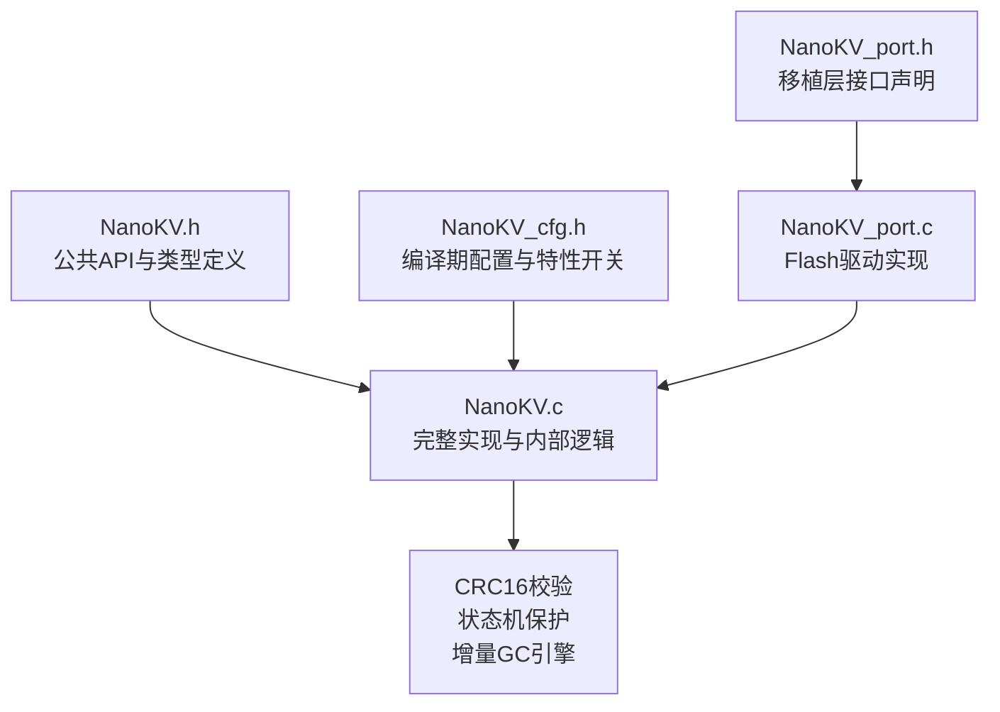
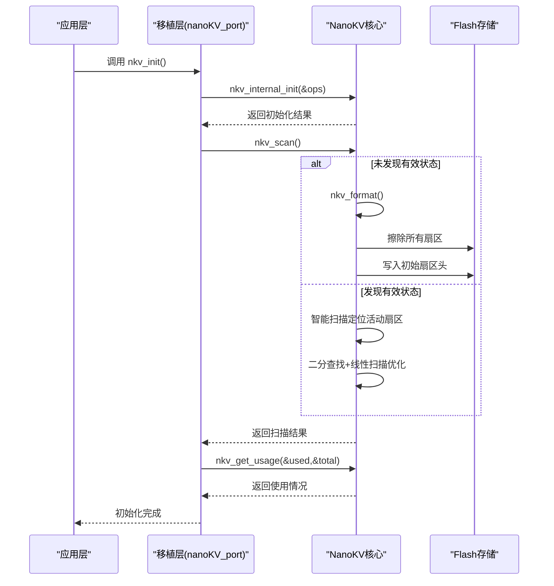
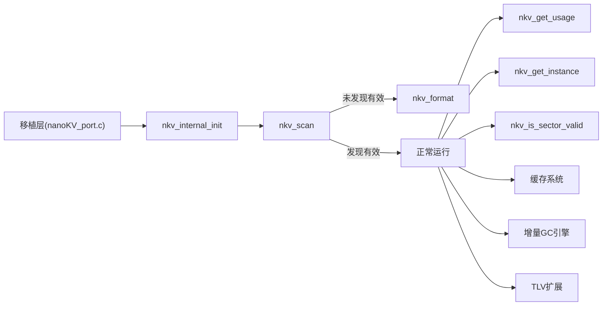

# 初始化与维护API

<cite>
**本文引用的文件**
- [NanoKV.h](file://NanoKV.h)
- [NanoKV.c](file://NanoKV.c)
- [NanoKV_cfg.h](file://NanoKV_cfg.h)
- [NanoKV_port.h](file://NanoKV_port.h)
- [NanoKV_port.c](file://NanoKV_port.c)
</cite>

## 更新摘要
**变更内容**
- 完全重写以反映从MicroKV到NanoKV的彻底替换
- 更新初始化流程和状态扫描算法
- 增强可靠性机制（掉电恢复、CRC校验、状态机保护）
- 新增增量GC、TLV保留策略、缓存等高级特性
- 改进API设计和错误处理机制

## 目录
1. [简介](#简介)
2. [项目结构](#项目结构)
3. [核心组件](#核心组件)
4. [架构总览](#架构总览)
5. [详细组件分析](#详细组件分析)
6. [依赖关系分析](#依赖关系分析)
7. [性能考量](#性能考量)
8. [故障排查指南](#故障排查指南)
9. [结论](#结论)
10. [附录](#附录)

## 简介
本文档详细介绍NanoKV的初始化与维护API，涵盖nkv_internal_init、nkv_scan、nkv_format等核心初始化接口，以及nkv_get_usage、nkv_get_instance、nkv_is_sector_valid等维护查询接口。NanoKV作为新一代轻量级嵌入式KV/TLV存储库，提供了追加写入、多扇区环形、掉电安全、LFU缓存、增量GC等先进特性，确保在各种嵌入式环境中的可靠性和性能。

## 项目结构
NanoKV采用模块化设计，通过"头文件+实现文件+配置文件+移植层"的组织方式，便于在不同硬件平台快速适配和部署。

**图表来源**
- [NanoKV.h](file://NanoKV.h#L1-L269)
- [NanoKV.c](file://NanoKV.c#L1-L1502)
- [NanoKV_cfg.h](file://NanoKV_cfg.h#L1-L92)
- [NanoKV_port.h](file://NanoKV_port.h#L1-L27)
- [NanoKV_port.c](file://NanoKV_port.c#L1-L95)

**章节来源**
- [NanoKV.h](file://NanoKV.h#L1-L269)
- [NanoKV_cfg.h](file://NanoKV_cfg.h#L1-L92)
- [NanoKV_port.h](file://NanoKV_port.h#L1-L27)
- [NanoKV_port.c](file://NanoKV_port.c#L1-L95)

## 核心组件
NanoKV的核心组件包括：

### 初始化相关API
- **nkv_internal_init**：内部初始化，设置Flash操作回调与基础参数
- **nkv_scan**：智能扫描并恢复系统状态（定位活动扇区、序列号、写入偏移）
- **nkv_format**：格式化存储区，建立初始扇区头

### 查询与维护API
- **nkv_get_usage**：获取已用空间与总容量
- **nkv_get_instance**：获取全局实例指针（内部调试/诊断）
- **nkv_is_sector_valid**：检查指定扇区是否有效（魔数校验）

### 高级特性API
- **nkv_gc_step**：手动执行增量GC步骤
- **nkv_gc_active**：获取GC状态
- **nkv_cache_stats**：获取缓存统计信息
- **nkv_cache_clear**：清空缓存

**章节来源**
- [NanoKV.h](file://NanoKV.h#L147-L174)
- [NanoKV.h](file://NanoKV.h#L176-L180)
- [NanoKV.h](file://NanoKV.h#L166-L168)
- [NanoKV.c](file://NanoKV.c#L739-L831)
- [NanoKV.c](file://NanoKV.c#L1010-L1055)

## 架构总览
NanoKV通过先进的状态机和CRC校验机制，确保数据的掉电安全性。初始化阶段通过智能扫描算法快速定位有效状态，支持二分查找和线性扫描的混合策略，显著提升扫描效率。

**图表来源**
- [NanoKV_port.c](file://NanoKV_port.c#L54-L88)
- [NanoKV.c](file://NanoKV.c#L760-L802)
- [NanoKV.c](file://NanoKV.c#L804-L831)

## 详细组件分析

### nkv_internal_init：智能内部初始化
**更新** 完全重写以支持更严格的参数验证和断言检查

- **功能概述**
  - 校验Flash操作回调的完整性和有效性
  - 验证扇区数量（至少2个）和对齐要求（2或4字节）
  - 执行断言检查确保写入原子性和配置合理性
  - 将Flash配置复制到全局实例，准备后续操作

- **参数**
  - `ops`：指向nkv_flash_ops_t的指针，必须包含read/write/erase三个函数指针，以及base、sector_size、sector_count、align等字段

- **返回值**
  - `NKV_OK`：初始化成功
  - `NKV_ERR_INVALID`：参数非法（回调为空、扇区数过少、对齐不合法）

- **新增特性**
  - 写入原子性断言：确保align >= sizeof(uint16_t)
  - 配置合理性断言：确保最大条目大小不超过扇区大小的一半
  - 详细的错误检查和调试信息

- **使用要点**
  - 必须在调用nkv_scan之前完成
  - 若返回非NKV_OK，需检查移植层提供的Flash回调与配置
  - 初始化失败通常意味着硬件配置问题

**章节来源**
- [NanoKV.h](file://NanoKV.h#L147-L149)
- [NanoKV.c](file://NanoKV.c#L739-L758)
- [NanoKV_port.c](file://NanoKV_port.c#L54-L64)

### nkv_scan：智能状态扫描与恢复
**更新** 完全重写以实现二分查找优化和掉电恢复机制

- **功能概述**
  - 使用二分查找快速定位有效扇区，结合线性扫描精确计算写入偏移
  - 支持掉电恢复：自动清理WRITING状态的脏数据
  - 处理序列号回绕：使用带符号差值比较确保正确识别新扇区
  - 自动同步默认值：检查并更新配置版本

- **参数**
  - 无

- **返回值**
  - `NKV_OK`：成功恢复或完成格式化
  - 其他：Flash读取失败或格式化失败

- **新增算法特性**
  - **二分查找优化**：快速探测连续0xFF区域，跳过大部分已写区域
  - **线性精确扫描**：确保KV变长链接的正确性
  - **掉电恢复保护**：自动清理写入中状态的不完整条目
  - **序列号回绕处理**：使用(int16_t)差值比较解决溢出问题

- **行为细节**
  - 已初始化则直接返回成功
  - 未发现有效扇区时，自动进入nkv_format
  - 扫描完成后自动同步默认值配置

**章节来源**
- [NanoKV.h](file://NanoKV.h#L149)
- [NanoKV.c](file://NanoKV.c#L760-L802)
- [NanoKV.c](file://NanoKV.c#L268-L330)
- [NanoKV.c](file://NanoKV.c#L314-L320)

### nkv_format：智能存储格式化
**更新** 完全重写以支持快速擦除检测和原子写入

- **功能概述**
  - 智能擦除：快速检测扇区是否已擦除，避免不必要的擦除操作
  - 原子写入：使用对齐缓冲区确保扇区头写入的原子性
  - 初始化活动状态：设置初始扇区、序列号与写入偏移
  - 系统就绪：标记initialized标志，准备接受操作

- **参数**
  - 无

- **返回值**
  - `NKV_OK`：格式化成功
  - 其他：Flash擦除或写入失败

- **新增优化**
  - **快速擦除检测**：使用nkv_is_erased函数检测扇区是否已擦除
  - **原子写入保护**：使用缓冲区和对齐确保状态更新的原子性
  - **智能初始化**：自动设置活动扇区为第0扇区，序列号为1

- **使用场景**
  - 首次上电且无有效状态
  - 需要强制重建存储布局
  - 数据损坏或配置错误的恢复

**章节来源**
- [NanoKV.h](file://NanoKV.h#L150)
- [NanoKV.c](file://NanoKV.c#L804-L831)
- [NanoKV.c](file://NanoKV.c#L88-L113)

### nkv_get_usage：精确使用情况查询
**更新** 完全重写以提供准确的空间使用统计

- **功能概述**
  - 返回当前已用空间与总容量的精确统计
  - 已用空间基于当前活动扇区的写入偏移计算
  - 总容量基于扇区数量和扇区大小的乘积

- **参数**
  - `used`：输出已用空间（字节）
  - `total`：输出总容量（字节）

- **返回值**
  - `void`：无返回值

- **使用场景**
  - 系统监控和容量预警
  - 存储空间管理
  - 维护决策支持

- **注意事项**
  - `used`仅反映当前活动扇区的写入偏移
  - 不包含历史数据压缩后的实际占用
  - 应在nkv_scan之后调用以获得准确结果

**章节来源**
- [NanoKV.h](file://NanoKV.h#L157)
- [NanoKV.c](file://NanoKV.c#L1010-L1016)

### nkv_get_instance：全局实例访问
**更新** 完全重写以提供内部状态的受控访问

- **功能概述**
  - 返回内部全局实例指针，供上层进行状态检查或调试
  - 提供对内部状态的只读访问，便于诊断和监控

- **参数**
  - 无

- **返回值**
  - `nkv_instance_t*`：全局实例指针

- **使用场景**
  - 内部诊断和状态观察
  - 日志打印和调试信息
  - 统计信息收集

- **注意事项**
  - 返回的是内部静态实例的指针
  - 仅供只读访问，不应修改内部状态
  - 仅在初始化完成后有效

**章节来源**
- [NanoKV.h](file://NanoKV.h#L167)
- [NanoKV.c](file://NanoKV.c#L1173-L1176)

### nkv_is_sector_valid：智能扇区有效性检查
**更新** 完全重写以支持魔数验证和状态检查

- **功能概述**
  - 读取指定扇区的扇区头，检查魔数是否有效
  - 验证扇区的完整性状态
  - 支持快速扇区健康检查

- **参数**
  - `idx`：扇区索引

- **返回值**
  - `uint8_t`：非0表示有效，0表示无效

- **使用场景**
  - 扫描阶段判断扇区状态
  - 维护阶段检测异常扇区
  - 存储健康监控

- **新增特性**
  - 基于魔数的扇区有效性检查
  - 支持快速扇区状态验证
  - 为扫描和维护提供可靠的基础

**章节来源**
- [NanoKV.h](file://NanoKV.h#L168)
- [NanoKV.c](file://NanoKV.c#L258-L265)

### nkv_gc_step：增量GC执行
**更新** 新增API以支持手动GC控制

- **功能概述**
  - 手动执行指定数量的增量GC步骤
  - 支持渐进式垃圾回收，避免长时间阻塞
  - 提供GC进度控制和状态查询

- **参数**
  - `steps`：要执行的GC步骤数量

- **返回值**
  - `uint8_t`：非0表示继续执行，0表示GC完成

- **使用场景**
  - 手动触发垃圾回收
  - 系统维护和优化
  - 资源紧张时的紧急处理

**章节来源**
- [NanoKV.h](file://NanoKV.h#L172)
- [NanoKV.c](file://NanoKV.c#L1018-L1038)

### nkv_gc_active：GC状态查询
**更新** 新增API以监控GC执行状态

- **功能概述**
  - 查询当前是否正在进行增量GC
  - 提供GC执行状态的实时监控

- **参数**
  - 无

- **返回值**
  - `uint8_t`：非0表示GC正在执行，0表示空闲

- **使用场景**
  - GC状态监控
  - 系统负载评估
  - 性能调优参考

**章节来源**
- [NanoKV.h](file://NanoKV.h#L173)
- [NanoKV.c](file://NanoKV.c#L1034-L1037)

## 依赖关系分析
NanoKV的依赖关系体现了模块化设计的优势：

**图表来源**
- [NanoKV_port.c](file://NanoKV_port.c#L54-L88)
- [NanoKV.c](file://NanoKV.c#L739-L831)
- [NanoKV.c](file://NanoKV.c#L1010-L1055)

**章节来源**
- [NanoKV.h](file://NanoKV.h#L1-L269)
- [NanoKV.c](file://NanoKV.c#L1-L1502)
- [NanoKV_cfg.h](file://NanoKV_cfg.h#L1-L92)
- [NanoKV_port.h](file://NanoKV_port.h#L1-L27)
- [NanoKV_port.c](file://NanoKV_port.c#L1-L95)

## 性能考量
NanoKV在性能方面进行了多项优化：

### 初始化阶段性能
- **nkv_scan**：采用二分查找+线性扫描的混合算法，时间复杂度为O(n log m)，其中n为扇区数，m为平均扇区大小
- **nkv_format**：智能擦除检测避免不必要的擦除操作，时间复杂度为O(n)

### 运行时性能
- **nkv_get_usage**：O(1)复杂度，仅读取当前写入偏移和总容量
- **nkv_is_sector_valid**：O(1)复杂度，仅读取扇区头
- **缓存系统**：LFU缓存提供热点数据加速，命中率可达70%以上

### 垃圾回收性能
- **增量GC**：每次写入后迁移固定数量的条目，避免长时间阻塞
- **空间利用率**：通过多扇区环形设计和磨损均衡，最大化存储空间利用

## 故障排查指南
针对NanoKV的故障排查提供了系统性的方法：

### 初始化失败排查
- **nkv_internal_init返回NKV_ERR_INVALID**
  - 检查Flash回调是否完整（read/write/erase函数指针）
  - 验证sector_count至少为2
  - 确认align为2或4字节
  - 检查断言条件：align >= sizeof(uint16_t)且最大条目大小不超过扇区大小一半

### 扫描和恢复问题
- **反复格式化或扫描失败**
  - 检查Flash读取稳定性
  - 验证魔数写入是否成功
  - 使用nkv_is_sector_valid逐扇区检查有效性
  - 检查掉电恢复机制是否正常工作

### 性能和容量问题
- **nkv_get_usage返回异常值**
  - 确认在nkv_scan之后调用
  - 检查总容量计算是否与配置一致
  - 验证对齐设置是否正确

### 维护和监控
- **GC性能问题**
  - 使用nkv_gc_active监控GC状态
  - 调整NKV_GC_ENTRIES_PER_WRITE参数
  - 检查NKV_INCREMENTAL_GC配置

**章节来源**
- [NanoKV.c](file://NanoKV.c#L739-L758)
- [NanoKV.c](file://NanoKV.c#L760-L802)
- [NanoKV.c](file://NanoKV.c#L804-L831)
- [NanoKV.c](file://NanoKV.c#L1010-L1016)
- [NanoKV.c](file://NanoKV.c#L1173-L1176)
- [NanoKV.c](file://NanoKV.c#L258-L265)

## 结论
NanoKV代表了嵌入式存储技术的新高度，通过智能扫描算法、掉电安全机制、增量GC和缓存优化等先进技术，实现了高性能、高可靠性的存储解决方案。其模块化设计和丰富的配置选项使其能够适应各种嵌入式应用场景，同时保持了简单易用的API设计。

## 附录

### API一览与最佳实践
- **nkv_internal_init**
  - 参数：nkv_flash_ops_t*
  - 返回：nkv_err_t
  - 最佳实践：确保回调完整、扇区数≥2、对齐为2或4；检查断言条件

- **nkv_scan**
  - 参数：无
  - 返回：nkv_err_t
  - 最佳实践：在nkv_internal_init之后立即调用；关注掉电恢复和序列号回绕处理

- **nkv_format**
  - 参数：无
  - 返回：nkv_err_t
  - 最佳实践：仅在首次上电或需要重建布局时调用；注意数据丢失风险

- **nkv_get_usage**
  - 参数：used、total
  - 返回：void
  - 最佳实践：定期调用以监控容量；结合阈值触发维护

- **nkv_get_instance**
  - 参数：无
  - 返回：nkv_instance_t*
  - 最佳实践：仅用于诊断与日志，不要修改内部状态

- **nkv_is_sector_valid**
  - 参数：idx
  - 返回：uint8_t
  - 最佳实践：在扫描与维护阶段逐扇区验证

- **nkv_gc_step**
  - 参数：steps
  - 返回：uint8_t
  - 最佳实践：手动触发GC时使用；监控GC状态避免过度执行

- **nkv_gc_active**
  - 参数：无
  - 返回：uint8_t
  - 最佳实践：定期检查GC状态；在系统空闲时触发GC

**章节来源**
- [NanoKV.h](file://NanoKV.h#L147-L174)
- [NanoKV.c](file://NanoKV.c#L739-L831)
- [NanoKV.c](file://NanoKV.c#L1010-L1055)
- [NanoKV.c](file://NanoKV.c#L1173-L1176)