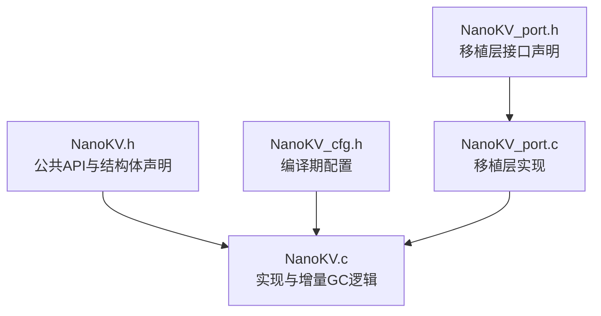
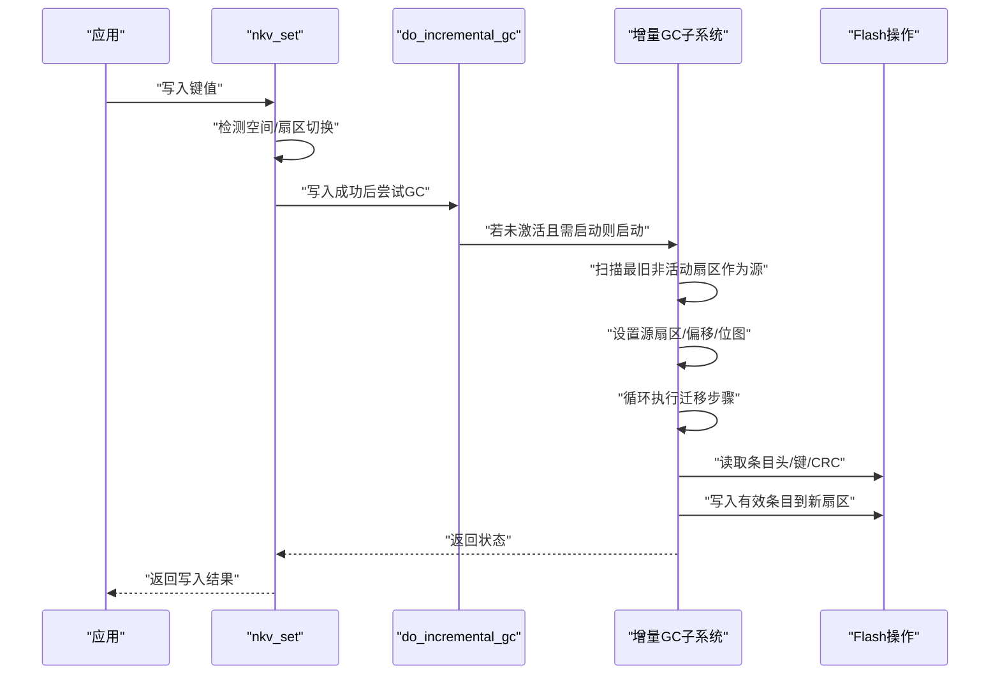
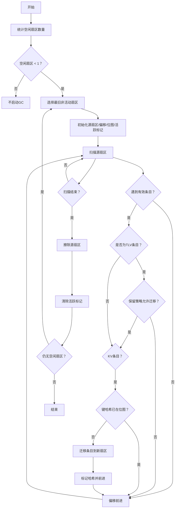
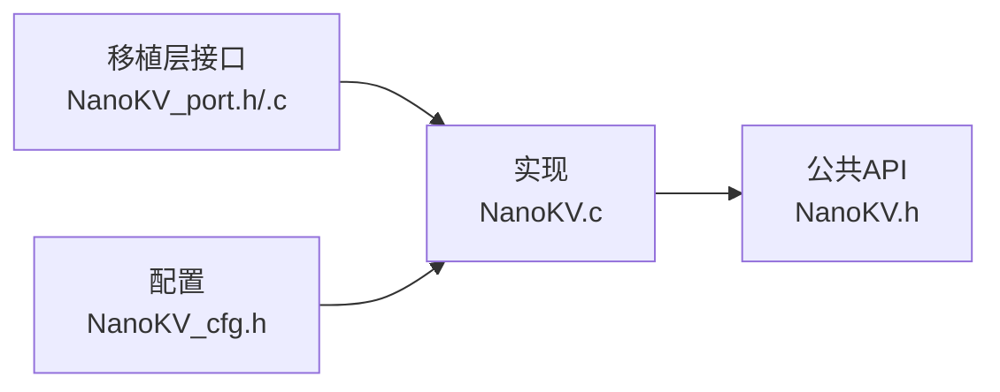

# 垃圾回收API

<cite>
**本文引用的文件**
- [NanoKV.h](file://NanoKV.h)
- [NanoKV.c](file://NanoKV.c)
- [NanoKV_cfg.h](file://NanoKV_cfg.h)
- [NanoKV_port.h](file://NanoKV_port.h)
- [NanoKV_port.c](file://NanoKV_port.c)
</cite>

## 目录
1. [简介](#简介)
2. [项目结构](#项目结构)
3. [核心组件](#核心组件)
4. [架构总览](#架构总览)
5. [详细组件分析](#详细组件分析)
6. [依赖关系分析](#依赖关系分析)
7. [性能考量](#性能考量)
8. [故障排除指南](#故障排除指南)
9. [结论](#结论)
10. [附录](#附录)

## 简介
本文件面向NanoKV的垃圾回收（GC）API，重点覆盖增量GC控制接口：nkv_gc_step与nkv_gc_active。内容包括：
- 增量GC工作机制与分步执行策略
- GC状态监控与触发条件
- 执行时机与性能影响
- 配置参数与效率分析
- 策略选择建议与系统集成指导
- 与其他模块的协调与数据一致性保障
- 使用示例、监控方法与故障排除

## 项目结构
NanoKV采用“头文件声明 + 单一实现文件 + 配置头 + 移植层”的组织方式，垃圾回收API位于公共头文件中，并在实现文件中提供完整逻辑。

图表来源
- [NanoKV.h](file://NanoKV.h#L158-L162)
- [NanoKV.c](file://NanoKV.c#L825-L845)
- [NanoKV_cfg.h](file://NanoKV_cfg.h#L18-L22)
- [NanoKV_port.h](file://NanoKV_port.h#L18-L21)
- [NanoKV_port.c](file://NanoKV_port.c#L53-L88)

章节来源
- [NanoKV.h](file://NanoKV.h#L158-L162)
- [NanoKV.c](file://NanoKV.c#L825-L845)
- [NanoKV_cfg.h](file://NanoKV_cfg.h#L18-L22)
- [NanoKV_port.h](file://NanoKV_port.h#L18-L21)
- [NanoKV_port.c](file://NanoKV_port.c#L53-L88)

## 核心组件
- 增量GC控制API
  - nkv_gc_step(steps): 手动执行指定步数的增量GC
  - nkv_gc_active(): 查询当前GC是否处于活跃状态
- 关键内部结构
  - nkv_instance_t中的gc_src_sector、gc_src_offset、gc_active、gc_bitmap等字段用于增量GC的状态跟踪与位图去重
- 配置参数
  - NKV_INCREMENTAL_GC：启用/禁用增量GC
  - NKV_GC_ENTRIES_PER_WRITE：每次写入后迁移的条目数
  - NKV_GC_THRESHOLD_PERCENT：GC触发阈值（使用率百分比）

章节来源
- [NanoKV.h](file://NanoKV.h#L120-L131)
- [NanoKV.h](file://NanoKV.h#L158-L162)
- [NanoKV_cfg.h](file://NanoKV_cfg.h#L18-L22)

## 架构总览
NanoKV的写入路径会在必要时触发增量GC；同时提供手动步进接口以配合应用调度。下图展示写入与增量GC的交互流程。

图表来源
- [NanoKV.c](file://NanoKV.c#L758-L760)
- [NanoKV.c](file://NanoKV.c#L609-L623)
- [NanoKV.c](file://NanoKV.c#L509-L542)
- [NanoKV.c](file://NanoKV.c#L544-L607)

## 详细组件分析

### 增量GC控制接口
- nkv_gc_step(steps)
  - 功能：按步数推进增量GC，每步处理一个有效条目
  - 行为：若当前未激活且满足启动条件则先启动；随后最多执行steps步
  - 返回：若已无更多工作则返回0；否则返回1
- nkv_gc_active()
  - 功能：查询当前GC是否仍在进行中
  - 返回：1表示活跃，0表示空闲

图表来源
- [NanoKV.c](file://NanoKV.c#L825-L845)
- [NanoKV.c](file://NanoKV.c#L544-L607)

章节来源
- [NanoKV.h](file://NanoKV.h#L158-L162)
- [NanoKV.c](file://NanoKV.c#L825-L845)

### 增量GC内部机制
- 启动条件
  - 当前未处于GC活跃状态
  - 空闲扇区少于阈值（至少1个可用）
- 启动过程
  - 选择最旧的非活动扇区作为源
  - 初始化源偏移、位图与活跃标记
- 步进执行
  - 逐条扫描源扇区的有效条目
  - 对于KV条目，基于键哈希判断是否需要迁移
  - 对于TLV条目，结合保留策略决定是否迁移
  - 将有效且需要保留的条目迁移到新扇区
  - 每步处理完成后返回，允许让出CPU
- 完成与收尾
  - 源扇区扫描完毕后擦除该扇区
  - 清理活跃标记，若仍无足够空闲扇区则再次启动

图表来源
- [NanoKV.c](file://NanoKV.c#L491-L507)
- [NanoKV.c](file://NanoKV.c#L509-L542)
- [NanoKV.c](file://NanoKV.c#L544-L607)

章节来源
- [NanoKV.c](file://NanoKV.c#L491-L507)
- [NanoKV.c](file://NanoKV.c#L509-L542)
- [NanoKV.c](file://NanoKV.c#L544-L607)

### GC状态监控与查询
- nkv_gc_active()直接返回内部活跃标志，便于上层调度器了解GC是否正在进行
- 结合nkv_get_usage()可评估使用率，辅助判断是否需要主动触发nkv_gc_step()

章节来源
- [NanoKV.h](file://NanoKV.h#L158-L162)
- [NanoKV.c](file://NanoKV.c#L817-L823)

### 与其他模块的协调与一致性
- 与写入路径的协作
  - nkv_set成功写入后会尝试执行增量GC，避免长时间阻塞
  - 若空间不足，优先尝试切换扇区；若无可切换扇区，则执行全量GC
- 与缓存的协调
  - 写入成功后更新缓存；删除键时清理缓存
- 与TLV保留策略的协同
  - 增量GC在迁移前检查保留策略，确保保留规则生效

章节来源
- [NanoKV.c](file://NanoKV.c#L758-L760)
- [NanoKV.c](file://NanoKV.c#L800-L806)
- [NanoKV.c](file://NanoKV.c#L398-L487)
- [NanoKV.c](file://NanoKV.c#L568-L579)

## 依赖关系分析
- 头文件与实现
  - NanoKV.h声明公共API与实例结构，NanoKV.c提供实现
- 配置依赖
  - 增量GC开关与步进参数来自NanoKV_cfg.h
- 移植层依赖
  - Flash操作接口由移植层提供，实现文件通过nkv_flash_ops_t调用

图表来源
- [NanoKV_port.h](file://NanoKV_port.h#L18-L21)
- [NanoKV_port.c](file://NanoKV_port.c#L43-L51)
- [NanoKV_cfg.h](file://NanoKV_cfg.h#L18-L22)
- [NanoKV.h](file://NanoKV.h#L158-L162)
- [NanoKV.c](file://NanoKV.c#L825-L845)

章节来源
- [NanoKV_port.h](file://NanoKV_port.h#L18-L21)
- [NanoKV_port.c](file://NanoKV_port.c#L43-L51)
- [NanoKV_cfg.h](file://NanoKV_cfg.h#L18-L22)
- [NanoKV.h](file://NanoKV.h#L158-L162)
- [NanoKV.c](file://NanoKV.c#L825-L845)

## 性能考量
- 增量GC的优势
  - 分步执行，避免长时间阻塞，适合实时系统
  - 通过位图避免重复迁移相同键，降低重复工作
- 影响因素
  - NKV_GC_ENTRIES_PER_WRITE：每次写入后迁移条目数，越大越快但单次开销越大
  - 使用率阈值：当使用率超过阈值时更易触发GC，建议60%-80%
  - 扇区数量与大小：扇区越多，可并行管理的迁移越灵活
- 资源消耗
  - CPU：步进式执行，单步开销主要在读取条目头、键与CRC校验，以及写入新扇区
  - Flash：迁移涉及多次写入与一次擦除；擦除次数与触发频率相关
  - RAM：位图占用固定空间（按配置），实例结构包含源位置与活跃标记

章节来源
- [NanoKV_cfg.h](file://NanoKV_cfg.h#L18-L22)
- [NanoKV.c](file://NanoKV.c#L544-L607)
- [NanoKV.c](file://NanoKV.c#L409-L486)

## 故障排除指南
- 常见问题与定位
  - nkv_gc_step返回0但nkv_gc_active仍为1
    - 可能原因：源扇区扫描已完成但尚未擦除；或迁移过程中发生空间不足导致切换
    - 建议：等待后续步进或主动再次调用nkv_gc_step
  - nkv_gc_active一直为0，但空间不足
    - 可能原因：未满足启动条件（空闲扇区>=1）或未触发
    - 建议：调用nkv_gc_step(steps)强制启动；或降低使用率阈值
  - 迁移异常或写入失败
    - 可能原因：Flash写入/擦除接口实现错误
    - 建议：检查移植层实现与硬件接口
- 调试与监控
  - 使用nkv_get_usage()观察使用率变化
  - 使用nkv_gc_active()确认GC状态
  - 在移植层开启日志（如NKV_LOG_I/NKV_LOG_E）查看初始化与错误信息

章节来源
- [NanoKV.c](file://NanoKV.c#L817-L823)
- [NanoKV.c](file://NanoKV.c#L825-L845)
- [NanoKV_port.c](file://NanoKV_port.c#L56-L87)

## 结论
NanoKV的增量GC通过nkv_gc_step与nkv_gc_active提供了可控、低延迟的垃圾回收能力。其分步执行策略与位图去重机制在保证数据一致性的同时，显著降低了单次操作的开销。结合合理的配置参数与系统调度，可在实时性与空间利用率之间取得良好平衡。

## 附录

### API参考与使用示例
- nkv_gc_step(steps)
  - 用途：手动推进增量GC，适合应用侧精确控制
  - 示例场景：在空闲时间片内循环调用，逐步完成GC
- nkv_gc_active()
  - 用途：查询GC是否仍在进行，便于上层调度
  - 示例场景：在主循环中周期性检查，决定是否继续执行其他任务

章节来源
- [NanoKV.h](file://NanoKV.h#L158-L162)
- [NanoKV.c](file://NanoKV.c#L825-L845)

### 配置参数与建议
- NKV_INCREMENTAL_GC
  - 建议：启用（1），以获得更好的实时性
- NKV_GC_ENTRIES_PER_WRITE
  - 建议：1-4，视系统负载与实时性要求调整
- NKV_GC_THRESHOLD_PERCENT
  - 建议：60%-80%，避免过早触发导致频繁迁移

章节来源
- [NanoKV_cfg.h](file://NanoKV_cfg.h#L18-L22)

### 系统集成指导
- 写入路径集成
  - nkv_set成功后自动尝试增量GC；若空间不足，优先切换扇区，再考虑全量GC
- 主循环集成
  - 在空闲时段调用nkv_gc_step(若干步)，直至nkv_gc_active返回0
- 监控与告警
  - 定期调用nkv_get_usage()与nkv_gc_active()，结合日志输出进行监控

章节来源
- [NanoKV.c](file://NanoKV.c#L758-L760)
- [NanoKV.c](file://NanoKV.c#L817-L823)
- [NanoKV.c](file://NanoKV.c#L825-L845)