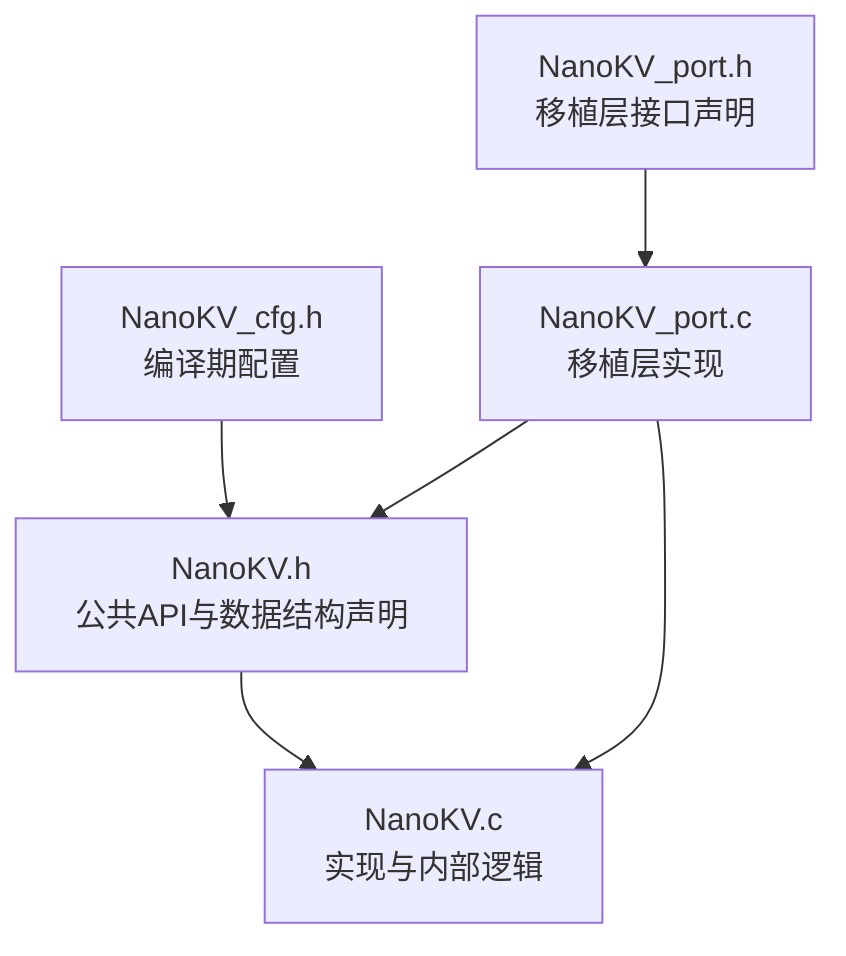
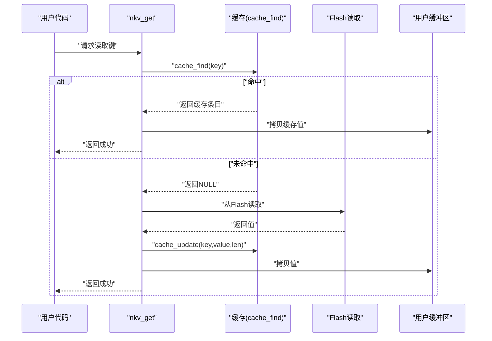
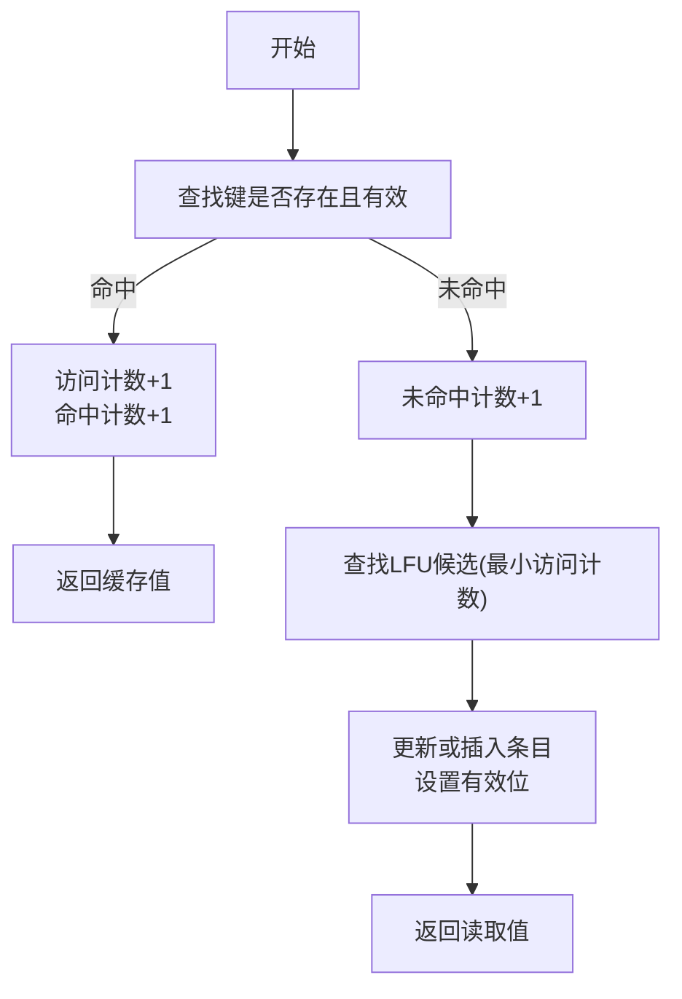
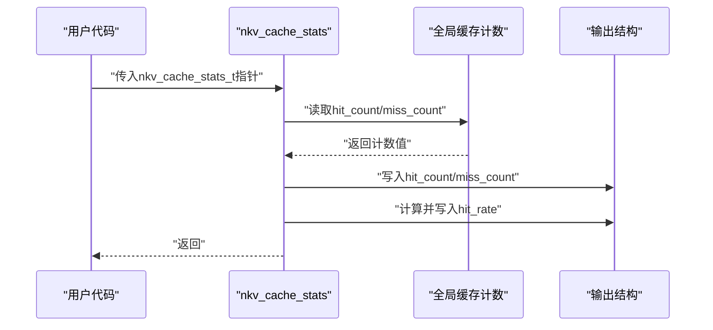
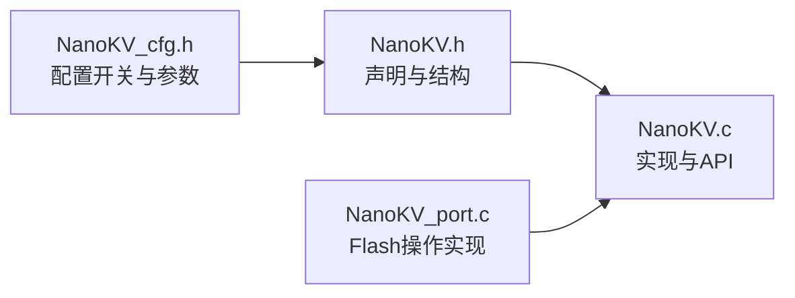

# 缓存管理API

<cite>
**本文引用的文件**
- [NanoKV.h](file://NanoKV.h)
- [NanoKV.c](file://NanoKV.c)
- [NanoKV_cfg.h](file://NanoKV_cfg.h)
- [NanoKV_port.h](file://NanoKV_port.h)
- [NanoKV_port.c](file://NanoKV_port.c)
</cite>

## 目录
1. [简介](#简介)
2. [项目结构](#项目结构)
3. [核心组件](#核心组件)
4. [架构总览](#架构总览)
5. [详细组件分析](#详细组件分析)
6. [依赖关系分析](#依赖关系分析)
7. [性能考量](#性能考量)
8. [故障排查指南](#故障排查指南)
9. [结论](#结论)
10. [附录](#附录)

## 简介
本文件面向NanoKV的缓存管理API，重点覆盖nkv_cache_stats与nkv_cache_clear两个缓存控制接口，系统阐述LFU（最少频繁使用）缓存的工作原理、缓存条目结构与访问计数机制，解释缓存命中率统计、缓存容量配置与替换策略，并给出缓存性能监控、缓存清理与缓存状态查询的使用方法与实践建议。同时，结合KV与TLV两种存储模式，说明缓存在不同场景下的作用与优化效果，并提供实际使用示例与调试技巧。

## 项目结构
NanoKV采用单文件头+实现的组织方式，配合配置头文件进行编译期开关与参数定制。缓存相关能力通过条件编译开关启用，核心API位于公共头文件中，实现位于源文件内。

图表来源
- [NanoKV.h](file://NanoKV.h#L16-L257)
- [NanoKV.c](file://NanoKV.c#L1-L1261)
- [NanoKV_cfg.h](file://NanoKV_cfg.h#L1-L51)
- [NanoKV_port.h](file://NanoKV_port.h#L1-L27)
- [NanoKV_port.c](file://NanoKV_port.c#L1-L95)

章节来源
- [NanoKV.h](file://NanoKV.h#L16-L257)
- [NanoKV_cfg.h](file://NanoKV_cfg.h#L1-L51)
- [NanoKV_port.c](file://NanoKV_port.c#L1-L95)

## 核心组件
- 缓存结构体族
  - nkv_cache_entry_t：缓存条目，包含键、值、键长、值长、有效性标记与访问计数。
  - nkv_cache_stats_t：缓存统计，包含命中次数、未命中次数与命中率。
  - nkv_cache_t：缓存容器，包含固定大小的条目数组以及全局命中/未命中计数。
- 缓存API
  - nkv_cache_stats：填充传入的统计结构，计算命中率。
  - nkv_cache_clear：清空缓存容器，重置计数与条目有效性。

章节来源
- [NanoKV.h](file://NanoKV.h#L85-L110)
- [NanoKV.h](file://NanoKV.h#L164-L168)
- [NanoKV.c](file://NanoKV.c#L847-L862)

## 架构总览
缓存作为KV读路径的加速层，与主存储（Flash）协同工作。当启用缓存时，读取流程优先检查缓存命中；若未命中，则从Flash读取并更新缓存。写入与删除操作会同步更新或移除缓存中的对应条目，确保一致性。

图表来源
- [NanoKV.c](file://NanoKV.c#L765-L798)
- [NanoKV.c](file://NanoKV.c#L89-L169)

## 详细组件分析

### LFU缓存工作原理与数据结构
- 条目结构
  - 键与键长：用于唯一标识缓存项。
  - 值与值长：缓存的实际数据副本。
  - 有效性标记：指示条目是否有效。
  - 访问计数：LFU替换的关键依据。
- 访问计数机制
  - 命中时递增访问计数，便于后续LFU替换。
  - 未命中时仅增加未命中计数，不修改条目。
- 替换策略
  - LFU：选择访问计数最小的条目进行替换；若存在未使用条目（有效位为0），优先选择空槽位。
  - 时间复杂度：线性扫描固定大小的缓存数组，O(K)（K为缓存容量）。

图表来源
- [NanoKV.c](file://NanoKV.c#L89-L169)

章节来源
- [NanoKV.h](file://NanoKV.h#L85-L110)
- [NanoKV.c](file://NanoKV.c#L89-L169)

### 缓存统计与清理API
- nkv_cache_stats
  - 功能：填充nkv_cache_stats_t结构，计算命中率。
  - 行为：读取全局命中/未命中计数，按总次数计算命中率百分比；若总次数为0，命中率为0。
- nkv_cache_clear
  - 功能：清空缓存容器，重置所有条目有效位与计数。
  - 行为：将缓存结构体内存清零，使所有条目失效，命中/未命中计数归零。

图表来源
- [NanoKV.c](file://NanoKV.c#L847-L856)

章节来源
- [NanoKV.h](file://NanoKV.h#L97-L110)
- [NanoKV.h](file://NanoKV.h#L164-L168)
- [NanoKV.c](file://NanoKV.c#L847-L862)

### KV与TLV中的缓存作用差异
- KV缓存
  - 针对键值对热点数据的加速，命中后直接返回缓存值，显著降低Flash读取次数。
  - 写入/删除操作会同步更新缓存，保证一致性。
- TLV缓存
  - TLV以类型-长度-值形式存储，通常用于历史记录与保留策略场景。
  - 当前实现中，TLV读取路径不直接复用KV缓存，但其读取流程与KV一致，均可受益于LFU策略带来的整体性能提升。

章节来源
- [NanoKV.c](file://NanoKV.c#L765-L798)
- [NanoKV.c](file://NanoKV.c#L964-L994)

### 缓存配置参数与影响分析
- 开关与容量
  - NKV_CACHE_ENABLE：启用/禁用缓存。
  - NKV_CACHE_SIZE：缓存条目数量，直接影响命中率与内存占用。
- 性能影响
  - 容量增大：提升命中率，但占用更多RAM；替换成本仍为O(K)。
  - 容量过小：命中率下降，频繁未命中导致Flash读取增多。
- 建议
  - 根据热点键分布与可用RAM设定容量，优先满足关键路径的热点数据。
  - 结合nkv_cache_stats监控命中率，动态调整容量或引入更复杂的策略。

章节来源
- [NanoKV_cfg.h](file://NanoKV_cfg.h#L14-L17)
- [NanoKV.h](file://NanoKV.h#L85-L110)

### 使用示例与最佳实践
- 查询缓存状态
  - 步骤：准备nkv_cache_stats_t变量，调用nkv_cache_stats填充统计，读取命中率与计数。
  - 用途：评估缓存效果，指导容量与策略优化。
- 清理缓存
  - 步骤：调用nkv_cache_clear，清空缓存并重置计数。
  - 用途：在系统重启、配置变更或需要强制刷新缓存时使用。
- 与KV/TLV读取结合
  - 在高频读取场景下，先尝试缓存命中；未命中再从Flash读取并更新缓存。
  - 写入/删除KV/TLV后，缓存会相应更新或移除，确保一致性。

章节来源
- [NanoKV.c](file://NanoKV.c#L847-L862)
- [NanoKV.c](file://NanoKV.c#L765-L798)
- [NanoKV.c](file://NanoKV.c#L964-L994)

## 依赖关系分析
- 头文件依赖
  - NanoKV.h包含配置头，定义缓存结构与API。
  - NanoKV.c实现缓存逻辑与API。
- 配置依赖
  - 编译期开关NKV_CACHE_ENABLE决定是否编译缓存相关代码。
  - NKV_CACHE_SIZE决定缓存数组大小。
- 移植层依赖
  - Flash操作接口由移植层提供，缓存API不直接依赖具体Flash实现。

图表来源
- [NanoKV_cfg.h](file://NanoKV_cfg.h#L1-L51)
- [NanoKV.h](file://NanoKV.h#L16-L257)
- [NanoKV.c](file://NanoKV.c#L1-L1261)
- [NanoKV_port.c](file://NanoKV_port.c#L1-L95)

章节来源
- [NanoKV.h](file://NanoKV.h#L16-L257)
- [NanoKV_cfg.h](file://NanoKV_cfg.h#L1-L51)
- [NanoKV_port.c](file://NanoKV_port.c#L1-L95)

## 性能考量
- 命中率优化
  - 提高NKV_CACHE_SIZE可提升命中率，但需权衡RAM占用。
  - 通过nkv_cache_stats持续监控命中率，动态调整容量。
- 替换策略
  - LFU在热点数据稳定场景表现良好；若热点变化频繁，可考虑其他策略（当前实现为LFU）。
- 读写路径
  - 命中时避免Flash读取，显著降低延迟与Flash磨损。
  - 未命中时，读取后更新缓存，后续访问命中概率提升。
- 增量GC与缓存
  - 增量GC在写入过程中分摊GC开销，减少长时间阻塞；缓存不会参与GC，但整体读性能提升有助于减少未命中。

章节来源
- [NanoKV.c](file://NanoKV.c#L847-L862)
- [NanoKV.c](file://NanoKV.c#L765-L798)
- [NanoKV_cfg.h](file://NanoKV_cfg.h#L18-L21)

## 故障排查指南
- 缓存统计异常
  - 现象：命中率始终为0或异常波动。
  - 排查：确认已启用缓存开关，检查nkv_cache_stats调用时机与统计对象是否正确。
- 缓存清理无效
  - 现象：调用nkv_cache_clear后命中率未降为0。
  - 排查：确认调用位置与时机，确保在读取前未被写入覆盖。
- 读取性能未提升
  - 现象：启用缓存后读取性能无明显改善。
  - 排查：检查热点数据分布、NKV_CACHE_SIZE是否过小；确认KV/TLV读取路径确实经过缓存。
- 写入/删除后缓存不一致
  - 现象：写入新值后读取旧值。
  - 排查：确认写入/删除路径是否调用了缓存更新/移除逻辑；检查NKV_CACHE_ENABLE是否开启。

章节来源
- [NanoKV.c](file://NanoKV.c#L847-L862)
- [NanoKV.c](file://NanoKV.c#L765-L798)
- [NanoKV.c](file://NanoKV.c#L800-L806)

## 结论
NanoKV的LFU缓存为KV/TLV读取提供了有效的加速机制。通过nkv_cache_stats与nkv_cache_clear，开发者可以监控与控制缓存行为，结合配置参数与运行时统计，实现性能与资源的平衡。在实际应用中，建议根据热点数据特征与系统资源，合理设置缓存容量，并持续监控命中率以指导优化。

## 附录
- API清单
  - nkv_cache_stats：填充缓存统计结构，计算命中率。
  - nkv_cache_clear：清空缓存容器，重置计数与条目有效性。
- 关键实现位置
  - 缓存结构与API声明：见头文件。
  - 缓存统计与清理实现：见源文件。
  - KV读取路径与缓存交互：见源文件。

章节来源
- [NanoKV.h](file://NanoKV.h#L97-L110)
- [NanoKV.h](file://NanoKV.h#L164-L168)
- [NanoKV.c](file://NanoKV.c#L847-L862)
- [NanoKV.c](file://NanoKV.c#L765-L798)