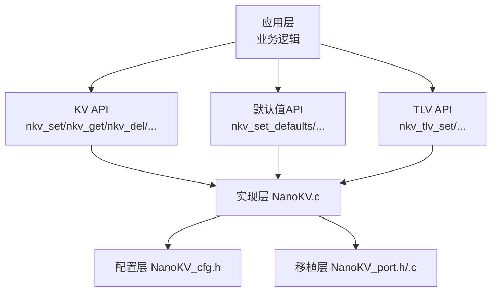
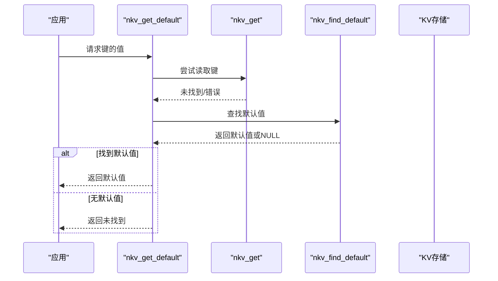
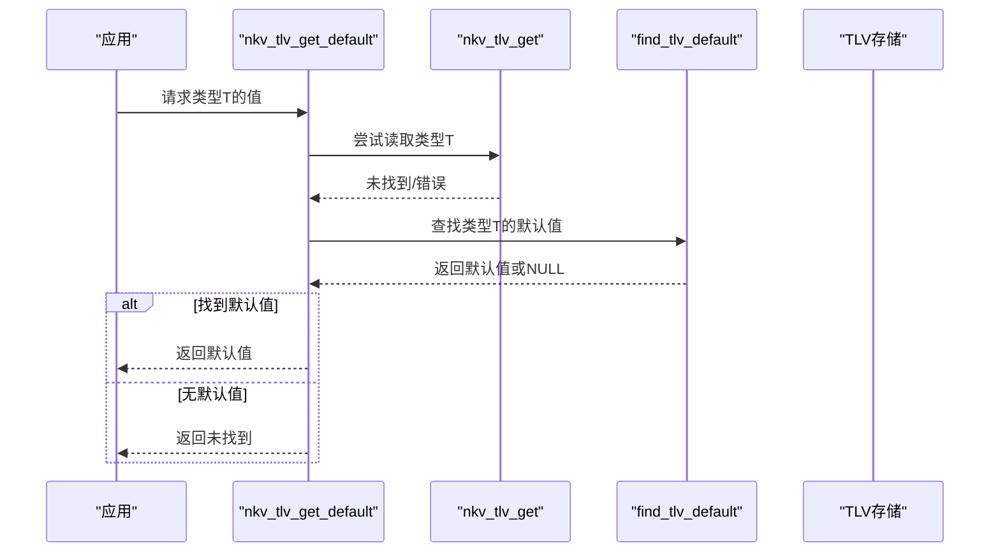
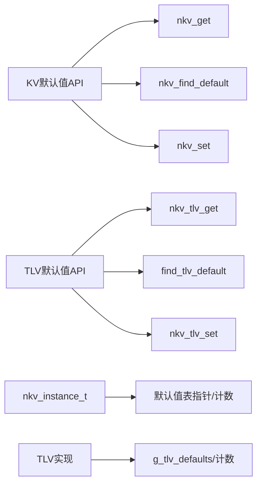

# 默认值API

<cite>
**本文引用的文件**
- [NanoKV.h](file://NanoKV.h)
- [NanoKV.c](file://NanoKV.c)
- [NanoKV_cfg.h](file://NanoKV_cfg.h)
- [NanoKV_port.h](file://NanoKV_port.h)
- [NanoKV_port.c](file://NanoKV_port.c)
</cite>

## 目录
1. [简介](#简介)
2. [项目结构](#项目结构)
3. [核心组件](#核心组件)
4. [架构总览](#架构总览)
5. [详细组件分析](#详细组件分析)
6. [依赖关系分析](#依赖关系分析)
7. [性能考量](#性能考量)
8. [故障排查指南](#故障排查指南)
9. [结论](#结论)
10. [附录](#附录)

## 简介
本文件为 NanoKV 的默认值 API 提供权威参考，覆盖 KV 和 TLV 两套默认值体系，包括：
- KV 默认值：nkv_set_defaults、nkv_get_default、nkv_find_default、nkv_reset_key、nkv_reset_all
- TLV 默认值：nkv_tlv_set_defaults、nkv_tlv_get_default、nkv_tlv_reset_type、nkv_tlv_reset_all
- 默认值辅助宏：NKV_DEF_*、NKV_TLV_DEF_*、NKV_DEFAULT_SIZE、NKV_TLV_DEFAULT_SIZE
- 默认值与实际存储数据的关系及优先级规则
- 使用示例与配置模板

默认值机制允许在键值不存在或被删除时，从预设的默认值表回退，从而简化上层逻辑并保证系统行为的一致性。

## 项目结构
NanoKV 采用“头文件声明 + 单一实现 + 配置头 + 移植层”的组织方式：
- NanoKV.h：对外 API、数据结构、宏定义
- NanoKV.c：实现主体（含默认值、KV/TLV、GC、缓存等）
- NanoKV_cfg.h：编译期配置（键长、值长、缓存、GC、调试等）
- NanoKV_port.h/.c：移植层（Flash 操作接口、初始化流程）

图表来源
- [NanoKV.h](file://NanoKV.h#L133-L257)
- [NanoKV.c](file://NanoKV.c#L626-L1261)
- [NanoKV_cfg.h](file://NanoKV_cfg.h#L1-L51)
- [NanoKV_port.c](file://NanoKV_port.c#L54-L95)

章节来源
- [NanoKV.h](file://NanoKV.h#L1-L257)
- [NanoKV.c](file://NanoKV.c#L1-L1261)
- [NanoKV_cfg.h](file://NanoKV_cfg.h#L1-L51)
- [NanoKV_port.c](file://NanoKV_port.c#L1-L95)

## 核心组件
- 默认值配置结构
  - KV 默认值：nkv_default_t（键指针、值指针、长度）
  - TLV 默认值：nkv_tlv_default_t（类型、值指针、长度）
- 默认值表注册与查询
  - nkv_set_defaults / nkv_tlv_set_defaults 注册默认值表
  - nkv_find_default / find_tlv_default 查询默认值
- 默认值读取与回退
  - nkv_get_default：先读 KV，不存在则回退默认值
  - nkv_tlv_get_default：先读 TLV，不存在则回退默认值
- 默认值重置
  - nkv_reset_key：按键重置为默认值
  - nkv_reset_all：批量重置所有键为默认值
  - nkv_tlv_reset_type / nkv_tlv_reset_all：TLV 对应重置
- 默认值辅助宏
  - KV：NKV_DEF_STR、NKV_DEF_INT、NKV_DEF_DATA、NKV_DEFAULT_SIZE
  - TLV：NKV_TLV_DEF_U8/U16/U32/DATA、NKV_TLV_DEFAULT_SIZE

章节来源
- [NanoKV.h](file://NanoKV.h#L60-L66)
- [NanoKV.h](file://NanoKV.h#L170-L175)
- [NanoKV.h](file://NanoKV.h#L186-L191)
- [NanoKV.h](file://NanoKV.h#L249-L254)
- [NanoKV.c](file://NanoKV.c#L866-L933)
- [NanoKV.c](file://NanoKV.c#L1013-L1064)

## 架构总览
默认值 API 的工作流分为两条主线：
- KV 默认值：nkv_get_default → 读取 KV → 未命中 → 查找默认值 → 返回默认值
- TLV 默认值：nkv_tlv_get_default → 读取 TLV → 未命中 → 查找默认值 → 返回默认值

图表来源
- [NanoKV.c](file://NanoKV.c#L887-L905)

章节来源
- [NanoKV.c](file://NanoKV.c#L864-L933)

## 详细组件分析

### KV 默认值 API
- nkv_set_defaults
  - 功能：注册默认值表（数组首地址与元素个数）
  - 行为：保存指针与计数，后续通过 nkv_find_default/nkv_get_default 使用
  - 注意：默认值表需在运行期内保持有效
- nkv_find_default
  - 功能：按键名精确匹配返回默认值项
  - 匹配条件：键名长度一致且内容相同
- nkv_get_default
  - 优先级：先尝试 nkv_get；若未找到，则回退到默认值表
  - 输出：将默认值拷贝至用户缓冲区，并设置输出长度
- nkv_reset_key
  - 功能：将指定键重置为默认值（若存在）
  - 若键不存在但默认值存在，会写入该默认值
- nkv_reset_all
  - 功能：遍历默认值表，逐项写入对应键的默认值
  - 适用场景：设备出厂设置恢复、批量初始化

图表来源
- [NanoKV.c](file://NanoKV.c#L887-L905)

章节来源
- [NanoKV.c](file://NanoKV.c#L866-L933)

### TLV 默认值 API
- nkv_tlv_set_defaults
  - 功能：注册 TLV 默认值表（类型→值）
- find_tlv_default
  - 功能：按类型精确匹配返回默认值项
- nkv_tlv_get_default
  - 优先级：先尝试 nkv_tlv_get；若未找到，则回退到默认值表
- nkv_tlv_reset_type
  - 功能：将指定类型重置为默认值
- nkv_tlv_reset_all
  - 功能：遍历默认值表，逐项写入对应类型的默认值

图表来源
- [NanoKV.c](file://NanoKV.c#L1029-L1043)

章节来源
- [NanoKV.c](file://NanoKV.c#L1013-L1064)

### 默认值辅助宏
- KV 宏
  - NKV_DEF_STR(key, value_str)：字符串默认值（自动计算长度）
  - NKV_DEF_INT(key, value_int)：整型默认值（固定长度）
  - NKV_DEF_DATA(key, ptr, len)：任意二进制数据默认值
  - NKV_DEFAULT_SIZE(arr)：计算默认值数组元素个数
- TLV 宏
  - NKV_TLV_DEF_U8/U16/U32(type, value)：无符号整型默认值
  - NKV_TLV_DEF_DATA(type, ptr, len)：二进制数据默认值
  - NKV_TLV_DEFAULT_SIZE(arr)：计算 TLV 默认值数组元素个数

使用建议
- 字符串默认值优先使用 NKV_DEF_STR，避免手动计算长度
- 整型默认值统一使用 NKV_DEF_INT，确保长度一致
- 二进制数据使用 NKV_DEF_DATA，注意内存生命周期
- 使用 NKV_DEFAULT_SIZE/NKV_TLV_DEFAULT_SIZE 统一计算数组长度，避免手工维护

章节来源
- [NanoKV.h](file://NanoKV.h#L170-L175)
- [NanoKV.h](file://NanoKV.h#L249-L254)

### 默认值与实际存储的关系与优先级
- KV 优先级
  - KV 存在且有效：优先返回 KV 值
  - KV 不存在或为空：回退到默认值
  - KV 被删除（长度为0）：视为不存在，回退默认值
- TLV 优先级
  - TLV 存在且有效：优先返回 TLV 值
  - TLV 不存在或长度≤1：回退到默认值
- 重置行为
  - nkv_reset_key/nkv_reset_all：将默认值写入 KV 存储
  - nkv_tlv_reset_type/nkv_tlv_reset_all：将默认值写入 TLV 存储
- 缓存影响
  - KV 读取命中缓存时，不会触发默认值回退
  - KV 写入成功后会更新缓存

章节来源
- [NanoKV.c](file://NanoKV.c#L887-L905)
- [NanoKV.c](file://NanoKV.c#L1029-L1043)
- [NanoKV.c](file://NanoKV.c#L765-L798)
- [NanoKV.c](file://NanoKV.c#L728-L763)

## 依赖关系分析
- KV 默认值依赖
  - nkv_get_default 依赖 nkv_get 与 nkv_find_default
  - nkv_reset_key 依赖 nkv_set 与 nkv_find_default
  - nkv_reset_all 依赖 nkv_set 与默认值表
- TLV 默认值依赖
  - nkv_tlv_get_default 依赖 nkv_tlv_get 与 find_tlv_default
  - nkv_tlv_reset_type 依赖 nkv_tlv_set 与 find_tlv_default
  - nkv_tlv_reset_all 依赖 nkv_tlv_set 与默认值表
- 数据结构依赖
  - nkv_instance_t 中保存默认值表指针与计数
  - g_tlv_defaults/g_tlv_default_count 保存 TLV 默认值表

图表来源
- [NanoKV.c](file://NanoKV.c#L866-L933)
- [NanoKV.c](file://NanoKV.c#L1013-L1064)
- [NanoKV.h](file://NanoKV.h#L113-L131)

章节来源
- [NanoKV.c](file://NanoKV.c#L864-L933)
- [NanoKV.c](file://NanoKV.c#L1013-L1064)
- [NanoKV.h](file://NanoKV.h#L113-L131)

## 性能考量
- KV 默认值回退
  - nkv_get_default：一次 KV 读取 + 一次默认值表线性扫描
  - 建议：默认值表不宜过大；必要时在上层缓存常用键的默认值
- TLV 默认值回退
  - nkv_tlv_get_default：一次 TLV 读取 + 一次默认值表线性扫描
  - 建议：默认值表按类型有序排列，便于快速匹配
- 批量重置
  - nkv_reset_all/nkv_tlv_reset_all：逐项写入，默认值表越大，耗时越长
  - 建议：仅在系统初始化或恢复出厂设置时执行
- 缓存配合
  - KV 读取命中缓存可显著降低默认值回退成本
  - 写入成功后会更新缓存，减少后续读取开销

[本节为通用指导，不直接分析具体文件]

## 故障排查指南
常见问题与处理
- 读取返回未找到
  - KV：确认键是否存在；确认默认值表已注册；确认键名完全一致
  - TLV：确认类型是否有效；确认默认值表已注册；确认类型匹配
- 重置无效
  - 确认默认值表已注册；确认默认值指针有效；确认写入空间充足
- 性能异常
  - 默认值表过大导致线性扫描耗时；考虑拆分或上层缓存
  - KV 缓存未命中导致频繁回退；优化键访问模式
- 内存生命周期
  - 默认值表与默认值数据必须在运行期内有效；避免局部变量作为默认值

章节来源
- [NanoKV.c](file://NanoKV.c#L887-L905)
- [NanoKV.c](file://NanoKV.c#L1029-L1043)
- [NanoKV.c](file://NanoKV.c#L866-L933)
- [NanoKV.c](file://NanoKV.c#L1013-L1064)

## 结论
NanoKV 的默认值 API 为 KV 与 TLV 提供了统一的回退机制，简化了上层逻辑并增强了健壮性。通过合理的默认值表设计、合适的宏使用以及与缓存/GC 的协同，可在资源受限的嵌入式环境中获得稳定高效的性能表现。

[本节为总结性内容，不直接分析具体文件]

## 附录

### 使用示例与配置模板

- KV 默认值使用模板
  - 定义默认值表（使用宏）
  - 注册默认值表
  - 读取默认值
  - 按键重置
  - 批量重置
  - 示例路径
    - [KV 默认值注册与使用](file://NanoKV.c#L866-L933)
    - [KV 默认值辅助宏](file://NanoKV.h#L170-L175)

- TLV 默认值使用模板
  - 定义 TLV 默认值表（使用宏）
  - 注册 TLV 默认值表
  - 读取默认值
  - 按类型重置
  - 批量重置
  - 示例路径
    - [TLV 默认值注册与使用](file://NanoKV.c#L1013-L1064)
    - [TLV 默认值辅助宏](file://NanoKV.h#L249-L254)

- 配置要点
  - 键长与值长限制：参考配置头文件
  - 缓存开关与大小：影响默认值回退的命中率
  - GC 策略：影响默认值回退后的写入行为
  - 示例路径
    - [编译期配置](file://NanoKV_cfg.h#L10-L26)

- 移植层注意事项
  - Flash 操作接口需正确实现
  - 初始化流程需先内部初始化再扫描恢复
  - 示例路径
    - [移植层初始化](file://NanoKV_port.c#L54-L95)

章节来源
- [NanoKV.c](file://NanoKV.c#L866-L933)
- [NanoKV.c](file://NanoKV.c#L1013-L1064)
- [NanoKV_cfg.h](file://NanoKV_cfg.h#L10-L26)
- [NanoKV_port.c](file://NanoKV_port.c#L54-L95)