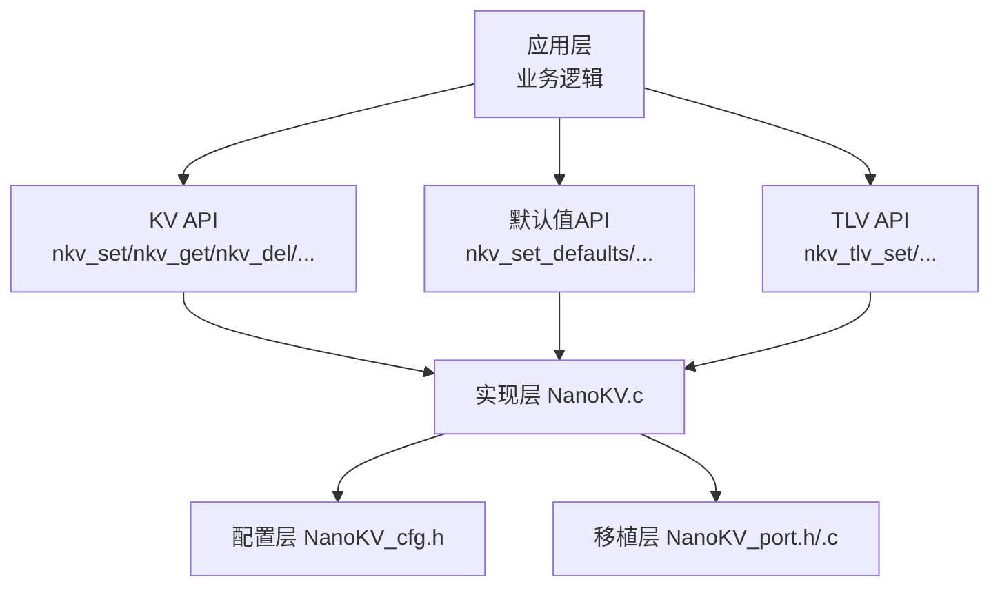
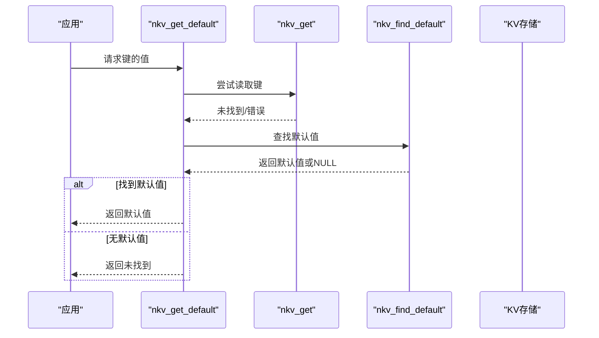
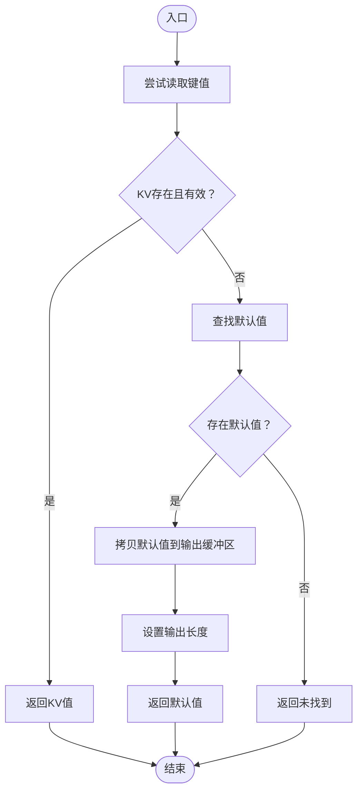
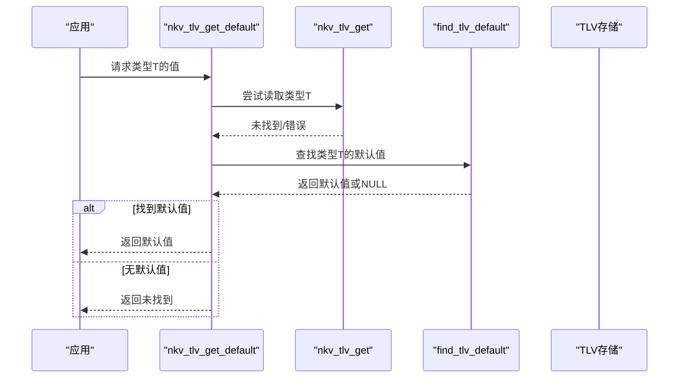
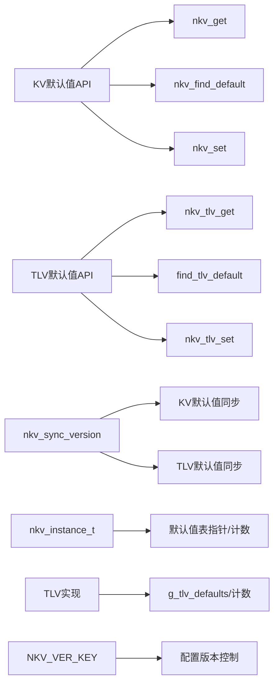

# 默认值API

<cite>
**本文引用的文件**
- [NanoKV.h](file://NanoKV.h)
- [NanoKV.c](file://NanoKV.c)
- [NanoKV_cfg.h](file://NanoKV_cfg.h)
- [NanoKV_port.h](file://NanoKV_port.h)
- [NanoKV_port.c](file://NanoKV_port.c)
</cite>

## 更新摘要
**变更内容**
- 完全基于NanoKV实现更新默认值API文档
- 新增配置版本同步机制说明
- 更新KV和TLV默认值API的实现细节
- 补充默认值辅助宏的使用方法
- 添加默认值与实际存储关系的详细说明

## 目录
1. [简介](#简介)
2. [项目结构](#项目结构)
3. [核心组件](#核心组件)
4. [架构总览](#架构总览)
5. [详细组件分析](#详细组件分析)
6. [依赖关系分析](#依赖关系分析)
7. [性能考量](#性能考量)
8. [故障排查指南](#故障排查指南)
9. [结论](#结论)
10. [附录](#附录)

## 简介
本文档为NanoKV的默认值API提供权威参考，覆盖KV和TLV两套默认值体系，包括：
- KV默认值：nkv_set_defaults、nkv_get_default、nkv_find_default、nkv_reset_key、nkv_reset_all
- TLV默认值：nkv_tlv_set_defaults、nkv_tlv_get_default、nkv_tlv_reset_type、nkv_tlv_reset_all
- 默认值辅助宏：NKV_DEF_*、NKV_TLV_DEF_*、NKV_DEFAULT_SIZE、NKV_TLV_DEFAULT_SIZE
- 配置版本同步机制：自动检测配置变更并同步默认值
- 默认值与实际存储数据的关系及优先级规则
- 使用示例与配置模板

默认值机制允许在键值不存在或被删除时，从预设的默认值表回退，从而简化上层逻辑并保证系统行为的一致性。

## 项目结构
NanoKV采用"头文件声明 + 单一实现 + 配置头 + 移植层"的组织方式：
- NanoKV.h：对外API、数据结构、宏定义
- NanoKV.c：实现主体（含默认值、KV/TLV、GC、缓存等）
- NanoKV_cfg.h：编译期配置（键长、值长、缓存、GC、调试等）
- NanoKV_port.h/.c：移植层（Flash操作接口、初始化流程）

**图表来源**
- [NanoKV.h](file://NanoKV.h#L145-L269)
- [NanoKV.c](file://NanoKV.c#L1-L1502)
- [NanoKV_cfg.h](file://NanoKV_cfg.h#L1-L92)
- [NanoKV_port.c](file://NanoKV_port.c#L1-L95)

**章节来源**
- [NanoKV.h](file://NanoKV.h#L1-L269)
- [NanoKV.c](file://NanoKV.c#L1-L1502)
- [NanoKV_cfg.h](file://NanoKV_cfg.h#L1-L92)
- [NanoKV_port.c](file://NanoKV_port.c#L1-L95)

## 核心组件
- 默认值配置结构
  - KV默认值：nkv_default_t（键指针、值指针、长度）
  - TLV默认值：nkv_tlv_default_t（类型、值指针、长度）
- 默认值表注册与查询
  - nkv_set_defaults / nkv_tlv_set_defaults注册默认值表
  - nkv_find_default / find_tlv_default查询默认值
- 默认值读取与回退
  - nkv_get_default：先读KV，不存在则回退默认值
  - nkv_tlv_get_default：先读TLV，不存在则回退默认值
- 默认值重置
  - nkv_reset_key：按键重置为默认值
  - nkv_reset_all：批量重置所有键为默认值
  - nkv_tlv_reset_type / nkv_tlv_reset_all：TLV对应重置
- 配置版本同步
  - 自动检测配置版本变更并同步默认值
- 默认值辅助宏
  - KV：NKV_DEF_STR、NKV_DEF_INT、NKV_DEF_DATA、NKV_DEFAULT_SIZE
  - TLV：NKV_TLV_DEF_U8/U16/U32/DATA、NKV_TLV_DEFAULT_SIZE

**章节来源**
- [NanoKV.h](file://NanoKV.h#L72-L78)
- [NanoKV.h](file://NanoKV.h#L197-L203)
- [NanoKV.h](file://NanoKV.h#L159-L164)
- [NanoKV.h](file://NanoKV.h#L236-L240)
- [NanoKV.h](file://NanoKV.h#L182-L186)
- [NanoKV.h](file://NanoKV.h#L261-L266)
- [NanoKV.c](file://NanoKV.c#L1102-L1171)
- [NanoKV.c](file://NanoKV.c#L1251-L1304)

## 架构总览
默认值API的工作流分为两条主线：
- KV默认值：nkv_get_default → 读取KV → 未命中 → 查找默认值 → 返回默认值
- TLV默认值：nkv_tlv_get_default → 读取TLV → 未命中 → 查找默认值 → 返回默认值

**图表来源**
- [NanoKV.c](file://NanoKV.c#L1125-L1143)

**章节来源**
- [NanoKV.c](file://NanoKV.c#L1100-L1171)
- [NanoKV.c](file://NanoKV.c#L1250-L1304)

## 详细组件分析

### KV默认值API
- nkv_set_defaults
  - 功能：注册默认值表（数组首地址与元素个数）
  - 行为：保存指针与计数，调用nkv_sync_version进行版本同步
  - 注意：默认值表需在运行期内保持有效
- nkv_find_default
  - 功能：按键名精确匹配返回默认值项
  - 匹配条件：键名长度一致且内容相同
- nkv_get_default
  - 优先级：先尝试nkv_get；若未找到，则回退到默认值表
  - 输出：将默认值拷贝至用户缓冲区，并设置输出长度
- nkv_reset_key
  - 功能：将指定键重置为默认值（若存在）
  - 若键不存在但默认值存在，会写入该默认值
- nkv_reset_all
  - 功能：遍历默认值表，逐项写入对应键的默认值
  - 适用场景：设备出厂设置恢复、批量初始化

**图表来源**
- [NanoKV.c](file://NanoKV.c#L1125-L1143)

**章节来源**
- [NanoKV.c](file://NanoKV.c#L1102-L1171)

### TLV默认值API
- nkv_tlv_set_defaults
  - 功能：注册TLV默认值表（类型→值）
  - 行为：保存指针与计数，调用nkv_sync_version进行版本同步
- find_tlv_default
  - 功能：按类型精确匹配返回默认值项
- nkv_tlv_get_default
  - 优先级：先尝试nkv_tlv_get；若未找到，则回退到默认值表
- nkv_tlv_reset_type
  - 功能：将指定类型重置为默认值
- nkv_tlv_reset_all
  - 功能：遍历默认值表，逐项写入对应类型的默认值

**图表来源**
- [NanoKV.c](file://NanoKV.c#L1269-L1283)

**章节来源**
- [NanoKV.c](file://NanoKV.c#L1251-L1304)

### 配置版本同步机制
- nkv_sync_version
  - 功能：自动检测配置版本变更并同步默认值
  - KV同步：遍历KV默认值表，对不存在的键写入默认值
  - TLV同步：遍历TLV默认值表，对不存在的类型写入默认值
  - 版本控制：使用NKV_VER_KEY键存储配置版本号

**章节来源**
- [NanoKV.c](file://NanoKV.c#L1059-L1098)

### 默认值辅助宏
- KV宏
  - NKV_DEF_STR(key, value_str)：字符串默认值（自动计算长度）
  - NKV_DEF_INT(key, value_int)：整型默认值（固定长度）
  - NKV_DEF_DATA(key, ptr, len)：任意二进制数据默认值
  - NKV_DEFAULT_SIZE(arr)：计算默认值数组元素个数
- TLV宏
  - NKV_TLV_DEF_U8/U16/U32(type, value)：无符号整型默认值
  - NKV_TLV_DEF_DATA(type, ptr, len)：二进制数据默认值
  - NKV_TLV_DEFAULT_SIZE(arr)：计算TLV默认值数组元素个数

使用建议
- 字符串默认值优先使用NKV_DEF_STR，避免手动计算长度
- 整型默认值统一使用NKV_DEF_INT，确保长度一致
- 二进制数据使用NKV_DEF_DATA，注意内存生命周期
- 使用NKV_DEFAULT_SIZE/NKV_TLV_DEFAULT_SIZE统一计算数组长度，避免手工维护

**章节来源**
- [NanoKV.h](file://NanoKV.h#L182-L186)
- [NanoKV.h](file://NanoKV.h#L261-L266)

### 默认值与实际存储的关系与优先级
- KV优先级
  - KV存在且有效：优先返回KV值
  - KV不存在或为空：回退到默认值
  - KV被删除（长度为0）：视为不存在，回退默认值
- TLV优先级
  - TLV存在且有效：优先返回TLV值
  - TLV不存在或长度≤1：回退到默认值
- 重置行为
  - nkv_reset_key/nkv_reset_all：将默认值写入KV存储
  - nkv_tlv_reset_type/nkv_tlv_reset_all：将默认值写入TLV存储
- 缓存影响
  - KV读取命中缓存时，不会触发默认值回退
  - KV写入成功后会更新缓存
- 版本同步
  - 配置版本变更时自动同步默认值
  - 仅对缺失的键/类型进行写入

**章节来源**
- [NanoKV.c](file://NanoKV.c#L1125-L1143)
- [NanoKV.c](file://NanoKV.c#L1269-L1283)
- [NanoKV.c](file://NanoKV.c#L1059-L1098)

## 依赖关系分析
- KV默认值依赖
  - nkv_get_default依赖nkv_get与nkv_find_default
  - nkv_reset_key依赖nkv_set与nkv_find_default
  - nkv_reset_all依赖nkv_set与默认值表
  - nkv_set_defaults依赖nkv_sync_version
- TLV默认值依赖
  - nkv_tlv_get_default依赖nkv_tlv_get与find_tlv_default
  - nkv_tlv_reset_type依赖nkv_tlv_set与find_tlv_default
  - nkv_tlv_reset_all依赖nkv_tlv_set与默认值表
  - nkv_tlv_set_defaults依赖nkv_sync_version
- 数据结构依赖
  - nkv_instance_t中保存默认值表指针与计数
  - g_tlv_defaults/g_tlv_default_count保存TLV默认值表
  - 配置版本通过NKV_VER_KEY键存储

**图表来源**
- [NanoKV.c](file://NanoKV.c#L1102-L1171)
- [NanoKV.c](file://NanoKV.c#L1251-L1304)
- [NanoKV.c](file://NanoKV.c#L1059-L1098)
- [NanoKV.h](file://NanoKV.h#L124-L143)

**章节来源**
- [NanoKV.c](file://NanoKV.c#L1100-L1304)
- [NanoKV.h](file://NanoKV.h#L124-L143)

## 性能考量
- KV默认值回退
  - nkv_get_default：一次KV读取 + 一次默认值表线性扫描
  - 建议：默认值表不宜过大；必要时在上层缓存常用键的默认值
- TLV默认值回退
  - nkv_tlv_get_default：一次TLV读取 + 一次默认值表线性扫描
  - 建议：默认值表按类型有序排列，便于快速匹配
- 批量重置
  - nkv_reset_all/nkv_tlv_reset_all：逐项写入，默认值表越大，耗时越长
  - 建议：仅在系统初始化或恢复出厂设置时执行
- 版本同步
  - nkv_sync_version：仅在配置版本变更时执行，通常在初始化时调用
  - 建议：避免频繁的配置版本变更
- 缓存配合
  - KV读取命中缓存可显著降低默认值回退成本
  - 写入成功后会更新缓存，减少后续读取开销

## 故障排查指南
常见问题与处理
- 读取返回未找到
  - KV：确认键是否存在；确认默认值表已注册；确认键名完全一致
  - TLV：确认类型是否有效；确认默认值表已注册；确认类型匹配
- 重置无效
  - 确认默认值表已注册；确认默认值指针有效；确认写入空间充足
- 性能异常
  - 默认值表过大导致线性扫描耗时；考虑拆分或上层缓存
  - KV缓存未命中导致频繁回退；优化键访问模式
- 配置版本问题
  - 确认NKV_SETTING_VER配置正确；检查NKV_VER_KEY键的读写
  - 配置版本变更后未同步默认值；检查nkv_sync_version调用
- 内存生命周期
  - 默认值表与默认值数据必须在运行期内有效；避免局部变量作为默认值

**章节来源**
- [NanoKV.c](file://NanoKV.c#L1125-L1143)
- [NanoKV.c](file://NanoKV.c#L1269-L1283)
- [NanoKV.c](file://NanoKV.c#L1102-L1171)
- [NanoKV.c](file://NanoKV.c#L1251-L1304)
- [NanoKV.c](file://NanoKV.c#L1059-L1098)

## 结论
NanoKV的默认值API为KV与TLV提供了统一的回退机制，简化了上层逻辑并增强了健壮性。通过合理的默认值表设计、合适的宏使用以及与缓存/GC的协同，可在资源受限的嵌入式环境中获得稳定高效的性能表现。配置版本同步机制进一步提升了系统的可靠性和易用性。

## 附录

### 使用示例与配置模板

- KV默认值使用模板
  - 定义默认值表（使用宏）
  - 注册默认值表
  - 读取默认值
  - 按键重置
  - 批量重置
  - 示例路径
    - [KV默认值注册与使用](file://NanoKV.c#L1102-L1171)
    - [KV默认值辅助宏](file://NanoKV.h#L182-L186)

- TLV默认值使用模板
  - 定义TLV默认值表（使用宏）
  - 注册TLV默认值表
  - 读取默认值
  - 按类型重置
  - 批量重置
  - 示例路径
    - [TLV默认值注册与使用](file://NanoKV.c#L1251-L1304)
    - [TLV默认值辅助宏](file://NanoKV.h#L261-L266)

- 配置要点
  - 键长与值长限制：参考配置头文件
  - 缓存开关与大小：影响默认值回退的命中率
  - GC策略：影响默认值回退后的写入行为
  - 配置版本：NKV_SETTING_VER用于默认值同步
  - 示例路径
    - [编译期配置](file://NanoKV_cfg.h#L10-L33)

- 移植层注意事项
  - Flash操作接口需正确实现
  - 初始化流程需先内部初始化再扫描恢复
  - 示例路径
    - [移植层初始化](file://NanoKV_port.c#L54-L95)

**章节来源**
- [NanoKV.c](file://NanoKV.c#L1102-L1304)
- [NanoKV_cfg.h](file://NanoKV_cfg.h#L10-L33)
- [NanoKV_port.c](file://NanoKV_port.c#L54-L95)