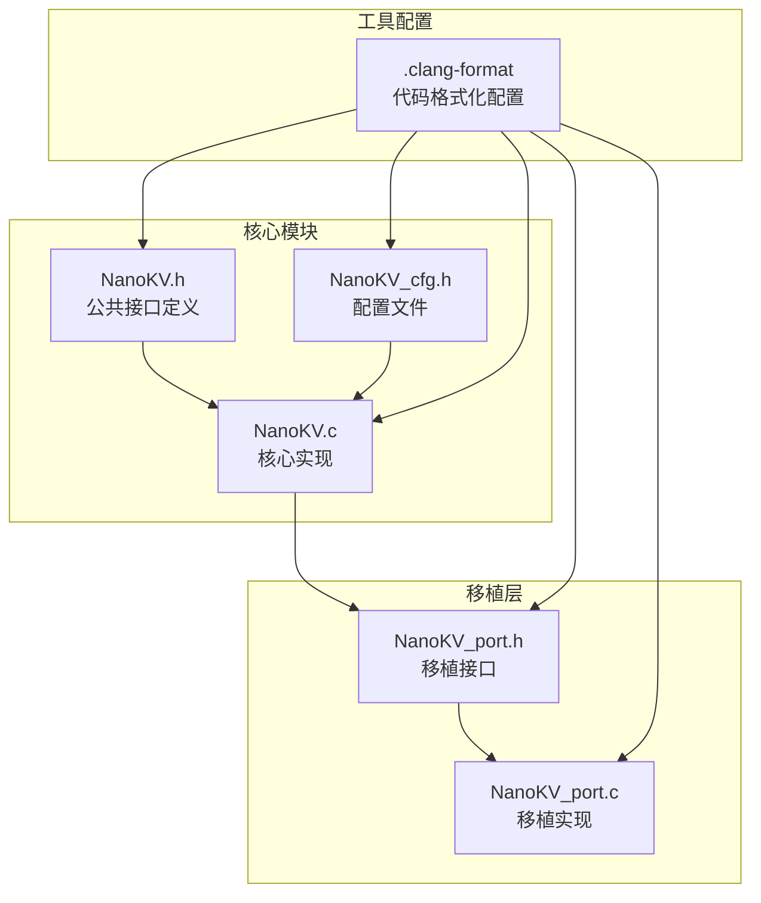
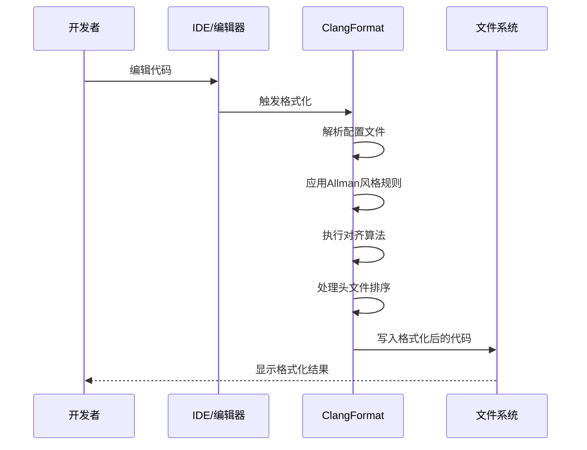
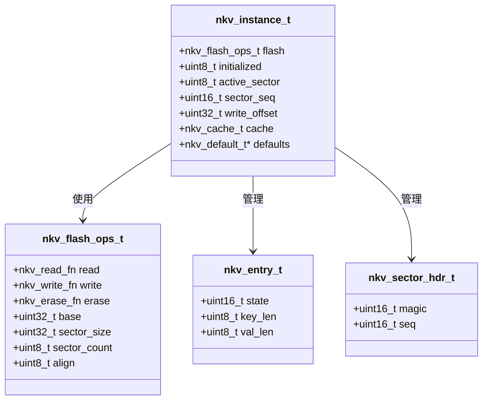
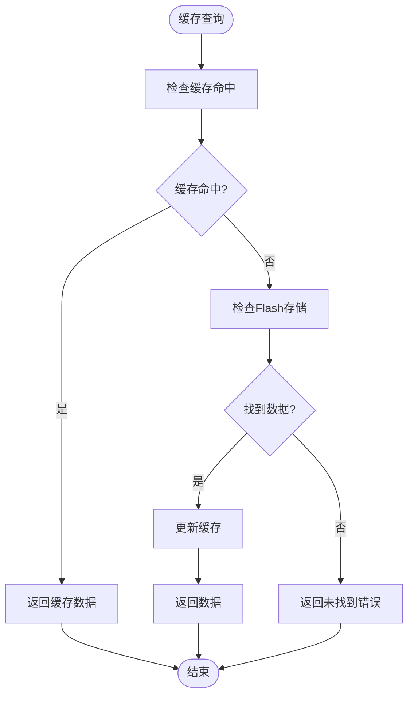
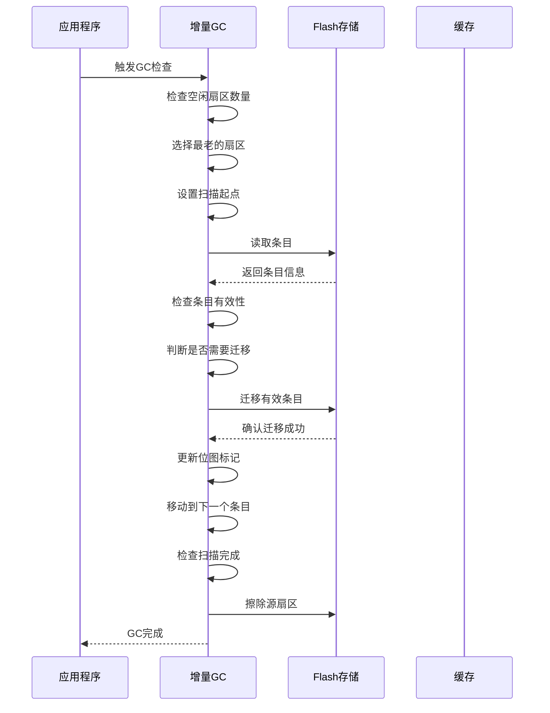
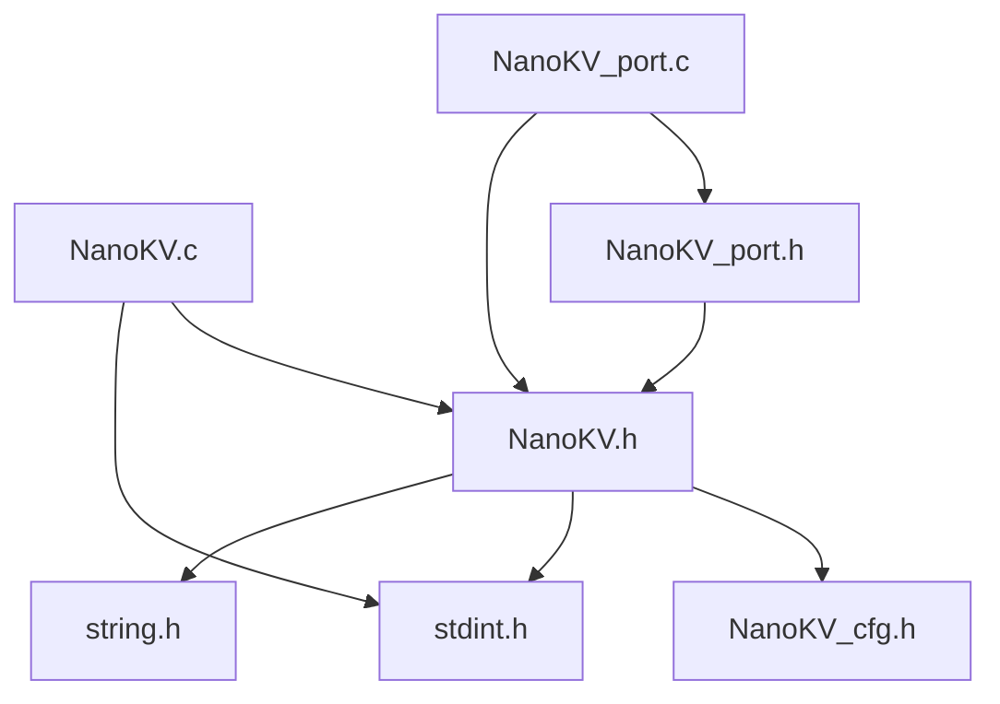

# 开发工具链

<cite>
**本文档引用的文件**
- [.clang-format](file://.clang-format)
- [NanoKV.c](file://NanoKV.c)
- [NanoKV.h](file://NanoKV.h)
- [NanoKV_cfg.h](file://NanoKV_cfg.h)
- [NanoKV_port.c](file://NanoKV_port.c)
- [NanoKV_port.h](file://NanoKV_port.h)
</cite>

## 目录
1. [简介](#简介)
2. [项目结构](#项目结构)
3. [核心组件](#核心组件)
4. [架构概览](#架构概览)
5. [详细组件分析](#详细组件分析)
6. [依赖关系分析](#依赖关系分析)
7. [性能考虑](#性能考虑)
8. [故障排除指南](#故障排除指南)
9. [结论](#结论)
10. [附录](#附录)

## 简介

NanoKV是一个轻量级的嵌入式KV/TLV存储库，专为微控制器应用设计。该项目提供了高效的键值对存储、类型-长度-值(TLV)存储、LFU缓存机制、增量垃圾回收等功能，特别适用于资源受限的嵌入式环境。

本指南专注于开发工具链的配置和使用，包括代码格式化、编译器设置、调试技巧、代码质量检查、持续集成等方面，帮助开发者建立高效、一致的开发环境。

## 项目结构

NanoKV项目采用模块化设计，主要包含以下核心文件：



**图表来源**
- [NanoKV.h](file://NanoKV.h#L1-L257)
- [NanoKV.c](file://NanoKV.c#L1-L1261)
- [.clang-format](file://.clang-format#L1-L656)

**章节来源**
- [NanoKV.h](file://NanoKV.h#L1-L257)
- [NanoKV.c](file://NanoKV.c#L1-L1261)
- [.clang-format](file://.clang-format#L1-L656)

## 核心组件

### 代码格式化配置

NanoKV项目使用ClangFormat进行代码格式化，采用Allman风格的大括号配置，确保代码的一致性和可读性。

#### Allman风格配置详解

Allman风格的核心配置包括：

- **大括号换行**: 所有大括号都单独成行
- **函数定义**: 函数定义后的大括号换行
- **控制语句**: if/for/while/switch等控制语句后的大括号换行
- **结构体定义**: 结构体定义后的大括号换行

#### 对齐配置

项目实现了多种对齐策略以提升代码可读性：

- **连续赋值对齐**: `int a = 1; int bbb = 2;` 形式的对齐
- **连续变量声明对齐**: 变量类型和变量名的对齐
- **连续宏定义对齐**: `#define SHORT 1` 和 `#define LONGER_NAME 2` 的对齐
- **行尾注释对齐**: `/* 注释 */` 的对齐

#### 头文件包含排序

项目实现了智能的头文件排序机制：

- **主头文件优先**: 与源文件同名的头文件优先
- **STM32库**: stm32开头的头文件
- **BSP驱动**: bsp_开头的头文件
- **项目内文件**: 双引号包含的项目文件
- **标准库**: C标准库头文件
- **第三方**: 系统/第三方头文件

**章节来源**
- [.clang-format](file://.clang-format#L136-L205)
- [.clang-format](file://.clang-format#L60-L126)
- [.clang-format](file://.clang-format#L456-L495)

### 配置管理

NanoKV使用集中式配置管理，通过头文件实现灵活的功能开关：

#### 功能配置选项

- **键值长度限制**: 最大键名长度16字节，最大值长度255字节
- **缓存机制**: 可选的LFU缓存，支持4个缓存条目
- **垃圾回收**: 支持增量GC和全量GC两种模式
- **TLV保留策略**: 可配置的保留策略，最多支持8种类型
- **调试输出**: 可选的日志输出功能

**章节来源**
- [NanoKV_cfg.h](file://NanoKV_cfg.h#L10-L29)

## 架构概览

NanoKV采用分层架构设计，确保了良好的模块化和可移植性：

```mermaid
graph TB
subgraph "应用层"
A[用户应用程序]
end
subgraph "API层"
B[NanoKV API<br/>nkv_set()<br/>nkv_get()<br/>nkv_del()]
C[TLV API<br/>nkv_tlv_set()<br/>nkv_tlv_get()]
end
subgraph "核心层"
D[NanoKV核心<br/>KV存储引擎]
E[TLV存储引擎]
F[缓存管理器]
G[垃圾回收器]
end
subgraph "存储层"
H[Flash抽象层]
I[移植接口]
end
subgraph "硬件层"
J[STM32 Flash存储]
end
A --> B
A --> C
B --> D
C --> E
D --> F
D --> G
E --> F
F --> H
G --> H
H --> I
I --> J
```

**图表来源**
- [NanoKV.h](file://NanoKV.h#L133-L168)
- [NanoKV.c](file://NanoKV.c#L627-L763)
- [NanoKV_port.c](file://NanoKV_port.c#L53-L88)

## 详细组件分析

### 代码格式化流程



**图表来源**
- [.clang-format](file://.clang-format#L1-L656)

### 存储引擎架构



**图表来源**
- [NanoKV.h](file://NanoKV.h#L112-L131)
- [NanoKV.h](file://NanoKV.h#L73-L83)
- [NanoKV.h](file://NanoKV.h#L52-L58)

**章节来源**
- [NanoKV.h](file://NanoKV.h#L112-L131)
- [NanoKV.h](file://NanoKV.h#L73-L83)
- [NanoKV.h](file://NanoKV.h#L52-L58)

### 缓存管理器



**图表来源**
- [NanoKV.c](file://NanoKV.c#L88-L169)

**章节来源**
- [NanoKV.c](file://NanoKV.c#L88-L169)

### 增量垃圾回收流程



**图表来源**
- [NanoKV.c](file://NanoKV.c#L509-L624)

**章节来源**
- [NanoKV.c](file://NanoKV.c#L509-L624)

## 依赖关系分析

### 头文件依赖关系



**图表来源**
- [NanoKV.h](file://NanoKV.h#L19-L22)
- [NanoKV.c](file://NanoKV.c#L16-L18)
- [NanoKV_port.h](file://NanoKV_port.h#L10-L10)

### 编译器依赖

项目对编译器的要求相对宽松，主要依赖标准C库功能：

- **C标准**: 支持C89/C90标准
- **标准库**: 依赖`<stdint.h>`和`<string.h>`
- **内联函数**: 使用`inline`关键字
- **打包结构体**: 使用`__attribute__((packed))`

**章节来源**
- [NanoKV.h](file://NanoKV.h#L21-L22)
- [NanoKV.h](file://NanoKV.h#L46-L50)

## 性能考虑

### 缓存性能优化

NanoKV实现了LFU(Lowest Frequency Usage)缓存策略，通过位图哈希加速键匹配：

- **缓存命中率**: 通过统计命中次数和未命中次数计算
- **LFU替换算法**: 选择访问频率最低的条目进行替换
- **内存效率**: 每个缓存条目包含键、值、访问计数等信息

### 垃圾回收优化

项目提供了两种垃圾回收策略：

- **增量GC**: 分批处理，避免长时间阻塞
- **全量GC**: 一次性处理所有无效条目
- **阈值控制**: 基于使用率的触发条件

**章节来源**
- [NanoKV.c](file://NanoKV.c#L106-L122)
- [NanoKV.c](file://NanoKV.c#L509-L542)

## 故障排除指南

### 常见问题诊断

#### 初始化失败

当`nkv_init()`返回错误时，可能的原因包括：

1. **Flash操作函数未正确实现**
2. **扇区数量少于2**
3. **对齐字节数不正确**

#### 数据读取失败

当`nkv_get()`返回错误时，检查：

1. **键是否存在且有效**
2. **Flash读取函数是否正常工作**
3. **CRC校验是否通过**

#### 存储空间不足

当写入操作返回`NKV_ERR_NO_SPACE`时：

1. **检查可用空间**
2. **触发垃圾回收**
3. **增加扇区数量**

**章节来源**
- [NanoKV.c](file://NanoKV.c#L628-L640)
- [NanoKV.c](file://NanoKV.c#L765-L798)
- [NanoKV.c](file://NanoKV.c#L708-L726)

### 调试技巧

#### 启用调试输出

通过设置`NKV_DEBUG_ENABLE`宏来启用详细的日志输出：

```c
#define NKV_DEBUG_ENABLE 1
```

#### 内存分析

使用以下方法进行内存使用分析：

1. **使用`nkv_get_usage()`获取当前使用情况**
2. **监控缓存命中率**
3. **跟踪垃圾回收频率**

**章节来源**
- [NanoKV_cfg.h](file://NanoKV_cfg.h#L27-L48)
- [NanoKV.c](file://NanoKV.c#L817-L823)

## 结论

NanoKV项目展示了嵌入式存储系统的最佳实践，通过合理的架构设计和工具配置，实现了高性能、可靠的键值存储解决方案。本文档提供的开发工具链指南涵盖了从代码格式化到调试优化的完整开发流程，为嵌入式开发者提供了实用的参考。

## 附录

### 开发环境搭建步骤

#### 基础环境准备

1. **安装必要的工具链**
   - GCC编译器
   - OpenOCD或J-Link调试器
   - ST-Link或类似编程器

2. **配置IDE**
   - VS Code + Cortex-Debug插件
   - IAR Embedded Workbench
   - Keil MDK

3. **设置代码格式化**
   - 安装ClangFormat 21+
   - 配置IDE自动格式化
   - 设置保存时格式化

#### 验证方法

1. **编译验证**
   ```bash
   gcc -Wall -Wextra -std=c99 -O2 -o nanokv_test NanoKV.c
   ```

2. **功能测试**
   - 初始化测试
   - 读写测试
   - 边界条件测试

3. **性能测试**
   - 缓存命中率测试
   - 垃圾回收性能测试
   - 内存使用分析

**章节来源**
- [NanoKV.c](file://NanoKV.c#L628-L640)
- [NanoKV_port.c](file://NanoKV_port.c#L53-L88)