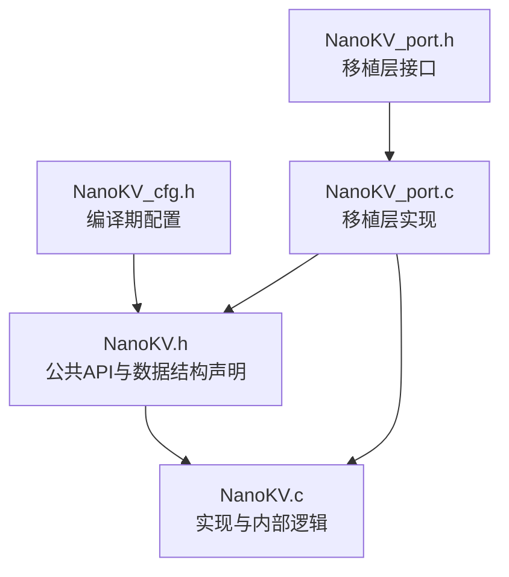
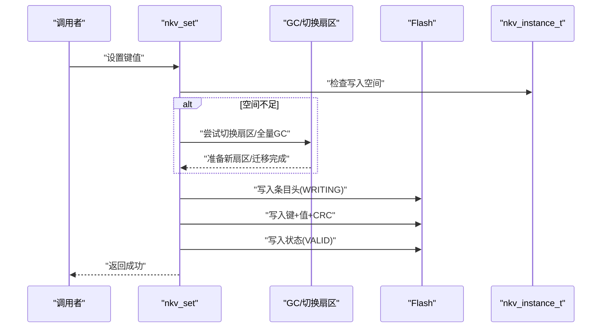
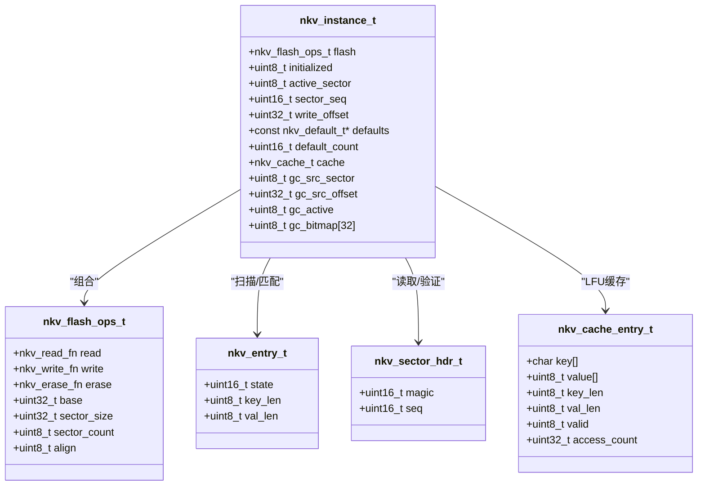
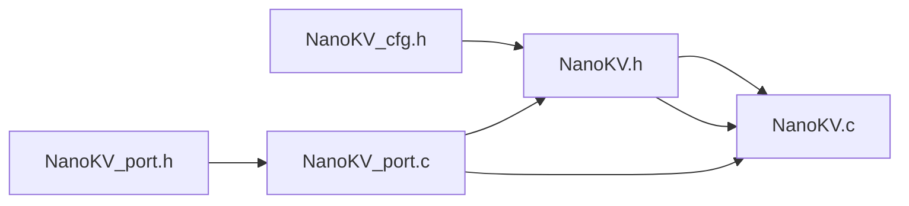

# 数据结构设计

<cite>
**本文引用的文件**
- [NanoKV.h](file://NanoKV.h)
- [NanoKV.c](file://NanoKV.c)
- [NanoKV_cfg.h](file://NanoKV_cfg.h)
- [NanoKV_port.h](file://NanoKV_port.h)
- [NanoKV_port.c](file://NanoKV_port.c)
</cite>

## 更新摘要
**变更内容**
- 完全替换MicroKV实现为全新的NanoKV架构
- 更新所有数据结构定义和内存布局
- 重新设计条目头结构和扇区头结构
- 新增TLV扩展功能和保留策略
- 改进缓存机制和垃圾回收策略
- 更新API接口和配置选项

## 目录
1. [简介](#简介)
2. [项目结构](#项目结构)
3. [核心组件](#核心组件)
4. [架构总览](#架构总览)
5. [详细组件分析](#详细组件分析)
6. [依赖关系分析](#依赖关系分析)
7. [性能考量](#性能考量)
8. [故障排查指南](#故障排查指南)
9. [结论](#结论)
10. [附录](#附录)

## 简介
本文件聚焦NanoKV的数据结构设计，系统阐述核心数据结构的内存布局、字段含义、数据包格式（扇区头、条目头、键值对存储格式与TLV格式）、内存对齐与打包策略、序列化与反序列化流程、内存使用分析与优化建议、结构间关系与引用模式、演进历史与设计权衡，并提供调试与诊断工具使用方法。NanoKV是一个全新的轻量级嵌入式KV/TLV存储库，相比MicroKV进行了全面重构，在数据结构设计、性能优化和功能扩展方面都有显著改进。

## 项目结构
NanoKV采用"头文件声明 + 单一实现文件 + 配置头 + 移植层"的组织方式，便于在不同平台移植与配置。整个实现围绕nkv_instance_t主实例展开，通过统一的API接口管理Flash存储和数据访问。



**图表来源**
- [NanoKV.h](file://NanoKV.h#L1-L269)
- [NanoKV.c](file://NanoKV.c#L1-L1502)
- [NanoKV_cfg.h](file://NanoKV_cfg.h#L1-L92)
- [NanoKV_port.h](file://NanoKV_port.h#L1-L27)
- [NanoKV_port.c](file://NanoKV_port.c#L1-L95)

**章节来源**
- [NanoKV.h](file://NanoKV.h#L1-L269)
- [NanoKV.c](file://NanoKV.c#L1-L1502)
- [NanoKV_cfg.h](file://NanoKV_cfg.h#L1-L92)
- [NanoKV_port.h](file://NanoKV_port.h#L1-L27)
- [NanoKV_port.c](file://NanoKV_port.c#L1-L95)

## 核心组件
本节从数据结构视角梳理关键结构体及其职责边界，重点覆盖：
- nkv_instance_t：主实例，承载Flash配置、当前活动扇区、写入偏移、增量GC状态、默认值表指针、缓存等
- nkv_entry_t：KV条目头，描述状态、键长、值长
- nkv_sector_hdr_t：扇区头，魔数与序号
- nkv_cache_entry_t：缓存条目，LFU热点缓存
- TLV相关结构：nkv_tlv_entry_t、nkv_tlv_iter_t、nkv_tlv_history_t等

**章节来源**
- [NanoKV.h](file://NanoKV.h#L57-L143)
- [NanoKV.h](file://NanoKV.h#L188-L266)

## 架构总览
NanoKV以"多扇区环形 + 追加写入 + 状态机 + CRC校验"为核心，通过nkv_instance_t统一管理Flash布局与运行态；KV与TLV共享同一物理布局，KV以键值对形式存储，TLV以类型-长度-值形式存储，二者均遵循相同的条目头与CRC策略。新增的TLV保留策略允许对特定类型的TLV数据进行保留控制。

```mermaid
graph TB
subgraph "存储介质"
S["Flash 扇区"]
end
subgraph "运行时实例"
I["nkv_instance_t<br/>active_sector/sector_seq/write_offset<br/>defaults/cache/gc_state"]
end
subgraph "数据包格式"
SH["扇区头 nkv_sector_hdr_t"]
EH["条目头 nkv_entry_t"]
KV["KV 数据段<br/>键 + 值 + CRC"]
TLV["TLV 数据段<br/>类型 + 值 + CRC"]
RET["TLV 保留策略<br/>keep_newest/count"]
END
S --> SH
S --> EH
EH --> KV
EH --> TLV
I --> S
I --> RET
```

**图表来源**
- [NanoKV.h](file://NanoKV.h#L57-L70)
- [NanoKV.h](file://NanoKV.h#L125-L143)
- [NanoKV.c](file://NanoKV.c#L251-L420)

## 详细组件分析

### nkv_instance_t：主实例结构
- 字段与职责
  - flash：Flash操作回调与基础参数（基址、扇区大小、扇区数、对齐）
  - initialized：初始化标志
  - active_sector、sector_seq、write_offset：当前活动扇区、扇区序号、写入偏移
  - defaults/default_count：默认值表指针与数量
  - cache：可选LFU缓存
  - 增量GC相关：gc_src_sector/gc_src_offset/gc_active/gc_bitmap
- 内存布局要点
  - 结构体整体按紧凑打包（无显式__attribute__((packed))），但字段本身为基本类型，通常由编译器按ABI对齐
  - 与Flash布局解耦，通过flash.base/sector_size/sector_count间接映射
- 关系与引用
  - 作为全局静态实例，贯穿所有API调用
  - 与nkv_flash_ops_t形成组合关系，依赖其读写擦除能力

**章节来源**
- [NanoKV.h](file://NanoKV.h#L125-L143)
- [NanoKV.c](file://NanoKV.c#L21-L21)

### nkv_entry_t：KV条目头
- 字段与含义
  - state：状态（ERASED/WRITE/VALID/PRE_DEL/DELETED）
  - key_len：键长度（字节）
  - val_len：值长度（字节）
- 数据包格式
  - KV条目布局：[条目头 | 键 | 值 | CRC]
  - TLV条目布局：[条目头 | 类型 | 值 | CRC]（键长为0）
- 对齐与大小
  - 条目头固定大小，键值数据紧随其后，末尾附加CRC
  - 整体大小按Flash对齐要求进行对齐

**章节来源**
- [NanoKV.h](file://NanoKV.h#L64-L70)
- [NanoKV.c](file://NanoKV.c#L223-L250)

### nkv_sector_hdr_t：扇区头
- 字段与含义
  - magic：魔数，标识扇区有效性
  - seq：扇区序号，用于确定活动扇区与环形遍历顺序
- 作用
  - 扇区扫描与恢复时识别有效扇区
  - 作为多扇区环形管理的基础

**章节来源**
- [NanoKV.h](file://NanoKV.h#L57-L62)
- [NanoKV.c](file://NanoKV.c#L252-L265)

### nkv_cache_entry_t：缓存条目
- 字段与含义
  - key/value/key_len/val_len：缓存键与值及长度
  - valid：有效位
  - access_count：LFU访问计数
- LFU替换策略
  - 未命中时选择access_count最小的条目进行替换
  - 命中时递增access_count

**章节来源**
- [NanoKV.h](file://NanoKV.h#L98-L122)
- [NanoKV.c](file://NanoKV.c#L126-L208)

### TLV相关结构
- nkv_tlv_entry_t：迭代器返回的TLV条目信息（类型、长度、Flash地址）
- nkv_tlv_iter_t：迭代器状态（扇区索引、偏移、完成标志）
- nkv_tlv_history_t：历史记录（类型、长度、Flash地址、写入顺序）
- nkv_tlv_default_t：TLV默认值（类型、值、长度）
- TLV保留策略：支持保留最新的N个条目

**章节来源**
- [NanoKV.h](file://NanoKV.h#L188-L266)
- [NanoKV.c](file://NanoKV.c#L1178-L1502)

### 数据包格式与TLV格式
- 扇区头
  - 固定大小，包含魔数与序号
- 条目头
  - 固定大小，包含状态、键长、值长
- 键值对存储格式（KV）
  - [条目头 | 键 | 值 | CRC]
  - 键长与值长来自条目头，键与值紧随条目头，末尾附加CRC
- TLV存储格式
  - [条目头 | 类型 | 值 | CRC]
  - 键长为0，类型占首字节，值紧随类型，末尾附加CRC
- CRC校验
  - 使用CRC16（MODBUS）校验键值或类型+值

**章节来源**
- [NanoKV.h](file://NanoKV.h#L34-L42)
- [NanoKV.c](file://NanoKV.c#L58-L70)
- [NanoKV.c](file://NanoKV.c#L1202-L1248)

### 内存对齐与打包策略
- 结构体打包
  - nkv_sector_hdr_t、nkv_entry_t明确使用紧凑打包（packed）
  - nkv_instance_t未使用packed，遵循ABI默认对齐
- 对齐计算
  - ENTRY_SIZE宏基于条目头大小、键长、值长与CRC大小，再按Flash对齐要求向上取整
  - ALIGN宏按flash.align对条目大小进行对齐
- 对齐要求
  - 移植层配置中对齐字节数为2或4，确保Flash读写一致性

**章节来源**
- [NanoKV.h](file://NanoKV.h#L25-L31)
- [NanoKV.h](file://NanoKV.h#L57-L70)
- [NanoKV.c](file://NanoKV.c#L27-L32)
- [NanoKV_port.c](file://NanoKV_port.c#L43-L51)

### 序列化与反序列化过程
- 写入流程（KV）
  1) 计算条目大小并按对齐要求对齐
  2) 写入条目头（状态=WRITING）
  3) 写入键与值
  4) 计算CRC并写入
  5) 将状态标记为VALID
  6) 更新写入偏移
- 读取流程（KV）
  1) 扫描所有扇区，定位最新有效条目
  2) 读取键值数据至缓冲区
  3) 可选：更新缓存
- TLV写入/读取
  - TLV通过设置空键并以类型作为首字节的方式复用KV写入路径
  - 读取时跳过类型字节，仅返回值部分



**图表来源**
- [NanoKV.c](file://NanoKV.c#L843-L932)
- [NanoKV.c](file://NanoKV.c#L865-L882)

**章节来源**
- [NanoKV.c](file://NanoKV.c#L843-L932)
- [NanoKV.c](file://NanoKV.c#L934-L991)
- [NanoKV.c](file://NanoKV.c#L1202-L1248)

### 内存使用分析与优化建议
- 使用率统计
  - 已用空间：当前写入偏移之和
  - 总空间：扇区数 × 扇区大小
- 空间浪费来源
  - 对齐填充：ENTRY_SIZE按对齐要求对齐
  - ERASED状态：扫描终止条件之一
- 优化建议
  - 合理设置NKV_MAX_KEY_LEN与NKV_MAX_VALUE_LEN，避免过大导致对齐浪费
  - 启用增量GC并在写入后分步迁移，降低峰值内存占用
  - 启用LFU缓存以减少重复读取带来的Flash访问次数

**章节来源**
- [NanoKV.c](file://NanoKV.c#L1010-L1016)
- [NanoKV_cfg.h](file://NanoKV_cfg.h#L10-L28)
- [NanoKV.c](file://NanoKV.c#L497-L590)

### 不同数据结构之间的关系与引用模式
- nkv_instance_t持有nkv_flash_ops_t，依赖其读写擦除能力
- KV与TLV共享同一物理布局，通过条目头的key_len区分KV（>0）与TLV（==0）
- 增量GC使用位图加速键去重，避免重复迁移
- 缓存与实例强关联，命中时直接返回缓存内容
- TLV保留策略独立管理，不影响KV存储



**图表来源**
- [NanoKV.h](file://NanoKV.h#L86-L143)
- [NanoKV.h](file://NanoKV.h#L57-L70)
- [NanoKV.h](file://NanoKV.h#L98-L122)

**章节来源**
- [NanoKV.h](file://NanoKV.h#L86-L143)
- [NanoKV.h](file://NanoKV.h#L57-L70)
- [NanoKV.h](file://NanoKV.h#L98-L122)

### 数据结构演进历史与设计权衡
- 版本与特性
  - 当前版本3.0，强调追加写入、多扇区环形、掉电安全、LFU缓存、增量GC、默认值支持、TLV扩展
- 设计权衡
  - 追加写入 vs 空间利用率：通过GC与对齐策略平衡
  - 状态机（WRITING→VALID）vs 写入延迟：先写入再标记，保证掉电安全
  - LFU缓存 vs 内存占用：可配置缓存大小，权衡命中率与内存
  - 增量GC vs 全量GC：在实时系统中避免长时间阻塞
  - TLV保留策略 vs 存储空间：可配置保留数量，平衡数据完整性与空间利用

**章节来源**
- [NanoKV.h](file://NanoKV.h#L1-L14)
- [NanoKV.c](file://NanoKV.c#L497-L590)

### 调试与诊断工具
- 日志与打印
  - 通过NKV_DEBUG_ENABLE控制日志输出，提供信息与错误级别日志
  - 初始化时打印Flash容量、使用率、缓存配置等
- 统计与查询
  - nkv_get_usage：获取已用/总空间
  - nkv_cache_stats：获取缓存命中/未命中次数与命中率
  - nkv_tlv_stats：统计TLV条目数量与占用空间
  - nkv_gc_active：查询GC是否处于活跃状态

**章节来源**
- [NanoKV_cfg.h](file://NanoKV_cfg.h#L34-L70)
- [NanoKV_port.c](file://NanoKV_port.c#L54-L87)
- [NanoKV.c](file://NanoKV.c#L1010-L1016)
- [NanoKV.c](file://NanoKV.c#L1040-L1055)
- [NanoKV.c](file://NanoKV.c#L1375-L1395)
- [NanoKV.c](file://NanoKV.c#L1034-L1037)

## 依赖关系分析
- 头文件依赖
  - NanoKV.c包含NanoKV.h，使用公共API与数据结构
  - NanoKV_port.c包含NanoKV.h与NanoKV_port.h，提供移植层实现
- 配置依赖
  - NanoKV.h依赖NanoKV_cfg.h提供的编译期配置
- 运行时依赖
  - nkv_instance_t依赖nkv_flash_ops_t提供的Flash操作回调



**图表来源**
- [NanoKV.h](file://NanoKV.h#L19-L20)
- [NanoKV.c](file://NanoKV.c#L16-L18)
- [NanoKV_port.c](file://NanoKV_port.c#L7-L9)

**章节来源**
- [NanoKV.h](file://NanoKV.h#L19-L20)
- [NanoKV.c](file://NanoKV.c#L16-L18)
- [NanoKV_port.c](file://NanoKV_port.c#L7-L9)

## 性能考量
- 读取性能
  - 启用LFU缓存可显著降低重复读取的Flash访问次数
  - 增量GC避免全量扫描带来的阻塞
- 写入性能
  - 追加写入避免擦除，减少写放大
  - 对齐填充带来额外空间开销，需结合键值长度合理规划
- 内存占用
  - 缓存条目数量与键值长度直接影响内存占用
  - 增量GC的位图与临时缓冲区占用有限，但需考虑峰值内存
- TLV性能
  - TLV保留策略增加少量内存开销，但提高数据完整性
  - TLV历史记录功能需要额外的排序和存储空间

## 故障排查指南
- 初始化失败
  - 检查nkv_internal_init参数合法性与Flash回调实现
  - 确认扇区数≥2、对齐值为2或4
- 扫描/恢复异常
  - 确认扇区魔数与序号正确，必要时执行格式化
- 写入失败
  - 检查空间是否充足，确认GC是否正常工作
  - 校验CRC与对齐策略
- 读取不到数据
  - 确认键存在且值长度>0
  - 检查缓存是否命中，必要时清空缓存重试
- TLV问题
  - 确认类型非0，值长度合法
  - 使用迭代器遍历验证数据存在性
- TLV保留策略问题
  - 检查保留策略配置是否正确
  - 确认保留数量不超过限制

**章节来源**
- [NanoKV.c](file://NanoKV.c#L739-L758)
- [NanoKV.c](file://NanoKV.c#L760-L802)
- [NanoKV.c](file://NanoKV.c#L843-L932)
- [NanoKV.c](file://NanoKV.c#L934-L991)
- [NanoKV.c](file://NanoKV.c#L1202-L1248)

## 结论
NanoKV通过紧凑的条目头、统一的KV/TLV布局与状态机保护，实现了在嵌入式Flash上的高效、可靠KV/TLV存储。相比MicroKV，NanoKV在数据结构设计、性能优化、功能扩展等方面都有显著改进，特别是新增的TLV扩展功能、保留策略和增强的可靠性特性。其设计在空间利用率、写入寿命、实时性与易用性之间取得良好平衡。理解本文所述数据结构与流程有助于正确配置与使用该库，并在出现异常时快速定位问题。

## 附录

### 字段说明表

- nkv_sector_hdr_t
  - 字段：magic（魔数）、seq（序号）
  - 用途：标识扇区有效性与顺序
  - 大小：固定

- nkv_entry_t
  - 字段：state（状态）、key_len（键长）、val_len（值长）
  - 用途：描述KV/TLV条目的元信息
  - 大小：固定

- nkv_instance_t
  - 字段：flash、initialized、active_sector、sector_seq、write_offset、defaults、default_count、cache、gc_*等
  - 用途：运行时状态与配置聚合
  - 大小：由字段决定，遵循ABI对齐

- nkv_cache_entry_t
  - 字段：key[]、value[]、key_len、val_len、valid、access_count
  - 用途：LFU热点缓存
  - 大小：由配置决定

- TLV相关
  - nkv_tlv_entry_t：type、len、flash_addr
  - nkv_tlv_iter_t：sector_idx、sector_offset、finished
  - nkv_tlv_history_t：type、len、flash_addr、write_order
  - nkv_tlv_default_t：type、value、len
  - tlv_retention_t：type、keep_count

**章节来源**
- [NanoKV.h](file://NanoKV.h#L57-L70)
- [NanoKV.h](file://NanoKV.h#L125-L143)
- [NanoKV.h](file://NanoKV.h#L98-L122)
- [NanoKV.h](file://NanoKV.h#L188-L266)

### 内存布局图

- 扇区头布局
  - [魔数(2B) | 序号(2B)]

- 条目头布局
  - [状态(2B) | 键长(1B) | 值长(1B)]

- KV条目布局
  - [条目头 | 键 | 值 | CRC]

- TLV条目布局
  - [条目头 | 类型 | 值 | CRC]

- TLV保留策略布局
  - [保留策略表 | 保留信息表]

**章节来源**
- [NanoKV.h](file://NanoKV.h#L57-L70)
- [NanoKV.h](file://NanoKV.h#L64-L70)
- [NanoKV.c](file://NanoKV.c#L1202-L1248)
- [NanoKV.c](file://NanoKV.c#L35-L52)