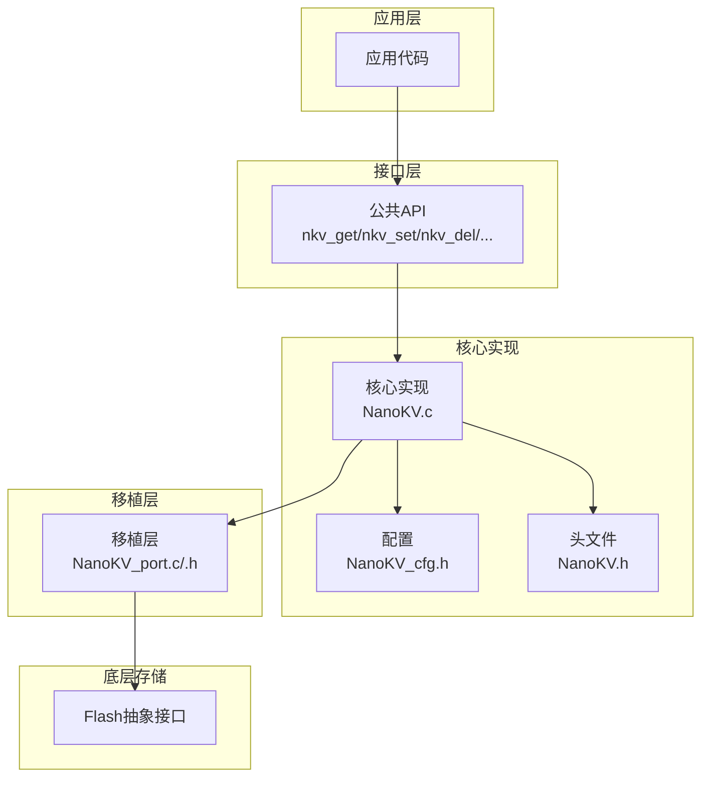
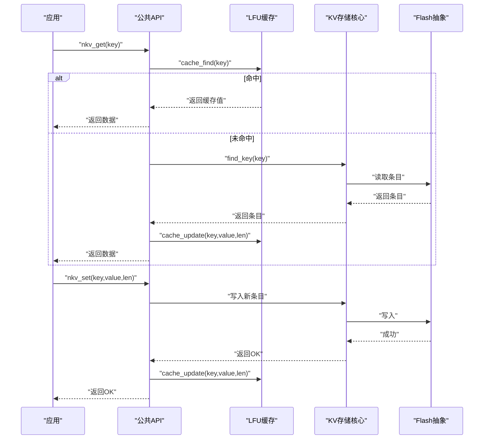
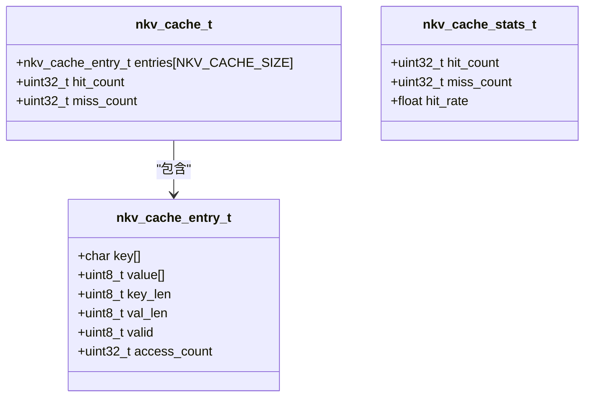
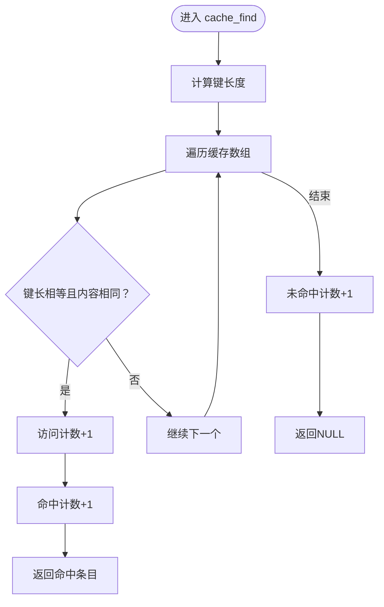
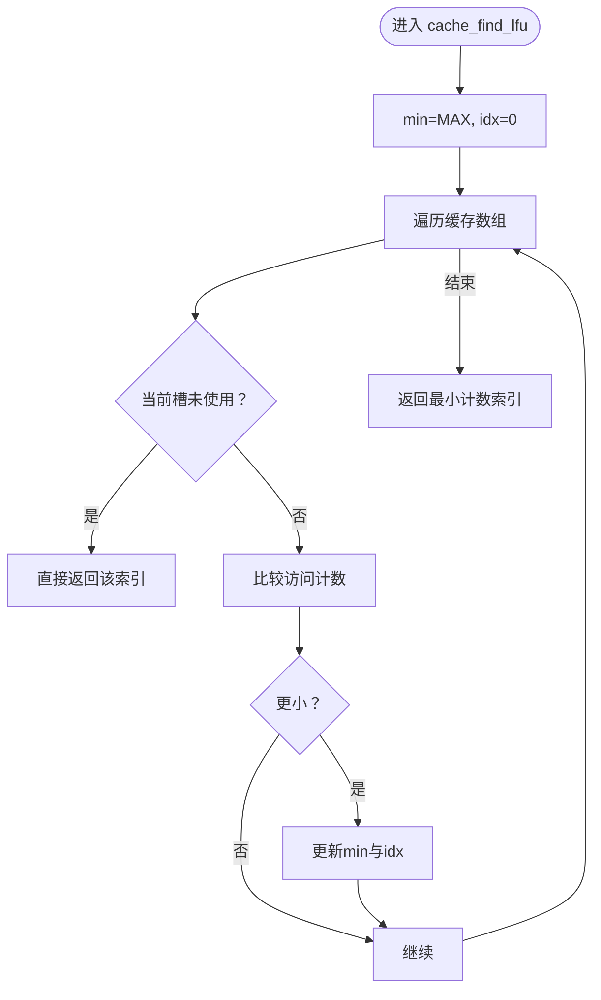
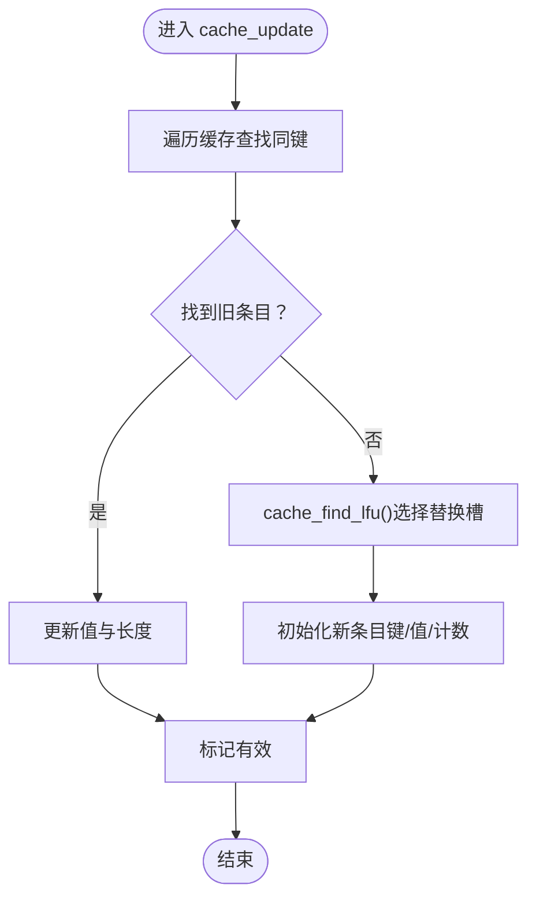
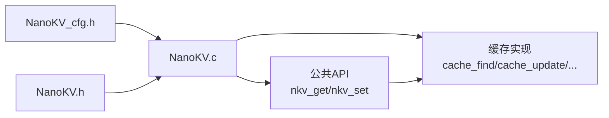

# LFU缓存算法

<cite>
**本文引用的文件**
- [NanoKV.c](file://NanoKV.c)
- [NanoKV.h](file://NanoKV.h)
- [NanoKV_cfg.h](file://NanoKV_cfg.h)
- [NanoKV_port.c](file://NanoKV_port.c)
- [NanoKV_port.h](file://NanoKV_port.h)
</cite>

## 目录
1. [简介](#简介)
2. [项目结构](#项目结构)
3. [核心组件](#核心组件)
4. [架构总览](#架构总览)
5. [详细组件分析](#详细组件分析)
6. [依赖关系分析](#依赖关系分析)
7. [性能考量](#性能考量)
8. [故障排查指南](#故障排查指南)
9. [结论](#结论)
10. [附录](#附录)

## 简介
本文件聚焦NanoKV中的LFU（Least Frequently Used）缓存算法实现，系统性解析缓存条目结构、访问计数机制、替换策略，以及在nkv_get()与nkv_set()中的应用。同时提供命中率统计、缓存大小配置、时间复杂度与内存使用效率评估、性能优化建议与调优实践，帮助读者在资源受限的嵌入式环境中高效使用LFU缓存。

## 项目结构
NanoKV采用模块化设计，核心逻辑集中在单文件实现中，配合少量配置头文件与移植层接口，形成“核心实现 + 配置 + 移植”的清晰分层。

图表来源
- [NanoKV.c](file://NanoKV.c#L628-L763)
- [NanoKV.h](file://NanoKV.h#L133-L168)
- [NanoKV_cfg.h](file://NanoKV_cfg.h#L10-L26)
- [NanoKV_port.c](file://NanoKV_port.c#L54-L88)

章节来源
- [NanoKV.c](file://NanoKV.c#L1-L1261)
- [NanoKV.h](file://NanoKV.h#L1-L257)
- [NanoKV_cfg.h](file://NanoKV_cfg.h#L1-L51)
- [NanoKV_port.c](file://NanoKV_port.c#L1-L95)
- [NanoKV_port.h](file://NanoKV_port.h#L1-L27)

## 核心组件
- 缓存条目结构：键、值、键长、值长、有效性标志、访问计数。
- 缓存容器：固定大小数组，按LRU风格的LFU替换。
- 访问计数：每次命中即自增，作为LFU替换依据。
- 替换策略：扫描缓存表，选择访问计数最小者进行替换；若存在空槽直接使用。
- 命中率统计：累计命中与未命中次数，计算命中率百分比。
- 在API中的应用：nkv_get()优先从缓存命中，未命中再落盘查询；nkv_set()写入后更新缓存。

章节来源
- [NanoKV.h](file://NanoKV.h#L85-L110)
- [NanoKV.c](file://NanoKV.c#L87-L169)
- [NanoKV.c](file://NanoKV.c#L695-L798)

## 架构总览
LFU缓存与KV存储核心流程如下：

图表来源
- [NanoKV.c](file://NanoKV.c#L695-L798)
- [NanoKV.c](file://NanoKV.c#L87-L169)

## 详细组件分析

### 缓存条目与容器结构
- 条目字段：键缓冲、值缓冲、键长、值长、有效性标志、访问计数。
- 容器字段：条目数组、命中计数、未命中计数。
- 命中率统计：通过累计命中与未命中计算百分比。

图表来源
- [NanoKV.h](file://NanoKV.h#L85-L110)

章节来源
- [NanoKV.h](file://NanoKV.h#L85-L110)

### cache_find() 实现逻辑
- 输入：键字符串。
- 行为：遍历缓存数组，比较键长与内容；命中则访问计数+1并增加命中计数，返回条目；否则增加未命中计数，返回空。
- 时间复杂度：O(K)（K为NKV_CACHE_SIZE），空间复杂度：O(1)。

图表来源
- [NanoKV.c](file://NanoKV.c#L89-L104)

章节来源
- [NanoKV.c](file://NanoKV.c#L89-L104)

### cache_find_lfu() 实现逻辑
- 输入：无。
- 行为：扫描缓存数组，优先返回未使用的槽位；否则返回访问计数最小的条目索引。
- 时间复杂度：O(K)（K为NKV_CACHE_SIZE），空间复杂度：O(1)。

图表来源
- [NanoKV.c](file://NanoKV.c#L107-L122)

章节来源
- [NanoKV.c](file://NanoKV.c#L107-L122)

### cache_update() 实现逻辑
- 输入：键、值指针、长度。
- 行为：先尝试在缓存中更新已有条目；若不存在则使用LFU策略选择替换目标，写入新键与值，设置有效性与访问计数。
- 时间复杂度：查找O(K)+LFU扫描O(K)=O(K)，空间复杂度：O(1)。

图表来源
- [NanoKV.c](file://NanoKV.c#L125-L153)

章节来源
- [NanoKV.c](file://NanoKV.c#L125-L153)

### cache_remove() 实现逻辑
- 输入：键字符串。
- 行为：遍历缓存数组，定位同键条目并清除有效性标志。
- 时间复杂度：O(K)，空间复杂度：O(1)。

章节来源
- [NanoKV.c](file://NanoKV.c#L156-L168)

### 命中率统计与缓存清空
- 命中率：累计命中/（命中+未命中）×100%。
- 清空：重置缓存容器与计数。

章节来源
- [NanoKV.c](file://NanoKV.c#L848-L862)

### 在nkv_get()中的应用
- 优先从缓存命中；命中则直接拷贝返回。
- 未命中则在存储中查找并读取，随后更新缓存。
- 返回值长度受传入缓冲区大小限制。

章节来源
- [NanoKV.c](file://NanoKV.c#L765-L798)

### 在nkv_set()中的应用
- 写入新条目后，若启用缓存则立即更新缓存。
- 与增量GC协同，在写入后可能触发增量GC步骤。

章节来源
- [NanoKV.c](file://NanoKV.c#L695-L763)

## 依赖关系分析
- 缓存实现依赖配置头文件中的缓存开关与容量。
- 缓存API依赖核心实例中的缓存容器与统计字段。
- nkv_get/nkv_set依赖缓存实现以加速读写路径。

图表来源
- [NanoKV_cfg.h](file://NanoKV_cfg.h#L14-L16)
- [NanoKV.h](file://NanoKV.h#L133-L168)
- [NanoKV.c](file://NanoKV.c#L87-L169)

章节来源
- [NanoKV_cfg.h](file://NanoKV_cfg.h#L10-L26)
- [NanoKV.h](file://NanoKV.h#L133-L168)
- [NanoKV.c](file://NanoKV.c#L87-L169)

## 性能考量

### 时间复杂度
- cache_find()：O(K)
- cache_find_lfu()：O(K)
- cache_update()：O(K)
- cache_remove()：O(K)
- nkv_get()：平均O(K)，最坏O(K)；命中时常数时间。
- nkv_set()：平均O(K)，最坏O(K)；命中时常数时间。

说明：K为NKV_CACHE_SIZE，LFU扫描线性遍历缓存数组，整体为线性复杂度。

### 空间复杂度
- 单条目：键缓冲+NKV_MAX_KEY_LEN + 值缓冲+NKV_MAX_VALUE_LEN + 元数据（键长、值长、有效性、访问计数）。
- 缓存总空间：K × 单条目空间 + 容器元数据。
- 访问计数为32位整型，占用4字节；命中/未命中计数为32位整型，占用4字节。

### 内存使用效率
- 缓存条目紧凑存放于连续数组，局部性良好。
- 访问计数与命中统计仅占少量额外字节，收益显著。
- 若NKV_MAX_KEY_LEN/NKV_MAX_VALUE_LEN较大，需权衡缓存容量与内存占用。

### 性能优化建议
- 合理设置NKV_CACHE_SIZE：在命中率与内存占用之间平衡。对于热点键数量有限的场景，较小的K即可获得较高命中率。
- 控制键与值的最大长度：降低单条目内存占用，提高缓存命中率与吞吐。
- 使用增量GC：在写入后分步执行GC，避免长时间阻塞，间接提升缓存可用性。
- 命中率监控：通过nkv_cache_stats()观察命中率，动态调整K或键分布。

## 故障排查指南
- 命中率低
  - 检查NKV_CACHE_SIZE是否过小，导致频繁LFU替换。
  - 检查键分布是否过于分散，热点不明显。
  - 使用nkv_cache_stats()确认命中/未命中计数。
- 缓存未生效
  - 确认NKV_CACHE_ENABLE已启用。
  - 确认NKV_CACHE_SIZE大于0。
- 写入后读取仍未命中
  - 检查nkv_set()是否正确调用cache_update()。
  - 检查键是否一致（大小写、长度）。
- 内存占用异常
  - 检查NKV_MAX_KEY_LEN与NKV_MAX_VALUE_LEN配置。
  - 评估K与单条目大小的乘积是否超出可用RAM。

章节来源
- [NanoKV_cfg.h](file://NanoKV_cfg.h#L14-L16)
- [NanoKV.c](file://NanoKV.c#L848-L862)
- [NanoKV.c](file://NanoKV.c#L695-L763)

## 结论
NanoKV的LFU缓存以简单高效的线性扫描实现，结合访问计数与命中统计，为热点数据提供快速读取通道。通过合理配置NKV_CACHE_SIZE与键值长度、配合增量GC与命中率监控，可在资源受限的嵌入式环境中获得稳定且可观的性能收益。建议在实际部署中基于业务特征进行调优，持续观测命中率与内存占用，确保系统在可靠性与性能之间取得最佳平衡。

## 附录

### 缓存配置参数与调优建议
- NKV_CACHE_ENABLE：控制是否启用LFU缓存。建议在读多写少场景启用。
- NKV_CACHE_SIZE：缓存条目数量。建议从4起步，逐步增大至命中率趋于饱和。
- NKV_MAX_KEY_LEN / NKV_MAX_VALUE_LEN：影响单条目内存占用与缓存容量上限。建议根据业务需求设定，避免过大导致内存压力。
- NKV_INCREMENTAL_GC / NKV_GC_ENTRIES_PER_WRITE / NKV_GC_THRESHOLD_PERCENT：与缓存协同工作，保证存储空间与缓存可用性。

章节来源
- [NanoKV_cfg.h](file://NanoKV_cfg.h#L10-L26)

### LFU算法在nkv_get()/nkv_set()中的具体应用
- nkv_get()：优先cache_find()命中；未命中则落盘查找并cache_update()。
- nkv_set()：写入成功后cache_update()，使新写入的键值尽快进入缓存。

章节来源
- [NanoKV.c](file://NanoKV.c#L695-L798)
- [NanoKV.c](file://NanoKV.c#L800-L806)