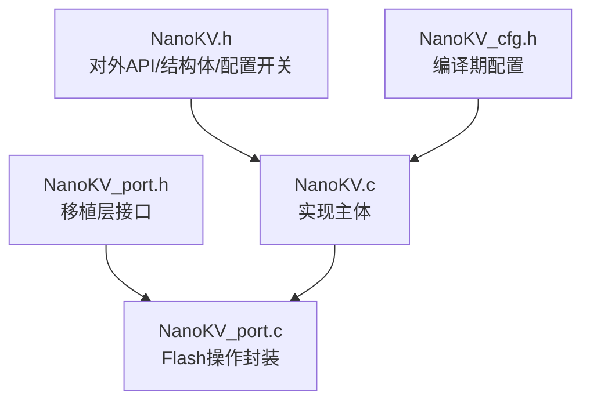
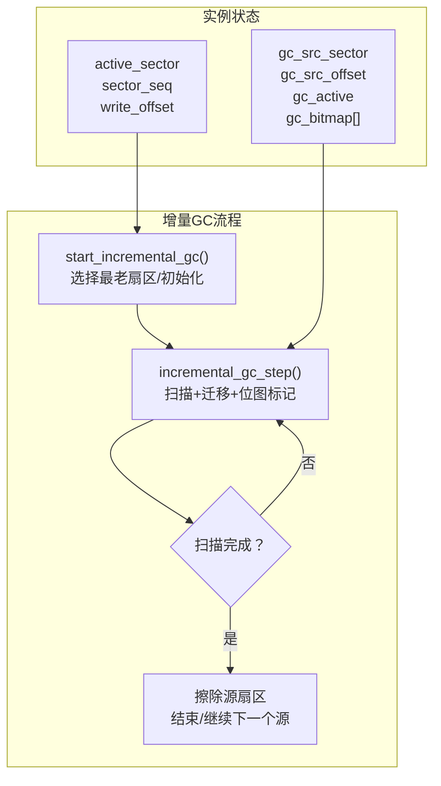
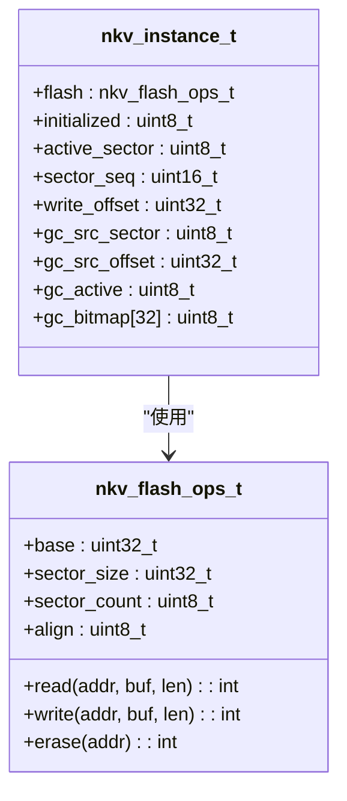
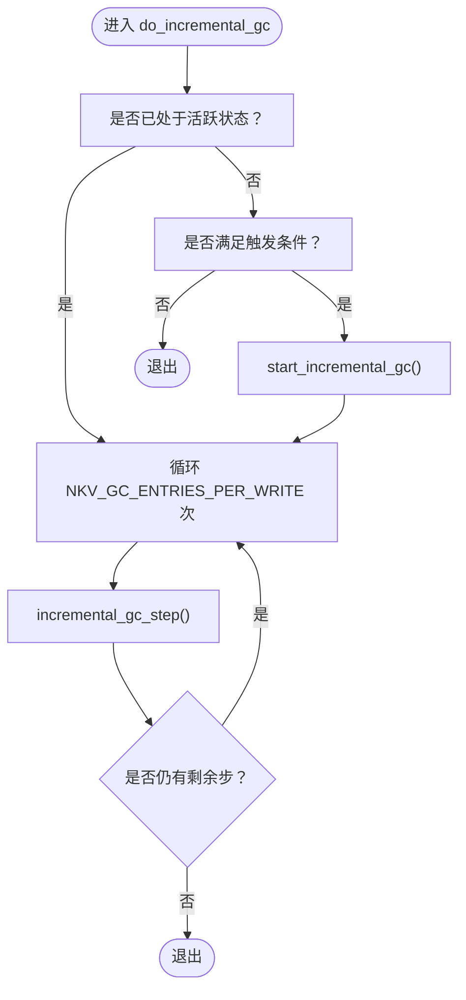
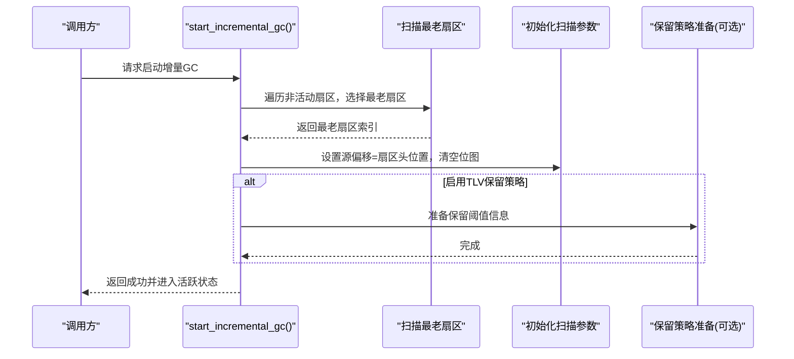
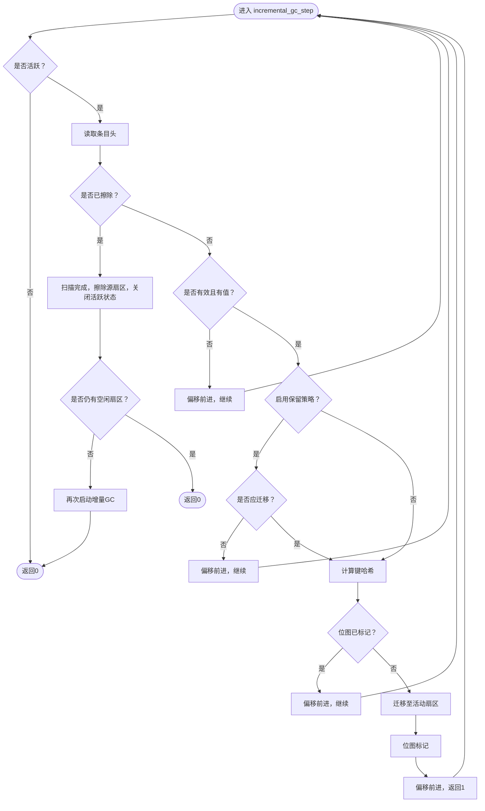
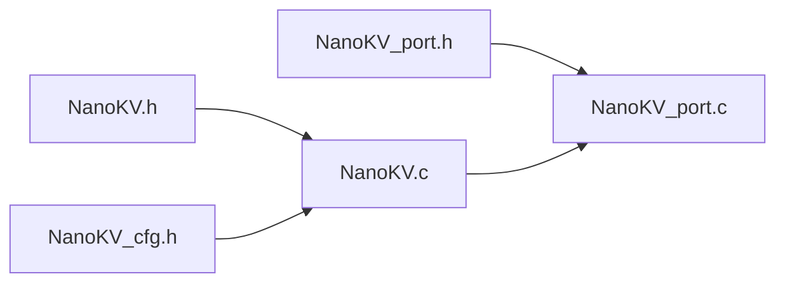

# 增量垃圾回收策略

<cite>
**本文引用的文件**
- [NanoKV.h](file://NanoKV.h)
- [NanoKV.c](file://NanoKV.c)
- [NanoKV_cfg.h](file://NanoKV_cfg.h)
- [NanoKV_port.h](file://NanoKV_port.h)
- [NanoKV_port.c](file://NanoKV_port.c)
</cite>

## 目录
1. [简介](#简介)
2. [项目结构](#项目结构)
3. [核心组件](#核心组件)
4. [架构总览](#架构总览)
5. [详细组件分析](#详细组件分析)
6. [依赖关系分析](#依赖关系分析)
7. [性能考量](#性能考量)
8. [故障排查指南](#故障排查指南)
9. [结论](#结论)
10. [附录](#附录)

## 简介
本文件围绕 NanoKV 的增量垃圾回收（Incremental GC）策略进行系统化技术说明，重点阐述其设计理念、实现机制与工程实践要点。增量 GC 通过“分摊”方式将全量 GC 的高成本拆解到多次小步操作中，显著降低单次写入或维护操作的停顿时间，特别适用于实时系统与嵌入式场景。本文将深入解析 do_incremental_gc()、start_incremental_gc()、incremental_gc_step() 的工作流程，解释 GC 状态管理、进度跟踪与资源分配策略，并对比增量 GC 与全量 GC 的优劣及在多扇区环境下的协调机制。

## 项目结构
仓库采用极简设计，核心文件如下：
- NanoKV.h：对外 API、内部结构体、配置开关与增量 GC 导出接口声明
- NanoKV.c：实现主体，包含扇区扫描、条目迁移、全量/增量 GC、KV/TLV API、缓存等
- NanoKV_cfg.h：编译期配置，含增量 GC 相关参数
- NanoKV_port.h / NanoKV_port.c：移植层接口与 Flash 操作封装示例

图表来源
- [NanoKV.h](file://NanoKV.h#L113-L162)
- [NanoKV.c](file://NanoKV.c#L1-L50)
- [NanoKV_cfg.h](file://NanoKV_cfg.h#L1-L51)
- [NanoKV_port.h](file://NanoKV_port.h#L1-L27)
- [NanoKV_port.c](file://NanoKV_port.c#L1-L95)

章节来源
- [NanoKV.h](file://NanoKV.h#L1-L257)
- [NanoKV.c](file://NanoKV.c#L1-L1261)
- [NanoKV_cfg.h](file://NanoKV_cfg.h#L1-L51)
- [NanoKV_port.h](file://NanoKV_port.h#L1-L27)
- [NanoKV_port.c](file://NanoKV_port.c#L1-L95)

## 核心组件
- 增量 GC 结构体字段
  - 源扇区索引与偏移：用于记录当前扫描位置
  - 活跃标志：指示是否处于增量 GC 中
  - 位图：按键哈希分桶标记，避免重复迁移同一键
- 关键函数族
  - start_incremental_gc()：选择最老非活动扇区作为源，初始化扫描起点与位图
  - incremental_gc_step()：单步扫描并迁移有效键值，返回是否继续
  - do_incremental_gc()：在每次写入后按配置批量推进增量 GC
  - nkv_gc_step()/nkv_gc_active()：用户态手动步进与查询状态
- 配置参数
  - 是否启用增量 GC
  - 每次写入后迁移条目数
  - 触发阈值（使用率百分比）

章节来源
- [NanoKV.h](file://NanoKV.h#L113-L131)
- [NanoKV.h](file://NanoKV.h#L158-L162)
- [NanoKV_cfg.h](file://NanoKV_cfg.h#L18-L22)
- [NanoKV.c](file://NanoKV.c#L509-L624)
- [NanoKV.c](file://NanoKV.c#L825-L845)

## 架构总览
增量 GC 的运行时架构围绕“扇区-条目-位图”的三元组展开：从最老的非活动扇区开始扫描，逐条检查有效性与键冲突，利用位图去重，将有效且最新的键迁移到当前活动扇区，最终擦除源扇区并可能继续处理下一个源扇区。

图表来源
- [NanoKV.h](file://NanoKV.h#L113-L131)
- [NanoKV.c](file://NanoKV.c#L509-L624)

## 详细组件分析

### 增量 GC 数据模型与状态管理
- 实例结构体中的 GC 字段
  - 源扇区索引与偏移：记录当前扫描位置，支持断点续扫
  - 活跃标志：防止并发启动多个增量 GC
  - 位图：每 256 个键按 32 字节存储，按哈希桶去重
- 触发条件
  - 当可用空闲扇区少于阈值时启动增量 GC；若无可用扇区则优先进行增量 GC
- 进度跟踪
  - 通过源扇区偏移推进扫描进度
  - 通过位图避免重复迁移相同键
- 资源分配策略
  - 迁移目标为下一个可用扇区；若目标扇区容量不足，会切换到新扇区继续迁移

图表来源
- [NanoKV.h](file://NanoKV.h#L113-L131)
- [NanoKV.h](file://NanoKV.h#L74-L83)

章节来源
- [NanoKV.h](file://NanoKV.h#L113-L131)
- [NanoKV.c](file://NanoKV.c#L509-L624)

### do_incremental_gc() 工作流程
- 设计目标：在每次写入后以较小代价推进 GC，避免一次性长停顿
- 执行逻辑
  - 若未处于活跃状态且满足触发条件，则尝试启动增量 GC
  - 若已处于活跃状态，则按配置的“每次写入迁移条目数”批量推进
- 性能特性：将全量 GC 的高成本分摊到多次小步操作，降低峰值延迟

图表来源
- [NanoKV.c](file://NanoKV.c#L609-L624)
- [NanoKV_cfg.h](file://NanoKV_cfg.h#L18-L22)

章节来源
- [NanoKV.c](file://NanoKV.c#L609-L624)
- [NanoKV_cfg.h](file://NanoKV_cfg.h#L18-L22)

### start_incremental_gc() 工作流程
- 选择源扇区：遍历所有非活动扇区，选择序列号最小（最老）的扇区作为源
- 初始化扫描：设置源扇区偏移为扇区头之后，清空位图
- 准备保留策略（可选）：若启用 TLV 保留策略，先准备阈值信息
- 激活状态：设置活跃标志，准备后续步进

图表来源
- [NanoKV.c](file://NanoKV.c#L509-L542)
- [NanoKV.c](file://NanoKV.c#L512-L514)

章节来源
- [NanoKV.c](file://NanoKV.c#L509-L542)

### incremental_gc_step() 工作流程
- 扫描推进：在当前源扇区按条目大小递增偏移
- 条目过滤：跳过无效状态或无值条目
- 保留策略检查（可选）：若启用 TLV 保留策略，按阈值决定是否迁移
- 去重判断：计算键哈希，若位图未标记则继续；否则跳过
- 迁移与更新：在当前活动扇区迁移有效键值，更新位图
- 完成检测：扫描完成后擦除源扇区，关闭活跃状态；若仍无足够空闲扇区则继续启动下一个增量 GC

图表来源
- [NanoKV.c](file://NanoKV.c#L544-L607)

章节来源
- [NanoKV.c](file://NanoKV.c#L544-L607)

### 用户态接口：nkv_gc_step() 与 nkv_gc_active()
- nkv_gc_step(steps)：手动推进若干步增量 GC，若尚未启动且满足触发条件则先启动
- nkv_gc_active()：查询当前是否处于增量 GC 活跃状态
- 应用场景：在系统空闲周期或任务调度中主动推进 GC，避免写入路径上的长停顿

章节来源
- [NanoKV.c](file://NanoKV.c#L825-L845)
- [NanoKV.h](file://NanoKV.h#L158-L162)

### 与全量 GC 的对比与优势
- 全量 GC（compact）
  - 将所有有效键值一次性迁移到新的活动扇区，然后擦除旧扇区
  - 优点：彻底清理碎片，最大化可用空间
  - 缺点：单次停顿时间长，不适合实时系统
- 增量 GC
  - 分批扫描并迁移，每次只处理少量条目
  - 优点：显著降低峰值停顿，适合实时系统；与写入路径协同
  - 缺点：可能无法完全释放空间，需配合触发阈值与空闲扇区策略

章节来源
- [NanoKV.c](file://NanoKV.c#L398-L487)
- [NanoKV.c](file://NanoKV.c#L509-L624)

### 多扇区环境下的协调机制
- 最老扇区优先：选择序列号最小的非活动扇区作为源，确保最旧数据优先被回收
- 扇区切换：当目标扇区容量不足时，自动切换到下一个可用扇区继续迁移
- 循环推进：扫描完成后擦除源扇区，若仍无足够空闲扇区则继续启动下一个增量 GC
- 与写入路径协同：每次写入后按配置批量推进，避免频繁全量 GC

章节来源
- [NanoKV.c](file://NanoKV.c#L509-L624)
- [NanoKV.c](file://NanoKV.c#L708-L726)

## 依赖关系分析
- 头文件依赖
  - NanoKV.c 包含 NanoKV.h，使用内部结构体与导出 API
  - 配置通过 NanoKV_cfg.h 控制编译期行为
- 移植层依赖
  - Flash 操作通过 nkv_flash_ops_t 抽象，具体实现位于移植层
  - 移植层负责 Flash 读写擦除的具体实现

图表来源
- [NanoKV.h](file://NanoKV.h#L19-L20)
- [NanoKV.c](file://NanoKV.c#L16-L17)
- [NanoKV_cfg.h](file://NanoKV_cfg.h#L1-L51)
- [NanoKV_port.h](file://NanoKV_port.h#L10-L11)
- [NanoKV_port.c](file://NanoKV_port.c#L9-L9)

章节来源
- [NanoKV.h](file://NanoKV.h#L19-L20)
- [NanoKV.c](file://NanoKV.c#L16-L17)
- [NanoKV_cfg.h](file://NanoKV_cfg.h#L1-L51)
- [NanoKV_port.h](file://NanoKV_port.h#L10-L11)
- [NanoKV_port.c](file://NanoKV_port.c#L9-L9)

## 性能考量
- 增量 GC 的停顿分摊
  - 通过“每次写入迁移条目数”参数控制每次推进的粒度
  - 在高频写入场景下，可显著降低单次写入的延迟抖动
- 触发阈值与空闲扇区
  - 当可用空闲扇区低于阈值时启动增量 GC，避免写入失败
  - 若无空闲扇区，优先进行增量 GC 再继续写入
- 位图去重与哈希
  - 使用键哈希分桶位图避免重复迁移，提高扫描效率
- TLV 保留策略（可选）
  - 通过保留策略表与阈值，控制某些类型的历史数据保留，减少不必要的迁移

章节来源
- [NanoKV_cfg.h](file://NanoKV_cfg.h#L18-L22)
- [NanoKV.c](file://NanoKV.c#L509-L624)
- [NanoKV.c](file://NanoKV.c#L329-L377)

## 故障排查指南
- 增量 GC 无法启动
  - 检查是否满足触发条件（空闲扇区数量）
  - 确认实例已初始化且存在非活动扇区
- 增量 GC 卡住不动
  - 检查源扇区偏移是否推进
  - 确认位图标记是否正确
- 迁移失败
  - 目标扇区容量不足时会切换扇区，确认切换逻辑是否正常
  - 检查 Flash 操作回调是否返回错误
- 写入失败
  - 若无空闲扇区，会触发全量 GC 或增量 GC；确认触发逻辑与扇区切换是否正常

章节来源
- [NanoKV.c](file://NanoKV.c#L509-L624)
- [NanoKV.c](file://NanoKV.c#L708-L726)

## 结论
NanoKV 的增量垃圾回收策略通过“分摊”思想将全量 GC 的高成本拆解为多次小步操作，显著降低了实时系统的停顿风险。结合触发阈值、空闲扇区策略与用户态手动推进接口，可在保证写入性能的同时维持良好的空间利用率。在多扇区环境下，通过最老扇区优先与扇区切换机制，实现了稳健的空间回收与磨损均衡。

## 附录
- 关键函数路径参考
  - [start_incremental_gc()](file://NanoKV.c#L509-L542)
  - [incremental_gc_step()](file://NanoKV.c#L544-L607)
  - [do_incremental_gc()](file://NanoKV.c#L609-L624)
  - [nkv_gc_step()](file://NanoKV.c#L825-L845)
  - [nkv_gc_active()](file://NanoKV.c#L841-L844)
- 配置参数参考
  - [NKV_INCREMENTAL_GC/NKV_GC_ENTRIES_PER_WRITE/NKV_GC_THRESHOLD_PERCENT](file://NanoKV_cfg.h#L18-L22)