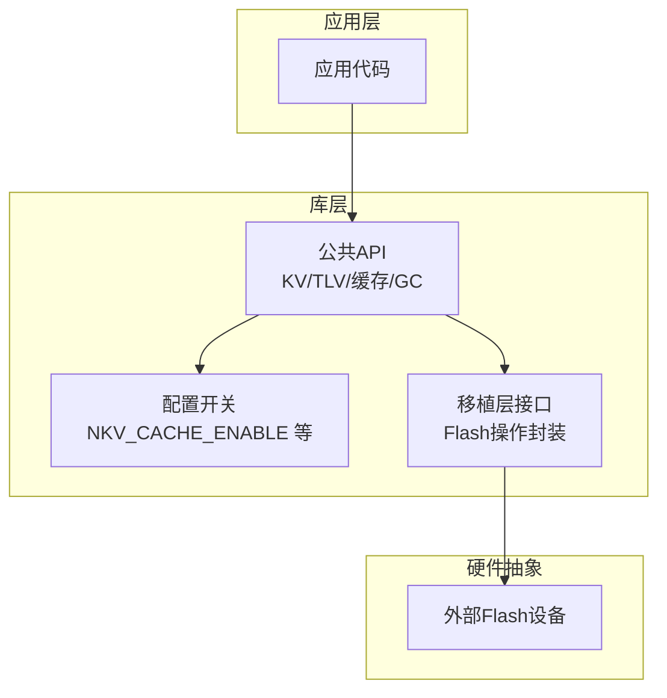
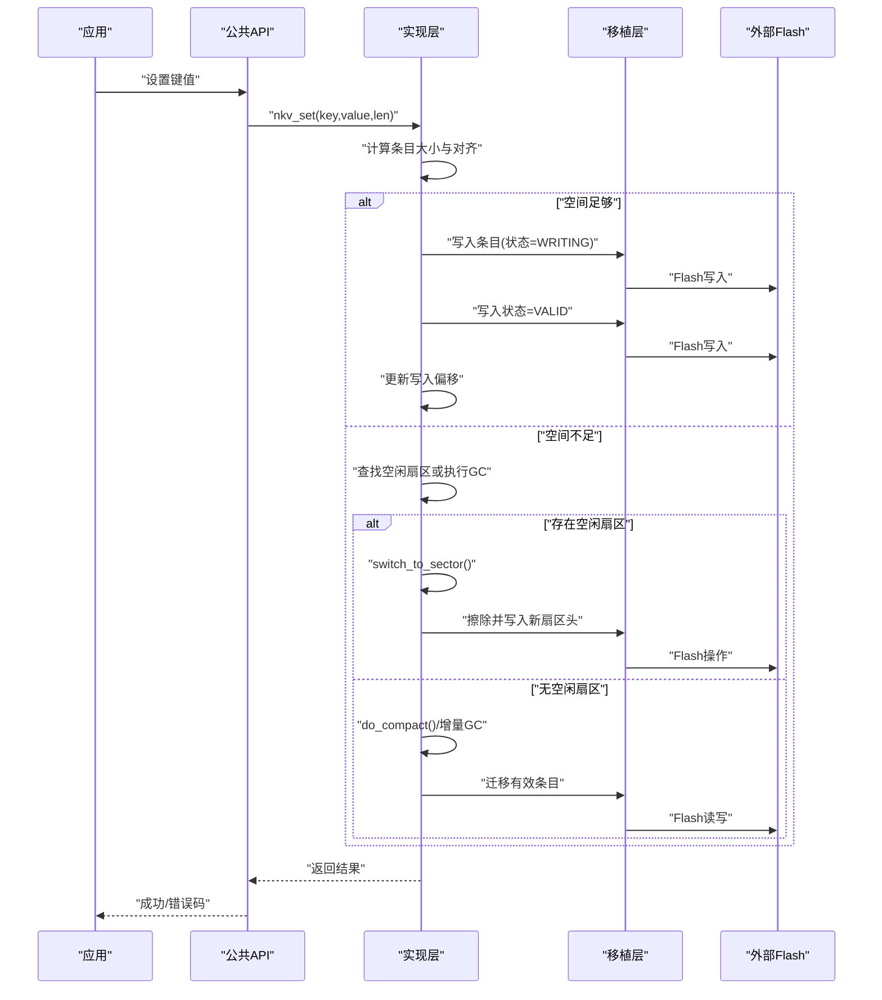
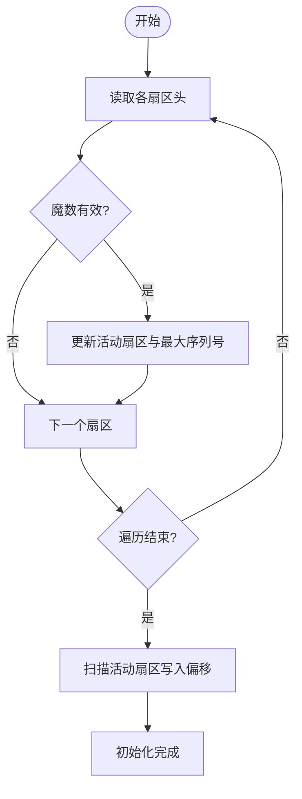
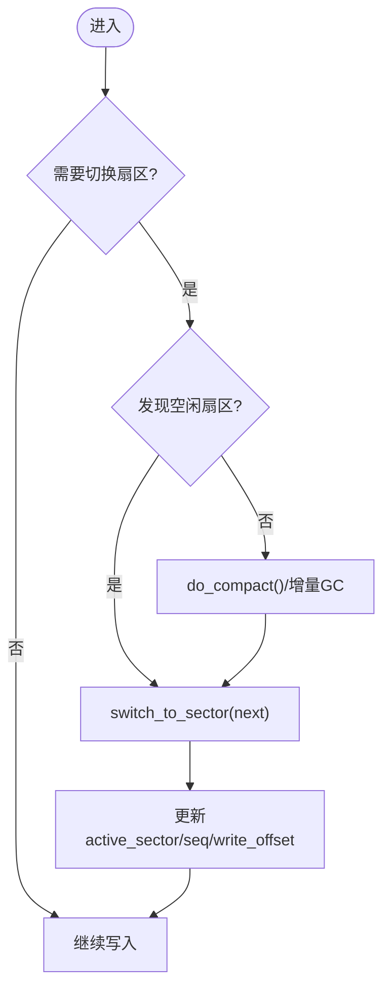
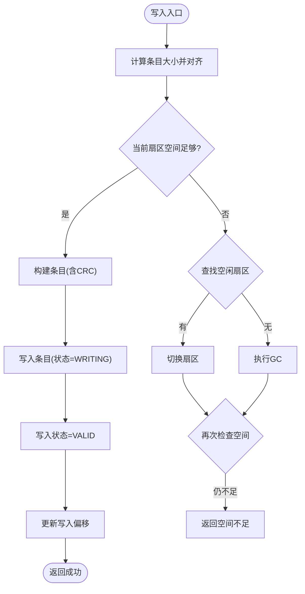
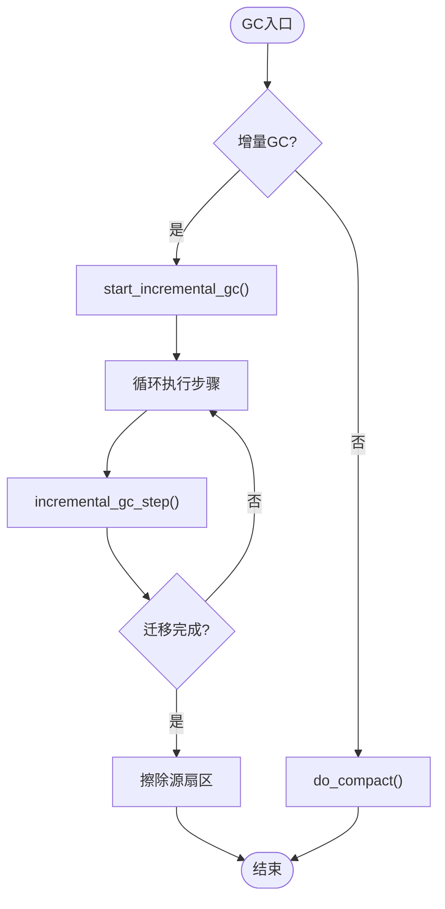
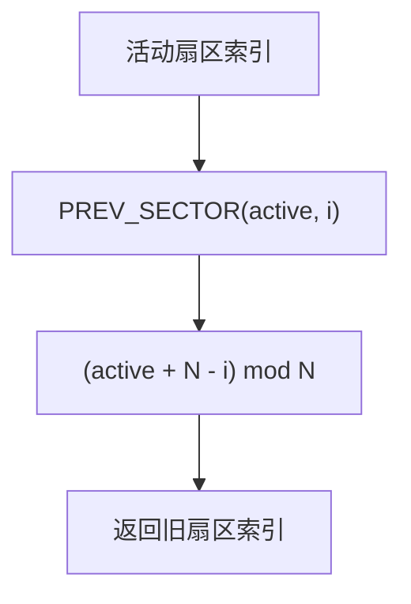
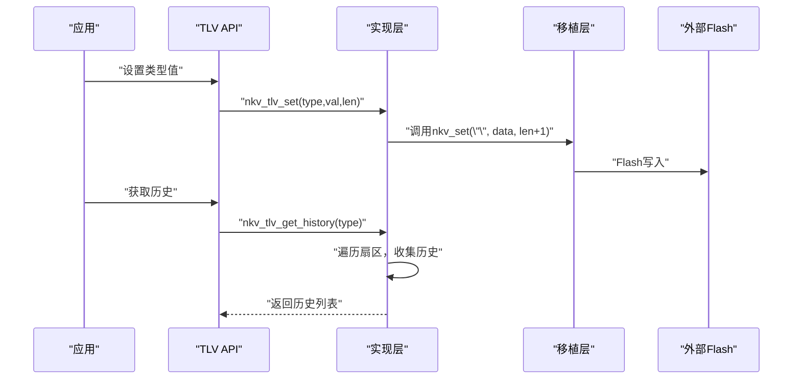
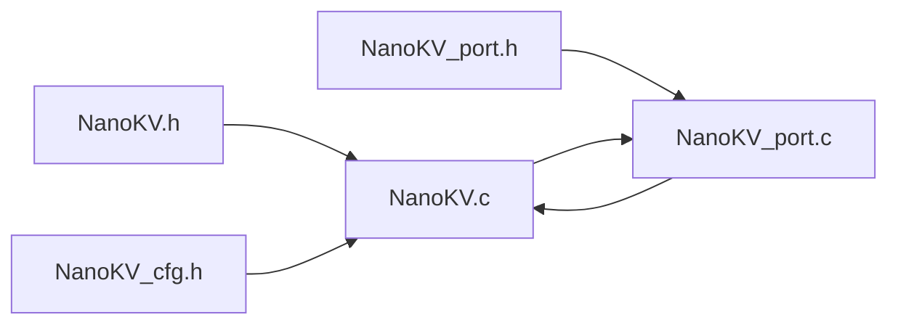
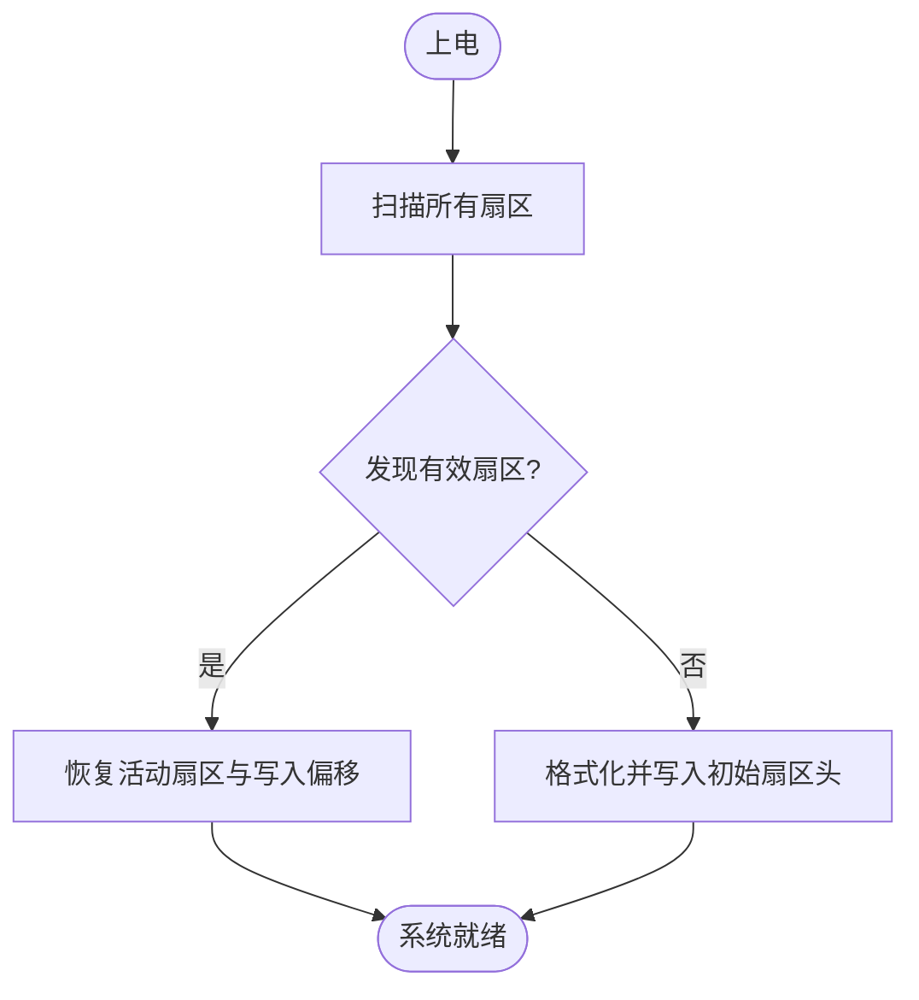

# 多扇区环形管理

<cite>
**本文引用的文件**
- [NanoKV.h](file://NanoKV.h)
- [NanoKV.c](file://NanoKV.c)
- [NanoKV_cfg.h](file://NanoKV_cfg.h)
- [NanoKV_port.h](file://NanoKV_port.h)
- [NanoKV_port.c](file://NanoKV_port.c)
</cite>

## 目录
1. [简介](#简介)
2. [项目结构](#项目结构)
3. [核心组件](#核心组件)
4. [架构总览](#架构总览)
5. [详细组件分析](#详细组件分析)
6. [依赖关系分析](#依赖关系分析)
7. [性能考量](#性能考量)
8. [故障处理与恢复](#故障处理与恢复)
9. [结论](#结论)
10. [附录](#附录)

## 简介
本技术文档围绕多扇区环形管理系统的实现进行深入解析，重点覆盖以下方面：
- 扇区轮转机制与环形索引算法
- 磨损均衡策略与空间利用率优化
- 扇区头部结构、序列号管理与有效性检查
- 扇区切换逻辑、写入偏移扫描与空间分配
- PREV_SECTOR宏的环形索引与扇区选择策略
- 增量GC与全量GC的迁移路径与性能权衡
- 容量规划与性能优化建议
- 故障处理、数据迁移与系统恢复机制
- 多扇区架构在延长Flash寿命与提高存储效率方面的优势

## 项目结构
该项目采用“头文件+实现文件+配置+移植层”的分层设计，核心文件如下：
- NanoKV.h：对外API、数据结构、常量与错误码定义
- NanoKV.c：核心实现，包括扇区管理、GC、TLV扩展、缓存等
- NanoKV_cfg.h：编译期配置开关与参数
- NanoKV_port.h/NanoKV_port.c：移植层接口与Flash操作封装示例

图表来源
- [NanoKV.h](file://NanoKV.h#L133-L257)
- [NanoKV_cfg.h](file://NanoKV_cfg.h#L10-L26)
- [NanoKV_port.h](file://NanoKV_port.h#L18-L21)
- [NanoKV_port.c](file://NanoKV_port.c#L12-L51)

章节来源
- [NanoKV.h](file://NanoKV.h#L1-L257)
- [NanoKV_cfg.h](file://NanoKV_cfg.h#L1-L51)
- [NanoKV_port.h](file://NanoKV_port.h#L1-L27)
- [NanoKV_port.c](file://NanoKV_port.c#L1-L95)

## 核心组件
- 实例结构与状态
  - 实例保存当前活动扇区、序列号、写入偏移、默认值表指针、缓存等；在增量GC模式下还包含GC源扇区、偏移、活跃标志与位图。
- 扇区头与条目头
  - 扇区头包含魔数与序列号，用于识别有效扇区与确定活动扇区。
  - 条目头包含状态、键长、值长，配合CRC实现数据完整性校验。
- Flash操作回调
  - 通过统一的读/写/擦除回调屏蔽底层差异，便于移植到不同MCU与Flash控制器。
- 缓存与默认值
  - 可选LFU缓存加速热点读取；默认值支持键/类型回退。
- 增量GC与全量GC
  - 增量GC按步进迁移，避免长时间阻塞；全量GC在空间不足时触发，进行全局整理。

章节来源
- [NanoKV.h](file://NanoKV.h#L45-L131)
- [NanoKV_cfg.h](file://NanoKV_cfg.h#L10-L26)
- [NanoKV.c](file://NanoKV.c#L628-L640)

## 架构总览
多扇区环形管理的核心在于“环形索引 + 扇区轮转 + 磨损均衡 + 增量GC”。系统通过PREV_SECTOR宏从活动扇区向前回溯若干个扇区，依次扫描有效扇区并进行条目迁移，从而实现空间复用与磨损均衡。

图表来源
- [NanoKV.c](file://NanoKV.c#L695-L763)
- [NanoKV.c](file://NanoKV.c#L294-L308)
- [NanoKV.c](file://NanoKV.c#L399-L487)
- [NanoKV_port.c](file://NanoKV_port.c#L18-L40)

章节来源
- [NanoKV.c](file://NanoKV.c#L695-L763)
- [NanoKV.c](file://NanoKV.c#L294-L308)
- [NanoKV.c](file://NanoKV.c#L399-L487)

## 详细组件分析

### 扇区头部结构与有效性检查
- 扇区头字段
  - 魔数：用于识别扇区是否有效。
  - 序列号：用于确定活动扇区与扇区轮转顺序。
- 有效性检查
  - 通过读取扇区首地址的扇区头并比对魔数判断扇区是否有效。
- 扇区扫描与活动扇区确定
  - 扫描所有扇区，选择魔数有效且序列号最大的扇区作为活动扇区，并据此扫描其写入偏移。

图表来源
- [NanoKV.c](file://NanoKV.c#L211-L224)
- [NanoKV.c](file://NanoKV.c#L642-L674)
- [NanoKV.c](file://NanoKV.c#L227-L242)

章节来源
- [NanoKV.h](file://NanoKV.h#L45-L50)
- [NanoKV.c](file://NanoKV.c#L211-L224)
- [NanoKV.c](file://NanoKV.c#L642-L674)

### 序列号管理与扇区轮转
- 序列号递增
  - 新扇区头的序列号基于当前序列号+1生成，确保线性递增。
- 扇区轮转
  - 当前活动扇区满或空间不足时，切换到下一个扇区；若无空闲扇区，则先执行GC再切换。
- PREV_SECTOR宏与环形索引
  - 从活动扇区向前回溯若干个扇区，用于扫描旧扇区进行迁移或查找键/类型。

图表来源
- [NanoKV.c](file://NanoKV.c#L322-L326)
- [NanoKV.c](file://NanoKV.c#L311-L320)
- [NanoKV.c](file://NanoKV.c#L294-L308)
- [NanoKV.c](file://NanoKV.c#L25-L25)

章节来源
- [NanoKV.c](file://NanoKV.c#L294-L308)
- [NanoKV.c](file://NanoKV.c#L311-L320)
- [NanoKV.c](file://NanoKV.c#L25-L25)

### 写入偏移扫描与空间分配
- 写入偏移扫描
  - 从扇区头之后开始，逐条扫描条目头，遇到已擦除状态或超出扇区边界即停止，得到当前可用写入偏移。
- 空间分配策略
  - 计算条目大小并进行对齐；若当前扇区剩余空间不足，优先寻找空闲扇区，否则触发GC。
- 条目写入流程
  - 先以“写入中”状态写入，随后立即更新为“有效”，以保证掉电安全。

图表来源
- [NanoKV.c](file://NanoKV.c#L706-L726)
- [NanoKV.c](file://NanoKV.c#L728-L750)
- [NanoKV.c](file://NanoKV.c#L227-L242)

章节来源
- [NanoKV.c](file://NanoKV.c#L706-L750)
- [NanoKV.c](file://NanoKV.c#L227-L242)

### 增量GC与全量GC
- 触发条件
  - 增量GC：当空闲扇区少于阈值时启动；全量GC：在切换扇区失败且无空闲扇区时触发。
- 迁移策略
  - 以哈希位图去重，仅迁移最新版本的键/类型；支持TLV保留策略，按阈值决定是否迁移。
- 执行方式
  - 增量GC按步进执行，避免长时间阻塞；全量GC遍历所有旧扇区进行整理。

图表来源
- [NanoKV.c](file://NanoKV.c#L509-L542)
- [NanoKV.c](file://NanoKV.c#L544-L607)
- [NanoKV.c](file://NanoKV.c#L399-L487)

章节来源
- [NanoKV.c](file://NanoKV.c#L509-L607)
- [NanoKV.c](file://NanoKV.c#L399-L487)

### PREV_SECTOR宏与扇区选择策略
- 环形索引算法
  - 使用模运算实现环形回溯，从活动扇区向前选择旧扇区，保证扫描顺序与磨损均衡。
- 扇区选择策略
  - 在查找键/类型时，按PREV_SECTOR顺序扫描，优先命中最近的扇区；在GC时也按此顺序选择最老的扇区作为源。

图表来源
- [NanoKV.c](file://NanoKV.c#L25-L25)
- [NanoKV.c](file://NanoKV.c#L283-L289)
- [NanoKV.c](file://NanoKV.c#L413-L415)

章节来源
- [NanoKV.c](file://NanoKV.c#L25-L25)
- [NanoKV.c](file://NanoKV.c#L283-L289)
- [NanoKV.c](file://NanoKV.c#L413-L415)

### TLV扩展与历史记录
- TLV条目组织
  - 以“类型-长度-值”形式存储，键长为0，值长度>1，类型位于值区首字节。
- 历史记录
  - 支持按写入顺序查询某类型的全部历史版本，便于审计与回放。
- 保留策略
  - 可配置保留最近N个版本，其余旧版本在GC时被迁移或丢弃。

图表来源
- [NanoKV.c](file://NanoKV.c#L964-L973)
- [NanoKV.c](file://NanoKV.c#L1165-L1209)
- [NanoKV.c](file://NanoKV.c#L1223-L1245)

章节来源
- [NanoKV.h](file://NanoKV.h#L176-L257)
- [NanoKV.c](file://NanoKV.c#L964-L973)
- [NanoKV.c](file://NanoKV.c#L1165-L1209)
- [NanoKV.c](file://NanoKV.c#L1223-L1245)

### 缓存与默认值
- LFU缓存
  - 热点键值缓存，命中时直接返回，未命中则从Flash读取并更新缓存。
- 默认值
  - 支持键/类型默认值回退，便于系统初始化与配置恢复。

章节来源
- [NanoKV.h](file://NanoKV.h#L85-L110)
- [NanoKV.c](file://NanoKV.c#L87-L169)
- [NanoKV.c](file://NanoKV.c#L866-L933)

## 依赖关系分析
- 头文件与实现
  - NanoKV.h定义API、数据结构与常量；NanoKV.c实现所有逻辑。
- 配置与移植
  - NanoKV_cfg.h提供编译期配置；NanoKV_port.c提供Flash操作封装示例。
- 组件耦合
  - 实现层依赖移植层的Flash回调；实例状态集中于静态全局变量，便于跨模块共享。

图表来源
- [NanoKV.h](file://NanoKV.h#L19-L20)
- [NanoKV.c](file://NanoKV.c#L16-L18)
- [NanoKV_cfg.h](file://NanoKV_cfg.h#L7-L8)
- [NanoKV_port.c](file://NanoKV_port.c#L7-L9)

章节来源
- [NanoKV.h](file://NanoKV.h#L19-L20)
- [NanoKV.c](file://NanoKV.c#L16-L18)
- [NanoKV_cfg.h](file://NanoKV_cfg.h#L7-L8)
- [NanoKV_port.c](file://NanoKV_port.c#L7-L9)

## 性能考量
- 写入路径优化
  - 追加写入避免擦除，降低Flash磨损；状态机（WRITING→VALID）保障掉电安全。
- 空间利用率
  - 增量GC分摊开销，全量GC在必要时进行全局整理；PREV_SECTOR保证扫描顺序合理。
- 缓存加速
  - LFU缓存显著提升热点读取性能，命中率可通过统计接口观测。
- 对齐与CRC
  - 对齐策略减少写放大；CRC校验保障数据完整性。
- 配置建议
  - 增量GC每次迁移条目数与阈值需结合负载特征调整；缓存大小与键/值长度限制需平衡内存与性能。

章节来源
- [NanoKV.c](file://NanoKV.c#L728-L750)
- [NanoKV.c](file://NanoKV.c#L509-L607)
- [NanoKV_cfg.h](file://NanoKV_cfg.h#L18-L26)

## 故障处理与恢复
- 掉电安全
  - 写入采用两阶段提交：先写入“写入中”，再写入“有效”，即使断电也能通过状态判断修复。
- 扫描与恢复
  - 上电后扫描所有扇区，选择序列号最大且魔数有效的扇区作为活动扇区，并重建写入偏移。
- 格式化
  - 若未发现有效扇区，执行格式化并在首个扇区写入初始扇区头。
- 数据迁移与擦除
  - GC完成后擦除源扇区，释放空间供后续写入使用。

图表来源
- [NanoKV.c](file://NanoKV.c#L642-L674)
- [NanoKV.c](file://NanoKV.c#L676-L693)

章节来源
- [NanoKV.c](file://NanoKV.c#L642-L693)

## 结论
多扇区环形管理系统通过环形索引、扇区轮转与磨损均衡，结合增量GC与全量GC，实现了在有限Flash资源下的高效、可靠存储。PREV_SECTOR宏确保了扫描与迁移的合理性；状态机与CRC保障了掉电安全；LFU缓存与默认值提升了易用性与性能。该架构在延长Flash寿命与提高空间利用率方面具有显著优势，适用于嵌入式实时系统与资源受限场景。

## 附录
- 关键宏与常量
  - SECTOR_ADDR：扇区基址计算
  - ALIGN：按对齐要求对齐
  - PREV_SECTOR：环形索引回溯
  - ENTRY_SIZE：条目大小计算
- API概览
  - 初始化、扫描、格式化
  - KV/TLV设置、获取、删除、存在性检查
  - 默认值设置与回退
  - 增量GC步进与状态查询
  - 缓存统计与清空
  - TLV迭代、历史查询、保留策略

章节来源
- [NanoKV.c](file://NanoKV.c#L23-L26)
- [NanoKV.h](file://NanoKV.h#L133-L257)