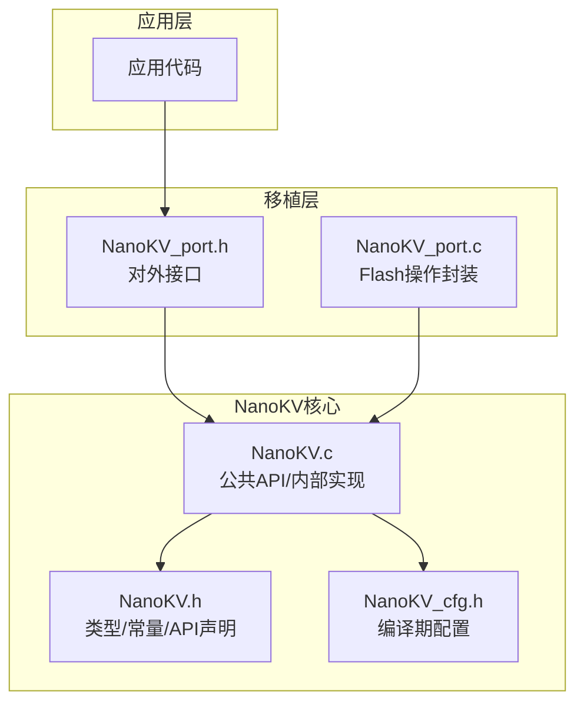
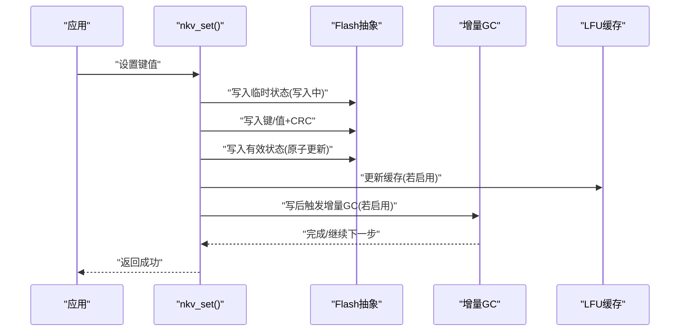
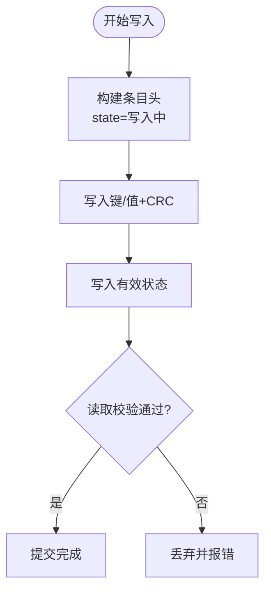
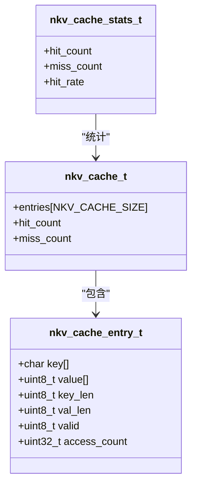
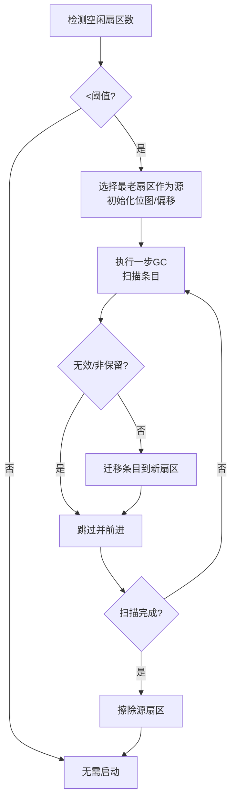
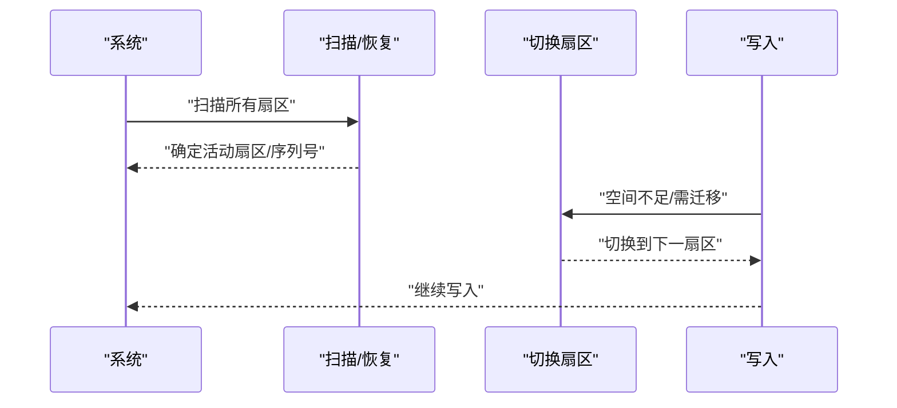
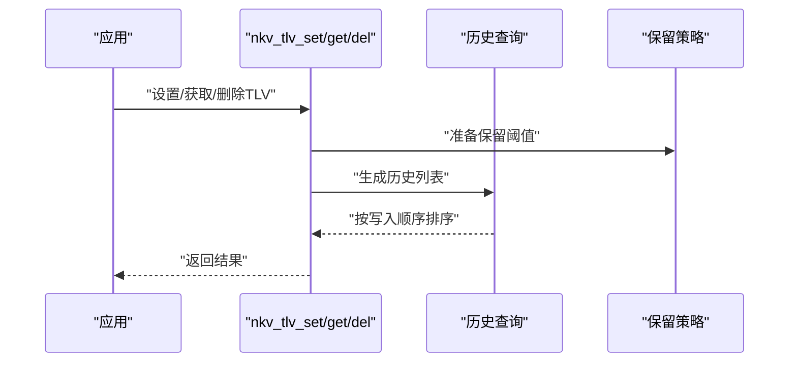
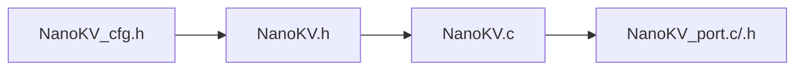

# 核心算法详解

<cite>
**本文引用的文件**
- [NanoKV.c](file://NanoKV.c)
- [NanoKV.h](file://NanoKV.h)
- [NanoKV_cfg.h](file://NanoKV_cfg.h)
- [NanoKV_port.c](file://NanoKV_port.c)
- [NanoKV_port.h](file://NanoKV_port.h)
</cite>

## 目录
1. [引言](#引言)
2. [项目结构](#项目结构)
3. [核心组件](#核心组件)
4. [架构总览](#架构总览)
5. [详细组件分析](#详细组件分析)
6. [依赖分析](#依赖分析)
7. [性能考量](#性能考量)
8. [故障排查指南](#故障排查指南)
9. [结论](#结论)
10. [附录](#附录)

## 引言
本文件面向嵌入式KV/TLV存储系统NanoKV，聚焦三大核心算法：追加写入机制（状态机+CRC）、LFU缓存（访问计数与替换策略）、增量GC（分摊与进度控制）。文档从代码级实现出发，结合类图、时序图、流程图与复杂度分析，帮助读者理解算法设计、协作关系与性能优化要点，并提供伪代码与实际代码片段路径以便进一步查阅。

## 项目结构
NanoKV采用极简单文件架构，核心逻辑集中在单一C文件中，配合头文件与配置文件组织功能模块。移植层负责Flash抽象，便于在不同MCU/平台复用。

图表来源
- [NanoKV.c](file://NanoKV.c#L1-L1261)
- [NanoKV.h](file://NanoKV.h#L1-L257)
- [NanoKV_cfg.h](file://NanoKV_cfg.h#L1-L51)
- [NanoKV_port.c](file://NanoKV_port.c#L1-L95)
- [NanoKV_port.h](file://NanoKV_port.h#L1-L27)

章节来源
- [NanoKV.c](file://NanoKV.c#L1-L1261)
- [NanoKV.h](file://NanoKV.h#L1-L257)
- [NanoKV_cfg.h](file://NanoKV_cfg.h#L1-L51)
- [NanoKV_port.c](file://NanoKV_port.c#L1-L95)
- [NanoKV_port.h](file://NanoKV_port.h#L1-L27)

## 核心组件
- 追加写入与掉电安全：通过“写入中→有效”两阶段状态机与CRC校验，确保写入过程即使断电也能保持一致性。
- LFU缓存：基于访问计数的缓存命中/替换，提升热点数据读取性能。
- 增量GC：扫描旧扇区，按步长迁移有效条目，避免长时间阻塞。
- 多扇区环形与磨损均衡：循环切换活动扇区，利用多个扇区空间并降低单一扇区磨损。
- TLV历史与保留策略：支持按类型保留最新若干条记录，便于审计与回放。

章节来源
- [NanoKV.c](file://NanoKV.c#L695-L763)
- [NanoKV.c](file://NanoKV.c#L87-L169)
- [NanoKV.c](file://NanoKV.c#L489-L624)
- [NanoKV.c](file://NanoKV.c#L210-L327)
- [NanoKV.c](file://NanoKV.c#L940-L1261)

## 架构总览
NanoKV围绕“扇区-条目-匹配器-迁移”的数据流构建。写入时先写入临时状态，再原子地更新为有效；读取时优先命中缓存，否则遍历扇区查找；GC阶段扫描旧扇区，按保留策略与哈希去重迁移有效条目至新扇区。

图表来源
- [NanoKV.c](file://NanoKV.c#L695-L763)
- [NanoKV.c](file://NanoKV.c#L758-L760)
- [NanoKV.c](file://NanoKV.c#L489-L624)
- [NanoKV.c](file://NanoKV.c#L87-L169)

## 详细组件分析

### 追加写入机制：状态机与CRC校验
- 设计目标
  - 避免擦除写入，减少Flash磨损。
  - 掉电安全：写入过程中若断电，不会出现半写入的脏数据。
- 状态机
  - 写入阶段：条目头state标记为“写入中”，随后写入键/值+CRC。
  - 提交阶段：写入“有效”状态，完成原子提交。
- CRC保障
  - 使用CRC16校验键与值的组合，读取时验证一致性。
- 关键实现点
  - 写入流程与状态更新见写入API与扇区扫描。
  - CRC计算与校验贯穿写入与读取路径。
  - 状态常量与条目头结构定义见头文件。

图表来源
- [NanoKV.c](file://NanoKV.c#L728-L750)
- [NanoKV.c](file://NanoKV.c#L54-L64)
- [NanoKV.h](file://NanoKV.h#L24-L58)

章节来源
- [NanoKV.c](file://NanoKV.c#L695-L763)
- [NanoKV.c](file://NanoKV.c#L54-L64)
- [NanoKV.h](file://NanoKV.h#L24-L58)

### LFU缓存：访问计数与替换策略
- 结构与行为
  - 缓存条目包含键、值、长度、有效性标志与访问计数。
  - 命中时访问计数自增，未命中时进行LFU替换。
- 替换策略
  - 寻找最小访问计数的条目作为候选；空槽优先。
  - 若键已存在则复用该槽位并重置访问计数。
- 性能优化
  - 命中/未命中计数用于统计命中率。
  - 可清空缓存或查询统计信息。

图表来源
- [NanoKV.h](file://NanoKV.h#L86-L110)
- [NanoKV.c](file://NanoKV.c#L87-L169)

章节来源
- [NanoKV.c](file://NanoKV.c#L87-L169)
- [NanoKV.h](file://NanoKV.h#L86-L110)

### 增量GC：分摊算法、进度跟踪与资源管理
- 设计思路
  - 不一次性全量扫描，而是按步长逐步迁移有效条目，避免长时间阻塞。
  - 通过位图记录键哈希，避免重复迁移同一键的旧版本。
  - 支持保留策略：按类型保留最新若干条，其余迁移。
- 进度跟踪
  - 记录源扇区、源偏移、活动标志与位图。
  - 每次写入后尝试启动或推进GC。
- 资源管理
  - 当可用扇区少于阈值时启动GC。
  - 迁移完成后擦除源扇区，继续扫描下一个最老扇区。

图表来源
- [NanoKV.c](file://NanoKV.c#L489-L624)
- [NanoKV.c](file://NanoKV.c#L491-L507)
- [NanoKV.c](file://NanoKV.c#L510-L542)
- [NanoKV.c](file://NanoKV.c#L545-L607)

章节来源
- [NanoKV.c](file://NanoKV.c#L489-L624)
- [NanoKV.h](file://NanoKV.h#L112-L131)

### 多扇区环形管理与磨损均衡
- 环形管理
  - 通过扇区序列号与活动扇区索引管理当前写入扇区。
  - 切换扇区时写入新扇区头，递增序列号。
- 磨损均衡
  - 通过循环切换活动扇区，避免单一扇区过度写入。
  - 扫描阶段按“上一个扇区”顺序遍历，保证公平性。

图表来源
- [NanoKV.c](file://NanoKV.c#L642-L693)
- [NanoKV.c](file://NanoKV.c#L294-L327)
- [NanoKV.c](file://NanoKV.c#L278-L291)

章节来源
- [NanoKV.c](file://NanoKV.c#L642-L693)
- [NanoKV.c](file://NanoKV.c#L294-L327)
- [NanoKV.c](file://NanoKV.c#L278-L291)

### TLV历史与保留策略
- 历史记录
  - 提供迭代器遍历有效TLV条目，支持按写入顺序排序的历史查询。
- 保留策略
  - 针对特定类型，保留最新的若干条记录，其余迁移。
  - 预计算阈值，迁移时按地址比较决定是否保留。

图表来源
- [NanoKV.c](file://NanoKV.c#L940-L1261)
- [NanoKV.c](file://NanoKV.c#L329-L377)
- [NanoKV.c](file://NanoKV.c#L1165-L1219)

章节来源
- [NanoKV.c](file://NanoKV.c#L940-L1261)
- [NanoKV.c](file://NanoKV.c#L329-L377)
- [NanoKV.c](file://NanoKV.c#L1165-L1219)

## 依赖分析
- 头文件与配置
  - NanoKV.h定义了状态常量、条目结构、API接口与编译期开关。
  - NanoKV_cfg.h集中管理键值长度、缓存大小、GC步长、保留策略等参数。
- 实现耦合
  - NanoKV.c内部大量使用宏与静态函数，形成清晰的模块边界。
  - 增量GC与LFU缓存相互独立，但都受写入路径影响。
  - TLV实现复用KV写入/读取逻辑，仅在键长度与类型字段上做差异处理。

图表来源
- [NanoKV_cfg.h](file://NanoKV_cfg.h#L1-L51)
- [NanoKV.h](file://NanoKV.h#L1-L257)
- [NanoKV.c](file://NanoKV.c#L1-L1261)
- [NanoKV_port.c](file://NanoKV_port.c#L1-L95)
- [NanoKV_port.h](file://NanoKV_port.h#L1-L27)

章节来源
- [NanoKV_cfg.h](file://NanoKV_cfg.h#L1-L51)
- [NanoKV.h](file://NanoKV.h#L1-L257)
- [NanoKV.c](file://NanoKV.c#L1-L1261)
- [NanoKV_port.c](file://NanoKV_port.c#L1-L95)
- [NanoKV_port.h](file://NanoKV_port.h#L1-L27)

## 性能考量
- 时间复杂度
  - 写入：O(1)（条目大小固定），若触发GC则叠加扫描成本。
  - 读取：O(S)（S为扇区数），启用缓存可显著降低平均时间。
  - 增量GC：每步O(1)条目扫描，整体O(N)条目，其中N为旧扇区有效条目总数。
  - LFU：查找/更新均为O(C)（C为缓存容量），通常很小。
- 空间复杂度
  - 条目头+键+值+CRC，空间开销与条目数量线性相关。
  - 缓存占用O(C×(K+V))，其中C为缓存容量，K/V为键值上限。
  - GC位图占用约32字节，随扇区数量线性增长。
- 优化建议
  - 合理设置NKV_GC_ENTRIES_PER_WRITE，平衡写入延迟与GC效率。
  - 控制NKV_CACHE_SIZE，避免缓存过大导致内存压力。
  - 使用保留策略减少历史数据迁移，降低GC负载。
  - 将频繁更新的键写入相邻位置，提高局部性。

[本节为通用性能讨论，不直接分析具体文件]

## 故障排查指南
- 常见错误与定位
  - 参数无效：检查键/值长度、指针合法性。
  - Flash操作失败：确认移植层Flash接口实现正确。
  - 空间不足：触发GC或切换扇区后重试。
  - 未找到：确认键存在且值长度大于0。
- 调试与日志
  - 启用调试宏后可在初始化与关键路径输出日志。
  - 可查询使用情况与缓存命中率辅助定位问题。

章节来源
- [NanoKV.h](file://NanoKV.h#L34-L41)
- [NanoKV_port.c](file://NanoKV_port.c#L54-L88)
- [NanoKV.c](file://NanoKV.c#L695-L763)
- [NanoKV.c](file://NanoKV.c#L765-L798)

## 结论
NanoKV通过“追加写入+状态机+CRC”实现掉电安全，“LFU缓存”提升读取性能，“增量GC”分摊回收开销，并以“多扇区环形+磨损均衡”延长Flash寿命。三者协同工作，使系统在嵌入式环境下具备高可靠性与良好吞吐。建议根据应用场景调整配置参数，持续监控使用率与命中率，以获得最佳性能与寿命平衡。

[本节为总结性内容，不直接分析具体文件]

## 附录

### 伪代码示例与代码片段路径
- 追加写入（状态机+CRC）
  - 写入流程：[写入条目与状态更新](file://NanoKV.c#L728-L750)
  - CRC计算：[CRC16计算](file://NanoKV.c#L54-L64)
- LFU缓存
  - 命中/替换：[缓存查找与LFU候选](file://NanoKV.c#L89-L122)
  - 更新缓存：[缓存更新](file://NanoKV.c#L125-L153)
- 增量GC
  - 步进执行：[增量GC一步](file://NanoKV.c#L545-L598)
  - 启动与进度：[启动GC与擦除源扇区](file://NanoKV.c#L510-L607)
- 多扇区环形
  - 切换扇区：[切换到指定/下一扇区](file://NanoKV.c#L294-L327)
  - 扫描写入偏移：[扫描写入偏移](file://NanoKV.c#L227-L242)
- TLV历史与保留
  - 历史排序：[按写入顺序排序](file://NanoKV.c#L1189-L1200)
  - 保留阈值：[准备保留阈值](file://NanoKV.c#L349-L361)

[本节提供伪代码与代码片段路径，不直接展示具体代码内容]