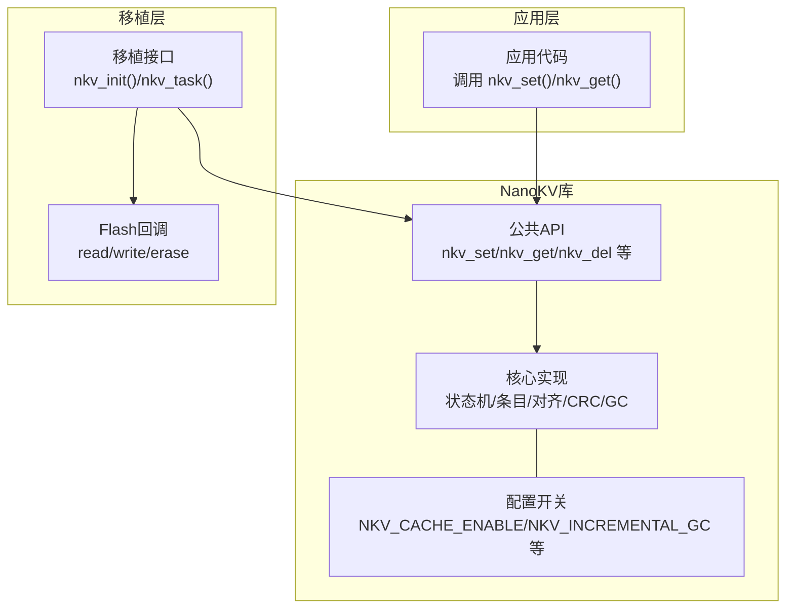
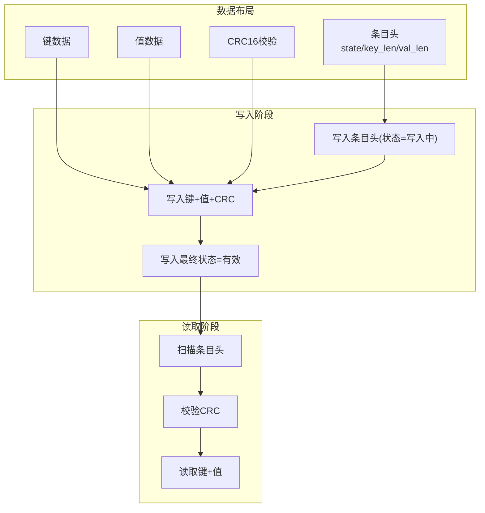
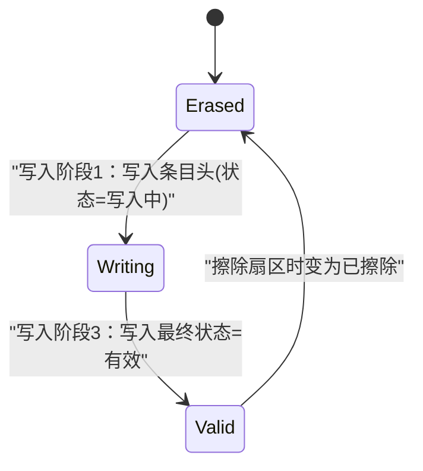
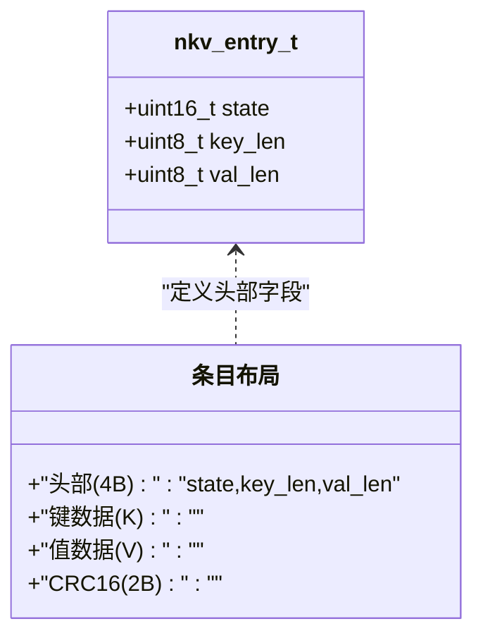
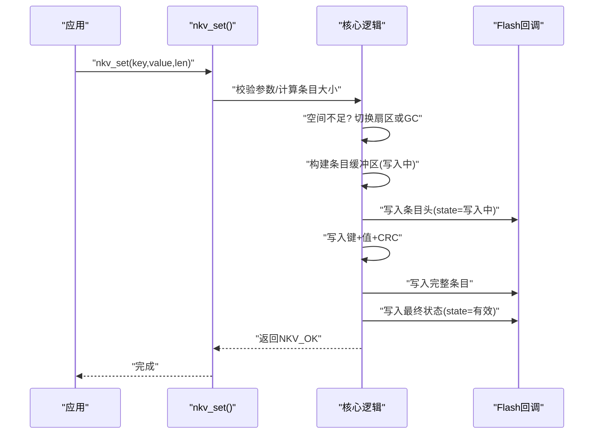
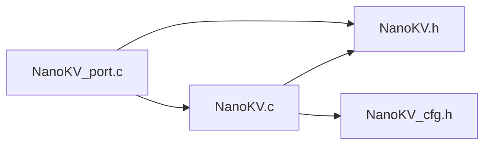

# 追加写入机制

<cite>
**本文引用的文件**
- [NanoKV.c](file://NanoKV.c)
- [NanoKV.h](file://NanoKV.h)
- [NanoKV_cfg.h](file://NanoKV_cfg.h)
- [NanoKV_port.c](file://NanoKV_port.c)
- [NanoKV_port.h](file://NanoKV_port.h)
</cite>

## 目录
1. [简介](#简介)
2. [项目结构](#项目结构)
3. [核心组件](#核心组件)
4. [架构总览](#架构总览)
5. [详细组件分析](#详细组件分析)
6. [依赖关系分析](#依赖关系分析)
7. [性能考量](#性能考量)
8. [故障排查指南](#故障排查指南)
9. [结论](#结论)
10. [附录](#附录)

## 简介
本文件聚焦NanoKV的“无需擦除的追加写入”机制，系统阐述其状态机设计（NKV_STATE_WRITING→NKV_STATE_VALID）、条目头部结构、对齐与CRC校验实现、从构建条目缓冲区到实际写入Flash的完整流程，并给出时间复杂度O(1)与空间优势的分析。同时，结合nkv_set()函数的实现路径，解释该机制如何降低Flash磨损并提升系统可靠性。

## 项目结构
仓库采用极简分层组织：
- NanoKV.h/NanoKV_cfg.h：公共头文件与配置开关
- NanoKV.c：核心实现（状态机、条目布局、GC、API等）
- NanoKV_port.c/NanoKV_port.h：移植层（Flash操作回调封装）

图表来源
- [NanoKV.h](file://NanoKV.h#L134-L162)
- [NanoKV.c](file://NanoKV.c#L628-L640)
- [NanoKV_port.c](file://NanoKV_port.c#L54-L88)

章节来源
- [NanoKV.h](file://NanoKV.h#L1-L257)
- [NanoKV_cfg.h](file://NanoKV_cfg.h#L1-L51)
- [NanoKV.c](file://NanoKV.c#L1-L1261)
- [NanoKV_port.c](file://NanoKV_port.c#L1-L95)

## 核心组件
- 状态机：NKV_STATE_WRITING → NKV_STATE_VALID，确保掉电安全
- 条目头部：包含state/key_len/val_len三字段，固定4字节
- 对齐机制：按Flash对齐粒度进行对齐，保证原子写入
- CRC校验：对键+值进行CRC16校验，写入尾部2字节
- 写入流程：先写入“写入中”状态，再写入完整条目，最后写入“有效”状态
- 空间管理：多扇区环形结构，配合增量GC实现空间复用

章节来源
- [NanoKV.h](file://NanoKV.h#L24-L60)
- [NanoKV.c](file://NanoKV.c#L54-L64)
- [NanoKV.c](file://NanoKV.c#L695-L763)

## 架构总览
NanoKV以“追加写入+状态机+对齐+CRC+多扇区环形+增量GC”的组合实现高性能、低磨损的KV/TLV存储。

图表来源
- [NanoKV.h](file://NanoKV.h#L52-L58)
- [NanoKV.h](file://NanoKV.h#L27-L28)
- [NanoKV.c](file://NanoKV.c#L728-L751)
- [NanoKV.c](file://NanoKV.c#L184-L208)

## 详细组件分析

### 状态机设计：NKV_STATE_WRITING → NKV_STATE_VALID
- 设计目标：在写入过程中若发生断电，读取器仅能识别“有效”状态的条目，从而保证数据一致性
- 实现要点：
  - 写入阶段1：将条目头写入为“写入中”状态
  - 写入阶段2：写入键、值与CRC
  - 写入阶段3：将条目头更新为“有效”状态
- 读取侧：扫描时仅处理state=VALID的条目；对写入中条目直接跳过

图表来源
- [NanoKV.h](file://NanoKV.h#L26-L28)
- [NanoKV.c](file://NanoKV.c#L728-L751)

章节来源
- [NanoKV.h](file://NanoKV.h#L26-L28)
- [NanoKV.c](file://NanoKV.c#L728-L751)

### 条目头部结构、对齐机制与CRC校验
- 头部结构：state(2B) + key_len(1B) + val_len(1B)，共4字节，__attribute__((packed))保证紧凑布局
- 对齐机制：ENTRY_SIZE = ALIGN(HEADER_SIZE + key_len + val_len + CRC_SIZE)，ALIGN按Flash对齐粒度向上取整
- CRC校验：对键+值进行CRC16计算，写入到条目尾部2字节，读取时验证CRC一致性

图表来源
- [NanoKV.h](file://NanoKV.h#L52-L58)
- [NanoKV.c](file://NanoKV.c#L24-L26)
- [NanoKV.c](file://NanoKV.c#L54-L64)

章节来源
- [NanoKV.h](file://NanoKV.h#L52-L58)
- [NanoKV.c](file://NanoKV.c#L24-L26)
- [NanoKV.c](file://NanoKV.c#L54-L64)

### 写入流程：从构建条目缓冲区到实际写入Flash
- 参数校验与空间评估：计算条目大小，若当前扇区剩余空间不足，尝试切换空闲扇区或触发GC
- 构建条目缓冲区：设置state=写入中、key_len、val_len，拷贝键与值，计算CRC并写入尾部
- 写入阶段1：写入条目头（state=写入中）
- 写入阶段2：写入键+值+CRC
- 写入阶段3：写入最终状态（state=有效）
- 后续处理：更新写入偏移、更新缓存、触发增量GC

图表来源
- [NanoKV.c](file://NanoKV.c#L695-L763)
- [NanoKV.c](file://NanoKV.c#L728-L751)

章节来源
- [NanoKV.c](file://NanoKV.c#L695-L763)

### 时间复杂度O(1)与空间优势
- 时间复杂度O(1)：单次写入仅涉及一次扇区写入（两次写入头与一次完整写入），且不涉及扫描其他条目；空间评估与必要时的GC为摊销行为，不影响单次写入的常数时间复杂度
- 空间优势：
  - 多扇区环形结构：充分利用可用空间，避免碎片化
  - 增量GC：分步迁移有效条目，避免长时间阻塞
  - 追加写入：无需擦除即可更新，显著降低擦写次数

章节来源
- [NanoKV.c](file://NanoKV.c#L695-L763)
- [NanoKV.c](file://NanoKV.c#L490-L624)

### nkv_set()函数实现细节（代码路径）
以下为关键实现路径，便于定位源码：
- 参数校验与空间评估：[NanoKV.c](file://NanoKV.c#L695-L726)
- 构建条目缓冲区与CRC计算：[NanoKV.c](file://NanoKV.c#L728-L740)
- 写入阶段1（写入条目头）：[NanoKV.c](file://NanoKV.c#L742-L744)
- 写入阶段2（写入完整条目）：[NanoKV.c](file://NanoKV.c#L742-L744)
- 写入阶段3（写入最终状态）：[NanoKV.c](file://NanoKV.c#L746-L749)
- 更新写入偏移与缓存：[NanoKV.c](file://NanoKV.c#L751-L756)
- 触发增量GC：[NanoKV.c](file://NanoKV.c#L758-L760)

章节来源
- [NanoKV.c](file://NanoKV.c#L695-L763)

### 追加写入如何减少Flash磨损与提升可靠性
- 减少擦写次数：无需擦除即可更新，避免频繁擦写导致的介质老化
- 掉电安全：通过状态机与CRC双重保护，即使断电也能保证数据一致性
- 空间复用：多扇区环形+增量GC，最大化利用存储空间，降低因空间不足而引发的写入失败
- 读取优化：LFU缓存加速热点数据访问，减少不必要的Flash读取

章节来源
- [NanoKV.h](file://NanoKV.h#L7-L13)
- [NanoKV.c](file://NanoKV.c#L87-L169)
- [NanoKV.c](file://NanoKV.c#L490-L624)

## 依赖关系分析
- 头文件依赖：NanoKV.c包含NanoKV.h，暴露公共API与内部结构
- 配置依赖：通过NanoKV_cfg.h控制缓存、GC、TLV保留策略等特性
- 移植层依赖：NanoKV_port.c提供Flash操作回调，供核心模块调用

图表来源
- [NanoKV.c](file://NanoKV.c#L16-L20)
- [NanoKV.h](file://NanoKV.h#L19-L22)
- [NanoKV_port.c](file://NanoKV_port.c#L7-L10)

章节来源
- [NanoKV.c](file://NanoKV.c#L16-L20)
- [NanoKV.h](file://NanoKV.h#L19-L22)
- [NanoKV_port.c](file://NanoKV_port.c#L7-L10)

## 性能考量
- 单次写入O(1)：不依赖扫描其他条目，写入路径短
- 对齐与CRC：对齐增加少量写入字节数，CRC提供强健性保障
- 增量GC：分步迁移，避免长时阻塞，适合实时系统
- 缓存命中：热点数据走缓存，显著降低Flash读取次数

## 故障排查指南
- 写入失败NKV_ERR_FLASH：检查移植层Flash回调实现与地址映射
- 空间不足NKV_ERR_NO_SPACE：确认是否触发了GC或切换扇区；检查NKV_GC_THRESHOLD_PERCENT配置
- 读取不到数据NKV_ERR_NOT_FOUND：确认键存在且state=VALID；检查CRC是否一致
- 断电后数据异常：确认写入流程是否完整执行（写入中→最终状态），以及CRC校验是否通过

章节来源
- [NanoKV.h](file://NanoKV.h#L33-L41)
- [NanoKV.c](file://NanoKV.c#L728-L751)

## 结论
NanoKV通过“状态机+对齐+CRC+多扇区环形+增量GC”的组合，实现了无需擦除的高效追加写入。单次写入时间复杂度O(1)，显著降低Flash磨损并提升系统可靠性。结合LFU缓存与配置化的保留策略，NanoKV在资源受限的嵌入式环境中提供了高可用的KV/TLV存储能力。

## 附录
- 关键宏与常量：见头文件中的状态码、头部大小、CRC大小等定义
- 配置开关：见配置文件中的缓存、GC、TLV保留策略等选项
- 移植说明：在移植层实现Flash的read/write/erase回调，并正确设置对齐粒度

章节来源
- [NanoKV.h](file://NanoKV.h#L24-L31)
- [NanoKV_cfg.h](file://NanoKV_cfg.h#L10-L26)
- [NanoKV_port.c](file://NanoKV_port.c#L42-L51)