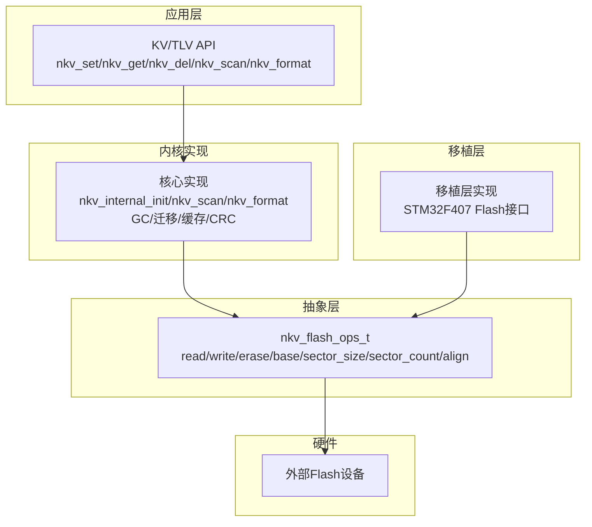
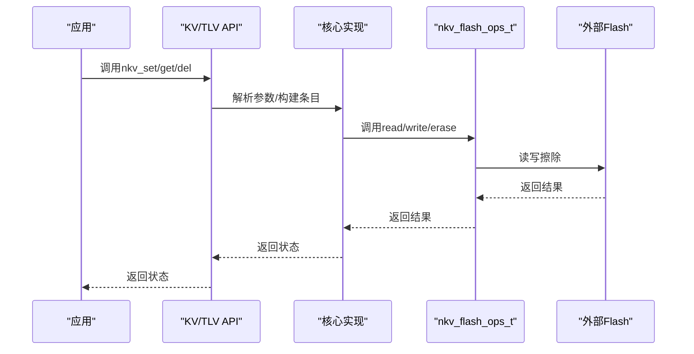
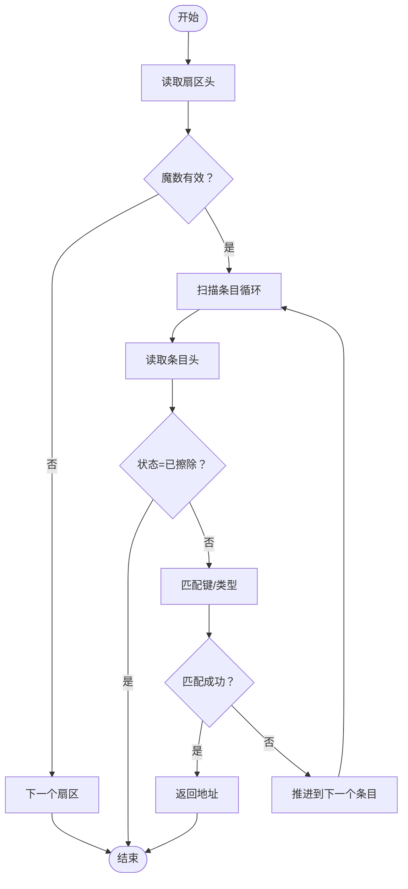
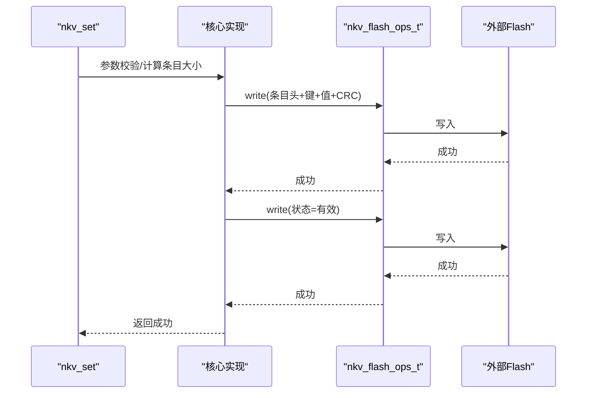
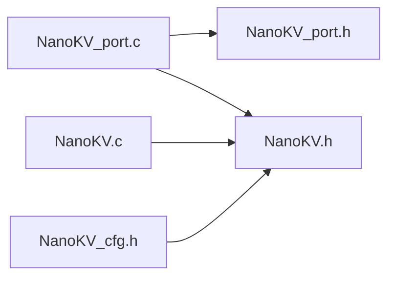

# Flash抽象层设计

<cite>
**本文档引用的文件**
- [NanoKV.h](file://NanoKV.h)
- [NanoKV.c](file://NanoKV.c)
- [NanoKV_cfg.h](file://NanoKV_cfg.h)
- [NanoKV_port.h](file://NanoKV_port.h)
- [NanoKV_port.c](file://NanoKV_port.c)
</cite>

## 目录
1. [简介](#简介)
2. [项目结构](#项目结构)
3. [核心组件](#核心组件)
4. [架构总览](#架构总览)
5. [详细组件分析](#详细组件分析)
6. [依赖关系分析](#依赖关系分析)
7. [性能考量](#性能考量)
8. [故障排查指南](#故障排查指南)
9. [结论](#结论)
10. [附录](#附录)

## 简介
本文件聚焦于NanoKV的Flash抽象层设计，系统阐述如何通过nkv_flash_ops_t结构体抽象底层Flash硬件操作，包括读取、写入、擦除等基本操作的接口设计原理。文档详细说明抽象层的设计目标与优势，如何实现硬件无关性与可移植性；分析Flash存储器的物理特性（如扇区划分、页面大小、对齐要求、擦除粒度等关键参数）；给出抽象层接口的实现规范与约束条件（包括地址映射规则、数据对齐要求、错误处理机制等），并总结最佳实践与常见陷阱，为不同Flash类型的适配提供理论指导。

## 项目结构
仓库采用“头文件+实现文件+移植层”的分层组织方式，核心逻辑集中在NanoKV.h/NanoKV.c，配置位于NanoKV_cfg.h，移植层位于NanoKV_port.h/NanoKV_port.c。该结构清晰分离了应用API、内部实现与硬件抽象，便于在不同MCU/Flash平台上复用。

图表来源
- [NanoKV.h](file://NanoKV.h#L68-L83)
- [NanoKV.c](file://NanoKV.c#L628-L640)
- [NanoKV_port.c](file://NanoKV_port.c#L42-L51)

章节来源
- [NanoKV.h](file://NanoKV.h#L1-L257)
- [NanoKV.c](file://NanoKV.c#L1-L1261)
- [NanoKV_cfg.h](file://NanoKV_cfg.h#L1-L51)
- [NanoKV_port.h](file://NanoKV_port.h#L1-L27)
- [NanoKV_port.c](file://NanoKV_port.c#L1-L95)

## 核心组件
- nkv_flash_ops_t：Flash操作回调与配置集合，是抽象层的核心载体，封装底层Flash的读、写、擦除能力以及Flash布局参数。
- KV/TLV API：上层业务接口，通过抽象层完成数据持久化。
- 移植层：提供具体Flash平台的实现，填充nkv_flash_ops_t并完成初始化。

章节来源
- [NanoKV.h](file://NanoKV.h#L68-L83)
- [NanoKV.c](file://NanoKV.c#L628-L640)
- [NanoKV_port.c](file://NanoKV_port.c#L42-L51)

## 架构总览
下图展示了从应用API到Flash硬件的调用链路与抽象层位置。

图表来源
- [NanoKV.c](file://NanoKV.c#L695-L763)
- [NanoKV.h](file://NanoKV.h#L68-L83)

## 详细组件分析

### Flash抽象层接口设计
- 接口类型
  - 读取回调：nkv_read_fn，参数为地址、缓冲区指针、长度，返回非零表示失败。
  - 写入回调：nkv_write_fn，参数为地址、数据指针、长度，返回非零表示失败。
  - 擦除回调：nkv_erase_fn，参数为扇区起始地址，返回非零表示失败。
- 配置字段
  - base：Flash基地址，用于将逻辑地址映射到物理地址。
  - sector_size：扇区大小，决定扫描、迁移、擦除的基本单位。
  - sector_count：扇区数量，决定多扇区环形布局与磨损均衡策略。
  - align：对齐字节数，限制写入/读取的最小对齐粒度。

章节来源
- [NanoKV.h](file://NanoKV.h#L68-L83)

### 地址映射与对齐规则
- 地址映射
  - 扇区地址：SECTOR_ADDR(i) = base + i * sector_size。
  - 写入偏移：写入位置 = 扇区地址 + write_offset。
- 对齐规则
  - 条目大小按align向上对齐：ALIGN(x) = ((x) + (align - 1)) & ~(align - 1)。
  - 初始化时要求align为2或4，确保与典型Flash的最小写入粒度一致。

章节来源
- [NanoKV.c](file://NanoKV.c#L21-L26)
- [NanoKV.c](file://NanoKV.c#L628-L640)

### 读取流程
- 读取扇区头：通过read回调读取扇区头部，判断魔数与序号。
- 扫描条目：按条目头大小读取，若状态为已擦除则停止；否则按ENTRY_SIZE对齐推进。
- 匹配键/类型：根据上下文选择匹配器，读取键或类型进行比较。

图表来源
- [NanoKV.c](file://NanoKV.c#L211-L269)
- [NanoKV.c](file://NanoKV.c#L183-L209)

章节来源
- [NanoKV.c](file://NanoKV.c#L211-L269)
- [NanoKV.c](file://NanoKV.c#L183-L209)

### 写入流程（追加写入）
- 条目构建：设置状态为“写入中”，写入键/类型、值与CRC。
- 写入数据：调用write回调写入完整条目。
- 标记有效：将状态从“写入中”写回“有效”，实现掉电安全的状态机。
- 空间管理：若当前扇区空间不足，尝试切换空闲扇区，否则触发GC。

图表来源
- [NanoKV.c](file://NanoKV.c#L695-L763)

章节来源
- [NanoKV.c](file://NanoKV.c#L695-L763)

### 擦除流程
- 扇区擦除：调用erase回调对扇区起始地址执行擦除。
- 格式化：擦除所有扇区后写入首个扇区的扇区头，建立初始状态。

章节来源
- [NanoKV.c](file://NanoKV.c#L294-L308)
- [NanoKV.c](file://NanoKV.c#L676-L693)

### 多扇区环形与磨损均衡
- 扇区序号：通过扇区头的序号字段实现环形布局，选择最大序号作为活动扇区。
- 切换策略：当无空闲扇区或空间不足时，切换到下一个扇区；若仍不足，则触发全量GC。

章节来源
- [NanoKV.c](file://NanoKV.c#L642-L674)
- [NanoKV.c](file://NanoKV.c#L294-L308)
- [NanoKV.c](file://NanoKV.c#L708-L726)

### 增量GC与全量GC
- 增量GC：在每次写入后按固定步数执行，逐步扫描旧扇区，仅迁移最新值，避免长时间阻塞。
- 全量GC：当无空闲扇区且增量GC不可用时，遍历所有扇区，迁移有效条目到新扇区，并擦除源扇区。

章节来源
- [NanoKV.c](file://NanoKV.c#L399-L487)
- [NanoKV.c](file://NanoKV.c#L490-L624)

### 移植层实现（STM32F407示例）
- Flash配置：定义基地址、扇区大小、扇区数量、对齐要求。
- 回调实现：提供flash_read_impl/flash_write_impl/flash_erase_impl，将逻辑地址转换为物理偏移后调用底层驱动。
- 初始化：调用nkv_internal_init传入nkv_flash_ops_t，随后nkv_scan恢复状态。

章节来源
- [NanoKV_port.c](file://NanoKV_port.c#L12-L51)
- [NanoKV_port.c](file://NanoKV_port.c#L54-L88)

## 依赖关系分析
- 头文件依赖
  - NanoKV.c包含NanoKV.h，使用内部常量、结构体与API。
  - NanoKV_port.c包含NanoKV.h与NanoKV_port.h，提供移植层实现。
- 内部依赖
  - 核心实现依赖nkv_flash_ops_t提供的回调与配置。
  - 读取/写入/擦除均通过回调完成，不直接依赖具体Flash驱动。
- 配置依赖
  - 配置文件影响缓存、GC策略、调试输出等行为。

图表来源
- [NanoKV_port.c](file://NanoKV_port.c#L1-L95)
- [NanoKV.c](file://NanoKV.c#L1-L1261)
- [NanoKV.h](file://NanoKV.h#L1-L257)
- [NanoKV_cfg.h](file://NanoKV_cfg.h#L1-L51)

章节来源
- [NanoKV_port.c](file://NanoKV_port.c#L1-L95)
- [NanoKV.c](file://NanoKV.c#L1-L1261)
- [NanoKV.h](file://NanoKV.h#L1-L257)
- [NanoKV_cfg.h](file://NanoKV_cfg.h#L1-L51)

## 性能考量
- 写入路径
  - 追加写入减少擦除次数，降低Flash磨损。
  - 状态机（写入中→有效）保障掉电安全，避免部分写入导致的数据损坏。
- GC策略
  - 增量GC将GC开销分摊到多次写入，适合实时系统。
  - 全量GC在空间紧张时清理碎片，但可能造成较长停顿。
- 缓存
  - LFU缓存加速热点数据读取，减少Flash读取次数。
- 对齐与对齐粒度
  - 对齐要求与Flash最小写入粒度一致，避免不必要的多次写入。

[本节为通用性能讨论，不直接分析具体文件]

## 故障排查指南
- 初始化失败
  - 检查nkv_flash_ops_t的回调是否全部提供，sector_count是否至少为2，align是否为2或4。
- 读取失败
  - 确认地址映射正确（base与sector_size），检查CRC校验与条目状态。
- 写入失败
  - 确认写入长度与对齐规则，检查状态机标记是否成功。
- 擦除失败
  - 确认擦除地址为扇区起始地址，检查底层驱动是否支持擦除。
- GC异常
  - 检查扇区有效性与序号，确认迁移过程中的空间与对齐。

章节来源
- [NanoKV.c](file://NanoKV.c#L628-L640)
- [NanoKV.c](file://NanoKV.c#L642-L674)
- [NanoKV.c](file://NanoKV.c#L695-L763)
- [NanoKV.c](file://NanoKV.c#L294-L308)

## 结论
NanoKV通过nkv_flash_ops_t实现了对Flash硬件的高度抽象，将读、写、擦除等操作与具体硬件解耦，从而在不同MCU/Flash平台上保持一致的API与行为。结合多扇区环形布局、追加写入、状态机与增量GC等机制，系统在保证数据完整性的同时，兼顾了性能与可靠性。移植层仅需实现三个回调与少量配置，即可快速适配新的Flash平台。

[本节为总结性内容，不直接分析具体文件]

## 附录

### Flash物理特性与参数
- 扇区划分
  - 通过sector_count与sector_size定义多个独立扇区，支持多扇区环形布局与磨损均衡。
- 页面大小与对齐
  - align字段反映Flash的最小写入粒度，通常为2或4字节，写入长度需按此对齐。
- 擦除粒度
  - 擦除以扇区为单位，擦除地址必须为扇区起始地址。
- 地址映射
  - 逻辑地址 = base + 扇区索引 × sector_size + 偏移。

章节来源
- [NanoKV.h](file://NanoKV.h#L74-L83)
- [NanoKV.c](file://NanoKV.c#L21-L26)

### 抽象层接口实现规范与约束
- 回调约束
  - read/write/erase必须返回0表示成功，非0表示失败；失败时应返回统一错误码NKV_ERR_FLASH。
  - read/write需满足对齐要求；擦除需以扇区为单位。
- 配置约束
  - base为Flash起始地址；sector_size与sector_count决定布局；align为2或4。
- 地址与对齐
  - 写入地址为逻辑地址；内部按align对齐条目大小；读取时按条目头解析键/类型与值。
- 错误处理
  - 初始化阶段严格校验回调与配置；运行期遇到Flash错误统一返回NKV_ERR_FLASH。

章节来源
- [NanoKV.h](file://NanoKV.h#L33-L41)
- [NanoKV.h](file://NanoKV.h#L68-L83)
- [NanoKV.c](file://NanoKV.c#L628-L640)
- [NanoKV.c](file://NanoKV.c#L21-L26)

### 最佳实践与常见陷阱
- 最佳实践
  - 明确Flash的最小写入粒度与擦除粒度，合理设置align与sector_size。
  - 使用追加写入策略，避免频繁擦除；必要时启用增量GC。
  - 为热点数据开启LFU缓存，减少Flash读取次数。
  - 在移植层中提供完善的日志与错误上报，便于定位问题。
- 常见陷阱
  - 忽视对齐要求导致写入失败或数据损坏。
  - 擦除地址不是扇区起始地址，导致擦除失败。
  - 初始化时未提供完整回调或配置错误，导致初始化失败。
  - 未考虑掉电安全，直接跳过状态机标记，导致数据不一致。

[本节为通用指导，不直接分析具体文件]