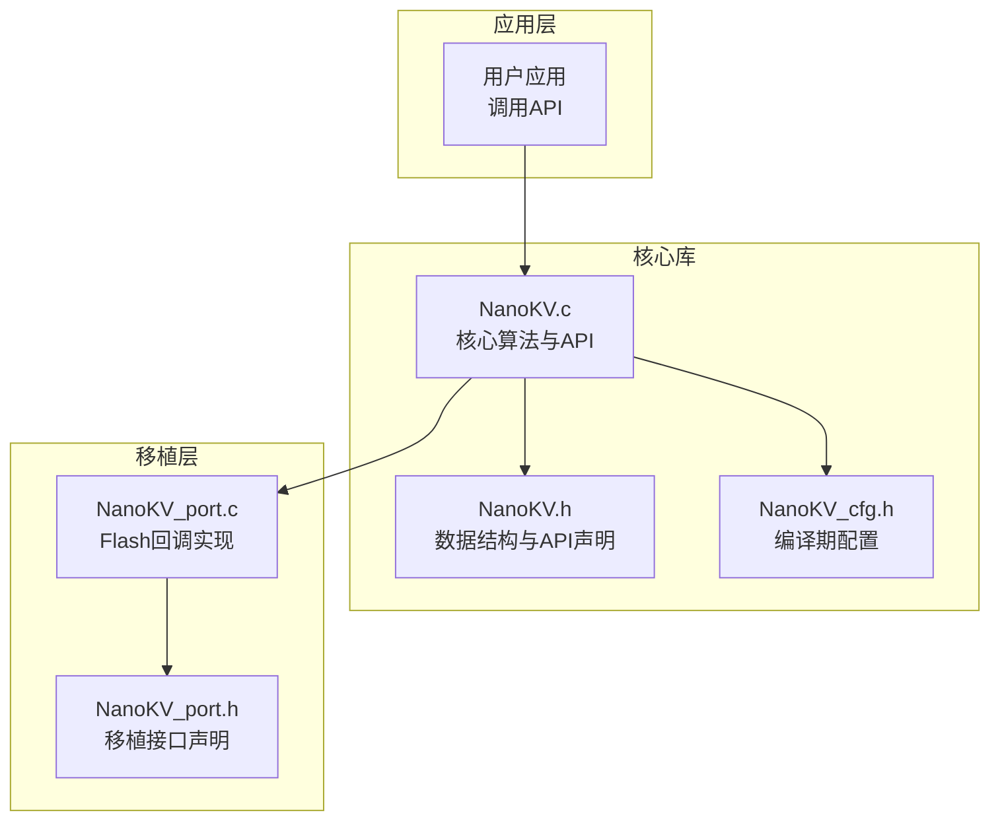
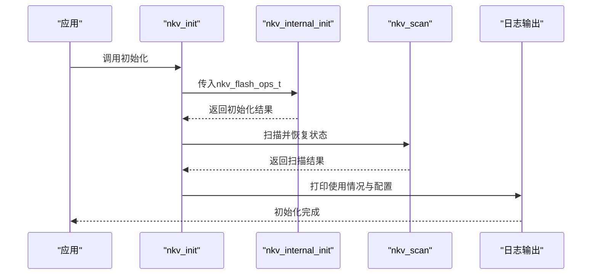
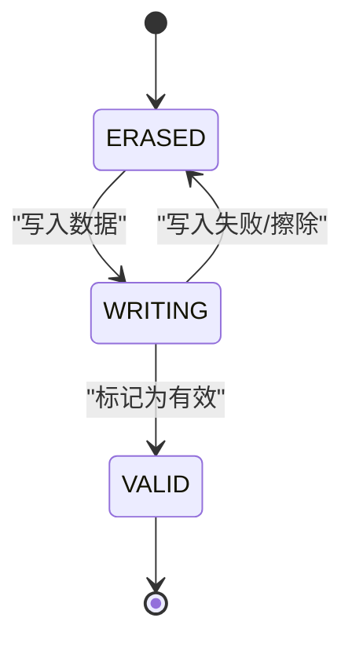
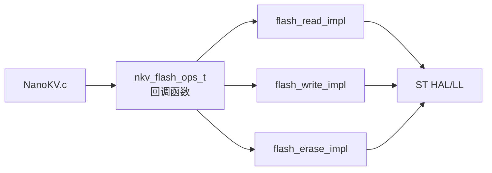

# STM32F407移植实现

<cite>
**本文引用的文件**
- [NanoKV.c](file://NanoKV.c)
- [NanoKV.h](file://NanoKV.h)
- [NanoKV_cfg.h](file://NanoKV_cfg.h)
- [NanoKV_port.c](file://NanoKV_port.c)
- [NanoKV_port.h](file://NanoKV_port.h)
</cite>

## 目录
1. [简介](#简介)
2. [项目结构](#项目结构)
3. [核心组件](#核心组件)
4. [架构总览](#架构总览)
5. [详细组件分析](#详细组件分析)
6. [依赖关系分析](#依赖关系分析)
7. [性能考虑](#性能考虑)
8. [故障排查指南](#故障排查指南)
9. [结论](#结论)
10. [附录](#附录)

## 简介
本指南面向在STM32F407平台上移植NanoKV嵌入式KV/TLV存储库的开发者。文档聚焦于NanoKV_port.c中针对STM32F407的移植实现细节，包括Flash存储器的初始化配置、寄存器操作、时钟设置等；解释ST官方库（HAL/LL）的使用方法，包括如何集成和配置FLASH_OTA库；详细说明STM32F407的Flash特性（扇区划分、页大小、写入擦除操作等）；提供完整的移植代码示例，涵盖nkv_flash_ops_t结构体中各回调函数的具体实现；分析中断处理、DMA传输、时序控制等关键技术点；并包含调试方法与常见问题的解决方案（如地址映射错误、写入失败、擦除异常等）。

## 项目结构
仓库采用“核心库+移植层”的分层设计：
- 核心库：NanoKV.c、NanoKV.h、NanoKV_cfg.h，提供KV/TLV存储算法、GC、缓存、TLV历史与保留策略等逻辑。
- 移植层：NanoKV_port.c、NanoKV_port.h，负责Flash底层操作（读/写/擦除）、初始化与维护任务。

图表来源
- [NanoKV.c](file://NanoKV.c#L1-L1261)
- [NanoKV.h](file://NanoKV.h#L1-L257)
- [NanoKV_cfg.h](file://NanoKV_cfg.h#L1-L51)
- [NanoKV_port.c](file://NanoKV_port.c#L1-L95)
- [NanoKV_port.h](file://NanoKV_port.h#L1-L27)

章节来源
- [NanoKV.c](file://NanoKV.c#L1-L1261)
- [NanoKV.h](file://NanoKV.h#L1-L257)
- [NanoKV_cfg.h](file://NanoKV_cfg.h#L1-L51)
- [NanoKV_port.c](file://NanoKV_port.c#L1-L95)
- [NanoKV_port.h](file://NanoKV_port.h#L1-L27)

## 核心组件
- nkv_flash_ops_t：封装Flash读/写/擦除回调及Flash属性（基址、扇区大小、扇区数、对齐要求），供核心库统一调用。
- 移植层回调函数：flash_read_impl、flash_write_impl、flash_erase_impl，分别对应读取、编程、擦除。
- 初始化流程：nkv_init完成内部初始化、扫描恢复状态、打印使用情况，并可选地开启缓存与增量GC。

章节来源
- [NanoKV.h](file://NanoKV.h#L68-L83)
- [NanoKV_port.c](file://NanoKV_port.c#L18-L88)

## 架构总览
NanoKV通过nkv_flash_ops_t抽象Flash硬件差异，移植层仅需实现三个回调函数即可适配不同MCU/Flash组合。STM32F407的Flash特性如下：
- 基址：0x08080000（KV分区起始）
- 扇区大小：128KB
- 扇区数量：4
- 总容量：512KB
- 对齐要求：4字节对齐

图表来源
- [NanoKV_port.c](file://NanoKV_port.c#L54-L88)
- [NanoKV.c](file://NanoKV.c#L628-L674)

章节来源
- [NanoKV_port.c](file://NanoKV_port.c#L12-L88)
- [NanoKV.c](file://NanoKV.c#L628-L674)

## 详细组件分析

### Flash配置与nkv_flash_ops_t
- Flash基址与分区规划：KV分区从0x08080000开始，占用4个128KB扇区，总容量512KB。
- 属性设置：sector_size、sector_count、align等字段由移植层提供给核心库。
- 回调函数指针：read/write/erase指向移植层实现。

章节来源
- [NanoKV_port.c](file://NanoKV_port.c#L12-L51)
- [NanoKV.h](file://NanoKV.h#L74-L83)

### 读取实现（flash_read_impl）
- 地址转换：将物理地址减去基址得到Flash内部偏移。
- 读取方式：建议使用ST HAL库的读取接口，按字节或半字/字对齐读取。
- 注意事项：确保地址对齐与边界检查，避免越界访问。

章节来源
- [NanoKV_port.c](file://NanoKV_port.c#L18-L24)

### 写入实现（flash_write_impl）
- 地址转换：同上。
- 写入方式：建议使用ST HAL库的编程接口，按4字节对齐编程。
- 关键点：写入前必须保证目标扇区已擦除；写入过程需遵循状态机（先写入状态为“写入中”，再写入有效数据，最后将状态标记为“有效”）。

章节来源
- [NanoKV_port.c](file://NanoKV_port.c#L27-L32)
- [NanoKV.c](file://NanoKV.c#L728-L750)

### 擦除实现（flash_erase_impl）
- 地址转换：同上。
- 擦除方式：建议使用ST HAL库的擦除接口，按扇区擦除。
- 关键点：擦除前确保无正在进行的写入操作；擦除后需验证状态。

章节来源
- [NanoKV_port.c](file://NanoKV_port.c#L35-L40)
- [NanoKV.c](file://NanoKV.c#L294-L308)

### 初始化与维护（nkv_init/nkv_task）
- 初始化：内部初始化、扫描恢复、打印使用情况。
- 维护任务：预留周期性维护入口（如增量GC步进）。

章节来源
- [NanoKV_port.c](file://NanoKV_port.c#L54-L95)
- [NanoKV.c](file://NanoKV.c#L825-L845)

### 关键数据结构与状态机
- 扇区头：包含魔数与序列号，用于识别有效分区。
- 条目头：包含状态、键长、值长，配合CRC校验保证完整性。
- 状态机：ERASED -> WRITING -> VALID，确保掉电安全。

图表来源
- [NanoKV.h](file://NanoKV.h#L25-L29)
- [NanoKV.c](file://NanoKV.c#L728-L750)

章节来源
- [NanoKV.h](file://NanoKV.h#L45-L58)
- [NanoKV.c](file://NanoKV.c#L728-L750)

### STM32F407 Flash特性与时序
- 扇区划分：STM32F407标准Flash按64KB或128KB扇区组织（此处使用128KB）。
- 页大小：通常为256字节，编程需按页对齐。
- 写入/擦除时序：写入前擦除、写入后状态机转换、擦除后验证。
- 对齐要求：4字节对齐，避免单字节写入导致未编程区域。

章节来源
- [NanoKV_port.c](file://NanoKV_port.c#L12-L17)
- [NanoKV.h](file://NanoKV.h#L79-L83)

### ST官方库集成与配置
- HAL库：推荐使用HAL_FLASH模块进行读/写/擦除操作，确保线程安全与时序正确。
- LL库：若追求更低开销，可使用LL层直接寄存器操作，但需严格遵循时序。
- FLASH_OTA库：若项目已有OTA需求，可在移植层中复用其擦写接口，但需确保与NanoKV的状态机兼容。

章节来源
- [NanoKV_port.c](file://NanoKV_port.c#L18-L40)

### 中断处理与DMA传输
- 中断：Flash操作期间避免打断，必要时关闭中断或使用临界区。
- DMA：对于大批量读取可考虑DMA，但需注意与Flash编程的互斥。
- 时序控制：严格遵循参考手册的时序参数，避免超频或时序违规。

章节来源
- [NanoKV.c](file://NanoKV.c#L728-L750)

## 依赖关系分析
- 核心库依赖移植层提供的nkv_flash_ops_t，不直接依赖任何MCU/Flash实现。
- 移植层依赖ST HAL/LL库（建议）或直接寄存器操作。
- 配置文件影响运行时行为（缓存、增量GC、TLV保留策略等）。

图表来源
- [NanoKV.c](file://NanoKV.c#L628-L640)
- [NanoKV.h](file://NanoKV.h#L68-L83)
- [NanoKV_port.c](file://NanoKV_port.c#L18-L51)

章节来源
- [NanoKV.c](file://NanoKV.c#L628-L640)
- [NanoKV.h](file://NanoKV.h#L68-L83)
- [NanoKV_port.c](file://NanoKV_port.c#L18-L51)

## 性能考虑
- 写入路径：采用追加写入与多扇区环形布局，降低擦写次数，延长Flash寿命。
- 增量GC：分摊GC开销，避免长时间阻塞，适合实时系统。
- 缓存：LFU缓存加速热点数据访问，减少Flash读取次数。
- 对齐与对齐粒度：4字节对齐可提升写入效率，避免不必要的拆分。

章节来源
- [NanoKV_cfg.h](file://NanoKV_cfg.h#L14-L21)
- [NanoKV.c](file://NanoKV.c#L87-L169)

## 故障排查指南
- 地址映射错误
  - 症状：读写返回失败、地址越界。
  - 排查：确认基址与分区规划一致；检查地址转换公式；核对sector_base与align。
  - 修复：修正基址或分区起始地址，确保offset非负且在扇区内。
  
  章节来源
  - [NanoKV_port.c](file://NanoKV_port.c#L18-L40)
  - [NanoKV.h](file://NanoKV.h#L79-L83)

- 写入失败
  - 症状：写入返回错误码NKV_ERR_FLASH。
  - 排查：检查扇区是否已擦除、对齐是否满足、状态机是否正确（先写入状态，再写入数据，最后标记有效）。
  - 修复：在写入前执行擦除；确保4字节对齐；严格遵循状态机。
  
  章节来源
  - [NanoKV.c](file://NanoKV.c#L728-L750)

- 擦除异常
  - 症状：擦除后仍无法写入、状态未更新。
  - 排查：确认擦除扇区地址正确、擦除完成后进行状态验证。
  - 修复：增加擦除后读取验证；必要时重试或格式化。
  
  章节来源
  - [NanoKV.c](file://NanoKV.c#L294-L308)

- 空间不足
  - 症状：写入返回NKV_ERR_NO_SPACE。
  - 排查：检查当前扇区写入偏移与可用空间；确认GC是否触发。
  - 修复：触发全量GC或切换到新扇区；优化键值长度或启用增量GC。
  
  章节来源
  - [NanoKV.c](file://NanoKV.c#L708-L726)

- 参数无效
  - 症状：初始化或API调用返回NKV_ERR_INVALID。
  - 排查：检查ops字段完整性、sector_count≥2、align为2或4。
  - 修复：补齐回调函数指针，调整配置参数。
  
  章节来源
  - [NanoKV.c](file://NanoKV.c#L628-L640)

## 结论
通过在NanoKV_port.c中实现读/写/擦除回调，并正确配置Flash分区与对齐参数，即可在STM32F407上稳定运行NanoKV。结合ST HAL/LL库与合理的中断/DMA策略，可进一步提升可靠性与性能。建议在开发过程中严格遵循状态机与对齐规则，配合增量GC与缓存机制，获得最佳的嵌入式存储体验。

## 附录
- 配置项参考
  - 键/值长度上限、缓存大小、增量GC步数与阈值、TLV保留策略等均在配置文件中定义。
- API参考
  - 初始化：nkv_init
  - 基础操作：nkv_set、nkv_get、nkv_del、nkv_exists、nkv_get_usage
  - 默认值：nkv_set_defaults、nkv_get_default、nkv_reset_key、nkv_reset_all
  - 增量GC：nkv_gc_step、nkv_gc_active
  - 缓存：nkv_cache_stats、nkv_cache_clear
  - TLV：nkv_tlv_set、nkv_tlv_get、nkv_tlv_del、nkv_tlv_iter_*、nkv_tlv_get_history、nkv_tlv_set_retention

章节来源
- [NanoKV_cfg.h](file://NanoKV_cfg.h#L10-L26)
- [NanoKV.h](file://NanoKV.h#L135-L168)
- [NanoKV.h](file://NanoKV.h#L176-L247)