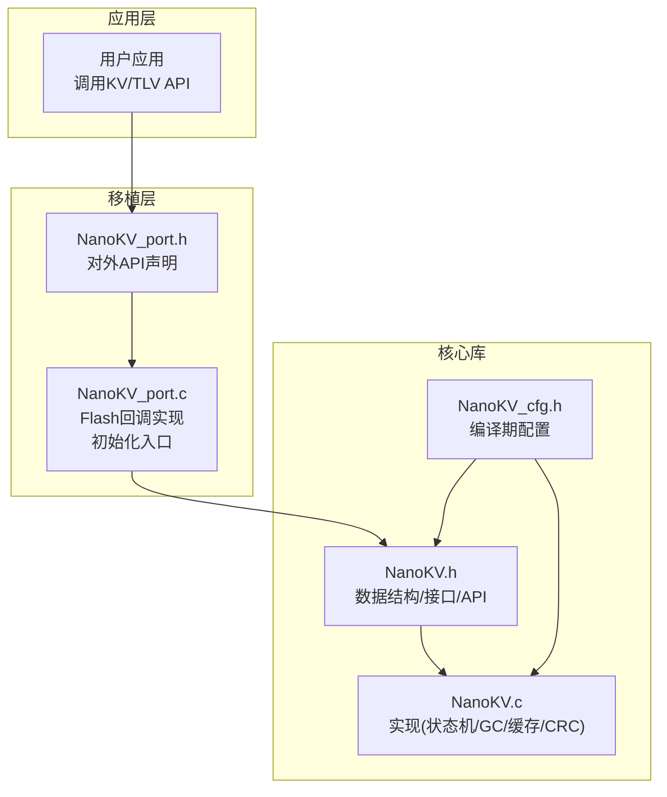
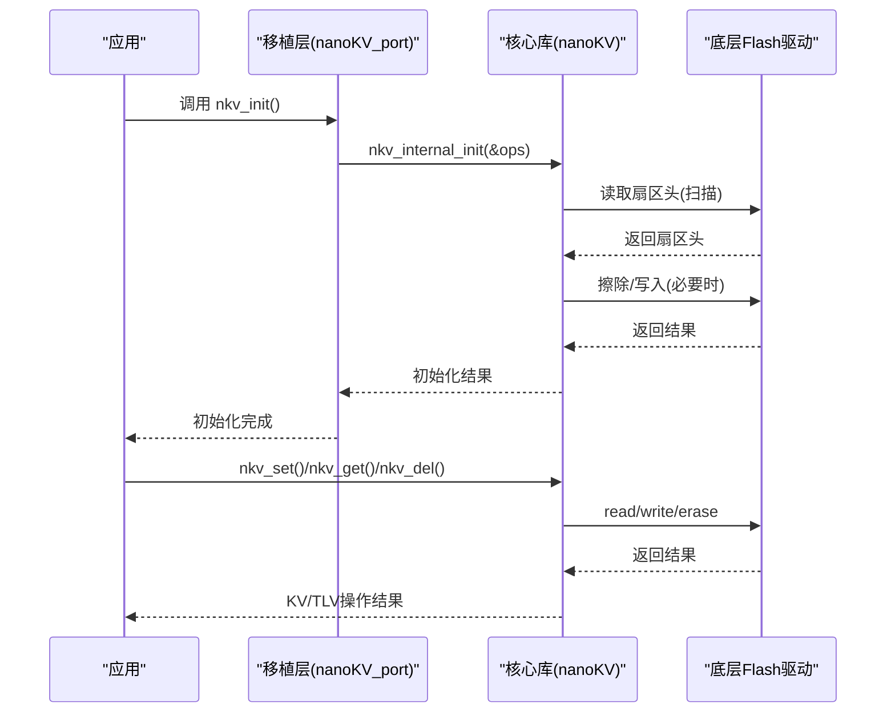
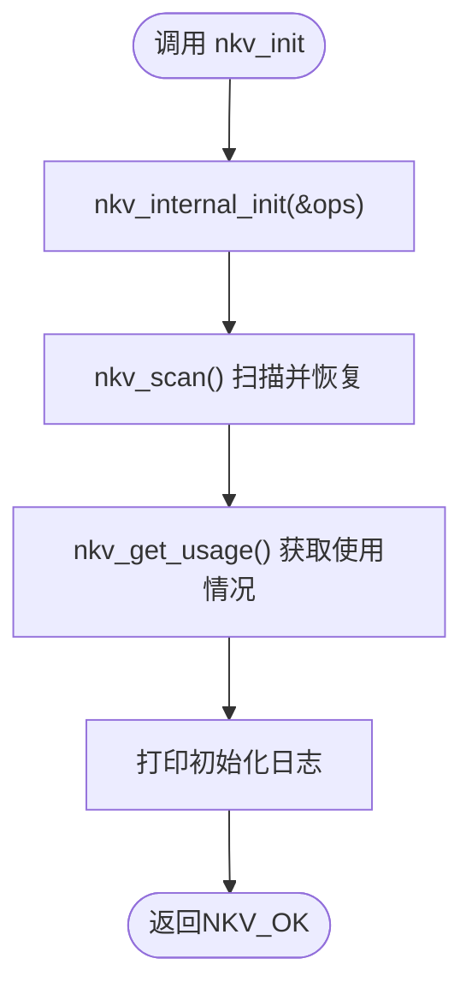
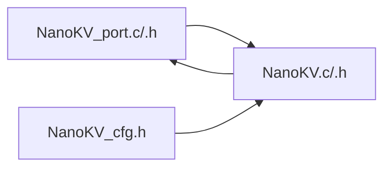

# 移植层开发

<cite>
**本文引用的文件**
- [NanoKV.h](file://NanoKV.h)
- [NanoKV.c](file://NanoKV.c)
- [NanoKV_port.h](file://NanoKV_port.h)
- [NanoKV_port.c](file://NanoKV_port.c)
- [NanoKV_cfg.h](file://NanoKV_cfg.h)
</cite>

## 目录
1. [简介](#简介)
2. [项目结构](#项目结构)
3. [核心组件](#核心组件)
4. [架构总览](#架构总览)
5. [详细组件分析](#详细组件分析)
6. [依赖关系分析](#依赖关系分析)
7. [性能考量](#性能考量)
8. [故障排查指南](#故障排查指南)
9. [结论](#结论)
10. [附录](#附录)

## 简介
本指南面向嵌入式开发者，提供NanoKV移植层的完整开发手册。内容涵盖移植层设计原理、接口规范、Flash读写擦除抽象、多硬件平台移植示例（重点为STM32F407）、nkv_flash_ops_t结构体各回调函数的实现要求与注意事项、Flash存储器物理特性（扇区划分、对齐要求、擦除粒度）、常见问题与解决方案（地址映射、中断处理、DMA传输）、移植验证方法与性能测试工具，以及每步移植的最佳实践与参考路径。

## 项目结构
仓库采用“核心库+移植层”的分层组织方式：
- 核心库：NanoKV.h/NanoKV.c 提供KV/TLV存储、状态机、GC、缓存、CRC等实现
- 移植层：NanoKV_port.h/NanoKV_port.c 定义Flash操作回调、初始化入口、日志宏
- 配置文件：NanoKV_cfg.h 提供编译期配置（键值长度、缓存、GC策略、调试输出）

图表来源
- [NanoKV_port.h](file://NanoKV_port.h#L1-L27)
- [NanoKV_port.c](file://NanoKV_port.c#L1-L95)
- [NanoKV.h](file://NanoKV.h#L1-L257)
- [NanoKV.c](file://NanoKV.c#L1-L1261)
- [NanoKV_cfg.h](file://NanoKV_cfg.h#L1-L51)

章节来源
- [NanoKV.h](file://NanoKV.h#L1-L257)
- [NanoKV.c](file://NanoKV.c#L1-L1261)
- [NanoKV_port.h](file://NanoKV_port.h#L1-L27)
- [NanoKV_port.c](file://NanoKV_port.c#L1-L95)
- [NanoKV_cfg.h](file://NanoKV_cfg.h#L1-L51)

## 核心组件
- nkv_flash_ops_t：Flash操作回调集，包含读、写、擦除三类回调，以及Flash基地址、扇区大小、扇区数量、对齐粒度等硬件参数
- 移植层API：nkv_init、nkv_task（可选），负责初始化、扫描恢复、日志输出
- 核心API：KV/TLV设置、获取、删除、存在性检查、格式化、扫描、GC、缓存统计等
- 配置宏：键值长度上限、缓存开关与大小、增量GC策略、调试输出等

章节来源
- [NanoKV.h](file://NanoKV.h#L68-L83)
- [NanoKV.h](file://NanoKV.h#L133-L168)
- [NanoKV_port.h](file://NanoKV_port.h#L18-L24)
- [NanoKV_cfg.h](file://NanoKV_cfg.h#L10-L28)

## 架构总览
NanoKV通过移植层提供的nkv_flash_ops_t与底层Flash驱动解耦，核心库仅依赖回调函数与配置常量，从而适配不同MCU与Flash控制器。

图表来源
- [NanoKV_port.c](file://NanoKV_port.c#L54-L88)
- [NanoKV.c](file://NanoKV.c#L628-L693)
- [NanoKV.c](file://NanoKV.c#L695-L763)
- [NanoKV.c](file://NanoKV.c#L765-L798)

## 详细组件分析

### nkv_flash_ops_t 结构体与回调函数
- 字段说明
  - read：读回调，参数为Flash绝对地址、缓冲指针、长度；返回0表示成功
  - write：写回调，参数为Flash绝对地址、写入缓冲、长度；返回0表示成功
  - erase：擦除回调，参数为要擦除的扇区首地址（通常为扇区对齐的地址）；返回0表示成功
  - base：Flash基地址（通常为0或设备Flash起始地址）
  - sector_size：扇区大小（字节）
  - sector_count：扇区数量（≥2）
  - align：对齐字节数（常见为2或4）

- 实现要求与注意事项
  - 地址有效性：回调内需确保addr在[base, base + sector_size*sector_count)范围内
  - 对齐要求：写/读长度可能受align限制，建议在上层按align对齐，或在回调内部进行边界处理
  - 擦除粒度：擦除必须按sector_size对齐，且擦除后状态应视为已擦除（0xFFFF）
  - 并发与中断：在多线程/中断场景下，回调需保证原子性或使用互斥保护
  - 错误处理：返回非0即视为失败，核心库会据此转换为错误码

章节来源
- [NanoKV.h](file://NanoKV.h#L68-L83)
- [NanoKV.h](file://NanoKV.h#L24-L31)
- [NanoKV.c](file://NanoKV.c#L628-L640)

### 移植层初始化流程
- nkv_init
  - 调用nkv_internal_init传入nkv_flash_ops_t
  - 调用nkv_scan进行扇区扫描与状态恢复
  - 输出使用情况与特性信息（调试宏开启时）
- nkv_task（可选）
  - 可在此周期性触发增量GC或其他维护任务

图表来源
- [NanoKV_port.c](file://NanoKV_port.c#L54-L88)
- [NanoKV.c](file://NanoKV.c#L628-L693)
- [NanoKV.c](file://NanoKV.c#L817-L823)

章节来源
- [NanoKV_port.c](file://NanoKV_port.c#L54-L88)
- [NanoKV.c](file://NanoKV.c#L628-L693)
- [NanoKV.c](file://NanoKV.c#L817-L823)

### Flash物理特性与对齐要求
- 扇区划分：多扇区环形布局，通过扇区头序号(seq)与魔数(magic)识别活动扇区
- 对齐要求：核心库提供ALIGN宏，建议在上层按align对齐；常见为2或4字节
- 擦除粒度：擦除必须按sector_size对齐，且擦除后视为已擦除状态
- 写入状态机：写入采用“WRITING→VALID”两阶段，结合CRC校验保障掉电安全

章节来源
- [NanoKV.h](file://NanoKV.h#L24-L31)
- [NanoKV.h](file://NanoKV.h#L45-L50)
- [NanoKV.c](file://NanoKV.c#L24-L26)
- [NanoKV.c](file://NanoKV.c#L728-L750)

### STM32F407 移植示例（基于现有模板）
当前移植层模板已给出STM32F407的Flash分区参数与回调占位实现，实际移植时需替换为具体Flash驱动接口。

- Flash分区参数（示例）
  - 基地址：NKV_FLASH_BASE
  - 扇区大小：NKV_SECTOR_SIZE（例如128KB）
  - 扇区数量：NKV_SECTOR_COUNT（例如4）
  - 对齐：align=4（STM32F407典型要求）
- 回调实现要点
  - flash_read_impl：使用HAL库或寄存器直接读取
  - flash_write_impl：使用HAL库或寄存器写入，注意对齐与状态机
  - flash_erase_impl：使用HAL库擦除扇区，确保按sector_size对齐
- 初始化
  - 将g_flash_ops注册给nkv_internal_init
  - 调用nkv_scan完成恢复

章节来源
- [NanoKV_port.c](file://NanoKV_port.c#L12-L17)
- [NanoKV_port.c](file://NanoKV_port.c#L18-L40)
- [NanoKV_port.c](file://NanoKV_port.c#L42-L51)
- [NanoKV_port.c](file://NanoKV_port.c#L54-L88)

### 其他硬件平台移植思路
- ESP32/ESP32-S3
  - 使用SPI Flash驱动（如ESP-IDF SPIFFS或自研驱动）
  - 注意SPI Flash的块/扇区对齐与写入粒度
- GD32系列
  - 使用GD32官方Flash库，遵循其擦除/写入对齐规则
- STM32F1/F3/F7/H7
  - 参考对应系列的Flash编程手册，统一擦除粒度与写入对齐
- Winbond/W25Q/W25X系列
  - 使用标准SPI命令序列，注意扇区/块对齐与写入状态轮询

提示：无论何种平台，均需满足nkv_flash_ops_t的回调契约与对齐约束。

### nkv_flash_ops_t 回调函数实现最佳实践
- 读回调
  - 必须支持任意对齐的读取
  - 返回0表示成功，非0表示失败
- 写回调
  - 必须按align对齐写入
  - 写入前确保目标扇区已擦除或即将被擦除
  - 写入后立即进入“WRITING→VALID”状态机
- 擦除回调
  - 必须按sector_size对齐
  - 擦除完成后，后续读取应返回已擦除状态
- 错误传播
  - 回调返回非0，核心库将转换为NKV_ERR_FLASH或NKV_ERR_NO_SPACE等

章节来源
- [NanoKV.h](file://NanoKV.h#L68-L83)
- [NanoKV.c](file://NanoKV.c#L728-L750)
- [NanoKV.c](file://NanoKV.c#L297-L299)

### 增量GC与全量GC
- 增量GC
  - 通过nkv_gc_step手动推进，或在写入后自动触发
  - 逐条扫描旧扇区，按哈希去重，迁移有效条目
- 全量GC
  - 当无可用扇区时触发，遍历所有扇区，清理无效条目并迁移有效数据
- 保留策略（TLV）
  - 支持为特定类型保留最近N条历史记录，避免迁移

章节来源
- [NanoKV.c](file://NanoKV.c#L490-L624)
- [NanoKV.c](file://NanoKV.c#L399-L487)
- [NanoKV.c](file://NanoKV.c#L1222-L1260)

### 缓存机制（LFU）
- 启用条件：NKV_CACHE_ENABLE=1
- LFU替换策略：按访问次数选择最少访问条目进行替换
- 统计：命中/未命中计数与命中率

章节来源
- [NanoKV.h](file://NanoKV.h#L86-L110)
- [NanoKV.c](file://NanoKV.c#L87-L169)
- [NanoKV.c](file://NanoKV.c#L847-L862)

### 默认值支持
- KV默认值：nkv_set_defaults + nkv_get_default + nkv_reset_key/all
- TLV默认值：nkv_tlv_set_defaults + nkv_tlv_get_default + nkv_tlv_reset_type/all

章节来源
- [NanoKV.h](file://NanoKV.h#L60-L66)
- [NanoKV.h](file://NanoKV.h#L147-L152)
- [NanoKV.c](file://NanoKV.c#L866-L933)
- [NanoKV.c](file://NanoKV.c#L1013-L1064)

## 依赖关系分析
- 移植层依赖核心库的API与数据结构
- 核心库依赖移植层提供的nkv_flash_ops_t
- 配置文件影响核心库行为（缓存、GC、调试输出）

图表来源
- [NanoKV_port.h](file://NanoKV_port.h#L10-L15)
- [NanoKV_port.c](file://NanoKV_port.c#L9-L9)
- [NanoKV.h](file://NanoKV.h#L19-L22)
- [NanoKV.c](file://NanoKV.c#L16-L18)
- [NanoKV_cfg.h](file://NanoKV_cfg.h#L1-L51)

章节来源
- [NanoKV_port.h](file://NanoKV_port.h#L10-L15)
- [NanoKV_port.c](file://NanoKV_port.c#L9-L9)
- [NanoKV.h](file://NanoKV.h#L19-L22)
- [NanoKV.c](file://NanoKV.c#L16-L18)
- [NanoKV_cfg.h](file://NanoKV_cfg.h#L1-L51)

## 性能考量
- 写入路径
  - 追加写入减少擦除次数，降低Flash磨损
  - 增量GC分摊GC开销，避免长阻塞
- 缓存
  - 启用LFU缓存可显著提升热点数据读取性能
- 对齐与擦除
  - 严格遵守align与sector_size对齐，避免多次擦写
- DMA与中断
  - 在回调中避免阻塞，必要时使用DMA或异步接口
  - 在中断上下文中谨慎调用Flash操作

章节来源
- [NanoKV.h](file://NanoKV.h#L7-L13)
- [NanoKV_cfg.h](file://NanoKV_cfg.h#L14-L21)
- [NanoKV.c](file://NanoKV.c#L87-L169)
- [NanoKV.c](file://NanoKV.c#L490-L624)

## 故障排查指南
- 初始化失败
  - 检查nkv_internal_init参数合法性（回调非空、扇区数≥2、align合法）
  - 检查nkv_scan读取是否成功
- 写入失败
  - 检查写入对齐与长度
  - 检查扇区是否足够（空间不足时触发GC或切换扇区）
- 擦除失败
  - 检查擦除地址是否按sector_size对齐
  - 检查底层驱动是否支持该地址范围
- 数据不一致
  - 检查状态机是否正确从WRITING→VALID
  - 检查CRC校验是否通过
- 中断/多线程问题
  - 在回调中加锁或避免在中断中调用阻塞Flash操作
- 调试输出
  - 开启NKV_DEBUG_ENABLE后，使用NKV_LOG_I/NKV_LOG_E查看运行日志

章节来源
- [NanoKV.c](file://NanoKV.c#L628-L640)
- [NanoKV.c](file://NanoKV.c#L642-L693)
- [NanoKV.c](file://NanoKV.c#L695-L763)
- [NanoKV.c](file://NanoKV.c#L765-L798)
- [NanoKV_cfg.h](file://NanoKV_cfg.h#L28-L48)

## 结论
NanoKV通过nkv_flash_ops_t实现了与底层Flash驱动的完全解耦，移植层只需提供读/写/擦除三个回调与必要的硬件参数，即可在多种MCU平台上稳定运行。遵循对齐、擦除粒度与状态机要求，配合增量GC与缓存策略，可在资源受限的嵌入式环境中实现高性能、低磨损的KV/TLV存储。

## 附录

### 移植步骤清单
- 定义Flash分区参数（基地址、扇区大小、扇区数量、对齐）
- 实现nkv_read_fn/nkv_write_fn/nkv_erase_fn
- 构造nkv_flash_ops_t并传入nkv_internal_init
- 调用nkv_scan完成状态恢复
- 可选：实现nkv_task进行周期性维护
- 验证：写入/读取/删除/默认值/GC/缓存

章节来源
- [NanoKV_port.c](file://NanoKV_port.c#L12-L17)
- [NanoKV_port.c](file://NanoKV_port.c#L42-L51)
- [NanoKV_port.c](file://NanoKV_port.c#L54-L88)
- [NanoKV.c](file://NanoKV.c#L628-L693)

### 常见问题与解决方案速查
- 问：如何处理地址映射？
  - 答：回调中将绝对地址转换为底层Flash控制器可寻址的地址，或在上层统一管理映射
- 问：如何处理中断与DMA？
  - 答：在回调中避免阻塞；若底层使用DMA，确保回调返回时机与DMA完成事件一致
- 问：如何优化写入性能？
  - 答：启用缓存、合理配置GC阈值、确保对齐写入、减少不必要的擦除

章节来源
- [NanoKV.c](file://NanoKV.c#L87-L169)
- [NanoKV.c](file://NanoKV.c#L490-L624)