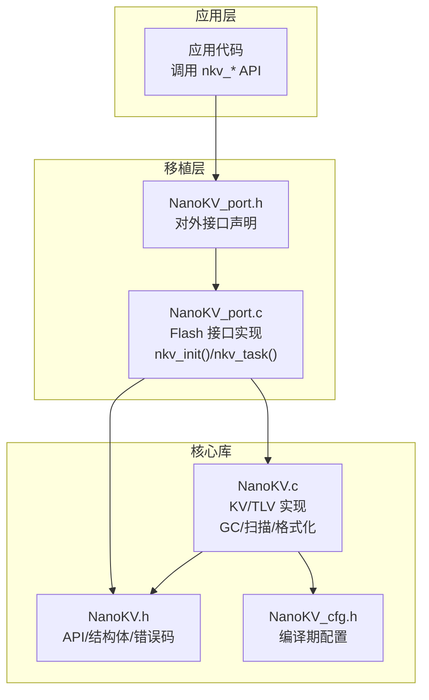
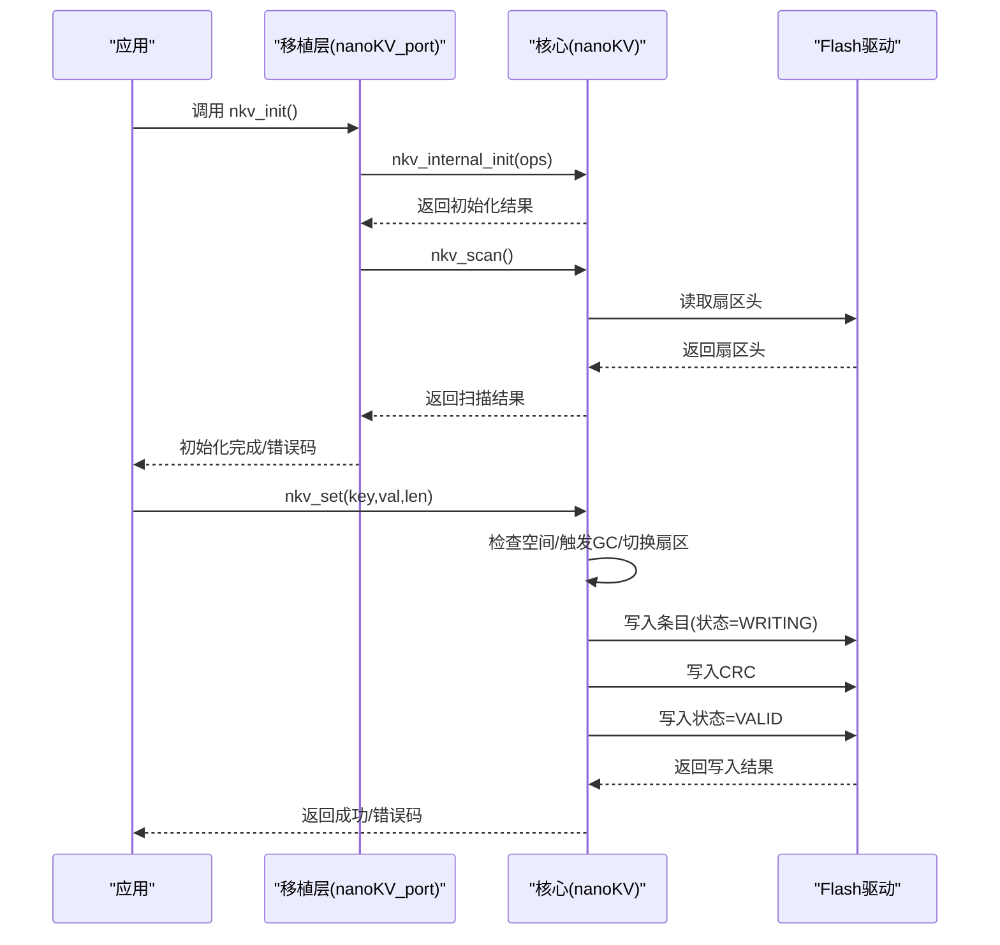
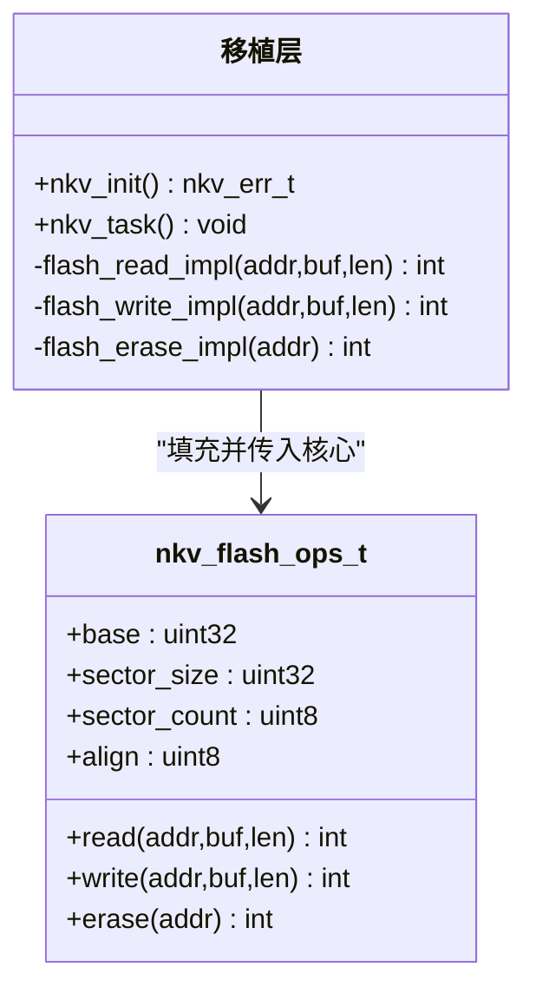
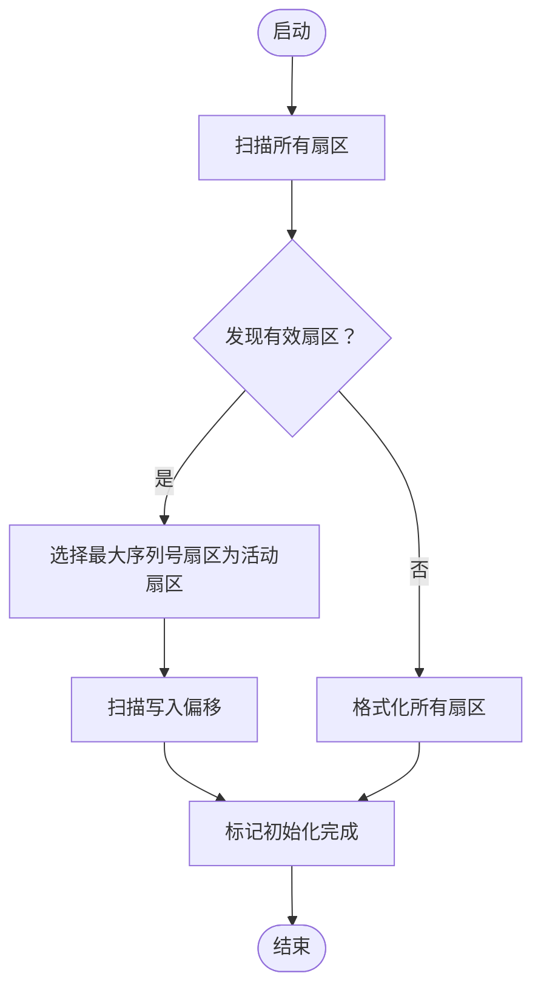
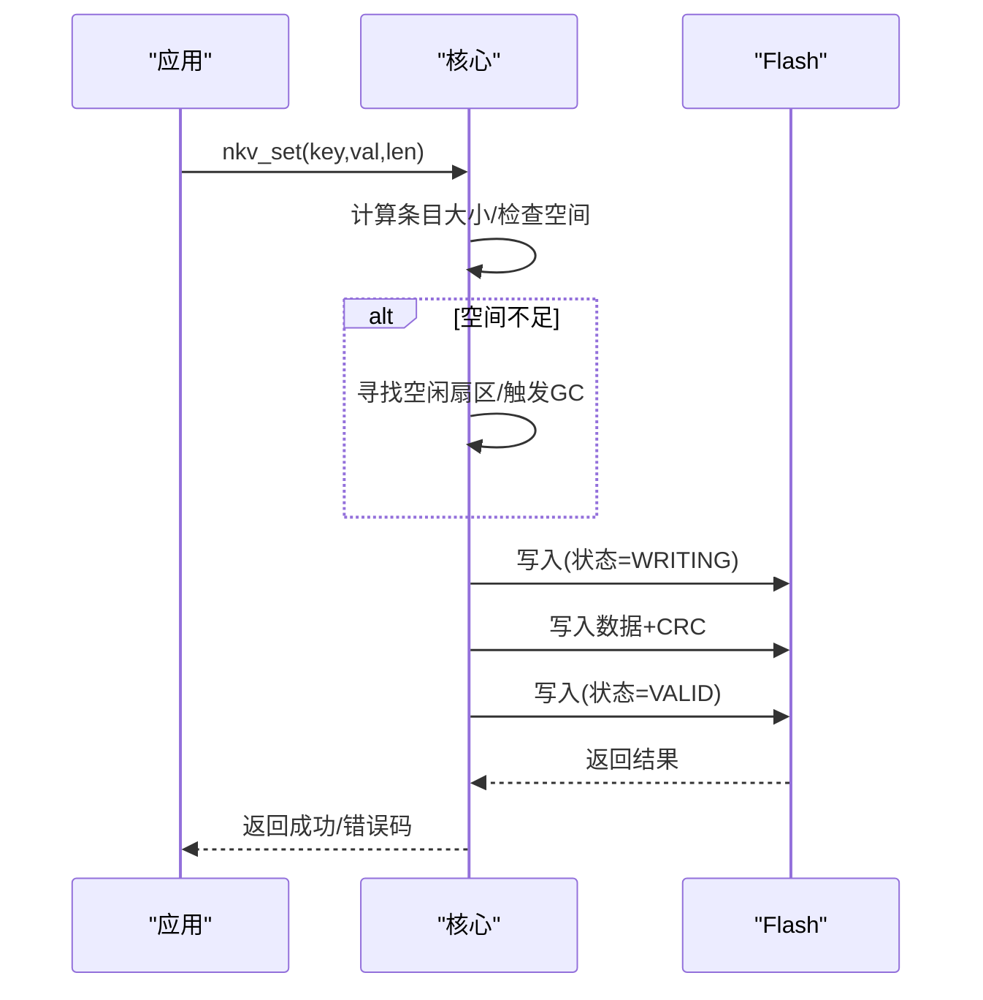
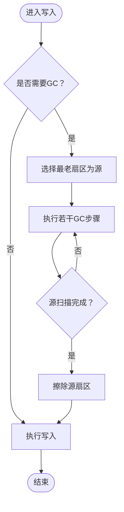
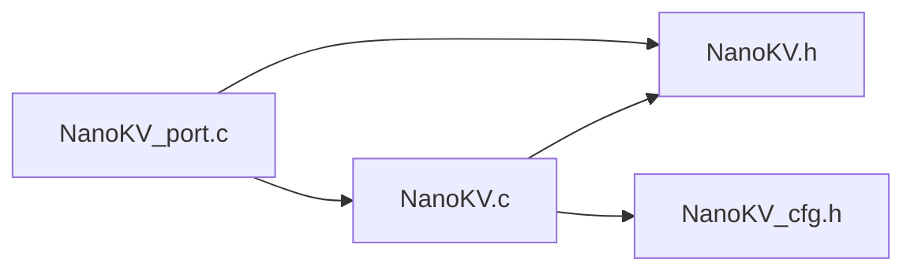

# 移植问题排查

<cite>
**本文引用的文件**
- [NanoKV.c](file://NanoKV.c)
- [NanoKV.h](file://NanoKV.h)
- [NanoKV_cfg.h](file://NanoKV_cfg.h)
- [NanoKV_port.c](file://NanoKV_port.c)
- [NanoKV_port.h](file://NanoKV_port.h)
</cite>

## 目录
1. [简介](#简介)
2. [项目结构](#项目结构)
3. [核心组件](#核心组件)
4. [架构总览](#架构总览)
5. [详细组件分析](#详细组件分析)
6. [依赖关系分析](#依赖关系分析)
7. [性能考量](#性能考量)
8. [故障排查指南](#故障排查指南)
9. [结论](#结论)
10. [附录](#附录)

## 简介
本指南面向在嵌入式平台上移植 NanoKV 的开发者，聚焦移植过程中的常见问题与系统性排查方法。内容覆盖 Flash 初始化失败、地址映射错误、写入擦除异常、数据完整性校验失败等问题，提供诊断流程、调试技巧、错误码含义、工具使用方法、思维导图与检查清单、预防性措施与最佳实践，以及社区支持与反馈渠道。

## 项目结构
该仓库采用“核心实现 + 移植层 + 配置”的分层设计：
- 核心实现：NanoKV.c 提供 KV/TLV 存储、多扇区环形、增量 GC、掉电安全、CRC 校验等核心逻辑
- 头文件：NanoKV.h 定义公共 API、数据结构、错误码、配置开关
- 配置：NanoKV_cfg.h 提供编译期配置（键值长度、缓存、GC、TLV 保留策略、调试输出）
- 移植层：NanoKV_port.c/NanoKV_port.h 封装 Flash 读写擦除接口与初始化流程



图表来源
- [NanoKV_port.c](file://NanoKV_port.c#L1-L95)
- [NanoKV_port.h](file://NanoKV_port.h#L1-L27)
- [NanoKV.c](file://NanoKV.c#L1-L1261)
- [NanoKV.h](file://NanoKV.h#L1-L257)
- [NanoKV_cfg.h](file://NanoKV_cfg.h#L1-L51)

章节来源
- [NanoKV.c](file://NanoKV.c#L1-L1261)
- [NanoKV.h](file://NanoKV.h#L1-L257)
- [NanoKV_cfg.h](file://NanoKV_cfg.h#L1-L51)
- [NanoKV_port.c](file://NanoKV_port.c#L1-L95)
- [NanoKV_port.h](file://NanoKV_port.h#L1-L27)

## 核心组件
- Flash 抽象层：通过 nkv_flash_ops_t 暴露 read/write/erase 回调，移植层负责对接具体芯片 Flash
- 扇区管理：多扇区环形结构，支持磨损均衡；扫描/格式化阶段确定活动扇区与写入偏移
- 增量 GC：分步迁移有效条目，避免长时间阻塞；可配置每次写入迁移条目数
- 数据完整性：状态机（ERASED → WRITING → VALID）+ CRC16 校验
- KV/TLV：KV 支持默认值回退；TLV 支持历史记录、保留策略

章节来源
- [NanoKV.h](file://NanoKV.h#L68-L83)
- [NanoKV.h](file://NanoKV.h#L113-L131)
- [NanoKV.h](file://NanoKV.h#L33-L41)
- [NanoKV.c](file://NanoKV.c#L628-L640)
- [NanoKV.c](file://NanoKV.c#L642-L693)
- [NanoKV.c](file://NanoKV.c#L399-L487)
- [NanoKV.c](file://NanoKV.c#L490-L624)

## 架构总览
下图展示从应用到 Flash 的调用链路与关键状态转换。



图表来源
- [NanoKV_port.c](file://NanoKV_port.c#L54-L88)
- [NanoKV.c](file://NanoKV.c#L628-L640)
- [NanoKV.c](file://NanoKV.c#L642-L693)
- [NanoKV.c](file://NanoKV.c#L695-L763)

## 详细组件分析

### 组件一：Flash 抽象与移植层
- 职责：封装底层 Flash 读写擦除，提供 nkv_flash_ops_t；在移植层中实现具体接口
- 关键点：
  - 基地址、扇区大小、扇区数量、对齐要求需与硬件一致
  - read/write/erase 必须返回 0 表示成功，非 0 表示失败
  - 初始化时会校验 ops 的有效性与最小扇区数、对齐值



图表来源
- [NanoKV.h](file://NanoKV.h#L68-L83)
- [NanoKV_port.c](file://NanoKV_port.c#L43-L51)
- [NanoKV_port.c](file://NanoKV_port.c#L18-L40)

章节来源
- [NanoKV.h](file://NanoKV.h#L68-L83)
- [NanoKV_port.c](file://NanoKV_port.c#L12-L51)
- [NanoKV.c](file://NanoKV.c#L628-L640)

### 组件二：扇区扫描与格式化
- 职责：启动时扫描所有扇区，选择最新序列号的扇区作为活动扇区；若无有效扇区则进行格式化
- 关键点：
  - 扇区头包含魔数与序列号
  - 写入偏移从扇区头之后开始扫描，遇到 ERASED 状态即停止



图表来源
- [NanoKV.c](file://NanoKV.c#L642-L693)
- [NanoKV.c](file://NanoKV.c#L211-L242)

章节来源
- [NanoKV.c](file://NanoKV.c#L642-L693)
- [NanoKV.c](file://NanoKV.c#L211-L242)

### 组件三：KV 写入与状态机
- 职责：追加写入，先写入状态=WRITING，再写入数据+CRC，最后写入状态=VALID
- 关键点：
  - 空间不足时优先尝试切换空闲扇区，否则触发全量 GC
  - 写入完成后可更新缓存（若启用）



图表来源
- [NanoKV.c](file://NanoKV.c#L695-L763)
- [NanoKV.c](file://NanoKV.c#L728-L750)

章节来源
- [NanoKV.c](file://NanoKV.c#L695-L763)
- [NanoKV.c](file://NanoKV.c#L728-L750)

### 组件四：增量 GC 与迁移
- 职责：在写入前后按步长迁移有效条目，避免长时间阻塞
- 关键点：
  - 选择最老的非活动扇区作为源
  - 使用位图避免重复迁移相同键
  - 迁移完成后擦除源扇区



图表来源
- [NanoKV.c](file://NanoKV.c#L490-L624)
- [NanoKV.c](file://NanoKV.c#L510-L607)

章节来源
- [NanoKV.c](file://NanoKV.c#L490-L624)
- [NanoKV.c](file://NanoKV.c#L510-L607)

### 组件五：TLV 与保留策略
- 职责：以类型-长度-值形式存储，支持历史记录与保留策略
- 关键点：
  - 通过 nkv_tlv_set/get/del/exists 等 API 操作
  - 保留策略基于“保留最新的 N 条”计算阈值，决定是否迁移

章节来源
- [NanoKV.c](file://NanoKV.c#L940-L1261)
- [NanoKV.h](file://NanoKV.h#L176-L247)

## 依赖关系分析
- 移植层依赖核心头文件与实现，向核心提供 Flash 操作回调
- 核心实现依赖配置头文件进行编译期开关控制
- 错误码与数据结构在公共头文件中统一定义



图表来源
- [NanoKV_port.c](file://NanoKV_port.c#L1-L95)
- [NanoKV.c](file://NanoKV.c#L1-L1261)
- [NanoKV.h](file://NanoKV.h#L1-L257)
- [NanoKV_cfg.h](file://NanoKV_cfg.h#L1-L51)

章节来源
- [NanoKV_port.c](file://NanoKV_port.c#L1-L95)
- [NanoKV.c](file://NanoKV.c#L1-L1261)
- [NanoKV.h](file://NanoKV.h#L1-L257)
- [NanoKV_cfg.h](file://NanoKV_cfg.h#L1-L51)

## 性能考量
- 增量 GC：通过每次写入迁移固定条目数，降低峰值延迟；可通过配置调整每次迁移数量
- 缓存：启用 LFU 缓存可显著提升热点读取性能，但需权衡内存占用
- 对齐与扇区大小：确保 align 与硬件对齐一致，避免写入失败
- 空间利用率：合理设置 GC 触发阈值，平衡碎片与 GC 开销

章节来源
- [NanoKV_cfg.h](file://NanoKV_cfg.h#L18-L21)
- [NanoKV.h](file://NanoKV.h#L85-L110)
- [NanoKV.c](file://NanoKV.c#L490-L624)

## 故障排查指南

### 一、常见问题与诊断方法

#### 1. Flash 初始化失败
- 现象：nkv_internal_init 或 nkv_scan 返回错误
- 可能原因：
  - ops 参数为空或回调函数指针为 NULL
  - 扇区数量小于最小值
  - 对齐值不满足要求（仅允许 2 或 4）
- 排查步骤：
  - 检查移植层是否正确填充 nkv_flash_ops_t
  - 确认 base/sector_size/sector_count/align 与硬件一致
  - 在移植层日志中确认初始化返回值
- 解决方案：
  - 修正 ops 结构体字段
  - 确保至少 2 个扇区
  - 设置 align 为 2 或 4

章节来源
- [NanoKV.c](file://NanoKV.c#L628-L640)
- [NanoKV_port.c](file://NanoKV_port.c#L43-L51)

#### 2. 地址映射错误
- 现象：读写擦除返回失败或数据异常
- 可能原因：
  - Flash 基地址配置错误
  - 扇区大小/数量与实际不一致
  - 对齐不正确导致写入越界
- 排查步骤：
  - 对照芯片手册核对基地址、扇区大小、扇区数量
  - 使用调试器查看实际地址是否落在 Flash 区域内
  - 检查 align 是否与硬件对齐一致
- 解决方案：
  - 修改移植层 Flash 配置常量
  - 确保地址计算正确（偏移 = 实际地址 - 基地址）

章节来源
- [NanoKV_port.c](file://NanoKV_port.c#L12-L17)
- [NanoKV_port.c](file://NanoKV_port.c#L18-L40)
- [NanoKV.h](file://NanoKV.h#L79-L82)

#### 3. 写入/擦除异常
- 现象：nkv_set 返回 Flash 错误或数据不可读
- 可能原因：
  - Flash 写入/擦除回调未实现或返回非 0
  - 写入时未按状态机顺序（WRITING→VALID）
  - CRC 校验失败导致条目被识别为无效
- 排查步骤：
  - 在移植层回调中增加日志，确认返回值
  - 检查写入顺序与 CRC 计算
  - 使用读取接口验证条目头状态
- 解决方案：
  - 实现正确的 Flash 读写擦除逻辑
  - 严格遵循状态机写入流程
  - 确保 CRC 计算与校验一致

章节来源
- [NanoKV.c](file://NanoKV.c#L728-L750)
- [NanoKV.c](file://NanoKV.c#L54-L64)
- [NanoKV.h](file://NanoKV.h#L25-L31)

#### 4. 数据完整性校验失败
- 现象：nkv_get 返回未找到或读取数据不正确
- 可能原因：
  - CRC 校验失败（数据损坏或读取错误）
  - 条目状态仍为 WRITING 或已被擦除
  - 键匹配器读取键名失败
- 排查步骤：
  - 检查条目头状态与 CRC 字段
  - 核对键名长度与内容
  - 使用 TLV 迭代器遍历验证
- 解决方案：
  - 修复读取路径与 CRC 校验
  - 确保写入完成后状态为 VALID

章节来源
- [NanoKV.c](file://NanoKV.c#L184-L208)
- [NanoKV.c](file://NanoKV.c#L765-L798)
- [NanoKV.c](file://NanoKV.c#L1067-L1132)

#### 5. 空间不足/写入失败
- 现象：nkv_set 返回空间不足
- 可能原因：
  - 当前扇区写入偏移已接近扇区末尾
  - 无可利用空闲扇区且 GC 无法释放空间
- 排查步骤：
  - 检查当前扇区使用情况与写入偏移
  - 观察 GC 是否正常启动与完成
- 解决方案：
  - 增加扇区数量或增大单扇区大小
  - 调整增量 GC 步长或阈值

章节来源
- [NanoKV.c](file://NanoKV.c#L708-L726)
- [NanoKV.c](file://NanoKV.c#L490-L624)

### 二、错误码含义与处理
- 成功：NKV_OK
- 未找到：NKV_ERR_NOT_FOUND
- 空间不足：NKV_ERR_NO_SPACE
- 参数无效：NKV_ERR_INVALID
- Flash 操作失败：NKV_ERR_FLASH

建议：
- 在移植层回调中统一返回 0/非 0
- 在上层根据错误码采取不同策略（重试、GC、格式化）

章节来源
- [NanoKV.h](file://NanoKV.h#L33-L41)

### 三、调试工具与技巧
- 逻辑分析仪/示波器：检查 Flash 时序（CE/WE/RE/OE）、地址线/数据线是否正确
- Flash 编程器：验证擦除/写入/读取的正确性
- 调试器：断点跟踪初始化、扫描、写入、GC 流程
- 日志：开启调试宏，输出关键路径返回值与中间状态

章节来源
- [NanoKV_cfg.h](file://NanoKV_cfg.h#L27-L48)
- [NanoKV_port.c](file://NanoKV_port.c#L56-L87)

### 四、问题定位思维导图
```mermaid
mindmap
ul
li 初始化
li Flash ops 校验
li 扇区数量/对齐
li 地址映射
li 基地址/大小/数量
li 偏移计算
li 写入流程
li 状态机顺序
li CRC 校验
li 读取流程
li 状态/键匹配/CRC
li GC/空间
li 空间不足
li 增量GC步长
li 工具验证
li 示波器/编程器
li 日志输出
```

### 五、检查清单
- [ ] Flash 基地址/扇区大小/数量/对齐配置正确
- [ ] 读写擦除回调实现并返回 0 表示成功
- [ ] 写入严格遵循 WRITING→VALID 状态机
- [ ] CRC 计算与校验一致
- [ ] 增量 GC 正常启动与完成
- [ ] 日志输出关键返回值与中间状态
- [ ] 使用示波器/编程器验证时序与数据

## 结论
移植 NanoKV 的关键在于正确实现 Flash 抽象层、严格遵循状态机与 CRC 校验、合理配置 GC 与缓存参数。通过系统化的排查流程、工具验证与日志输出，可以高效定位并解决移植过程中的绝大多数问题。建议在开发早期就建立完善的日志与工具链，以便快速迭代与回归测试。

## 附录

### A. 移植步骤与最佳实践
- 明确硬件参数：基地址、扇区大小、扇区数量、对齐
- 实现 Flash 回调：read/write/erase，返回 0 表示成功
- 配置编译选项：键值长度、缓存、GC、调试输出
- 先验证初始化与扫描，再进行读写与 GC
- 逐步增加负载，观察 GC 行为与性能表现

### B. 社区支持与反馈渠道
- 仓库 Issues：提交问题与需求
- 文档与示例：参考移植层实现与配置说明
- 版本与变更：关注版本更新与兼容性说明