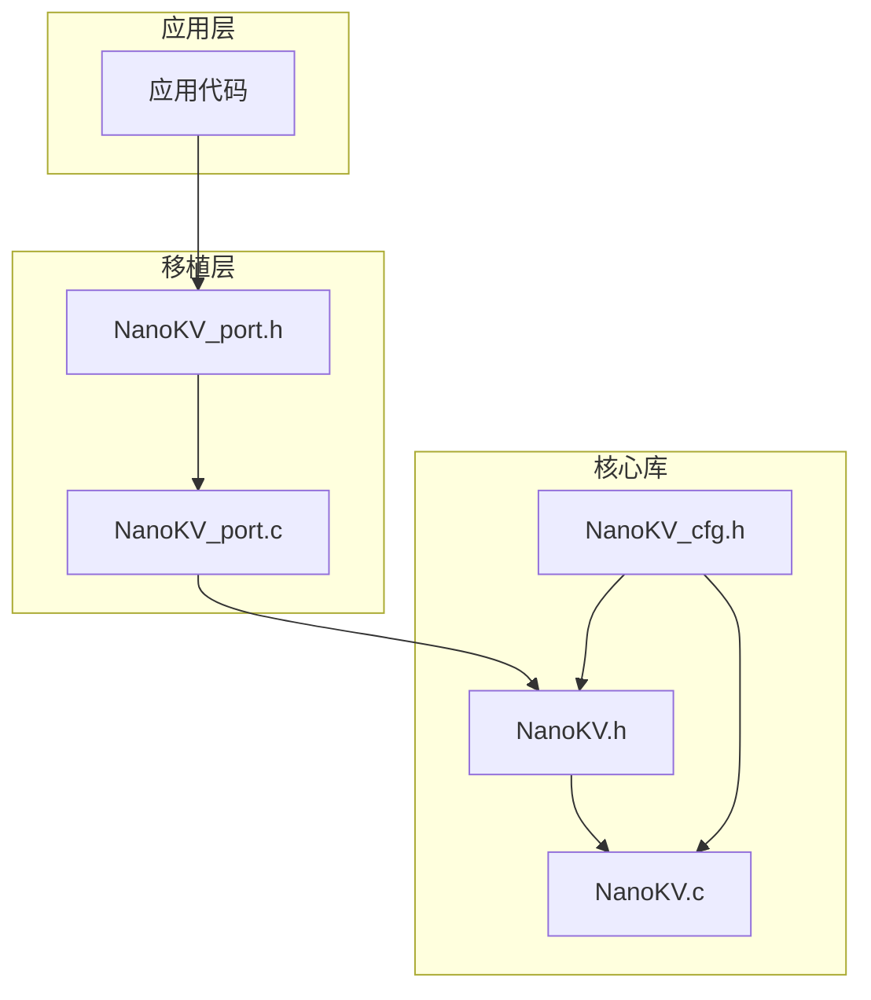
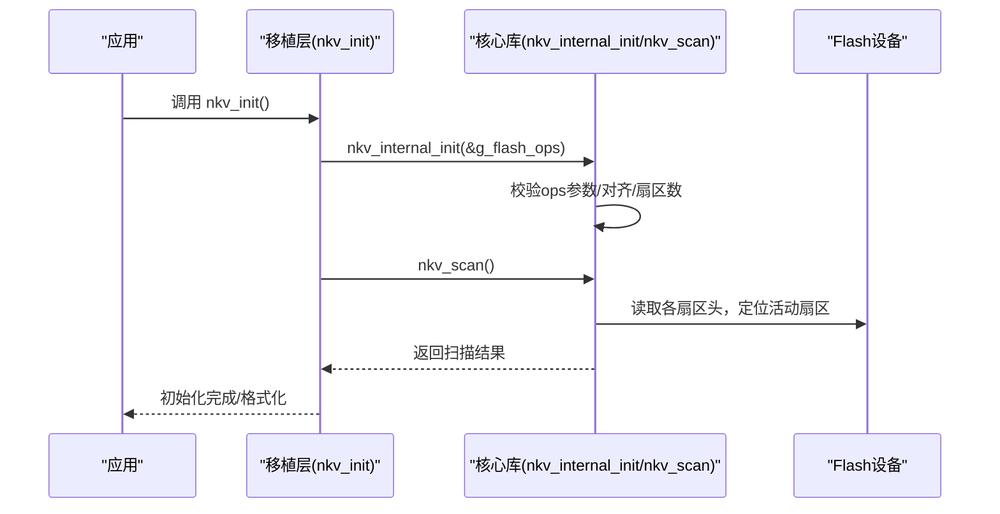
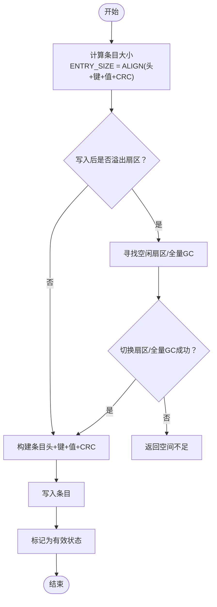
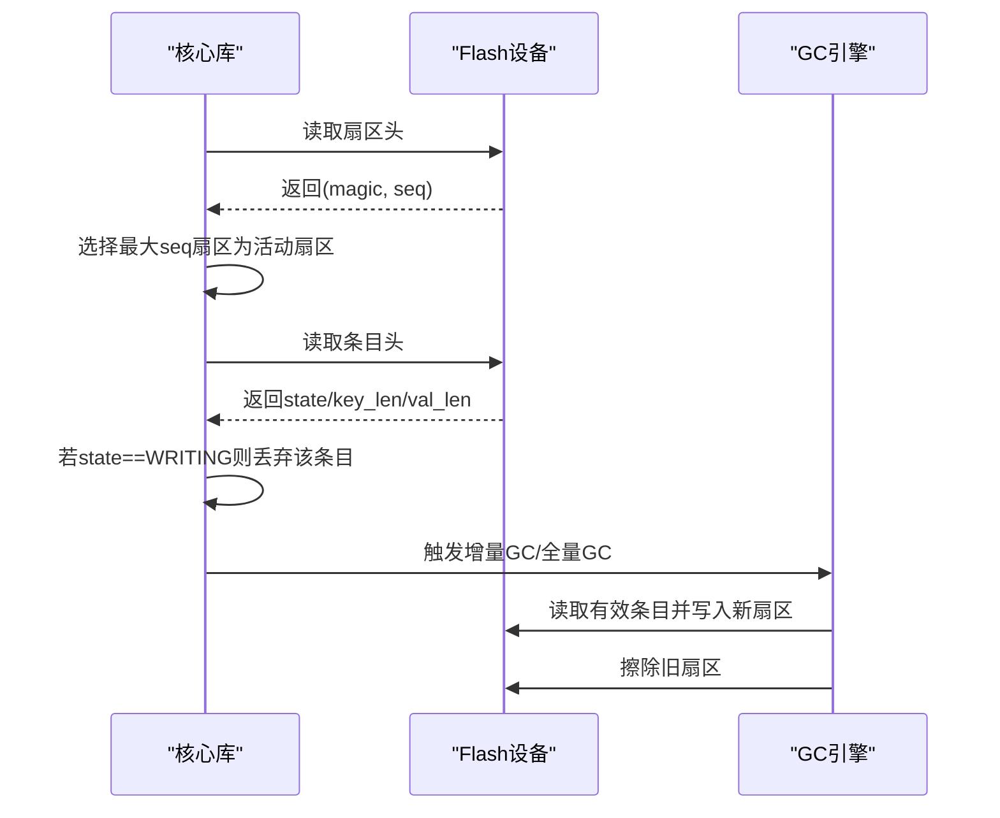
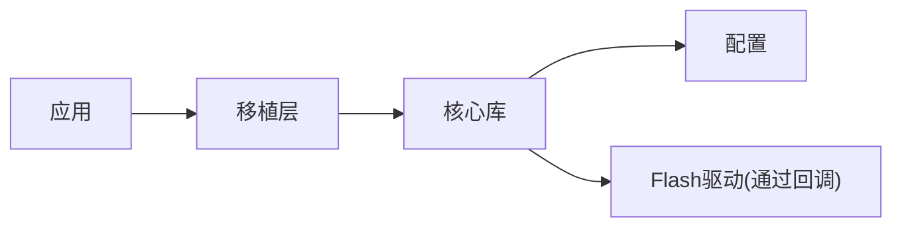

# 自定义平台适配

<cite>
**本文引用的文件**
- [NanoKV.h](file://NanoKV.h)
- [NanoKV.c](file://NanoKV.c)
- [NanoKV_cfg.h](file://NanoKV_cfg.h)
- [NanoKV_port.h](file://NanoKV_port.h)
- [NanoKV_port.c](file://NanoKV_port.c)
</cite>

## 目录
1. [简介](#简介)
2. [项目结构](#项目结构)
3. [核心组件](#核心组件)
4. [架构总览](#架构总览)
5. [详细组件分析](#详细组件分析)
6. [依赖关系分析](#依赖关系分析)
7. [性能考虑](#性能考虑)
8. [故障排查指南](#故障排查指南)
9. [结论](#结论)
10. [附录](#附录)

## 简介
本指南面向需要为新微控制器或不同类型的Flash存储器（NorFlash、NandFlash、EEPROM等）移植NanoKV的工程师。文档基于仓库中的头文件、实现文件、配置文件与移植层示例，系统讲解移植层的实现要求、地址映射策略、数据对齐处理、错误恢复机制、性能优化与验证方法。同时提供多平台适配要点与模板，帮助快速完成从硬件分析到代码实现的全流程移植。

## 项目结构
仓库采用“核心库 + 配置 + 移植层”的分层设计：
- 核心库：NanoKV.h/NanoKV.c 提供KV/TLV存储、GC、缓存、CRC等核心逻辑
- 配置层：NanoKV_cfg.h 定义可配置参数（键值长度、缓存、GC策略、调试输出）
- 移植层：NanoKV_port.h/NanoKV_port.c 封装Flash读写擦除回调与初始化流程

图表来源
- [NanoKV_port.h](file://NanoKV_port.h#L1-L27)
- [NanoKV_port.c](file://NanoKV_port.c#L1-L95)
- [NanoKV.h](file://NanoKV.h#L1-L257)
- [NanoKV.c](file://NanoKV.c#L1-L1261)
- [NanoKV_cfg.h](file://NanoKV_cfg.h#L1-L51)

章节来源
- [NanoKV.h](file://NanoKV.h#L1-L257)
- [NanoKV.c](file://NanoKV.c#L1-L1261)
- [NanoKV_cfg.h](file://NanoKV_cfg.h#L1-L51)
- [NanoKV_port.h](file://NanoKV_port.h#L1-L27)
- [NanoKV_port.c](file://NanoKV_port.c#L1-L95)

## 核心组件
- nkv_flash_ops_t：移植层的核心接口，包含读、写、擦除回调以及Flash基地址、扇区大小、扇区数量、对齐要求等配置
- KV/TLV API：nkv_set/nkv_get/nkv_del、nkv_tlv_set/get/del等，内部通过nkv_flash_ops_t进行底层Flash操作
- 增量GC与全量GC：在空间不足或磨损均衡需求下，将有效数据迁移到新扇区
- 缓存：LFU缓存加速热点数据读取
- CRC校验：MODBUS CRC16保障数据完整性
- 扇区扫描与状态恢复：开机扫描扇区头，识别活动扇区与序列号，恢复运行状态

章节来源
- [NanoKV.h](file://NanoKV.h#L68-L83)
- [NanoKV.c](file://NanoKV.c#L628-L693)
- [NanoKV.c](file://NanoKV.c#L695-L763)
- [NanoKV.c](file://NanoKV.c#L964-L1010)
- [NanoKV.c](file://NanoKV.c#L489-L624)
- [NanoKV.c](file://NanoKV.c#L84-L169)

## 架构总览
NanoKV通过移植层抽象Flash硬件差异，核心库仅依赖nkv_flash_ops_t提供的回调与配置。初始化流程如下：

图表来源
- [NanoKV_port.c](file://NanoKV_port.c#L54-L88)
- [NanoKV.c](file://NanoKV.c#L628-L693)

章节来源
- [NanoKV_port.c](file://NanoKV_port.c#L54-L88)
- [NanoKV.c](file://NanoKV.c#L628-L693)

## 详细组件分析

### nkv_flash_ops_t 结构体与实现要求
- 字段说明
  - read/write/erase：必须实现的回调，返回0表示成功，非0表示失败
  - base：Flash基地址（物理地址）
  - sector_size：扇区大小（字节），需与硬件一致
  - sector_count：扇区数量（≥2），用于多扇区环形与磨损均衡
  - align：对齐字节数（常见为2或4），影响地址对齐与写入粒度
- 实现约束
  - 读写擦除必须满足最小粒度与对齐要求
  - 擦除单位通常为扇区，写入单位通常为字或半字（取决于硬件）
  - 对齐策略：使用宏ALIGN进行按align对齐，确保写入边界正确
- 地址映射策略
  - 传入的addr为Flash物理地址；移植层内部通过addr - base计算相对偏移
  - 扇区地址：SECTOR_ADDR(i) = base + i * sector_size
- 错误处理
  - 回调返回非0即视为Flash操作失败，上层统一返回NKV_ERR_FLASH
  - 初始化阶段会校验ops参数合法性

章节来源
- [NanoKV.h](file://NanoKV.h#L68-L83)
- [NanoKV.h](file://NanoKV.h#L24-L26)
- [NanoKV.c](file://NanoKV.c#L23-L26)
- [NanoKV.c](file://NanoKV.c#L628-L640)

### Flash类型适配方法与注意事项

#### NorFlash（典型闪存）
- 适配要点
  - 支持按扇区擦除与按字/半字写入
  - align通常为4；若硬件只支持偶地址写入，需确保地址对齐
  - 使用标准的寄存器或驱动API完成读写擦除
- 注意事项
  - 写入前必须先擦除对应扇区（或整块）
  - 写入顺序遵循硬件规范，避免跨页写入导致数据损坏
  - 擦除粒度与写入粒度不一致时，需分批写入

#### NandFlash（大规模存储）
- 适配要点
  - 需要BCH/ECC、坏块管理、FTL映射等
  - 通常以页为写入单位，以块为擦除单位
  - 读写接口需封装到nkv_flash_ops_t回调中
- 注意事项
  - 写入前擦除，读取可能需要ECC校正
  - 页对齐与块对齐严格遵守，避免越界
  - 坏块检测与替换策略需在移植层实现

#### EEPROM（小容量非易失存储）
- 适配要点
  - 通常以字节为写入单位，无擦除概念
  - 若存在写周期限制，需在移植层实现写合并与去抖动
- 注意事项
  - 写入次数有限，需结合KV/TLV的默认值与保留策略降低写放大
  - 对齐要求较低，但需注意写入原子性

### 地址映射与对齐处理
- 地址映射
  - 传入addr为Flash物理地址，内部通过addr - base计算相对偏移
  - 扇区地址计算：SECTOR_ADDR(i) = base + i * sector_size
- 对齐策略
  - ENTRY_SIZE(e) = ALIGN(NKV_HEADER_SIZE + key_len + val_len + CRC_SIZE)
  - ALIGN(x) = ((x + align - 1) & ~(align - 1))
  - 写入时按align对齐，避免跨边界写入
- 数据布局
  - 扇区头：magic + seq
  - 条目头：state + key_len + val_len
  - 数据区：键 + 值 + CRC16
  - 状态机：WRITING→VALID，掉电安全

图表来源
- [NanoKV.c](file://NanoKV.c#L706-L763)
- [NanoKV.c](file://NanoKV.c#L23-L26)

章节来源
- [NanoKV.c](file://NanoKV.c#L23-L26)
- [NanoKV.c](file://NanoKV.c#L706-L763)

### 错误恢复机制
- 扇区扫描与状态恢复
  - nkv_scan遍历所有扇区，读取扇区头，选择序号最大的有效扇区作为活动扇区
  - 若无有效扇区，则执行nkv_format进行格式化
- 掉电安全
  - 写入采用“先写入临时状态WRITING，再写入有效状态VALID”的两步写法
  - 若写入过程中断电，重启后扫描将识别为无效条目并被GC清理
- GC与迁移
  - 增量GC按步长迁移有效条目，避免长时间阻塞
  - 全量GC在空间不足时触发，将有效数据迁移到新扇区并擦除旧扇区

图表来源
- [NanoKV.c](file://NanoKV.c#L642-L693)
- [NanoKV.c](file://NanoKV.c#L489-L624)

章节来源
- [NanoKV.c](file://NanoKV.c#L642-L693)
- [NanoKV.c](file://NanoKV.c#L489-L624)

### 性能优化技巧
- 批量写入与写合并
  - 将多个KV/TLV写入合并为一次写入，减少擦写次数
  - 使用默认值减少频繁写入
- 缓存策略
  - 启用LFU缓存，热点数据直接从缓存读取
  - 控制缓存大小与命中率，避免内存占用过高
- 增量GC
  - 每次写入后按固定步数执行GC，分摊GC开销
  - 设置合适的阈值与步长，平衡性能与空间利用率
- 地址对齐与写粒度
  - 根据硬件align设置合理对齐，避免多次写入
  - 尽量按扇区边界对齐，减少跨页写入

章节来源
- [NanoKV_cfg.h](file://NanoKV_cfg.h#L14-L25)
- [NanoKV.c](file://NanoKV.c#L489-L624)
- [NanoKV.c](file://NanoKV.c#L84-L169)

### 移植验证方法与测试用例
- 基础功能验证
  - 初始化：nkv_init成功，nkv_scan返回OK
  - 读写：nkv_set/nkv_get/nkv_del正常工作
  - 默认值：nkv_get_default/nkv_reset_key/nkv_reset_all
- 空间与GC验证
  - 写满后触发GC，确认数据迁移与空间释放
  - 增量GC：nkv_gc_step逐步执行，最终完成
- 容错与恢复
  - 模拟断电场景：写入中途断电后重启，验证状态机与恢复
- TLV功能验证
  - nkv_tlv_set/get/del/迭代器/历史记录/保留策略
- 性能测试
  - 缓存命中率统计、GC耗时、写入延迟

章节来源
- [NanoKV.c](file://NanoKV.c#L628-L693)
- [NanoKV.c](file://NanoKV.c#L695-L806)
- [NanoKV.c](file://NanoKV.c#L964-L1010)
- [NanoKV.c](file://NanoKV.c#L1067-L1162)

## 依赖关系分析
- 头文件依赖
  - NanoKV.h依赖NanoKV_cfg.h
  - NanoKV_port.h依赖NanoKV.h
  - NanoKV_port.c依赖NanoKV.h与NanoKV_port.h
  - NanoKV.c依赖NanoKV.h与字符串库
- 关键依赖链
  - 应用 → 移植层 → 核心库 → Flash驱动
  - 配置文件影响核心库行为（缓存、GC、调试）

图表来源
- [NanoKV.h](file://NanoKV.h#L19)
- [NanoKV_port.h](file://NanoKV_port.h#L10)
- [NanoKV_port.c](file://NanoKV_port.c#L9)
- [NanoKV_cfg.h](file://NanoKV_cfg.h#L1-L51)

章节来源
- [NanoKV.h](file://NanoKV.h#L19)
- [NanoKV_port.h](file://NanoKV_port.h#L10)
- [NanoKV_port.c](file://NanoKV_port.c#L9)
- [NanoKV_cfg.h](file://NanoKV_cfg.h#L1-L51)

## 性能考虑
- 写入路径优化
  - 尽量使用4字节对齐写入，减少多次写入
  - 合理设置扇区大小与数量，避免频繁切换扇区
- GC策略
  - 增量GC步长与阈值需结合应用场景调整
  - 在实时系统中优先使用增量GC，避免长时间阻塞
- 缓存策略
  - 根据热点数据特征调整缓存大小与替换算法
  - 定期统计缓存命中率，动态优化

## 故障排查指南
- 初始化失败
  - 检查nkv_flash_ops_t参数：read/write/erase是否为空，sector_count是否≥2，align是否为2或4
  - 确认Flash基地址与扇区大小配置正确
- 读写失败
  - 回调返回非0，检查硬件接口与地址映射
  - 确保对齐与写粒度满足硬件要求
- GC异常
  - 检查扇区有效性与序列号一致性
  - 确认写入状态机：WRITING→VALID
- 缓存问题
  - 检查缓存条目是否正确更新与淘汰
  - 关注LFU替换策略是否符合预期

章节来源
- [NanoKV.c](file://NanoKV.c#L628-L640)
- [NanoKV.c](file://NanoKV.c#L642-L693)
- [NanoKV.c](file://NanoKV.c#L84-L169)

## 结论
NanoKV通过nkv_flash_ops_t实现了对不同Flash硬件的抽象，配合KV/TLV存储、CRC校验、增量GC与LFU缓存，提供了高可靠、高性能的嵌入式KV存储方案。按照本指南的适配流程与注意事项，可在多种MCU与Flash类型上快速完成移植，并通过完善的验证方法确保质量。

## 附录

### 适配流程总览
- 硬件分析
  - 确定Flash基地址、扇区大小、擦除粒度、写入粒度、对齐要求
  - 明确是否支持扇区擦除与按字/半字写入
- 移植层实现
  - 实现nkv_flash_ops_t的read/write/erase回调
  - 配置base、sector_size、sector_count、align
  - 实现nkv_init与可选的nkv_task
- 核心库集成
  - 调用nkv_internal_init与nkv_scan
  - 验证初始化与基本读写
- 性能与可靠性验证
  - 空间与GC验证、断电恢复、TLV功能、缓存命中率
- 平台适配要点与模板

#### ESP32 平台适配要点
- Flash接口
  - 使用SPI Flash驱动或ROM API实现读写擦除
  - 注意SPI Flash的扇区对齐与写入粒度
- 电源管理
  - 在深度睡眠前确保写入完成，避免断电
- 示例参考
  - 参考移植层回调实现与初始化流程

章节来源
- [NanoKV_port.c](file://NanoKV_port.c#L18-L88)

#### STM32L4 平台适配要点
- Flash接口
  - 使用HAL库或LL驱动实现读写擦除
  - 注意L4系列的扇区大小与对齐要求
- 电源管理
  - 在低功耗模式下避免中断擦写
- 示例参考
  - 参考移植层回调实现与初始化流程

章节来源
- [NanoKV_port.c](file://NanoKV_port.c#L18-L88)

#### RP2040 平台适配要点
- Flash接口
  - 使用片上Flash或QSPI外接Flash
  - 注意RP2040的扇区与页对齐
- 电源管理
  - 在休眠前确保写入完成
- 示例参考
  - 参考移植层回调实现与初始化流程

章节来源
- [NanoKV_port.c](file://NanoKV_port.c#L18-L88)

#### EEPROM 平台适配要点
- 写入特性
  - 通常为字节写入，无擦除概念
  - 注意写周期限制与数据保持
- 优化策略
  - 使用默认值与保留策略减少写入
  - 合理规划键值长度，避免频繁写入

章节来源
- [NanoKV.h](file://NanoKV.h#L10-L13)
- [NanoKV_cfg.h](file://NanoKV_cfg.h#L14-L25)