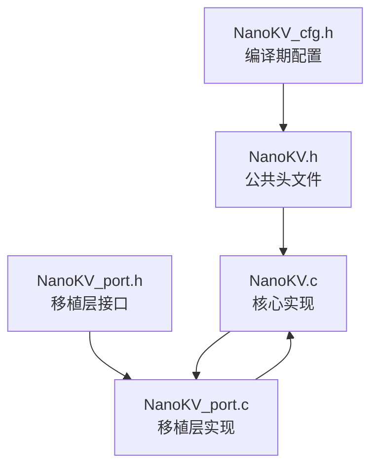
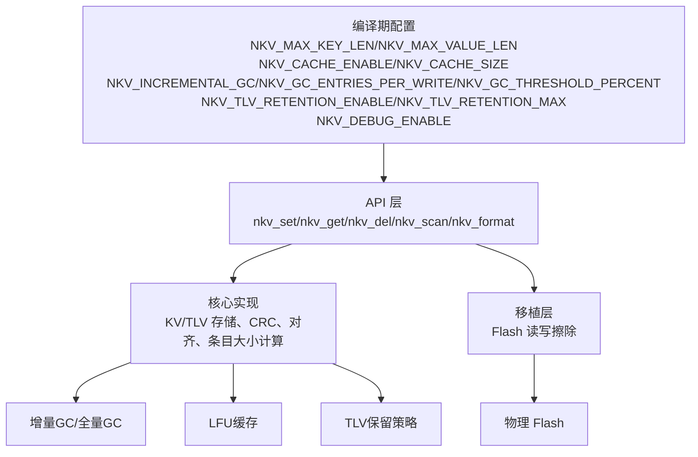
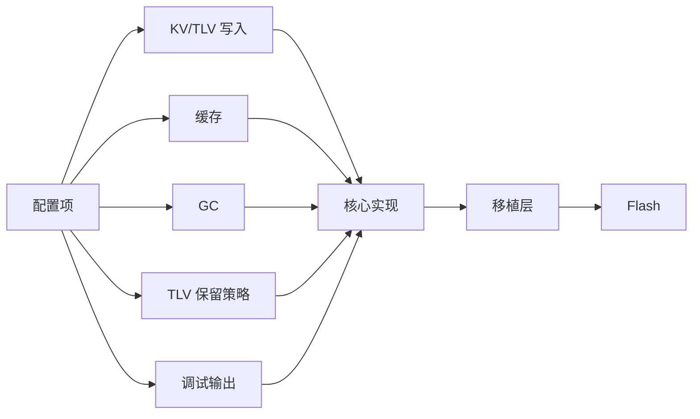

# 配置系统

<cite>
**本文引用的文件**
- [NanoKV.h](file://NanoKV.h)
- [NanoKV_cfg.h](file://NanoKV_cfg.h)
- [NanoKV.c](file://NanoKV.c)
- [NanoKV_port.h](file://NanoKV_port.h)
- [NanoKV_port.c](file://NanoKV_port.c)
</cite>

## 目录
1. [简介](#简介)
2. [项目结构](#项目结构)
3. [核心组件](#核心组件)
4. [架构总览](#架构总览)
5. [详细组件分析](#详细组件分析)
6. [依赖关系分析](#依赖关系分析)
7. [性能考量](#性能考量)
8. [故障排查指南](#故障排查指南)
9. [结论](#结论)
10. [附录](#附录)

## 简介
本文件系统性梳理 NanoKV 的编译时配置体系，聚焦以下关键配置项及其影响：
- 键值长度限制：键名与值的最大长度
- 缓存配置：是否启用、缓存条目数量
- 增量GC策略：是否启用、每次写入迁移条目数、触发阈值
- TLV 保留策略：是否启用、保留策略表容量
- 调试输出：日志开关与日志级别

文档同时提供不同应用场景的推荐配置、参数取值范围与默认值、相互依赖关系、优化指南、变更影响分析与性能测试方法，并给出常见配置错误与调试技巧。

## 项目结构
NanoKV 采用“头文件声明 + 配置文件 + 实现 + 移植层”的分层设计：
- NanoKV.h：对外 API、内部结构体、常量与宏定义
- NanoKV_cfg.h：编译期配置集中地，所有可调参数在此定义
- NanoKV.c：核心实现，包含 KV/TLV 存储、GC、缓存、CRC、迭代器等
- NanoKV_port.h / NanoKV_port.c：移植层接口与 Flash 操作实现模板

图表来源
- [NanoKV_cfg.h](file://NanoKV_cfg.h#L1-L51)
- [NanoKV.h](file://NanoKV.h#L1-L257)
- [NanoKV.c](file://NanoKV.c#L1-L1261)
- [NanoKV_port.h](file://NanoKV_port.h#L1-L27)
- [NanoKV_port.c](file://NanoKV_port.c#L1-L95)

章节来源
- [NanoKV.h](file://NanoKV.h#L1-L257)
- [NanoKV_cfg.h](file://NanoKV_cfg.h#L1-L51)
- [NanoKV_port.h](file://NanoKV_port.h#L1-L27)
- [NanoKV_port.c](file://NanoKV_port.c#L1-L95)

## 核心组件
本节从配置角度拆解关键组件与参数，明确其作用域与默认行为。

- 键值长度限制
  - 键名最大长度：NKV_MAX_KEY_LEN（默认 16 字节）
  - 值最大长度：NKV_MAX_VALUE_LEN（默认 255 字节）
  - 影响：直接影响条目头大小、对齐计算、写入缓冲区大小与可用空间估算

- 缓存配置
  - 是否启用：NKV_CACHE_ENABLE（默认 1 启用）
  - 缓存条目数：NKV_CACHE_SIZE（默认 4）
  - 影响：启用 LFU 缓存可显著降低热点键的 Flash 读取次数；缓存越大命中率越高但占用 RAM 更多

- 增量 GC 配置
  - 是否启用：NKV_INCREMENTAL_GC（默认 1 启用）
  - 每次写入迁移条目数：NKV_GC_ENTRIES_PER_WRITE（默认 2）
  - 触发阈值百分比：NKV_GC_THRESHOLD_PERCENT（默认 70）
  - 影响：启用增量 GC 可避免全量 GC 导致的长时阻塞；阈值过低会频繁触发，过高可能导致空间不足

- TLV 保留策略
  - 是否启用：NKV_TLV_RETENTION_ENABLE（默认 1 启用）
  - 保留策略表最大条目数：NKV_TLV_RETENTION_MAX（默认 8）
  - 影响：仅对 TLV 类型生效，控制保留最新 N 条历史记录，减少迁移成本

- 调试输出
  - 是否启用：NKV_DEBUG_ENABLE（默认 1 启用）
  - 日志宏：NKV_PRINTF、NKV_LOG_I、NKV_LOG_E
  - 影响：开启后可在初始化、扫描、使用情况等关键路径输出日志，便于问题定位

章节来源
- [NanoKV_cfg.h](file://NanoKV_cfg.h#L10-L29)
- [NanoKV.h](file://NanoKV.h#L86-L131)
- [NanoKV.c](file://NanoKV.c#L490-L624)

## 架构总览
下图展示配置如何贯穿到运行时行为的关键路径。

图表来源
- [NanoKV_cfg.h](file://NanoKV_cfg.h#L10-L29)
- [NanoKV.h](file://NanoKV.h#L133-L168)
- [NanoKV.c](file://NanoKV.c#L628-L763)
- [NanoKV_port.c](file://NanoKV_port.c#L42-L51)

## 详细组件分析

### 键值长度限制配置
- 参数
  - NKV_MAX_KEY_LEN：键名最大长度（默认 16）
  - NKV_MAX_VALUE_LEN：值最大长度（默认 255）
- 作用与影响
  - 条目头固定大小为 4 字节，键名与值分别以 1 字节长度字段记录，因此键名+值+CRC 的上限受此限制
  - 写入路径中会根据对齐规则计算条目总大小，过大值会增加写入延迟与空间碎片风险
- 取值范围与默认值
  - 键名：建议 8~16 字节（默认 16）
  - 值：建议 ≤ 255 字节（默认 255）
- 相互依赖
  - 值长度上限受 8 位长度字段约束，超过 255 字节需改用外部存储或分片策略
- 性能与可靠性
  - 较小键名可提升缓存命中与查找效率；较小值有利于减少迁移成本
- 常见错误
  - 键名超限导致写入失败
  - 值超限导致参数校验失败
- 优化建议
  - 根据业务键命名规范压缩键名长度
  - 将大对象序列化后存储，或采用外部索引+块存储

章节来源
- [NanoKV_cfg.h](file://NanoKV_cfg.h#L10-L12)
- [NanoKV.h](file://NanoKV.h#L29-L31)
- [NanoKV.c](file://NanoKV.c#L695-L763)

### 缓存配置
- 参数
  - NKV_CACHE_ENABLE：是否启用（默认 1）
  - NKV_CACHE_SIZE：缓存条目数（默认 4）
- 作用与影响
  - 启用后使用 LFU（最少使用）算法进行替换，热点键可显著降低 Flash 读取次数
  - 缓存命中率与访问模式高度相关；条目数越多，命中率越高但占用 RAM 越多
- 取值范围与默认值
  - 启用开关：0/1（默认 1）
  - 条目数：≥1（默认 4）
- 相互依赖
  - 仅在启用缓存时生效；与键名长度、值长度共同决定缓存项占用空间
- 性能与可靠性
  - 命中率提升带来读取延迟下降；缓存失效策略基于 LFU，避免冷数据长期占用
- 常见错误
  - 缓存条目数过大导致 RAM 不足
  - 未正确清空缓存导致读取脏数据
- 优化建议
  - 结合业务热点分布评估条目数；必要时通过统计接口观察命中率并调整

章节来源
- [NanoKV_cfg.h](file://NanoKV_cfg.h#L14-L16)
- [NanoKV.h](file://NanoKV.h#L86-L110)
- [NanoKV.c](file://NanoKV.c#L87-L169)
- [NanoKV.c](file://NanoKV.c#L847-L862)

### 增量 GC 配置
- 参数
  - NKV_INCREMENTAL_GC：是否启用（默认 1）
  - NKV_GC_ENTRIES_PER_WRITE：每次写入迁移条目数（默认 2）
  - NKV_GC_THRESHOLD_PERCENT：触发阈值（默认 70）
- 作用与影响
  - 启用增量 GC 可避免全量 GC 导致的长时间阻塞；按步迁移条目，平摊开销
  - 迁移条目数影响单次写入的额外开销；阈值影响触发频率
- 取值范围与默认值
  - 启用开关：0/1（默认 1）
  - 每次迁移：≥1（默认 2）
  - 阈值：60~80（默认 70）
- 相互依赖
  - 与扇区数量、扇区大小、键值长度共同决定可用空间与迁移压力
- 性能与可靠性
  - 阈值过低会频繁触发，影响写入吞吐；过高可能导致空间不足
  - 迁移条目数过少会导致 GC 进度缓慢，过多会增加写放大
- 常见错误
  - 扇区数量过少导致空间不足
  - 阈值设置不当引发频繁 GC 或空间耗尽
- 优化建议
  - 根据写入频率与数据生命周期调整阈值与迁移步数
  - 在系统空闲时段手动执行 GC 步骤以加速回收

章节来源
- [NanoKV_cfg.h](file://NanoKV_cfg.h#L18-L21)
- [NanoKV.h](file://NanoKV.h#L120-L125)
- [NanoKV.c](file://NanoKV.c#L490-L624)
- [NanoKV.c](file://NanoKV.c#L825-L845)

### TLV 保留策略配置
- 参数
  - NKV_TLV_RETENTION_ENABLE：是否启用（默认 1）
  - NKV_TLV_RETENTION_MAX：保留策略表最大条目数（默认 8）
- 作用与影响
  - 仅对 TLV 类型生效，控制保留最新 N 条历史记录，避免这些记录被迁移
  - 通过阈值计算避免迁移过旧的历史记录，平衡空间与历史保留
- 取值范围与默认值
  - 启用开关：0/1（默认 1）
  - 表容量：≥1（默认 8）
- 相互依赖
  - 与增量 GC 策略协同工作，仅在启用增量 GC 时生效
- 性能与可靠性
  - 保留策略可减少重复迁移，提高 GC 效率；但会占用更多空间
- 常见错误
  - 保留策略表溢出导致新增策略失败
  - 未正确设置保留数量导致历史丢失
- 优化建议
  - 为高频访问的 TLV 类型设置合理的保留数量
  - 定期清理不再需要的保留策略

章节来源
- [NanoKV_cfg.h](file://NanoKV_cfg.h#L23-L25)
- [NanoKV.h](file://NanoKV.h#L244-L247)
- [NanoKV.c](file://NanoKV.c#L29-L46)
- [NanoKV.c](file://NanoKV.c#L329-L377)
- [NanoKV.c](file://NanoKV.c#L1221-L1260)

### 调试输出配置
- 参数
  - NKV_DEBUG_ENABLE：是否启用（默认 1）
  - 日志宏：NKV_PRINTF、NKV_LOG_I、NKV_LOG_E
- 作用与影响
  - 开启后可在初始化、扫描、使用情况等关键路径输出日志，便于问题定位
- 取值范围与默认值
  - 开关：0/1（默认 1）
- 相互依赖
  - 与编译器/平台的 printf 支持相关
- 性能与可靠性
  - 调试输出会增加 CPU 与串口开销，发布版本建议关闭
- 常见错误
  - 平台不支持 printf 导致编译或运行时错误
- 优化建议
  - 在开发阶段开启，发布版本关闭

章节来源
- [NanoKV_cfg.h](file://NanoKV_cfg.h#L27-L48)
- [NanoKV_port.c](file://NanoKV_port.c#L56-L87)

## 依赖关系分析
- 配置到实现的依赖
  - 键值长度限制影响条目头与对齐计算，进而影响写入路径与空间利用率
  - 缓存配置影响读取路径与命中统计
  - 增量 GC 配置影响写入路径中的 GC 触发与步进
  - TLV 保留策略影响 GC 迁移决策
  - 调试配置影响日志输出与运行时开销
- 运行时耦合
  - 移植层负责 Flash 读写擦除，必须满足对齐要求与扇区边界
  - 初始化阶段扫描并恢复状态，确保后续操作的正确性

图表来源
- [NanoKV_cfg.h](file://NanoKV_cfg.h#L10-L29)
- [NanoKV.c](file://NanoKV.c#L628-L763)
- [NanoKV.c](file://NanoKV.c#L847-L862)
- [NanoKV.c](file://NanoKV.c#L490-L624)
- [NanoKV.c](file://NanoKV.c#L1221-L1260)
- [NanoKV_port.c](file://NanoKV_port.c#L42-L51)

章节来源
- [NanoKV_cfg.h](file://NanoKV_cfg.h#L10-L29)
- [NanoKV.c](file://NanoKV.c#L628-L763)
- [NanoKV.c](file://NanoKV.c#L847-L862)
- [NanoKV.c](file://NanoKV.c#L490-L624)
- [NanoKV.c](file://NanoKV.c#L1221-L1260)
- [NanoKV_port.c](file://NanoKV_port.c#L42-L51)

## 性能考量
- 键值长度
  - 增大键名会增加条目头与对齐开销，建议控制在 8~16 字节范围内
  - 值长度接近上限会增加迁移成本，建议优先考虑外部存储或分片
- 缓存
  - 提高缓存条目数可提升命中率，但会增加 RAM 占用；建议结合业务热点评估
  - 使用缓存统计接口观察命中率，动态调整条目数
- 增量 GC
  - 适当提高每次迁移条目数可缩短 GC 时间，但会增加写放大
  - 合理设置阈值，避免频繁触发或空间不足
- TLV 保留策略
  - 为高频访问的类型设置合理保留数量，减少重复迁移
- 调试输出
  - 发布版本关闭调试输出，避免影响实时性

[本节为通用指导，不直接分析具体文件]

## 故障排查指南
- 初始化失败
  - 检查移植层 Flash 操作是否正确实现，确认对齐与扇区边界
  - 确认扇区数量至少为 2，否则初始化失败
- 写入失败
  - 检查键名长度与值长度是否超限
  - 检查空间是否不足，必要时触发 GC 或切换扇区
- 读取失败
  - 若启用缓存，确认缓存未被意外清空
  - 检查键是否存在且值长度大于 0
- GC 异常
  - 检查增量 GC 是否被正确触发与步进
  - 调整每次迁移条目数与阈值，观察空间利用率变化
- TLV 保留策略异常
  - 检查保留策略表是否溢出
  - 确认类型合法且保留数量合理

章节来源
- [NanoKV.c](file://NanoKV.c#L628-L640)
- [NanoKV.c](file://NanoKV.c#L695-L763)
- [NanoKV.c](file://NanoKV.c#L765-L798)
- [NanoKV.c](file://NanoKV.c#L825-L845)
- [NanoKV.c](file://NanoKV.c#L1221-L1260)

## 结论
NanoKV 的配置系统围绕“键值长度、缓存、GC 策略、TLV 保留策略、调试输出”五大维度展开，既保证了嵌入式环境下的资源友好性，又提供了灵活的性能调优空间。通过合理设置参数并结合场景化的优化策略，可在内存受限设备、高吞吐量应用与实时系统等不同场景下取得良好表现。

[本节为总结性内容，不直接分析具体文件]

## 附录

### 不同应用场景的推荐配置
- 内存受限设备（RAM < 1KB）
  - 关闭缓存：NKV_CACHE_ENABLE=0
  - 降低缓存条目数：NKV_CACHE_SIZE=1~2
  - 启用增量 GC：NKV_INCREMENTAL_GC=1
  - 保守阈值：NKV_GC_THRESHOLD_PERCENT=60~65
  - 保留策略：NKV_TLV_RETENTION_ENABLE=0 或极小容量
- 高吞吐量应用（频繁读写）
  - 启用缓存：NKV_CACHE_ENABLE=1
  - 适中条目数：NKV_CACHE_SIZE=4~8
  - 启用增量 GC：NKV_INCREMENTAL_GC=1
  - 中等阈值：NKV_GC_THRESHOLD_PERCENT=70~75
  - 适度保留策略：NKV_TLV_RETENTION_ENABLE=1，NKV_TLV_RETENTION_MAX=4~8
- 实时系统（低抖动要求）
  - 启用增量 GC：NKV_INCREMENTAL_GC=1
  - 控制每次迁移条目数：NKV_GC_ENTRIES_PER_WRITE=1~2
  - 严格阈值：NKV_GC_THRESHOLD_PERCENT=65~70
  - 保留策略：针对关键类型启用，避免频繁迁移

[本节为通用指导，不直接分析具体文件]

### 配置变更的影响分析与性能测试方法
- 影响分析
  - 键值长度：影响条目大小、对齐与空间利用率
  - 缓存：影响命中率与 RAM 占用
  - 增量 GC：影响写入延迟与空间回收效率
  - TLV 保留策略：影响 GC 迁移范围与空间占用
- 测试方法
  - 命中率测试：通过缓存统计接口获取命中与未命中次数，计算命中率
  - 写入延迟测试：测量 nkv_set 的平均耗时，对比不同配置
  - 空间利用率测试：使用 nkv_get_usage 获取已用空间与总空间，评估阈值设置
  - GC 效果测试：记录 GC 触发次数与耗时，评估迁移步数与阈值的平衡点

[本节为通用指导，不直接分析具体文件]

### 常见配置错误与调试技巧
- 常见错误
  - 键名或值超限导致写入失败
  - 扇区数量不足导致初始化失败
  - 缓存条目数过大导致 RAM 不足
  - 保留策略表溢出导致新增失败
- 调试技巧
  - 开启调试输出，观察初始化与扫描日志
  - 使用缓存统计接口监控命中率
  - 在系统空闲时段手动执行 GC 步骤，加速回收

[本节为通用指导，不直接分析具体文件]