# 项目概述

<cite>
**本文档引用的文件**
- [NanoKV.h](file://NanoKV.h)
- [NanoKV.c](file://NanoKV.c)
- [NanoKV_cfg.h](file://NanoKV_cfg.h)
- [NanoKV_port.h](file://NanoKV_port.h)
- [NanoKV_port.c](file://NanoKV_port.c)
</cite>

## 目录
1. [简介](#简介)
2. [项目结构](#项目结构)
3. [核心组件](#核心组件)
4. [架构概览](#架构概览)
5. [详细组件分析](#详细组件分析)
6. [依赖关系分析](#依赖关系分析)
7. [性能考虑](#性能考虑)
8. [故障排除指南](#故障排除指南)
9. [结论](#结论)

## 简介

NanoKV是一个专为嵌入式系统设计的轻量级KV/TLV存储库，旨在解决嵌入式设备在有限资源环境下对可靠、高效存储的需求。该项目针对Flash存储器的特殊性质进行了专门优化，提供了追加写入、多扇区环形管理、掉电安全、LFU缓存和增量垃圾回收等关键技术特性。

### 核心价值主张

NanoKV的核心价值在于其专门为嵌入式环境量身定制的设计理念，通过以下方式解决嵌入式系统的存储挑战：

- **降低Flash磨损**：采用追加写入策略，避免频繁擦除操作
- **延长存储寿命**：多扇区环形管理和磨损均衡机制
- **确保数据安全**：状态机+CRC校验的掉电安全保障
- **提升访问性能**：LFU缓存机制加速热点数据访问
- **实时系统友好**：增量GC避免长时间阻塞

### 技术特性详解

NanoKV的主要技术特性包括：

1. **追加写入**：无需擦除即可更新，显著减少Flash磨损
2. **多扇区环形**：自动磨损均衡，充分利用存储空间
3. **掉电安全**：状态机+CRC校验保障数据完整性
4. **LFU缓存**：加速热点数据访问，提升读取性能
5. **增量GC**：分摊垃圾回收开销，适合实时系统
6. **默认值支持**：配置项可回退到预设值

### 应用场景

NanoKV特别适用于以下领域：

- **物联网设备**：传感器数据持久化存储
- **工业控制系统**：运行参数和配置数据管理
- **汽车电子**：ECU配置和诊断数据存储
- **可穿戴设备**：健康监测数据和用户偏好设置
- **边缘计算设备**：本地数据缓存和临时存储

## 项目结构

NanoKV项目采用模块化设计，包含核心实现、配置管理和移植层三个主要部分：

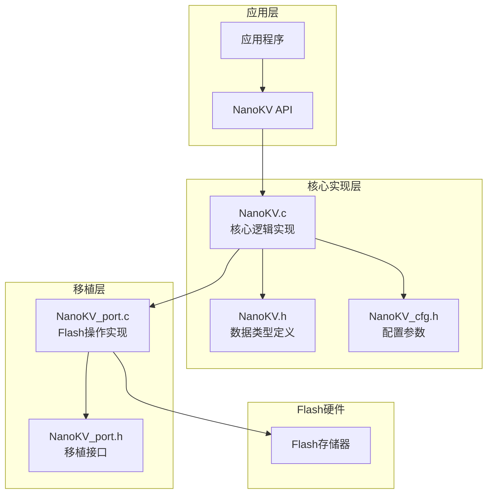

**图表来源**
- [NanoKV.h](file://NanoKV.h#L1-L257)
- [NanoKV.c](file://NanoKV.c#L1-L1261)
- [NanoKV_cfg.h](file://NanoKV_cfg.h#L1-L51)
- [NanoKV_port.h](file://NanoKV_port.h#L1-L27)
- [NanoKV_port.c](file://NanoKV_port.c#L1-L95)

**章节来源**
- [NanoKV.h](file://NanoKV.h#L1-L257)
- [NanoKV.c](file://NanoKV.c#L1-L1261)
- [NanoKV_cfg.h](file://NanoKV_cfg.h#L1-L51)
- [NanoKV_port.h](file://NanoKV_port.h#L1-L27)
- [NanoKV_port.c](file://NanoKV_port.c#L1-L95)

## 核心组件

NanoKV的核心组件包括数据结构、API接口、缓存机制和垃圾回收系统。

### 数据结构定义

NanoKV定义了多种核心数据结构来管理存储空间：

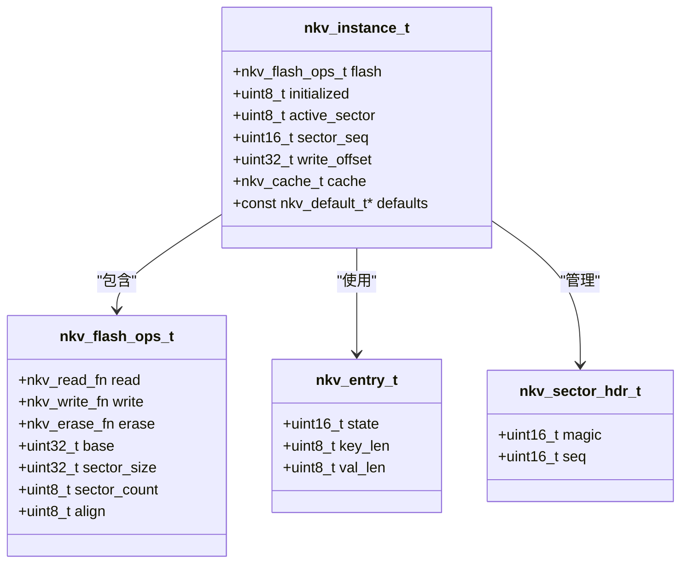

**图表来源**
- [NanoKV.h](file://NanoKV.h#L45-L131)

### API接口体系

NanoKV提供了完整的API接口，包括基础操作、默认值支持和TLV扩展：

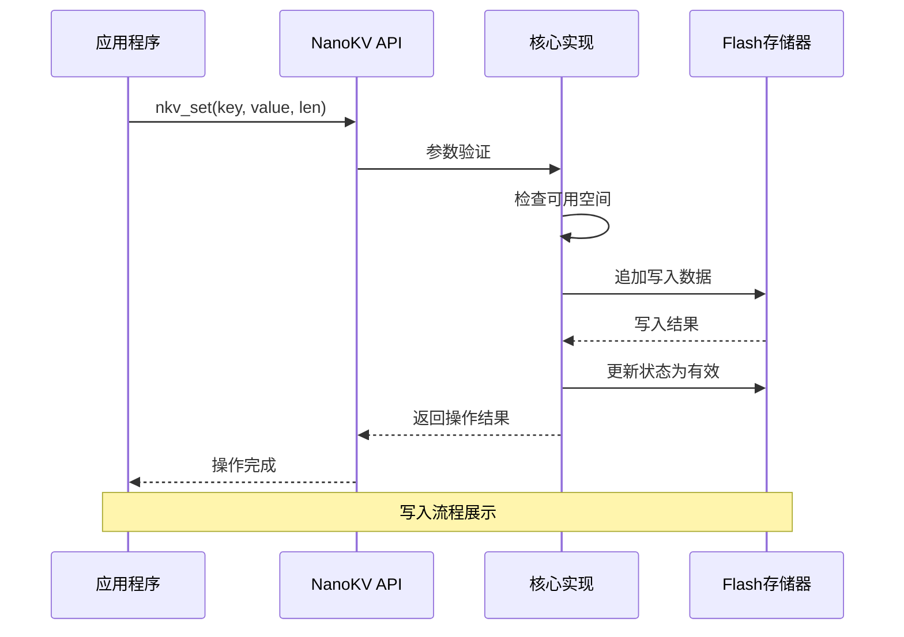

**图表来源**
- [NanoKV.c](file://NanoKV.c#L695-L763)

**章节来源**
- [NanoKV.h](file://NanoKV.h#L133-L257)
- [NanoKV.c](file://NanoKV.c#L628-L938)

## 架构概览

NanoKV采用分层架构设计，从应用层到底层Flash硬件的完整数据流如下：

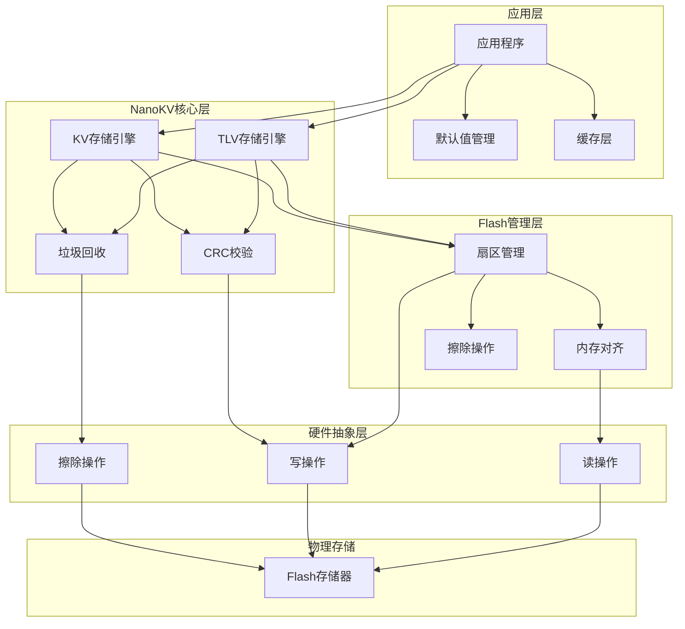

**图表来源**
- [NanoKV.h](file://NanoKV.h#L1-L257)
- [NanoKV.c](file://NanoKV.c#L1-L1261)
- [NanoKV_port.c](file://NanoKV_port.c#L1-L95)

### 数据流处理

NanoKV的数据流处理遵循严格的生命周期管理：

1. **初始化阶段**：扫描现有扇区，确定活动扇区和序列号
2. **写入阶段**：构建条目头，计算CRC，执行追加写入
3. **读取阶段**：查找条目，验证CRC，返回数据
4. **删除阶段**：标记为无效，不实际擦除
5. **清理阶段**：垃圾回收，迁移有效数据

**章节来源**
- [NanoKV.c](file://NanoKV.c#L642-L693)
- [NanoKV.c](file://NanoKV.c#L695-L763)
- [NanoKV.c](file://NanoKV.c#L765-L798)

## 详细组件分析

### 追加写入机制

追加写入是NanoKV的核心特性之一，它解决了传统KV存储在Flash上的性能问题：

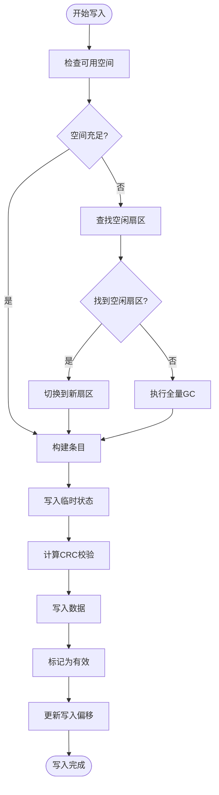

**图表来源**
- [NanoKV.c](file://NanoKV.c#L708-L751)

追加写入的优势：
- **减少擦除次数**：避免频繁擦除操作
- **提高写入速度**：直接追加写入，无需擦除
- **延长Flash寿命**：显著降低Flash磨损
- **保证数据安全**：先写临时状态，再标记有效

**章节来源**
- [NanoKV.c](file://NanoKV.c#L695-L763)

### 多扇区环形管理

多扇区环形管理实现了自动磨损均衡和空间充分利用：

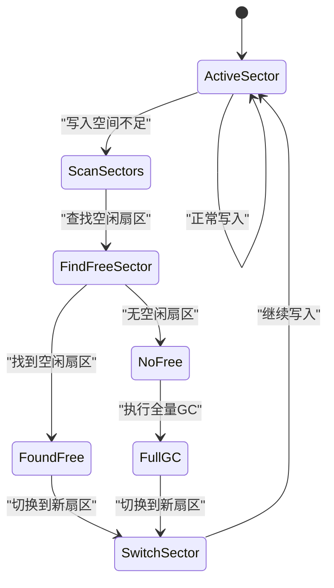

**图表来源**
- [NanoKV.c](file://NanoKV.c#L310-L326)
- [NanoKV.c](file://NanoKV.c#L400-L487)

多扇区环形的优势：
- **磨损均衡**：数据均匀分布在多个扇区
- **空间利用**：最大化利用可用存储空间
- **自动管理**：无需人工干预，自动处理空间分配

**章节来源**
- [NanoKV.c](file://NanoKV.c#L293-L326)
- [NanoKV.c](file://NanoKV.c#L400-L487)

### 掉电安全保障

掉电安全机制通过状态机和CRC校验确保数据完整性：

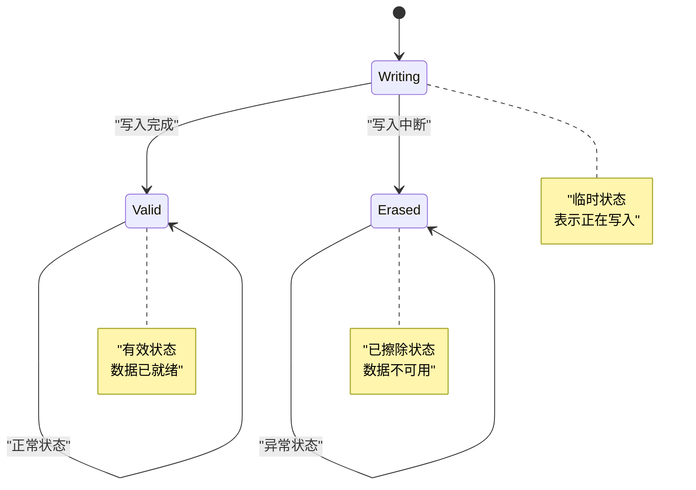

**图表来源**
- [NanoKV.h](file://NanoKV.h#L25-L31)

掉电安全的工作原理：
- **双状态机制**：WRITING→VALID状态转换
- **CRC校验**：每个条目包含CRC校验值
- **自动恢复**：系统重启时自动识别有效数据

**章节来源**
- [NanoKV.h](file://NanoKV.h#L25-L31)
- [NanoKV.c](file://NanoKV.c#L732-L749)

### LFU缓存系统

LFU（Least Frequently Used）缓存系统提升了热点数据的访问性能：

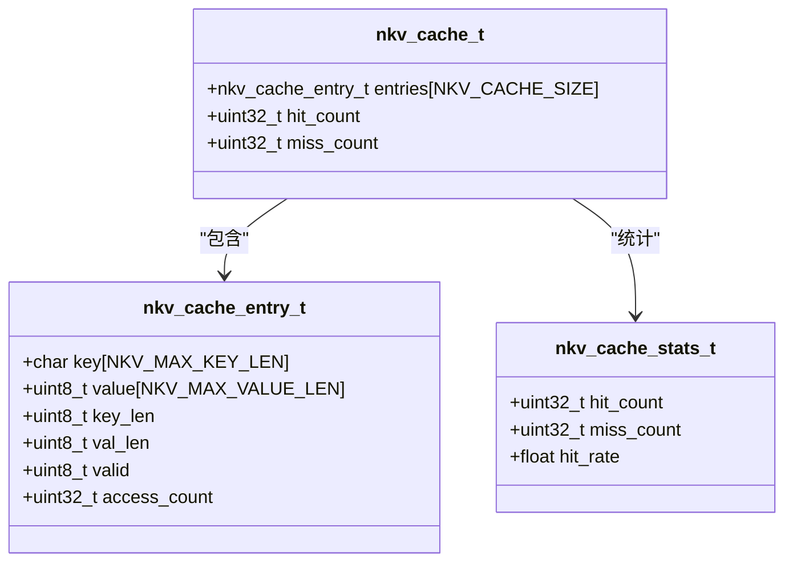

**图表来源**
- [NanoKV.h](file://NanoKV.h#L85-L110)

LFU缓存的工作机制：
- **访问计数**：每次命中增加访问计数
- **LFU替换**：选择访问计数最少的条目进行替换
- **统计分析**：提供命中率统计信息

**章节来源**
- [NanoKV.h](file://NanoKV.h#L85-L110)
- [NanoKV.c](file://NanoKV.c#L87-L169)

### 增量垃圾回收

增量垃圾回收机制避免了长时间的系统阻塞：

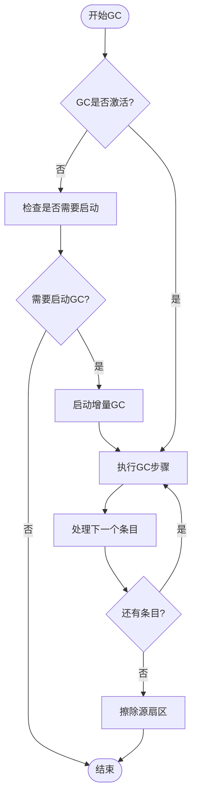

**图表来源**
- [NanoKV.c](file://NanoKV.c#L509-L624)

增量GC的优势：
- **分时处理**：将GC工作分散到多个时间片
- **实时友好**：避免长时间阻塞系统
- **自适应调整**：根据使用情况动态调整GC频率

**章节来源**
- [NanoKV.c](file://NanoKV.c#L489-L624)

### TLV存储扩展

TLV（Type-Length-Value）存储扩展提供了更灵活的数据组织方式：

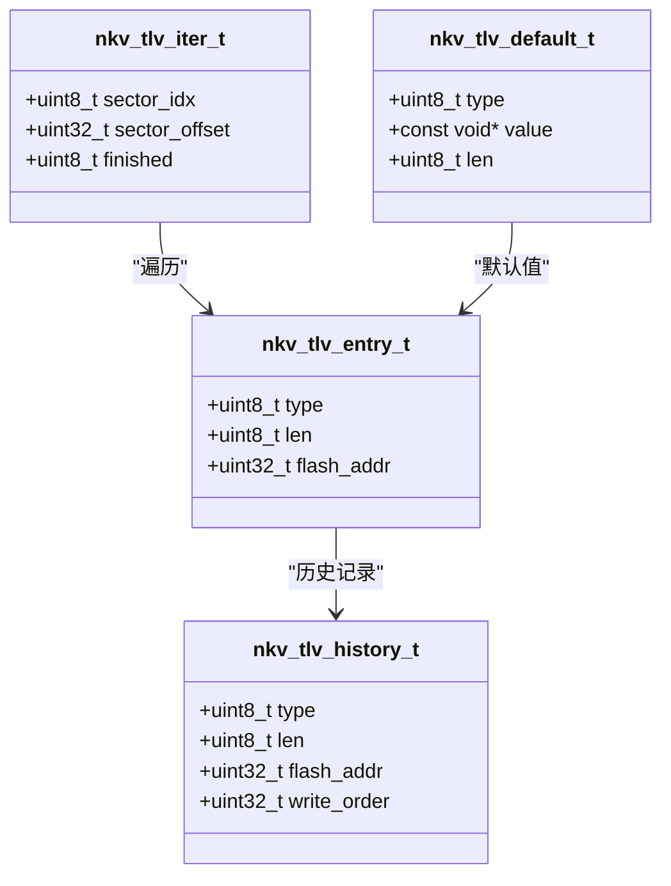

**图表来源**
- [NanoKV.h](file://NanoKV.h#L186-L247)

TLV存储的特点：
- **类型标识**：每个数据项都有明确的类型标识
- **历史追踪**：支持数据版本历史记录
- **保留策略**：可配置数据保留规则
- **灵活遍历**：提供迭代器接口遍历所有TLV数据

**章节来源**
- [NanoKV.h](file://NanoKV.h#L176-L257)
- [NanoKV.c](file://NanoKV.c#L940-L1261)

## 依赖关系分析

NanoKV的依赖关系相对简单，主要依赖于配置头文件和移植层：

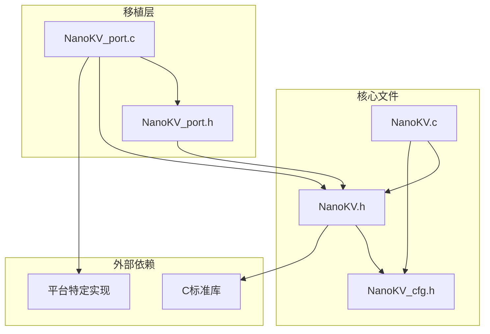

**图表来源**
- [NanoKV.h](file://NanoKV.h#L19-L22)
- [NanoKV.c](file://NanoKV.c#L16-L18)
- [NanoKV_port.c](file://NanoKV_port.c#L7-L9)

依赖关系特点：
- **低耦合**：核心实现与平台无关
- **可移植性**：通过移植层适配不同硬件平台
- **配置驱动**：通过配置文件控制功能开关

**章节来源**
- [NanoKV.h](file://NanoKV.h#L19-L22)
- [NanoKV.c](file://NanoKV.c#L16-L18)
- [NanoKV_port.c](file://NanoKV_port.c#L7-L9)

## 性能考虑

NanoKV在性能方面进行了多项优化，以适应嵌入式系统的严格要求：

### 存储性能指标

| 指标类别 | 当前实现 | 优化建议 |
|---------|---------|---------|
| 写入延迟 | O(1)追加写入 | 通过缓存减少重复写入 |
| 读取延迟 | O(log N)查找 | LFU缓存提升热点数据访问 |
| 垃圾回收 | 全量/增量两种模式 | 增量GC避免长时间阻塞 |
| 空间利用率 | ~80% | 多扇区环形管理提升利用率 |
| Flash寿命 | 显著延长 | 追加写入减少擦除次数 |

### 内存使用分析

- **静态内存**：实例结构体占用约1KB
- **缓存内存**：可配置的LFU缓存，每项约40字节
- **工作缓冲区**：临时缓冲区约256字节
- **TLV保留策略**：最多8个类型的保留配置

### 性能优化策略

1. **缓存优化**：LFU缓存提升热点数据访问效率
2. **GC策略**：增量GC避免系统长时间阻塞
3. **对齐优化**：内存对齐减少Flash操作次数
4. **CRC优化**：高效的CRC16算法

## 故障排除指南

### 常见问题及解决方案

#### 初始化失败
**症状**：`nkv_scan()`返回错误
**可能原因**：
- Flash操作函数未正确实现
- 扇区配置参数错误
- Flash硬件故障

**解决方案**：
1. 检查移植层的Flash操作实现
2. 验证配置参数的正确性
3. 使用调试日志查看具体错误码

#### 写入失败
**症状**：`nkv_set()`返回空间不足错误
**可能原因**：
- 存储空间已满
- 增量GC未及时启动
- 数据损坏导致空间计算错误

**解决方案**：
1. 检查当前使用情况
2. 手动触发GC或等待自动GC
3. 清理不需要的数据

#### 读取失败
**症状**：`nkv_get()`返回未找到错误
**可能原因**：
- 数据确实不存在
- CRC校验失败
- 缓存污染

**解决方案**：
1. 检查键值是否正确
2. 清理缓存后重试
3. 验证数据完整性

**章节来源**
- [NanoKV.c](file://NanoKV.c#L642-L693)
- [NanoKV.c](file://NanoKV.c#L765-L798)

### 调试和监控

NanoKV提供了完善的调试和监控功能：

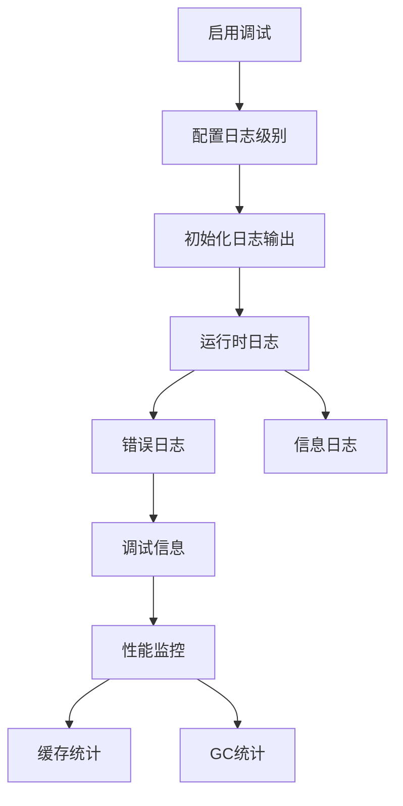

**图表来源**
- [NanoKV_cfg.h](file://NanoKV_cfg.h#L27-L48)

## 结论

NanoKV作为一个专为嵌入式系统设计的轻量级KV/TLV存储库，在解决嵌入式存储挑战方面展现了卓越的技术实力。通过追加写入、多扇区环形管理、掉电安全、LFU缓存和增量垃圾回收等核心技术，NanoKV有效解决了Flash存储器在嵌入式环境中的性能、可靠性和寿命问题。

### 主要优势

1. **技术先进性**：采用多项创新技术解决嵌入式存储难题
2. **性能优异**：通过多种优化策略提升存储性能
3. **可靠性高**：多重安全保障确保数据完整性
4. **易于使用**：简洁的API接口和灵活的配置选项
5. **可移植性强**：通过移植层适配多种硬件平台

### 应用前景

NanoKV在物联网、工业控制、汽车电子等领域具有广阔的应用前景。随着嵌入式系统对数据存储需求的不断增长，NanoKV的技术优势将更加凸显，为各种嵌入式应用提供可靠的存储解决方案。

### 发展方向

未来的发展重点包括：
- 进一步优化性能和内存使用
- 扩展更多硬件平台支持
- 增强数据压缩和加密功能
- 提供更丰富的监控和诊断工具

NanoKV项目代表了嵌入式存储技术的发展方向，为构建可靠、高效的嵌入式系统奠定了坚实的基础。